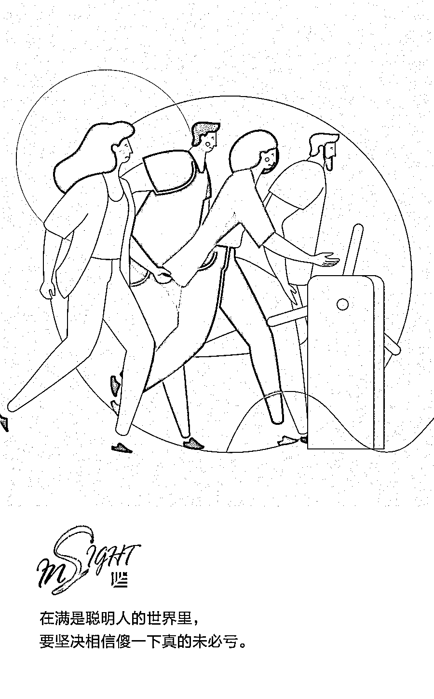

# 越来越热的 to B 企业，需要什么样的“武林高手”？| 首席人才官

> 原文：[`mp.weixin.qq.com/s?__biz=MzAwODE5NDg3NQ==&mid=2651226115&idx=1&sn=7ff7edb66373164927fb8dbf991b1bbb&chksm=8080be57b7f737415184f3d2c913f80647bc4e4909562c21a236d6ed0560cc4efa4d314177ad&scene=21#wechat_redirect`](http://mp.weixin.qq.com/s?__biz=MzAwODE5NDg3NQ==&mid=2651226115&idx=1&sn=7ff7edb66373164927fb8dbf991b1bbb&chksm=8080be57b7f737415184f3d2c913f80647bc4e4909562c21a236d6ed0560cc4efa4d314177ad&scene=21#wechat_redirect)

所谓江湖，无非是人的故事，武林如此，创业亦是。

武侠小说里的武林高手分为两种，一种是练体的，一种是练气的。练体的骨骼强壮，几乎刀枪不入；练气的往往三年不得寸进，熬到某机缘下任督二脉打通，就马上触类旁通，无边无界，一飞通天。这两种高手，刚好可以和 toC 和 toB 的企业相对应。

国内领先的人力资源 SaaS（软件即服务）系统薪人薪事创始人兼 CEO 常兴龙认为：“如果回归根本，我认为 toC 更适合练体者，而 toB 则更需要的是练气者。”在他看来，toB 不属于速杀业务，“没有明显的缺点，有一个绝对的中心优势”是渡过早期大劫的关键。所以人才骨架还是应该多选择练气者。

在本文中，他从创始人及领导核心、中层领导和基层一线员工三个层面，阐述了 toB 的初创企业如何选择和凝练人才。

梁羽生的《萍踪侠影》里讲，武林存在两类高手，一类为练体的，最猛的叫铁布衫。一类为练气（内功）的，武功几乎没上限。

这两者的修炼上升路径不同。练体立刻见效，顶点就是攻之蛮力可拔山，守之称做铁布衫，几乎刀枪不入，往往只有一处隐蔽的命门缺点。而练气者，先讲聚气丹田，再讲小周天，再讲心法，再讲大循环，再讲调天地之气、日月之辉，最后以融入自然天地间为至高点。然而，这类人小时候一般很笨（至少别人看起来），往往三年不得寸进，熬到某机缘下任督二脉打通，就马上触类旁通，无边无界，一飞通天。

普通大众往往喜欢容易上手能速成的东西，大多人都选成效快、天花板较低的练体，鲜有人去选概率低、见效慢、但天花板高的练气。其实，高与低、快与慢，其背后的决策逻辑是“眼光长短及心性高低”。

反复体会聚焦目标、调和供需和反复试错重建，一旦找到方法就四两拨千斤是练气派；只看收入，什么客户有钱就找什么样的客户，什么需求赚钱就接什么，一顿猛攻的是练体派。

就选择本身而言，不同的人做不同的事，没有谁好谁坏，也没有谁对谁错。然而，如果回归根本，我认为 toC 更适合练体者，而 toB 则更需要的是练气者。

toB 不属于速杀业务，本质是金木水火土都要全，“没有明显的缺点，有一个绝对的中心优势”是渡过早期大劫的关键。所以其人才骨架还应多选择练气者，让他们来挑大梁。

我们可以从常见的人才三层结构去理解：

**合伙人及核心领导层 **

**理想是第一位**

▨ **第一，理想放在第一位。**

如果没有做事大成的长线理想，每天都净想着什么能速成、什么能速赚，3 年上市退出发财，没有 10 年以上从业决心（尽管实际上机缘巧合未必真的需要 10 年）的，基本不可能行。正如心性修为不到，不可炼至阳纯阴神功，很易走火入魔一个道理，入魔很危险。

▨ **第二，契合度和沟通性很重要。**

德高是长期团结一致的根本要求。toB 路途远，彼此的契合度很重要。如果每个小破事都暗自挂心不知忘却，抓住一个把柄恨不能絮叨一辈子，格人而不知律己，自己会累死，也会把身边人累死，难久远。

▨ **第三，傻一下真的未必亏。**

胸不宽不能大成，财不疏无宜于大局。有时就是需要牺牲精神，创始团队的组建应该尤其要注意这一点。

只要对事业有宜，只要复盘后大有进步，就不必有任何怨言。在满是聪明人的世界里，要坚决相信傻一下真的未必亏，事实也是如此。

▨ **最后，做事业和赚钱是两个事情。**

很多人把做事业当成赚钱，到最后很痛苦。也有很多人把赚钱当成做事业，最终也莫衷一是，甚至坏了一世英名。

长期来看，内心追求做一番事业的和内心追求如何赚钱的往往不是一类人。toB 合伙人这个层面，必须是做事业的人，只想赚钱的一定做不成，而混合也几乎不可能做成。走得越远，彼此伤得越深。

不是说做事业不能赚钱，只是会延迟满足，一旦成功，会赚到只以赚钱为目的人赚不到的大钱，那时财富会更有持续的生态生命力，源源不可限量。

**中层领导**

**责任心是第一位**

▨ **第一，务必保证有勇于承担的责任心。**

切忌满口流程，满心想去规避责任，流程你讲了，责任你不担，最终客户不满意又谁来负责？

▨ **第二，敢打并擅于打硬仗。**

只会讲问题，自己不能分析解决，也不想影响到别人的，不要做中层。toB 业务往往互相交织，没有一个强有力的推进者，大家得过且过，最后的结果就是谁都不好过。

▨ **第三，习惯在变化中成长，并创造变化****。**

toB 本身很稳定，如果中层再没有变化，极易变成了一个按部就班、按资排辈的事情。变化是成长的营养，变化能提升人的际遇。某些变化对个体来说，可能一闪而过，也可能一路相随。一般，持续善于创造并拥抱变化的，往往有所大成。

**▨ ****第四，成为打不死的小强。**

中层 leader 要有极其强的韧性，没有打不死的小强的精神，很难带出一个真正的能打仗的队伍。

**▨ ****第五，不要纠结于自己是不是 nice。**

此外，中层还要做到外圆内方，即对外争取其它人支持时懂周转，左右逢源，对内要求自己和团队弟兄时，严苛有力。此处要克服的心理障碍是，自己是不是很 nice，团队的人会不会离自己而去，会怎么评价自己。

答案很简单，每个人都需要很强的带自己打过大仗的老大，一时的怨言可以换来一辈子的感激与回忆，而不是回想跟着某个人时，几年时光毫无意义。人们会因为一个人的强而佩服，永不会因为一个人的软而欣赏。所谓的 nice，于自己进步不利，于别人对你长期感恩不利，于组织成长更不利，你还纠结什么？

**基层一线员工**

**成长是第一位**

▨ **第一，成长的需求务必放在第一位。**

如果一个人放弃了成长，得过且过，把所有组织对他的要求当成一种负担，而不是面对困难战意澎湃地追求成就感，无论当前水平高低，最终高度都会有限。

每人都喜欢与更优秀的同事共事，没人喜欢懒惰臃肿的灵魂。很多人自认为无所妨碍，其实不进步者能获得与进步者同样的组织资源，就是对组织内部的相对公平的最大妨碍。对这类人听之任之，也是对自己的最大伤害，影响自我成长。我们无法叫醒一个装睡的人，也同样无法唤醒一个放弃自我成长的人的斗志，如果这类个体没能及时改善和处理，一定是组织的问题。

▨ **第二，乐观，且有耐心。**

时刻警醒正能量要远大于负能量。 在事情发生变化更改的时候，要有热情和耐心理解并拥抱变化，懂得看到其中蕴藏的机会，而不是固守不变，成为组织进步的阻力。当一个人面对新东西越多、挑战越大时，正是自我进步最快的时刻，不离开现在舒适区，何来进步可言？

放眼于社会分层，不要拘泥于身边人的水平，才有可能出现奇迹。

▨ **第三，不要文人相轻。**

指责一个业务前，要尊重并深刻理解他的想法思路，推翻一个观点前，你必须建立一个新观点，这样你就很容易知道其中的奥妙了。

离 toB 大热不远了，随大机构的进入和获得更大投资的创业公司增多，人才流动速率一定会大幅度显著增长。无论是淘汰组织还是被淘汰，适当的自我反思，懂得冷静控制情绪可能会带来后续的某个大机缘（前组织对个体评价的潜在影响，可能让人意想不到）。

此外，日常工作中，组织和个体的反思机制一定要建立起来。这也是 toB 企业想要发展好的必然要素。

综上，在这个世界上，乐利者人所共也，惟 toB 之人不应“喜躯壳之乐利，而喜精神之乐利，故曰饭疏食饮水，曲肱而枕之，乐亦在其中矣”（不看重物质利益，看重精神享受，吃粗粮，喝白水，枕着胳膊睡觉，这中间也有乐趣。）。懂得“不义而富且贵，于生之不利”。故曰，惟安贫者能成大事，咬得菜根，百事可为！** **

原标题 / 越来越热的 toB 的企业应该选择和凝练什么样的人才？

来源 / SaaS 议事厅

** 推荐阅读**

壹

[绩效考核前，管理者需要向员工讲明 7 件事 | 首席人才官](http://mp.weixin.qq.com/s?__biz=MzAwODE5NDg3NQ==&mid=2651226054&idx=1&sn=d749c185096d02d2ac3f85e28b17eb36&chksm=80804192b7f7c884a759377054f7fac249c6671a0f24914df4caaee1049a778d100ed5e29356&scene=21#wechat_redirect)

贰

[红杉清华行：同学你好，欢迎成为独角兽企业的“缔造者” | 首席人才官](http://mp.weixin.qq.com/s?__biz=MzAwODE5NDg3NQ==&mid=2651225997&idx=1&sn=19d266956f1cc49201c66f324821df7e&chksm=808041d9b7f7c8cf6d6ca4f033cea94868fc3b9625d511a53d354b16aacd0cacdf106c791c82&scene=21#wechat_redirect)

叁

[比起“志同道合”，“可培养性”在招聘时更关键 | 首席人才官](http://mp.weixin.qq.com/s?__biz=MzAwODE5NDg3NQ==&mid=2651225914&idx=1&sn=6128d178e9ec02a4f917dbc5276e41b1&chksm=8080416eb7f7c878f9cab0059a45c760db18379dac96786f3358dc11167aae8d60ace05e39da&scene=21#wechat_redirect)

肆

[KPI 不是指南针，而是可视化的 GPS 工具 | 首席人才官](http://mp.weixin.qq.com/s?__biz=MzAwODE5NDg3NQ==&mid=2651225800&idx=1&sn=540419d5c125f6440de27f578502cbf2&chksm=8080409cb7f7c98ad9563a4f9b2c4c474b18a0d721fb38cf5e81e089c70617ad952fae2436e5&scene=21#wechat_redirect)

伍

[办公室福利：是一种浪费还是利润驱动？| 首席人才官](http://mp.weixin.qq.com/s?__biz=MzAwODE5NDg3NQ==&mid=2651225757&idx=1&sn=cabfa1eeb863a27a2a560d43d9fac6b1&chksm=808040c9b7f7c9df7d11c212e032fb72134457ca0ad63cc7bde272a3adb68e1ea2dd390d0dc2&scene=21#wechat_redirect)

