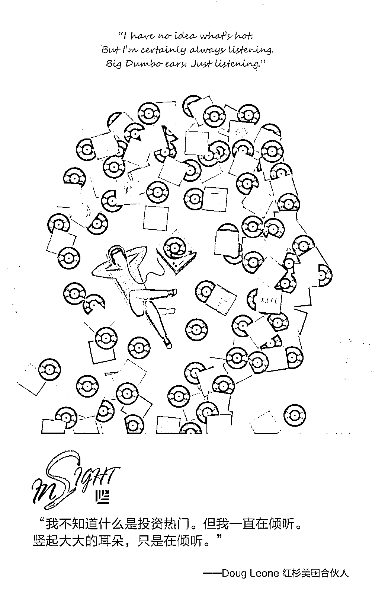

# 把责任当“皮球”踢的团队，到底出了什么问题？｜红杉汇内参

> 原文：[`mp.weixin.qq.com/s?__biz=MzAwODE5NDg3NQ==&mid=2651224768&idx=1&sn=13bece9e77226fb89f67f50e71806d64&chksm=80804494b7f7cd825878c2c2f4d0a4c3a734c2557af905f896116584fc0fdeb9e885c8f3f214&scene=21#wechat_redirect`](http://mp.weixin.qq.com/s?__biz=MzAwODE5NDg3NQ==&mid=2651224768&idx=1&sn=13bece9e77226fb89f67f50e71806d64&chksm=80804494b7f7cd825878c2c2f4d0a4c3a734c2557af905f896116584fc0fdeb9e885c8f3f214&scene=21#wechat_redirect)

[ 编者按 ] 在组织机体中，法务、财务、HR、行政等职能部门就像是人体的副交感神经，总是让销售运营的一线员工感到创新“被抑制”、“被羁绊”。

它们其实是“守门员”。

它们的职能通常会影响产品制造商和销售商争取用户的能力，因而要么为企业提供动力，让企业实现高速发展；要么为企业提供阻力，不仅它们自己的本职工作没做好，出现问题时可能还会把责任当“皮球”踢，使公司陷入增长陷阱。

所以，怎样让“守门员”成为力量与速度的源泉？

大多数早期团队都会忽视守门员的职能，待意识到其重要性的时候，一切为时已晚。每年都有无数公司落入这些陷阱，无以生还。尤其是初创企业，是时候开始思考如何让“守门员”发挥它们真正的作用啦。

每期监测和精编中文视野之外的全球高价值情报，为你提供先人一步洞察机会的新鲜资讯，为你提供升级思维方式的深度内容，是为 **[ 红杉汇内参 ]**。

** 内参**

初创公司**怎样避开**

**“守门员”陷阱？**

编译 / 洪杉

创业公司的发展十分迅速，且井然有序，而守门员型职能部门也如雨后春笋般进入人们的视野，一切都发展得太快，以至于创业者们都来不及思考如何给它们定位，抑或是如何防止其成为一种阻力。

领导者创建守门员机制的时候，通常是以一种被动的方式。他们意识到，如果没有守门员型职能部门，很容易引来各种麻烦，然后不断循环。如此，守门员功能就变得比较单一了——并且在创业公司需要以最快的速度增长时拖后腿。

初创公司要怎么做才能消除员工心中对守门员型职能部门的成见呢？

**给 ****非守门员 ****的秘籍**

牢

记

别到最后一刻才问

以防陷入双输局面

因为自己没有预留时间给法务或 HR 审批，而在自己急需有个明确答案的下午才催他们，这种事情你做过几次？如果你对此有所感触，那就怪不得你只会感觉到——并且更加深信——守门员总是在阻碍你。

对法务或 HR 来说，他们感觉到的是打电话过来的这个人没有时间观念，只是一股脑给他们抛了一套复杂的方案，然后要你在下班时就给个答复。在律师的眼里，这种情况怎么处理都是双输。要么他就要批准在他接受范围以外的合约，要么就拒绝，做一轮坏人。这样的话，不久你就能听到产品部或营销部这些非守门员型职能部门的人在背后说：“合规部的那些人应该恨死我们吧，什么事都不让我们干。”

战

术

一开始便组建一个

跨职能团队

当然，跨职能团队的益处众所周知，开发部、产品部和设计部之间的合作尤是如此。但在制定计划的关键节点时（不单是在开始和结束的时候，而且还有其他成员想不出办法的时候），你是否经常会将法务或合规人员考虑进来？

如果你是一家初创公司，担当守门员角色的职能部门人员也有限的话，那就让相关部门派代表参加你的第一次、中间一次和最后一次会议。要是这些参会代表的工资不能从你自己部门出的话，那就把项目划一部分出来，让他们牵头去做。让他们真正接手一些任务才能让他们觉得真正有认同感。

**给 ** **守门员****的秘籍**

牢

记

尊重别人的创造

灵活对待自己的创造

最优秀的守门员具备企业家精神，尽管他们可能从未创建任何企业或者供职于初创公司。他们能够忍受（甚至可以说是欣然接受）不确定性和模糊性，并且明白企业家的身份挑战重重。这使得他们能够对产品团队的经历感同身受。这种品质涉及到尊重别人的创造和自己的创造能力时显得尤为重要。当然，这种灵活性带来的是学习第一的心态。你想要的守门员应该充分掌握各种信息但又不会总有答案。这样的员工应该能够将自己的专长与公司的事业融为一体。

其二是思维敏捷。守门员必须具备敏捷的思维。让他们说出所在行业的一项最佳实践，然后问他们这项最佳实践是否有不恰当的地方。思维敏捷的人懂得哪怕是最佳实践也并非没有不足之处。

战

术

为客户制作

仅有一页内容的指南

守门员做的工作大多很复杂，需要具备高深的知识才行，但是他们可以用简洁的语言解释，指出与他们共事的简易方式，这样一来他们开展起工作来可以更快更好。要简化事情，他们应该将该指南精简到一页的篇幅，这样一来，股东（本质上也是用户）才能正确理解何时他们可以自行处理事情，何时他们需要进行互动，以及提供什么样的信息。

这里有一个限制性因素：要守门员型的职能部门做出一页指南难度很大。但是，守门员必须从客户的角度来考虑事情，做出的东西对于产品经理和工程师必须易于理解和消化。

**给 ** **CEO/创始人****的秘籍**

牢

记

打造一种守门员职能服务

而非仅是回应的环境

要给团队赋权是初创公司里常说的一句话，但很多公司常常没有给予守门员真正的“代理权”。作为他们的领导，CEO 或创始人必须要能够做出的表态是：守门员型职能部门是为它们的顾客服务，而不仅是回应顾客的要求。它们能不能设计出一套代理模式，为它们重要的利益相关者——即员工——带来一项核心的业务处理服务？还是只会在最后一刻踢皮球，对员工互相推脱？你要以创始人或 CEO 身份介入处理的情况有多频繁？ 

战

术

让守门员型职能部门的负责人

根据各团队的生产时间负起相应责任

如果你对法律总顾问说，“你的工作就是要保证我们公司没有任何债务，这是你工作表现的评判指标之一”，顾问就会对所有事情都说不行，你的各个团队就无法发布任何产品。那时，顾问就会说，“呐，你叫我不能产生债务的，我照做了啊”。

所以，不要跟守门员型职能部门说道它们要对公司整体业绩负责，因为业绩的可变性非常大，也不是一个能够给予它们持续动力的具体目标。相反的是，你要创造一些能反映“你想要这个团队多快能扭转局势”的指标，比如让职能部门对各团队的生产时间负起相应责任。

对于许多扩张迅速的初创公司来说，“守门员”是一个贬损的词。它们被看成公司的瓶颈，而不是能保护团队，揭露团队盲点的职能部门。

作为创始人，你应该做的是，让非守门员型职能部门（如产品部、设计部、营销部等）从一开始就组建一个跨职能的团队（如果可以，把各守门员正式加入到这个团队来）。这可以减少人们在最后一刻才来问进度的让人想拉黑的行为。守门员应要为各团队起草一份一页纸的、普通人也能看懂的备忘录，这样他们就能不使用复杂的法律用语或行业用语就能设立自己的期望。最后，对 CEO 或创始人来说，要设立精确的指标——可以尝试奖励那些为产品团队创造了更快的生产时间的守门员，而不是避免所有债务。

** 读数**

**75%**

Gartner 预计：到 2019 年，将有 75%的收入在 1000 万美元以上的 B2B 企业，会采用目标用户群营销（ABM）作为其主要模式策略，而 2017 年只有 25％。

** 情报**

#所有产品都需要被“管理”吗#

**我们需要更少的产品经理**

产品经理、用户体验师、数据科学家、商业分析员、团队经理、教练……产品经理经常担任这些职务吗？当然。你需要产品经理来担任这些职务吗？不。

▨ 产品经理已经变成一个无所不包的头衔了。“每个团队应该拥有一个产品主人！”“我们需要产品思维！”这些说法很公平。然而，坚持称任何东西和所有东西为“产品”，任何监管这个“产品”的人为产品经理，这使它在日常使用中毫无意义。

▨ 大多数产品经理并不是在做产品管理。当所有东西都以某种方式成为一种产品，产品经理其实在从事一系列混合的“核心”活动，团队也会变得过于依赖于他们的产品经理，组织也会变得僵硬。

▨ 少使用“产品”这个词，少使用“经理”这个词（尤其在头衔里）。批判性地思考你正在让前线产品经理做的事。我们可以重新命名这个职位，让它更加具有描述性和准确吗？如果你需要倡导者、传道者、分析员、形象专家、领域专家、协调员、战略员、股民、项目驱动人等等，就雇用他们，然后赋予他们正确的头衔。

▨ 考虑一下雇用实习生来填补“混合型”职位——研究、数据科学、用户体验等等。大多数年轻人不应该被立即放到正式的产品经理岗位上。这是帮助人们在安全的模式上成长的不错方式。

#11 条天使投资经验#

**如何形成天使投资格栅**

查理・芒格（Charlie Munger）说，投资是需要思维模式格栅的。天使投资亦然。红杉资本美国合伙人 Doug Leone 分享了这样一条投资经验：“我不知道什么是投资热门。但我一直在倾听。竖起大大的耳朵，只是在倾听”。此外，这些经验或对你有益：

▨ 如果你下不了决定，就不要进行天使投资。

▨ 专属交易流意味着“你是他们想要的投资者”。

▨ 投资是需要数年时间来学习的，而收获回报还需要更长时间。

▨ 估值很重要。

▨ 投资那些现在看起来一文不值的公司，未来则可能长成独角兽。否则你的投资组合将无法取得风险收益。

▨ 判断力虽重要但不能被高估。

▨ 只投资技术。

▨ 最佳投资人往往没有个人观点。

▨ 用大量的数据来形成你的直觉。

▨ 警惕：权力能打败合同。

** 推荐阅读**

壹

[数字化转型失败真相：领导者伪造变化，假装转型](http://mp.weixin.qq.com/s?__biz=MzAwODE5NDg3NQ==&mid=2651224756&idx=1&sn=ae83dba9d038ecbef7a2857efe2cad31&chksm=808044e0b7f7cdf66830cdefae6bf380b616cae239737ec5dcbd8b5ba1df84b2a68e3aaecf67&scene=21#wechat_redirect)

贰

[数据告诉我，没有谁的辞职是“突然”的](http://mp.weixin.qq.com/s?__biz=MzAwODE5NDg3NQ==&mid=2651224762&idx=1&sn=5fedde1e43cecdcebc22ed448c074e3b&chksm=808044eeb7f7cdf82a25888b63f353b53df9da3a01b3e3dcddb6b754abd5e2d884c5e99871b7&scene=21#wechat_redirect)

叁

[超燃 TED 演讲集锦，10 句话点燃你的小宇宙](http://mp.weixin.qq.com/s?__biz=MzAwODE5NDg3NQ==&mid=2651224733&idx=1&sn=59fa580f87fdfaa1c16fb201624acbac&chksm=808044c9b7f7cddfac16530bb445c905a0fe7e4b2fac35e107a250d6069357adb36cb689c5b4&scene=21#wechat_redirect)

肆

[返回交大捐赠 ACM 班奖学金时，沈南鹏讲了一个 32 年前的下乡故事](http://mp.weixin.qq.com/s?__biz=MzAwODE5NDg3NQ==&mid=2651224748&idx=1&sn=302b9f643fdd68524c4d422502042cf8&chksm=808044f8b7f7cdee379fcf386e80fda2c5630e6bcbe2e3c734a00c5ae55e4c5a2bd9f4815f95&scene=21#wechat_redirect)

伍

[为什么我相信提问是学习最好的开始？](http://mp.weixin.qq.com/s?__biz=MzAwODE5NDg3NQ==&mid=2651224750&idx=1&sn=4282b6e0efe03ea45c830a44de8242c5&chksm=808044fab7f7cdec05c4a89648cbc0c91c2c49cb70b218dc6d0fa19c0517347197c6dc0f4c7d&scene=21#wechat_redirect)

