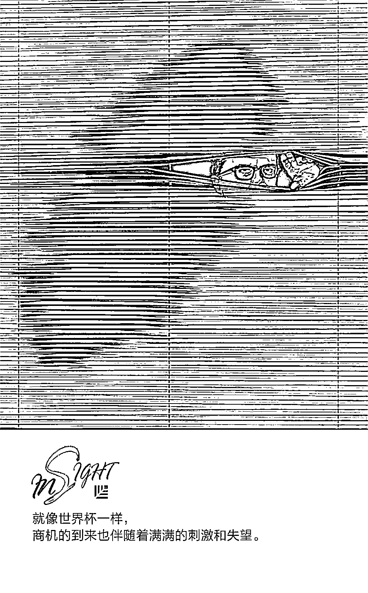
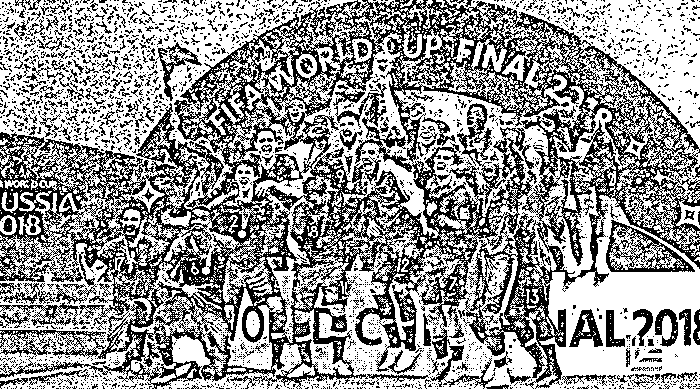

# 你对“现金为王”的理解有多少是错的?｜红杉汇内参

> 原文：[`mp.weixin.qq.com/s?__biz=MzAwODE5NDg3NQ==&mid=2651225247&idx=1&sn=c2f3e71e30168c7e81b14603b6f541f2&chksm=808042cbb7f7cbdd68060128ac7ce9dc085a2be88f447be6202f0bdadb64f41b6cacee7b0d35&scene=21#wechat_redirect`](http://mp.weixin.qq.com/s?__biz=MzAwODE5NDg3NQ==&mid=2651225247&idx=1&sn=c2f3e71e30168c7e81b14603b6f541f2&chksm=808042cbb7f7cbdd68060128ac7ce9dc085a2be88f447be6202f0bdadb64f41b6cacee7b0d35&scene=21#wechat_redirect)

[ 编者按 ] 人人都知道，现金是维持企业生命的血脉。评估一家企业的表现时最需要看的就是其现金可用性（cash accessibility），换句话说，就是企业在必需的时候能够使用自由现金的能力。

但是，大多数企业不清楚其现金可用程度，因为其数据收集和报告部门不认为这是需要优先考虑的事情。甚至明明各个部门的业绩都比之前要好，但企业的整体情况却大不如前。反思目前的绩效评估方法，更深入地了解如何收集、分析和使用数据，或许能帮助创业者更好地理解并解决这个问题。

每期监测和精编中文视野之外的全球高价值情报，为你提供先人一步洞察机会的新鲜资讯，为你提供升级思维方式的深度内容，是为 **[ 红杉汇内参 ]**。

** 内参**

**正确理解“现金为王”**

作者 / Liz Sweigart

编译 / 洪杉

**过时的价值等式**

很长一段时间以来，大多数企业采用的价值等式是像下面这样的：

**绩效管理+降低成本=企业价值**

这个等式中的“价值”可以体现为各种形式，包括盈利能力、资产收益率、资产流动性、股票价格、每股收益或任何其它（特别是非现金的）指标。其隐含的假定是：企业价值等于企业中的个体绩效综合，而这一价值可以通过消除供应链的浪费行为来最大化。

只要不专门去思考现金的问题，这一等式当然很有道理。

对于个人和团队层面的绩效管理，许多企业不能有效利用它来驱动企业层面获得持续性的成功，原因在于它们所采用的价值等式已经过时。

众所周知，一张漂亮的损益表背后，很有可能是一家缺少正向净现金流的企业。很多企业高管一心钻研如何实现盈利能力、资源生产、资产利用、顶尖的收入水平和其它各种指标，忽视了现金。结果不出意料：损益表变好看了，但是资产负债表却难看了，最后企业由于付不起钱濒临倒闭。

**到处都有水**

**但没有一口是能喝的**

现金可用性是评估企业表现时最需要看的一个指标。企业不仅需要正向净现金流来保证持续运转，同时也需要它能看得见、摸得着，用起来不费劲。

尽管自由现金流属于现金可用性的一部分，但现金可用性和自由现金流不完全一样。在某些情况下，企业暂时性地缺乏流动资产或不具备一定量的自由现金来支配，是因为它已经把现金投资于自己的业务里。另一些情况下，虽然企业的现金流入大于现金流出，但是银行法、出口限制及货币限制却使得企业几乎不可能有效地将其利用起来。名义上，企业具备必要的流动资产，但实际上却不是如此。打个比方来说就是：到处都有水，但没有一口是能喝的。

过去，企业一般通过向外部资源借贷来解决缺乏可用现金这一问题。只要企业有能力偿还债务，这也不是什么糟糕的策略。甚至，大多数国家都有税收鼓励政策，以鼓励企业采取这种做法，因为第三方支付的债务利息可以抵扣所得税。

与此同时，企业也获得了前所未有的利润。在很多情况下，已经形成了这样的循环：企业越来越依赖银行等外部资源，利用它们提供的贷款难度低的现金来获得巨额利润，以偿还日益增长的债务。本来这都不会有什么问题，但如果利率上涨，同时债务到期，导致企业难以为继，就会出问题。

现金可用性本来就应该时时刻刻受到企业的关注，但由于过去以来的关注点一直都是自由现金流，而不是可用的自由现金流，因此没有标准化的财务报告、比率或指标来衡量或评估它。通常，公司并不理解这一点——为何他们认为对整体战略而言是正确而有效的做法，实际上会损害企业？

答案是，因为这些做法会影响现金可用性。

**“现金电网”**

每个企业都有进账，有支出。企业生命周期中，这种财务平衡在循环往复。

企业中，现金的流动方式与电流传输类似。要将电从发电厂输送给用户，电力公司需要电网。但值得注意的是，通过电网输送给用户的电能总是要少于电厂所产生的电能。这是因为，电流的输送需要损耗电能，这就是输电成本。

若电网维护不当，则电网的输电效率就会降低，进而提高输电成本。日积月累，到达用户家中的电量会越来越少，电力公司的利润也不翼而飞。最后，连发电厂可能都必须要通过其他渠道购买电能（意不意外？）。最糟糕的是，由于电网本身十分复杂，其中的问题难以知晓，企业甚至可能完全不会意识到低效的电网在榨取它们的钱财。

现金也是如此。多数的财务报告都既不会告诉你哪些钱是真正可以拿到手的，也不会告诉你要将现金投入其所需的地方要付出多大的代价。

**为什么部门业绩在提升，**

**整体绩效却在下降？**

现有价值等式中的关键前提在于个人绩效的累增会带来集体绩效的累增。这与保龄球队类似——每个保龄球手的得分加起来，总分最高的队获胜。但是，偶尔也会出现的现实情况是，即便单个个体、所有个体或所有业务部门都提高了绩效，但产生的结果仍可能对整体不利。

因此，我们需要新的价值等式，它通过将可用现金量最大化来持续增加股东价值。具体内容为：

**不断增加的股东价值**

**=可用现金量最大化**

**=优化内外关系、专注于现金收支+**

**有目的导向的数据设计和洞见深刻的报告+**

**有助于将行为与策略融为一体的绩效管理措施**

为实施这一价值等式，企业需要掌握“微妙的科学和精确的艺术”，将那些看得见的和看不见的业务关系都紧密联系起来。对于那些创造价值、提高利益的关系，企业需要在它和它所引起的交易中进行协调。

** 预测**

**Netflix**

**艾美奖大赢家？**

在已公布的今年艾美奖提名名单中，**Netflix**（112 项）首次历史性地超越传统电视巨头 HBO（108 项），成为获得提名最多的制作公司，这是 HBO 十八年来第一次失去艾美奖霸主地位。

但从单部剧而言，HBO 的《权力的游戏》、《西部世界》则是获得提名最多的。Netflix 表示今年在内容上的支出预计为 80 亿美元，而 HBO 才 20 亿美元。

** 情报**

#如何点球成金？#

**世界杯给创业者的 4 点启发**

▨ 劣势者可以逆袭上位。韩国队淘汰了卫冕冠军德国队。小品牌通过适当的策略、计划和努力可以远远胜过大型企业。

▨ 团队协作是关键。法国队是靠团队获得冠军的，而不是靠葡萄牙的 C 罗和阿根廷的梅西之类的个人英雄。

▨ 制定计划是常态。要想蓬勃发展，务必理解保持稳定有多重要。

▨ 进行培训是基本。在联赛开始前，球员要接受数周的培训，企业家也不是天生的，该学习时就学习。

#融资无小事#

**与 VC 开会前应该准备哪些资料？**

▨ **会议前**：一份优秀的商业计划书（精简版）要比冗长的邮件好得多，不用担心计划书被竞争对手模仿，团队的执行力才是胜出者的决定因素。

▨ **会议中**：一场高质量的会议应当是一场辩论会而非音乐会。因此，你需要一份简短的会议版计划书（快速完成演讲），以及一份细致但独立的随身幻灯片（应对投资人的刨根问底）。

▨ **会议后**：一封感谢电子邮件（附上会议版计划书），同时提出可能有的“进一步合作计划”建议。

** 推荐阅读**

壹

[红杉资本 Doug Leone：别做房间里最聪明的人｜红杉七问之谈](http://mp.weixin.qq.com/s?__biz=MzAwODE5NDg3NQ==&mid=2651225235&idx=1&sn=f4c30e3690311b7b634763371e6a65c1&chksm=808042c7b7f7cbd1c5281f0a213a13b248f223ab7147605bb150b5e94576cc38ba362b77e6fc&scene=21#wechat_redirect)

贰

[很多公司还在沉睡，用 90 年代的老方法招新人类](http://mp.weixin.qq.com/s?__biz=MzAwODE5NDg3NQ==&mid=2651225243&idx=1&sn=38bb4dedd2e4cb625da5658f681d03a7&chksm=808042cfb7f7cbd967b4457022a81b8605ae0622ee823360d3aa1ff79f6981742778a86295b9&scene=21#wechat_redirect)

叁

[颠覆组织：让人人都成为“迷你 CEO”](http://mp.weixin.qq.com/s?__biz=MzAwODE5NDg3NQ==&mid=2651225214&idx=1&sn=9fa64294faa93b2251c2c88e92fe5c9f&chksm=8080422ab7f7cb3cfa25225616150bfadecd2afc7c7633010ddc618233429bde6dba21f7ebc0&scene=21#wechat_redirect)

肆

[出门问问李志飞：少谈算法，多想想 AI 商业落地](http://mp.weixin.qq.com/s?__biz=MzAwODE5NDg3NQ==&mid=2651225222&idx=1&sn=1f06ad40e9eb9fdbfde937ac82ee2441&chksm=808042d2b7f7cbc472b94ea8feb01753d0eca98642a1fae217eeba0267a325090db9291edd6b&scene=21#wechat_redirect)

伍

[专属修习 ▎从耶鲁走出来的人，都有哪些共同点？](http://mp.weixin.qq.com/s?__biz=MzAwODE5NDg3NQ==&mid=2651225230&idx=1&sn=03ac80df4dd654399e6679b934fbfb57&chksm=808042dab7f7cbcc6cba2e3779aa92742eb31347f94e6a6a8e3a207dacd290b27d3df60d2f5e&scene=21#wechat_redirect)

