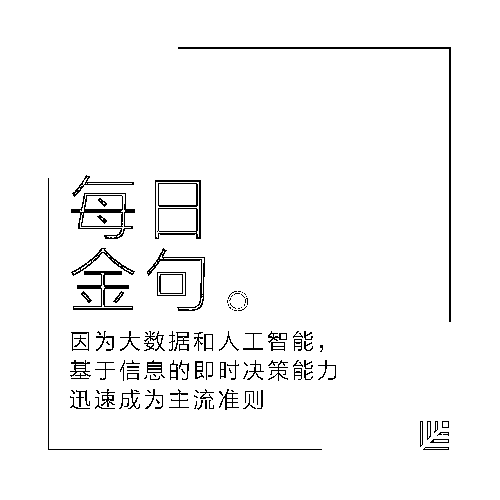

# 从烧钱数百万到七个月内扭亏为盈，这位创始人如何做到的？｜红杉汇内参

> 原文：[`mp.weixin.qq.com/s?__biz=MzAwODE5NDg3NQ==&mid=2651223122&idx=1&sn=b990caa2eb4870ce38b7023df8853823&chksm=80804a06b7f7c310fbc5b99409535f5a18b288df6b765b6d9264f3e76ada5720a1a4640e3308&scene=21#wechat_redirect`](http://mp.weixin.qq.com/s?__biz=MzAwODE5NDg3NQ==&mid=2651223122&idx=1&sn=b990caa2eb4870ce38b7023df8853823&chksm=80804a06b7f7c310fbc5b99409535f5a18b288df6b765b6d9264f3e76ada5720a1a4640e3308&scene=21#wechat_redirect)

[ 编者按 ] 盈利没有魔法。只有清晰的目标感、科学的计划和超强的执行力相结合。

美国初创公司 HotelTonight 联合创始人/CEO Sam Shank 在这篇文章里分享了如何在短短 7 个月里让公司起死回生的故事，这同样不是魔法，他的每一条经验都是可以被其它创业者学习到的。

经历一次危机，那些没有消灭我们的东西，将会让我们更强大。Shank 果断止住了烧钱的创口，他的方法是：全面紧缩企业开支，只进行一轮裁员；在裁员同时就重新吹响集结号，制定盈利计划；高效执行，不再为未经证实的假设冒险；让所有人都能够参与到成功的过程中。非常有参考意义。

每期监测和精编中文视野之外的全球高价值情报，为你提供先人一步洞察机会的新鲜资讯，为你提供升级思维方式的深度内容，是为** [ 红杉汇内参 ]**。

*******

**【内参】**

创始人自述：从**烧钱数百万**

到七个月内**扭亏为盈**

自述：Sam Shank

综合编译：洪杉

**每**位创始人都会回忆起创业生涯的那一刻：你第一次宣布一个能够改变公司命运的决定，而前一晚，你可能彻夜未眠。

对我来说，那是 2015 年 10 月里的一个周一。我在公司执行团队面前宣布了我的决定。五年来，我的公司一直在以严重的资金消耗来拉动高增长率，我花了整个夏天来试图筹集下一轮资金，但每位风险投资人仿佛都说出了同样的台词：“贵公司是有着不错的增长，但是你们的亏损额可是个天文数字啊。”由于每月亏损 250 万美元，我们的融资似乎注定只能达成一笔非常糟糕的交易。

是时候要向执行团队通报这一情况了。虽然我已经练习了很多次，但在我说公司要改变发展路线时，我的声音变得嘶哑了——我们不会再进行 E 轮融资，相反，我们要努力实现盈利。

真好，他们没有把时间浪费在表达怜悯之情上，而是奋起迎接挑战。我们不再着眼于增长数字，而是为盈利制定了一条路线。在之后的七个月里，我们从每年亏损 3000 万美元变为能够掌控自己的命运。下面就让我来分享达成这个目标的四个步骤。

**只进行一轮裁员** 

重新评估基础开支是你第一个而且是最关键的任务。对于许多公司而言，最大的开支就是人工成本。虽然不要期待裁员能够完全填补财务上的缺口，但它往往会成为让公司摆脱赤字的必要步骤。

舍弃团队成员是此过程中最困难和最引人注目的部分。也正因为如此，你必须从这一步开始做起。

如果其中一些员工将被裁掉，他们就需要尽快找到下一份工作；如果能够留下来，他们就需要消化这个负面信息，重新集合并做好在一个更精简的团队里携手前进的准备。无论哪一种情况，太长时间的拖延只会坏事。想把裁员推迟一两个星期是人的天性所趋，但是请不要这样做。否则这个决定的执行只会变得更加沉重，更加棘手。

以下是我向面临类似情况的创业者提供的经验教训：

*   **只进行一轮裁员。**人们可以接受公司的重组并从变动中恢复过来，但当你暗示要进行第二轮裁员时，他们就会害怕，并预想到会有第三轮、第四轮……他们会脱离公司，并开始寻找下一份工作，他们会不再信任你的领导、承诺以及愿景。

*   **给将要离职的人以及那些留下来的人以最高尊重。**比如帮助他们找到新工作，约他们喝咖啡，向他们提供建议。

*   **你对待离职人员的方式会向留下来的员工传达强有力的信息。**我们主动实行了表明具体态度的手段——比如给予员工带薪假期——以践行我们的价值观。

*   **不要让裁员决定变成一件个人私事。**永远不要说“这对于我来说真的很艰难”，当谈话变得情绪化时，你会不由自主想要说出诸如此类的话语。想表达同情是很自然的事情，但是他们伤心的程度远比你高。

*   **主动承担责任**——不要将裁员归咎于董事会或其他任何人，一切都要反省己身。

**开启追求盈利模式**

裁员之后，一个令人信服的重振计划在此关头才是至关重要的。以下是为盈利计划扫清障碍的关键执行步骤：

*   **立即组建新团队。****召集人员的速度越快，随裁员而来的恐慌就会越少。**不妨考虑在常规的团队会议之前完成关于裁员的谈话，如此一来，你可以轻松聚集那些决定予以留用的员工。

*   **摒弃使用 PPT。**这不是向董事会汇报工作，与团队谈话时要保持开放、诚实以及能够接受批评的态度。你需要做的第一件事就是，肩负起企业在盲目扩张方面的全部责任。告诉团队，企业不能再以目前的方式运作了。**团队对你的信任正取决于你将此刻设定为一个新开始的能力。**

*   **展开企业的安全网。****让人们知道你只会进行一轮裁员——这就是刚刚发生的事情。你要回答员工的所有问题，直到他们完全理解一切。**他们的下一个疑问将会与公司的现状相关，你需要极其清楚地阐明公司的状况良好，你具备所需的一切资金来达成盈利，但是需要每个人都能达成共识以降低亏损率。为了表明这一点，我告诉团队目前确切的企业数据：我们在银行所持有的资源、我们的现金流、亏损率以及这些因素会如何影响盈利目标的达成。

*   **让企业的亮点和成就成为焦点。**分享最近你成功建立的任何里程碑，比如在订单或新客户数量上创下的纪录。利用最近的这些成就来帮助推行新计划，这是一种在困难时期推动增长势头的有用途径。

*   **在面对艰难问题之前先做准备。**员工在这一刻可能会因为困惑或害怕而不作提问。那么，在全员大会开始之前，你可以与核心团队一起列出最可能被提出的问题，对回答进行演练，并**在员工提问之前就把答案给他们**。这不仅可以提供有价值的信息，而且有助于向员工表明，你已经对此深思熟虑。

现在，是时候开启追求盈利模式了。你的盈利计划要可行，并且还要简单明了。我们定义的目标很简单，就是增长和盈利。增长，就是公司年收入增加了多少，对我们来说，指的就是账面总值(GBV)。盈利，就是自给自足。就这么简单，不会有什么歧义。

我们的团队也真的在这种思想下团结了起来。但这不足够——你要为他们绘制出一幅美好宏图。我还告诉他们，这是因为每一个人都将做出意义非凡和独一无二的贡献，才能帮助公司走到那一步。

**执行，执行，执行**

你必须现身说法，让每个人都相信经过前番挫折，公司正在走向成功。你要让自己更积极地投入工作。以下是我给自己定的一些规矩：

*   **对每分钟都负责**，更积极地利用时间。我发现，之前我在一周内有 80%的时间是去公司外面开会，现在，我留出更多时间和团队在一起。

*   **要可见和可找。**我希望团队里的人可以很容易就找到我。如果没有人来找我，我就会去旁听一些我一般不会参加的会议。

*   **定期召开全开放式会议。**我们对月度的全员大会做了调整。原本会议结束前就有一个 AMA (Ask Me Anything, “问我任何事”）环节，在追求盈利的七个月里，AMA 环节尤其重要，员工提出的问题激发我们展开富有建设性的对话，结果是想出了富有创意的产品特色和新方案，并着手去做。这些方案增加了收入，还降低了烧钱的成本。所以时至今日，我们还保留着这一传统。

**在实现盈利的道路上，要让别人看到你。你就要成为第一个到办公室、最后一个离开的人。**

此外——

**有 9 成信心才通过预算。**坚决否决那些不会盈利的方案，这个阶段不应该再为未经证实的假设而冒险，这样，团队才能清晰地看到离实现目标更近了一步。

**只看各项 KPI 的颜色。**它会突出我们实现月度目标过程中所取得的成绩，如果数据一片飘绿，说明我们要实现目标了。盈利能力是一条亮绿的线——我们都盯着它看。每项决策都是朝这个方向迈出的一步。

**让每个人都参与到成功中**

我很惊讶地发现，在开启追求盈利模式后的一周内，我们团队的观念完全改变了。他们全身心投入工作，好像在说：“让以前的事都见鬼去吧！现在是时候建立伟业了。”在我反应过来之前，各个团队已经开始在做新项目来让公司重回正轨。我当时有两个选择：要么主动管理起这些项目计划，要么只是设立一些范围让团队自由发挥。很高兴我选了后者，它让我学到了以下法则：

**划定范围，而非批不批准。**每个人应对挑战、达成目标和深入探索出色方案的能力会让你大吃一惊。

**公开奖赏。**嘉奖员工做出的新努力，如提前完成任务或应用了创新性的方法来减少预算。我们有一个叫“省而不抠”奖，每月奖励一位员工采用了精明的方式为公司省钱。这会让大家认识到，在公司里的方方面面你都可以取得成功。

**在实现大目标的过程中，以具体的物像来展示目标是一个极其有帮助的手段。**我们在茶水间放了一瓶威士忌，写着“到了 B2P 才能开”——B2P 的意思是“盈利的成形”(build to profitability)。每次经过，这瓶酒都会提醒我们目标是什么。它作为一个有形的具体物像，让我们期待着在未来可以享用它。

2016 年 4 月，我们实现了盈利目标。从每月烧钱数百万，到扭亏为盈，我们只用了七个月。而那瓶威士忌，我们更是只花了 10 分钟就喝完了。在那一刻，我们感觉到的团结感是以前从来没有的。

***********

**【情报】**

#人工智能的魔法基础是…#

**大数据如何大规模赋予 AI 和机器学习能力**

*   由于缺乏数据的可用性，样本量有限，以及无法在 1 毫秒内分析大量数据，使得 AI 和机器学习的能力埋没了几十年。

*   NewVantage 公司今年初所做的一项调查显示，高达 88.5%的企业高管希望其公司能受到 AI 的影响，并认为**在未来十年中 AI 将是新的“最具破坏性的”能力。**

*   大数据赋予人工智能能力的关键是：

✔️ 大数据技术。我们有能力大量处理以前需要非常昂贵的硬件、软件才能处理的数据。

✔️ 大型数据集的可用性。语音、图像文件、天气数据、物流数据等在过去不可能实现的现在统统可用，即使是旧的“纸张来源”数据也可以从网上获取。

✔️ 规模性机器学习。神经网络和深度学习是人工智能的一大突破。

*   **基于信息的即时决策能力迅速成为主流准则。**

#创业不是为了毁掉生活，对吗#

**如何克服创业的焦虑和抑郁**

创业同样要经历许多挣扎，无论这些挣扎是否看得见。如何在管理企业同时应对焦虑和沮丧情绪？

*   **你不属于事业的一部分。****如果以公司收入、利润、客户评级和员工满意度来衡量自我成功，那么每一个失败都是对自我价值的一次毁灭性打击**，会让做决策这件事变得越来越恐怖。但事业只是你展现自我的一种形式，自我价值不应该只由事业（或资产）价值来定义。

*   **照顾好自己的身体。**改变自己对工作和业余时间的心态。智能手机和自我意识相结合，会产生一种过度膨胀的紧迫感。但其实，你猜怎么着……即使每晚没有检查电邮，这个世界也不会崩溃。

*   **有你的日程表。**人们想创业是为了更好地掌控自己的事业和生活。然而现实恰恰相反：你会很快发现自己分身乏术，无法让所有人都满意。你需要专注于那些对你和企业来说最重要的事。

*   **谈一谈。****当 CEO 是一种孤独的体验。当你觉得需要掩饰自己的情绪，并一直念着“装久了就变成真的”这条咒语来伪装自己时，孤独感会变本加厉地袭来。**不妨与他人分享你的真实感受，你将最终与他人建立起更深入的关系。放弃凡事皆要尽善尽美的幻想，才能为公司做出更明智的决策。

*   **不要害怕寻求帮助和专业治疗。**

#过于相似反而有负面影响#

**为何要在公司文化与个人领导风格之间划界线？**

佐治亚州立大学一项研究发现，那些领导风格与公司文化相似的 CEO 们对组织绩效其实是有负面影响的。如何找到两者的微妙平衡，并实现创新突破？

*   **完善文化，不要削弱文化。****领导者虽然要承担创新责任，但不能以创新为借口挑战和破坏既有文化。**可以先看看企业文化忽视了哪些方面，然后从这些角度切入，找出改善方法。

*   **找到缺失部分。**员工和领导者对企业文化的理解往往不一致，认真倾听员工的想法，找出这些断层的位置，把缺失的部分填补好。

*   **鼓励创新。**当领导者坚守既定文化时，员工会认为自己也必须循规蹈矩。这样一来，企业中的各个层级都会缺乏创新。领导者应该**鼓励员工挑战和质疑企业文化中那些想当然的观念，那些被视为“正常”的做法**，并以身作则，提出问题，推动积极的变革。领导者的目标应该是改善整个企业的创新环境，而不是破坏价值观。

***

**【往期回顾】**

红杉汇内参第 031 期

[创业公司如何实现高增长？](http://mp.weixin.qq.com/s?__biz=MzAwODE5NDg3NQ==&mid=2651223072&idx=1&sn=d59f1af3a43bd0945b66333cd630b992&chksm=80804a74b7f7c362ef2127ee20f3fc0de723d8004558c6f28afa96ba9ddfc7e96e848d754d94&scene=21#wechat_redirect)

[这里有 8 位老司机的朴素经验谈](http://mp.weixin.qq.com/s?__biz=MzAwODE5NDg3NQ==&mid=2651223072&idx=1&sn=d59f1af3a43bd0945b66333cd630b992&chksm=80804a74b7f7c362ef2127ee20f3fc0de723d8004558c6f28afa96ba9ddfc7e96e848d754d94&scene=21#wechat_redirect)

红杉汇内参第 030 期

[在创建平台级企业之前，你需要知道的](http://mp.weixin.qq.com/s?__biz=MzAwODE5NDg3NQ==&mid=2651223019&idx=1&sn=5fbf8d7f1118ec0d3f9bdd797d12dd4e&chksm=80804dbfb7f7c4a92f7178dab6aea7bc886bb7af717c2872dedb5f6d13bf4a1179045301c02a&scene=21#wechat_redirect)

红杉汇内参第 029 期

[想成为优秀的 CEO？先成为优秀的产品经理](http://mp.weixin.qq.com/s?__biz=MzAwODE5NDg3NQ==&mid=2651222949&idx=1&sn=f40049b018226b151c264bda16f13194&chksm=80804df1b7f7c4e7b575567ea9dc5457f7e4e75de22651799235e1388fdadfeb1bcb6f7748f1&scene=21#wechat_redirect)

