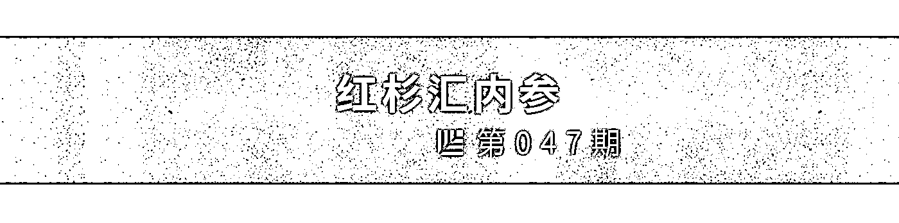
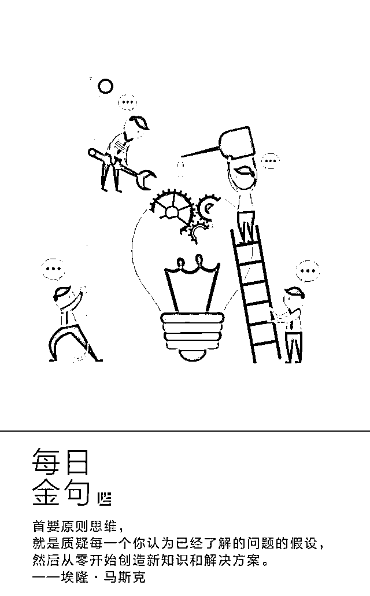
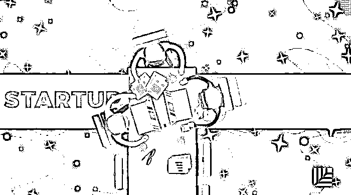
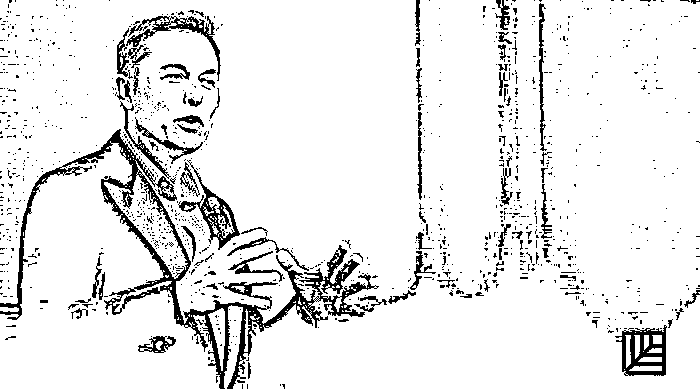

# 初创公司“烧钱”的正确姿势｜红杉汇内参

> 原文：[`mp.weixin.qq.com/s?__biz=MzAwODE5NDg3NQ==&mid=2651223729&idx=1&sn=ba0dd7795eccbed93f0f6fda4cae93cd&chksm=808048e5b7f7c1f3a3b4e14f411ec1217a8ae5be2685cf4c2742a8e647388a4bb30f180ae761&scene=21#wechat_redirect`](http://mp.weixin.qq.com/s?__biz=MzAwODE5NDg3NQ==&mid=2651223729&idx=1&sn=ba0dd7795eccbed93f0f6fda4cae93cd&chksm=808048e5b7f7c1f3a3b4e14f411ec1217a8ae5be2685cf4c2742a8e647388a4bb30f180ae761&scene=21#wechat_redirect)

[ 编者按 ] 无论是靠风投融资的初创公司还是靠自己力量的初创公司，烧钱率和创业跑道对它们都十分重要。

自筹资金的公司，其创始人须得足智多谋、工作高效，因为时间、金钱、关系等有限，那就要尽量把烧钱率降至最低，与此同时，努力把资金用在刀刃上。

靠融资的初创公司也要时刻做好这道计算题，毕竟引资是一个过程，投资人也会“审视”你的“烧钱率”。

▨ 连续准确地计算出烧钱率和创业跑道十分重要，它会告诉你哪个时间点钱会烧光。

▨ 烧钱率会影响投资人对你企业的评估以及投资决定。

▨ 如果现金跑道少于一年，要么得开始新一轮融资，要么就得制定和执行新计划来确保生存了。

▨ 要想知道理想烧钱率和创业跑道长度是多少，还得靠你自己对公司经济和战略的主要方面进行全面分析。

每期监测和精编中文视野之外的全球高价值情报，为你提供先人一步洞察机会的新鲜资讯，为你提供升级思维方式的深度内容，是为 **[ 红杉汇内参 ]**。

** 内参**

**初创公司“烧钱”的正确姿势**

作者 / Josiah Humphrey

综合编译 / 洪杉

为什么超过 90%的初创公司都没能坚持下来？许多研究显示，创业失败率高企的原因往往是这些初创公司没能发展出创业大师史蒂夫・布兰克口中的“具有可重复性且可伸缩性的商业模式”。

简单来说，就是初创公司缺乏经济资源来维持运作了才会把门店关了。例如，他们手头上已经没有现金了。

因此，公司的创始人们必须时刻衡量他们公司的收支情况，而**若想保持一个可持续的现金流，就要了解透彻“烧钱率”和“创业跑道”这两个概念。**

**一个除法，算出投资人是否“爱”你**

一般而言，“烧钱率”是指企业资金损耗的比率（即投出去石沉大海的现金），而“创业跑道”也称“零现金日”——指的是企业基于目前的烧钱率能坚持运营下去的时间。

你可以利用现金结余，除以烧钱率来计算创业跑道。

例如：

**创业跑道=现金结余（125000 美元）÷烧钱率（25000 美元/月）=5 个月**

当你需要引进外部资金时，计算零现金日就极其有用，因为引资这一过程有时需要 4 到 6 个月。

连续准确地计算出烧钱率和创业跑道十分重要，这至少出于以下三个原因：

▨ 这些数字非常清楚地提醒你，要是你最后无法产生足够的营收，你的初创公司将会在未来某个时间点烧光钱。

▨ 这些数字影响投资人对你企业的评估以及投资决定。如果烧钱率比预期大，或者企业的营收增长速度没有预期快，投资人可能会认为这个企业不是笔好的投资，风险太大。

▨ 若是这些数据显示开支失控，那么你的投资人大概会忧心忡忡，进而介入你公司运营。

例如，一家拥有 7 名全职员工的软件即服务（SaaS）公司，总烧钱率为每个月 10 万美元，最近在 A 轮融资中获得 500 万美元资金，根据其当下的烧钱率（10 万美元×50 个月=500 万美元），公司的创业跑道是四年又两个月。

按照设想，这一“创业跑道”的长度相当可观，但实际上，四年多的时间内，初创公司保持不变的烧钱率，这种可能性微乎其微。因为这家公司几乎一定会对其他资源进行投资，甚至可能为了刺激、管理和加速增长而调整方向。

因此，**烧钱率也会提高，导致创业跑道变短。**任何初创公司要想评估其烧钱率和创业跑道，持续不断地反复计算、调整战略，无论何时都是必要的。

**怎么“烧”才健康？**

2011 年，弗雷德・威尔逊提出一个基本公式，用于计算（他认为应当的）初创公司最大烧钱率。

“一条行之有效的规则是，**将团队成员数量乘以 1 万美元**，这样就得到每月的烧钱量。这不是你支付给员工的金钱数目，而是包含租金及其它费用在内的聘用一个人的总成本。”

另一条普遍接受的规则是：**每个月支出应少于最近一笔融资的百分之十。**

例如，如果你在最新一轮融资中筹得资金 150 万美元，那每个月的支出应少于 15 万美元。这种情况下，公司需要认识到，距离下一轮融资的时间间隔（也就是创业跑道长度）只有 10 个月。5%到 9%这样小一点的比例可能会更稳妥（取决于筹得的资金数目）。

天使投资者马丁・兹威灵也强调这点：“如果现金跑道少于一年，要么得开始新一轮融资，要么就得制定和执行新计划来确保生存了。”

鉴于各个公司烧钱形式各不相同，所以要遵循一个具体的普适的公式，轻而易举地算出任何一家初创公司的正确烧钱率，几乎是不可能的。

六种方法确定最合适的烧钱率：

▨ **工资以外的开支不应超过预算的 5-10%**

排除工资、税收、设备/技术和租金等支出后，用于资源或投资的花费尽量避免超过预算的 10%。

▨ **在投入重金前先对营销渠道进行测试**

对于初创公司而言，最具吸引力的营销渠道莫过于最低的获客成本，并实现最高的转化率。

▨ **唯有在必要时才进行人才上的投资**

雇员工资常常是初创公司比重最大的一项开支。你必须保证，公司的雇佣决定是根据公司真正的需求和新员工将给公司运营带来的预期价值而做出的。

▨ **缩短现金循环周期**

我们的目标是在不影响公司正常发展的情况下，尽可能快地获取收入来收回之前支出的每一分钱。

▨ **建立战略性伙伴关系**

通过与其他公司合作来发展自身，而不是疯狂花尽账户里每一分钱。

▨ **进行收支平衡分析，尽早达到收支平衡点**

收支平衡点便是你的初创公司生与死的分界点。越过收支平衡点后，你就开始积累利润了。

**别死磕“烧钱率”**

不过，也有人对烧钱率持有不同态度，有些人甚至认为创业者应该减少对烧钱率的关注，重视公司支出对执行的影响。

一家 VC 合伙人这样认为：“仅凭烧钱率几乎看不出一家初创公司是否在道上。只有对一家公司如何使用现金及其长期战略进行评估，才能得知高烧钱率是好是坏。很多情况下，低烧钱率的典范却会带来危险。”

另一位投资人也有类似的看法。他坚持认为，没有先将创始人的（难以测量的）风险承受能力纳入考量，可承受烧钱率便无从谈起。所谓风险承受能力就是，为了获得高速增长，是否愿意做出使公司暴露于可能倒闭的风险的决策。

事实上，和创立一家高增长初创公司要注意的诸多其它方面一样，**你必须在下列这两者间取得平衡：一边是随意挥霍耗尽现金，另一边是过于审慎导致错失增长良机。**

** 情报**

#让它看上去和实际一样美#

**包装你的种子轮融资**

▨ 募资时，创始人销售的是公司的大部分股权，它既像是一个产品，又像是软件即服务许可证，然而有些创始人却没有好好考虑这个“产品”的“用户体验”。

▨ 投资人想看到的不是“掌握一家潜力和风险并存的公司的有志技术青年”，而是“平衡个人技术与零散式招聘和商业才干的坚定创始人”。

▨ 无论你正在一个全新的市场/技术前景下创业，或是使用强制方法攻击一个看似无敌的老牌企业，重要的是能够写出一个令人信服的剧本，并与业内杰出人物联合演绎。

▨ 所以，包装不应该是美化你的创业公司以满足风险投资期望。而是：

□ **一个完整团队。**由相识多年、人际和睦的伙伴组成的强大创始团队是筹码。

□** 展现真正的行业支持。**如果你在业内没有很高的个人信誉，那么找到建立信誉的方法很重要。

□ **将很多可靠的投资者吸引到了自己周围。**你在潜在投资圈里有不错的口碑。

如果投资者对你有兴趣，你却无法与之达成交易，问问为什么：

□ **是因为信誉不足吗？**如果是这样，在你的行业和关系网中尽可能找到十位最具影响力的思想家。

□ **是因为缺乏一个团队吗？**作为创始人，你需要表现自己有能力聚集一群信徒加入你的事业。

□ **是因为要努力说服投资者？**如果不行，那就招揽更多客户以展现你的公司的重要性。

#如何像天才一样思考问题并解决问题#

**马斯克所信奉的首要原则思维是什么**

埃隆・马斯克曾在接受采访时说：

▨ 思考需要有个框架。类似物理学的首要原则推理——从最基本的原理自下而上进行推理而不是类比推理。**在我们的一生中，大多数时候我们都使用类比推理，即只在别人的基础上做出微小改变。**

▨ 首要原则思维，就是质疑每一个你认为已经了解的问题的假设， 然后从零开始创造新知识和解决方案，像个新生儿一样。

▨ 从本质上讲，首要原则思维有助于你形成一种旁人无法理解的独特世界观，以创新的方式解决难题。

方法是：

▨ 第一步：**确定和定义你目前的假设。**

▨ 第二步：**将问题分解，找出基本原则。**“将知识视为语义树模型，这一点很重要。在研究细节之前，一定要弄明白基本原理，即问题的主干和大分支。否则这些细节/叶子将无法单独存在。”

▨ 第三步：**从头创建新的解决方案。**

#因为 AI 也在催促人类的进化#

**终身学习应纳入 CEO 的日程表**

▨ 当 AI 时代来临，有一件事是显而易见的。未来，有越来越多的员工必须把更多时间耗费在复杂的认知技能的使用上。

▨ 大信息量工具使用的范围越广，那些只能由人类做出的决策就显得越发重要。这一现象反过来又会增强持续学习的重要性。员工、经理和高层管理人员需要跟上机器的脚步，学会解读机器生成的结果。

▨ 未来的学习不会在课堂中，而是在职场中——人们在工作中寻找更好的工作方法。CEO 需要建立学习行为模式，并投资于学习流程和工具的开发。

▨ 重视“软性”技能开发：

□ 重新理解**协作**：更重要的是成员与跨越多种界限（如专业知识和距离）的外部人员所进行的团队式沟通和协作。

□ **同理心**：可以借助有意识地训练和人与人之间快速而深入的交流来学会。

□ 开启人工智能时代的**意义构建**，要先理解机器能做和不能做的事。阐明组织的宗旨（并随着技术和客户需求的变化而演进）将成为领导者工作中更为关键的一部分。************

** 推荐阅读**

壹

[48 小时的红杉人生创业馆，企业、机构、粉丝都玩得这么 6？](http://mp.weixin.qq.com/s?__biz=MzAwODE5NDg3NQ==&mid=2651223722&idx=1&sn=3f54b46d375dd5841a30c311b70aeda2&chksm=808048feb7f7c1e8f2d4dc1d20625b91e077e4fbc02e4f8559105cccea60e4645a491eb7b7f9&scene=21#wechat_redirect)

贰

[如何从 14.5 亿流动劳动力中挖掘人才？](http://mp.weixin.qq.com/s?__biz=MzAwODE5NDg3NQ==&mid=2651223723&idx=1&sn=3593ccbe47de44fefb0aef03da910591&chksm=808048ffb7f7c1e938dda309efa3bbcb8cfb4ad915e48c906ede482bdb0dc422718831c348e5&scene=21#wechat_redirect)

叁

[没想到我们是这样的红杉？ | 致你们的 Q&A](http://mp.weixin.qq.com/s?__biz=MzAwODE5NDg3NQ==&mid=2651223648&idx=1&sn=6539309922e4f46bf74922079fbbe565&chksm=80804834b7f7c12200389187be88374c770bf9c27d9b5c5bb66e929c7713c17b85a817a95fc9&scene=21#wechat_redirect)

肆

[独家｜中美 AI 六巨头都在密谋啥？我们绘制了一份全球 AI 专利分布战情图](http://mp.weixin.qq.com/s?__biz=MzAwODE5NDg3NQ==&mid=2651223649&idx=1&sn=728eeac00e72d62f5dfd81b0e5c5a08c&chksm=80804835b7f7c123779b1a0ad922a1b2f1f02e8e6e344a00bece64b53873331e27abbfce35cd&scene=21#wechat_redirect)

伍

[AI 时代，中国的首席财务官需要如何改变](http://mp.weixin.qq.com/s?__biz=MzAwODE5NDg3NQ==&mid=2651223708&idx=1&sn=8a198cc9db28de3277186b6b5334ae80&chksm=808048c8b7f7c1dedc49e3aa98da5079e03c2faa468b750cc28f2fdce05682412bdb33300242&scene=21#wechat_redirect)

