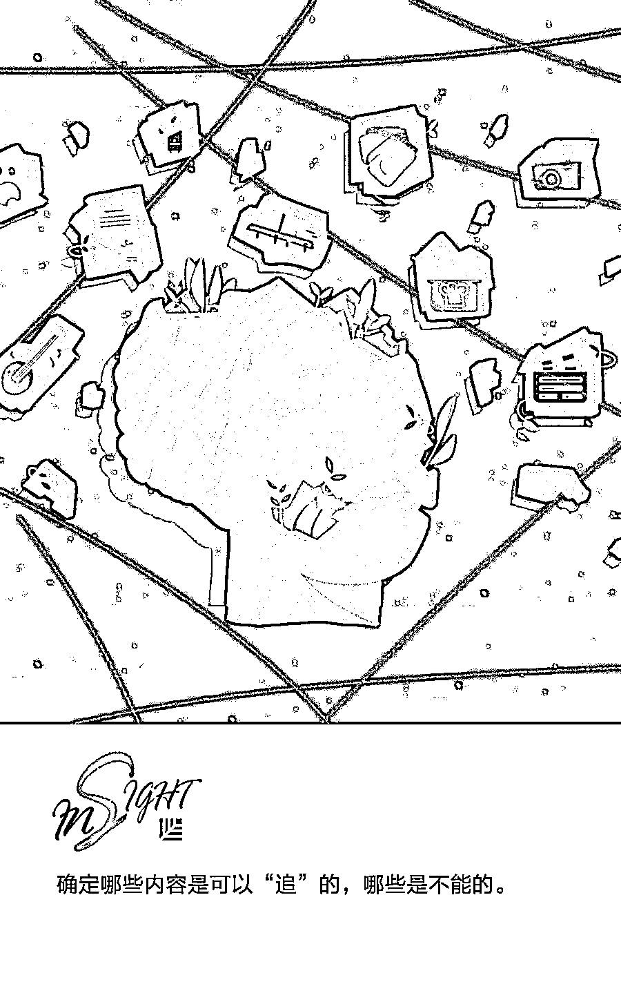
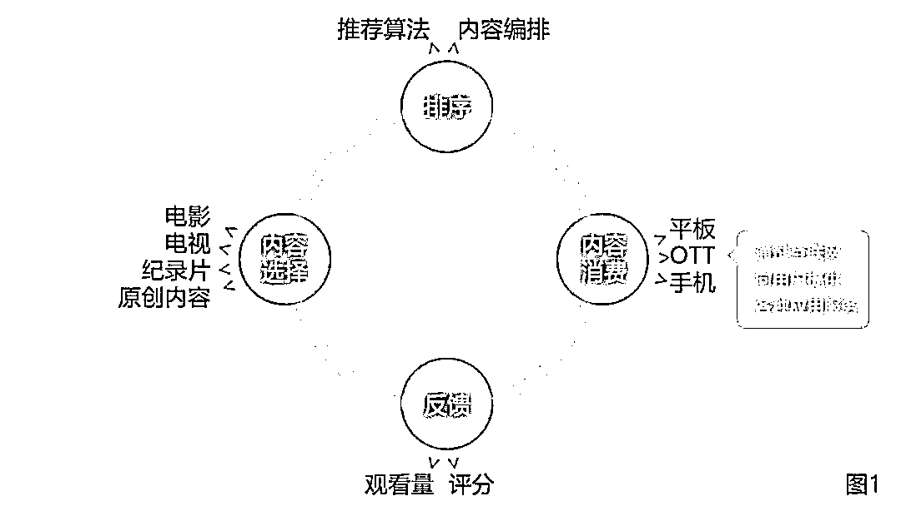
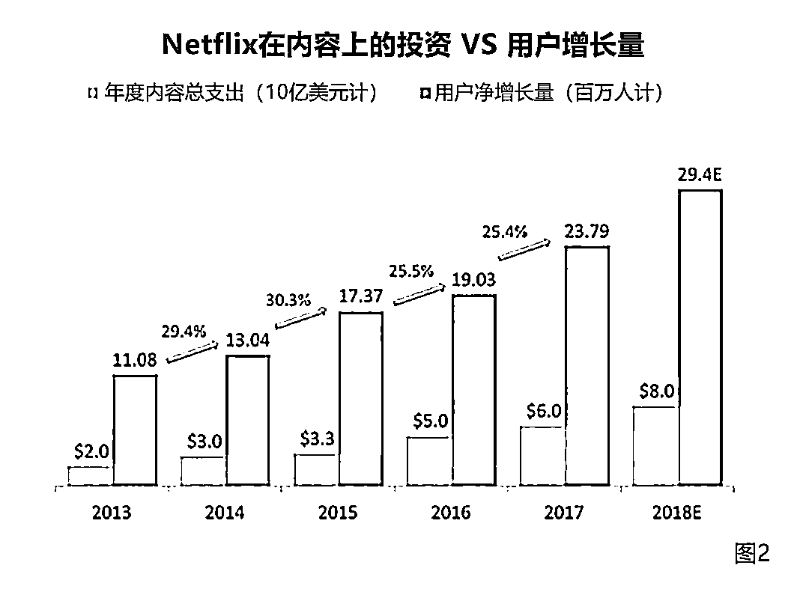
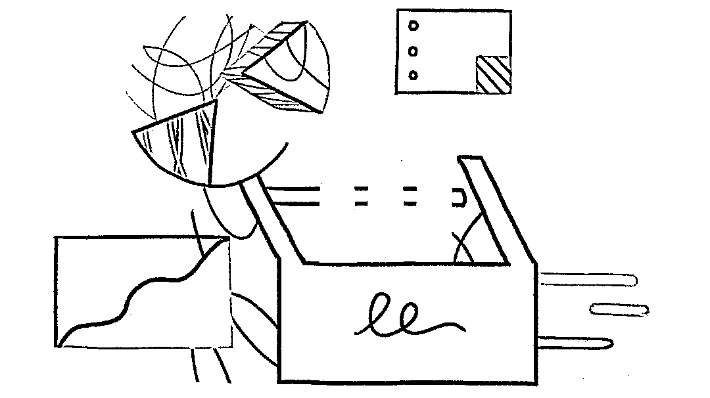
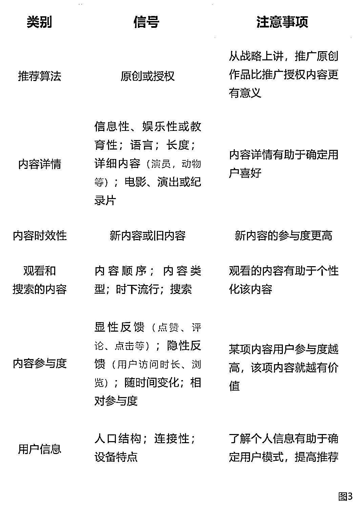

# 让人欲罢不能的产品：运用参与度打造出“爆款”产品 | 投资人说

> 原文：[`mp.weixin.qq.com/s?__biz=MzAwODE5NDg3NQ==&mid=2651226353&idx=1&sn=90ac368e99393fc845dbbe59d06d752a&chksm=8080bea5b7f737b38c91e1e25eda32a013d5ebd0b664a100084a0bc270c49c936c3363ea9fec&scene=21#wechat_redirect`](http://mp.weixin.qq.com/s?__biz=MzAwODE5NDg3NQ==&mid=2651226353&idx=1&sn=90ac368e99393fc845dbbe59d06d752a&chksm=8080bea5b7f737b38c91e1e25eda32a013d5ebd0b664a100084a0bc270c49c936c3363ea9fec&scene=21#wechat_redirect)

这是“让人欲罢不能的产品”系列的第四篇，本文聚焦于如何从内容制作、推荐和内容消费三个方面帮助专业内容平台培养用户的参与度，打造出“爆款”产品。文中的指导主要是针对视频内容生产，当然也适用于包括文本和音频在内的其他形式的专业内容。

本文研究成果来自红杉美国数据科学团队，Jamie Cuffe、Avanika Narayan、Chandra Narayanan、Hem Wadhar 和 Jenny Wang 对本文亦有贡献。以下是部分要点摘要：

▨ 制作“长青”内容是确保用户参与度最重要的方法。

▨ 内容多样性、保证质量、可追性、原创性和高价值都是推出高浏览量内容的关键因素。

▨ 为了达到精准推荐的目的，必须了解每位用户可搜索到的所有内容，收集用户直接和间接的信号，并使用这些信号预测用户行为。

▨ 内容消费会受到设备、网络连接、内容提供顺序及搜索结果顺序的影响。

▨ 内容类型、推荐算法、探索和利用选择、季节性、共享账户、优化功能等强烈影响专业内容的参与度。

此前，“让人欲罢不能的产品”系列已经推出了三篇，在[《让人欲罢不能的产品：News Feeds 和 Content Production 的背后魔力 | 投资人说》](http://mp.weixin.qq.com/s?__biz=MzAwODE5NDg3NQ==&mid=2651225795&idx=1&sn=c3122f5ea139d3e435da3fb18caaacea&chksm=80804097b7f7c98133bf8edd39058a7e0a7dd8f2df2d8f33b1b52eaac3b54c518af28234eafc&scene=21#wechat_redirect)中，我们介绍了新闻推送、内容生产，在[《让人欲罢不能的产品：数据探索与优化利用之间的权衡 | 投资人说》](http://mp.weixin.qq.com/s?__biz=MzAwODE5NDg3NQ==&mid=2651226169&idx=1&sn=9427ab83620b576244e2905e9288d68a&chksm=8080be6db7f7377ba03f0cfddc7509a68db81a22ab1a87e938da4c04da32121449a33ee4d993&scene=21#wechat_redirect)中，我们介绍了连接和库存、即时动态排序，在[《让人欲罢不能的产品：学会帮用户积累“美妙时刻” | 投资人说》](http://mp.weixin.qq.com/s?__biz=MzAwODE5NDg3NQ==&mid=2651226228&idx=1&sn=0dfa58e60ba6360c2367d121274e4d87&chksm=8080be20b7f73736952d30ff83936cd9d2bf96d81a4af17f1ffb5d4029c469fac7b441e0f855&scene=21#wechat_redirect)中，我们介绍内容消费、反馈，并总结参与度对产品运营的重要启发。

想要理解有关专业内容的参与度问题，可以先制定一个框架。与即时动态一样，Netflix、HBO 和 Spotify 这些产品都可以通过如图 1 所示的内容制作-消费循环过程来理解，这个循环极大地促进了用户的参与度。

专业人士制作和传播这些内容，使用者体验后会通过评分、评论、投票反映直接反馈，或通过观看量、观看时长来进行间接反馈，而这些反馈会促进专业内容的进一步创作和传播。

虽然像 Netflix 这样的公司不断推出新的内容，每个用户也都能获得这些内容，但并不是所有内容都与用户相关。因此，我们建议用选择和排序算法。随着用户继续消费并提供反馈，该产品可以继续研究他们的喜好，不断推送他们感兴趣的内容以持续提高参与度。观看时长通常是最重要的指标，但用户回访越频繁（访问量），获取内容越多（观看量），参与度就越会增加。

我们将从内容制作（制作或购买不同类型的内容）、推荐（联系用户并展示与他们最相关的内容）、排序（按正确的顺序给用户展示正确的内容）、内容消费（确保用户在任何网络状态下可以用任何装置便捷地获取内容）和反馈（鼓励用户对内容进行反馈）这几个方面研究如何提高专业内容平台的用户参与度。

**内容制作**

影响专业内容用户参与度的最重要的一个因素是制作。和用户生成内容一样，如果不能给用户提供新的、相关的和多样的内容（授权或原创），访问量就会逐渐减少，产品最终就会没有用户了。制定内容制作的策略时，可以考虑以下几个方面：

▨ **内容多样性是留存用户的关键**

除了能吸引新用户，内容多样性还是促进专业平台发展的最大动力。为了减少用户流失，确保他们坚持使用产品，必须给他们提供大量内容。这对于跨国际、语言和文化的用户群尤为重要，Netflix 和 Hulu 便是如此。

内容多样性会确保用户有“追剧”的选择，便会增加整体的观看时长。不同类型的内容有不同的保鲜期和可追性（例如有一个完整系列的电视剧就比电影、新闻和体育节目更有可追性）。因此，理解每一种类型并合理搭配是至关重要的。

▨ **独家内容能助力在现有市场中获取新用户**

尽管相对来说，用户的总观看时长只有一小部分是花在新内容上（因为更“旧”的内容更容易获取），它仍然是促进你产品发展的重要因素。特别是提供一些别的地方找不到的内容，这不仅会帮你留住现有用户，还会吸引新用户（见图 2）。产品宣传需要新老信息的合理搭配。因此，像 Netflix 和 Hulu 这样的公司才不断努力获得并创造最好的新内容。

▨ **策略选择：授权内容还是原创内容？**

独家、原创内容和授权内容应该如何搭配，很大程度上取决于你们公司的使命、策略和对未来的长远眼光。例如，在 Netflix，授权内容创造了 80%美国国内浏览量，而其原创内容，如《纸牌屋》和《怪奇物语》，仅创造了 20%浏览量（数据来自 7Park Data 最新研究）。然而 Netflix 的首席内容官泰德·萨兰多斯表示，2018 年公司 80 亿美元的内容投资中有 85%是原创。为什么？可能是因为 Netflix 认为，随着内容创作者发展他们自己的、直接面向消费者的服务（如迪士尼现在所做的），他们可能损失授权内容。换言之，他们认为未来是属于原创的，而非授权内容。

▨ **内容保鲜期会影响收益**

正如前文所讲，不是所有内容都有同样的保鲜期。用户可能会看电影、纪录片，或是已经推出了好几年的某些节目，但这些跟体育节目大为不同。然而，体育节目对于时间的敏感性也意味着可以在这段时期获得高收益，尤其是通过广告的形式。所以，像 Netflix 这样的公司，没有广告策略，他们就依靠保鲜期长的内容；而亚马逊、Facebook 和 HBO 就会购买或推出体育节目。

▨ **按用户习惯确定发布时间**

更喜欢“追”新节目或播客，还是每周或每几天听一次新内容？一次性发布一整季，你可以同时满足这两种用户，但要确保观众或听众会去“追”。这通常也会增加总观影/收听时长，因为许多用户每次只看一个节目。他们越快看完一个节目换到下一个，观影/收听量就会越多。

评价一个专业内容平台的成就和发展策略，请考量以下指标（注意，这些指标可因类型、年龄、制作人、时间、评级等因素而异）：

**-** **每周都有内容更新**

每周可以获取新内容的数量最终决定了用户的去留。

****- **可获取的内容总量**

可搜索和浏览的内容越多，用户越有可能找到他们想要的。

****- **评估内容保鲜期**

有些内容经久不衰，有些内容很快就会过时。记录每项内容的保鲜期可以获得有价值的信息。

****- **评估内容是否可以“追”**

确定哪些内容是可以“追”的，哪些是不能的。

****- **内容的价值**

制作专业内容是要花钱的，所以你要知道内容的数量与它所带来的收益有关。

****- **内容的质量**

高质量内容一般最贵，但也更容易推销出去。考虑开发一种方法给每项内容设定质量值。

****- **搜索不可获取的内容**

了解用户所需内容，并了解他们是否可以找到，这会帮助你确定要获取什么样的内容。

**推荐**

为了达到精准推荐的目的，你必须了解每位用户可搜索到的所有内容，收集用户直接和间接的信号，使用这些信号预料用户行为（预测），并确定每一内容对每个用户的重要性（相关性）。因此，行之有效的推荐系统必须包含预测算法，该算法可以为每一内容所对应的用户分配一个数值上的“相关性分数”。

▨ **用户连接和内容库**

Facebook、Snapchat 或 Instagram 这样的社交平台上既有用户生成的内容，也有专业生产内容。与之不同的是，在 Netflix 这样的平台上，每位用户都可以接触到所有的内容。因此，每位用户所看到的内容都是一样的，消费和参与度很大程度上取决于用户与推荐、搜索、浏览和订阅特定节目或频道的交互方式。

随着产品的发展、制作内容的增加，大多数用户在平台上订阅的内容会增加、花费的时间也会增多，从而增加用户与内容、用户与平台之间的连接。最终，消费内容的数量会成为用户长期留存及参与度的强有力指标。

一些指标可以帮助你了解平台上的用户连接，你还可以考虑将它们按国家、语言、类型（新闻、电影等）、原创或授权、格式（文本、视频等），以及平台（iOS、Android、电脑）进行细分。

需要关注的指标：

****- ******可获得的内容**

通过推荐、搜索以及浏览能接触到的总内容越多，用户就越有可能找到他们想要的内容。

**- ****可获得内容的消费量**

了解用户消费与推荐内容之间的相关程度。

**- ****用户连接量**

用户与相关内容联系越紧密，他们就越有可能消费内容。

▨ **信号**

产品信号包括用户本身及其对内容偏好的所有信息，这能帮助你预测指定用户是否会浏览给定的内容。下表列举了一些信号类别的例子，并不全面。

▨ **预测及相关性**

因为借助用户过去的行为可以预测其未来的行为，因此，在一定程度上，机器学习模型可以使用上述信号来确定指定用户是否会观看给定内容，并根据每一内容对应的用户来生成相关性分数。当总内容中的每一段内容都有这样的分数时，排序算法就会按照出现在每个用户页面上的顺序将其排列。

由于多种原因，这些预测具有挑战性，尤其在决定哪些信号将影响，以及在多大程度上影响相关分数这个方面。选择并适当地权衡每一种功能既是一门艺术，也是一门科学，这可能相当复杂。

此外，每发布的一条内容所对应用户的相关性分数不仅应该反映从信号中得到的预测，而且应该反映产品的优化功能。比如，根据公司的发展方向，你可能需要优化用户观看时长，访问次数或点击率。Netflix 称其商业目标旨在最大限度地提高用户满意度，并保持每月订阅人数不下降，这两者都与尽可能扩大视频浏览量相关。因此，Netflix 优化了算法，对用户最有可能观看和欣赏的影片给予最高评分。尤为重要的是，推荐能够优化产品，并朝向公司发展总体目标时，才是卓有成效的。

**内容消费**

用户的网络连接能力和设备极大地影响他们对任何产品的消费体验，包括提供专业内容的产品（这些产品其实会非常受影响）。因此，牢记以下几个因素极为重要：

**- ****用以消费内容的设备**

你的产品在不同的设备（iPad、智能手机、电视等）上如何呈现？在低端设备上又如何呈现？

**- ****优化功能**

你想将产品朝哪方面优化？这取决于你自己的想法，可能是用户观看时长更长，有价值的用户观看时长更长，原创内容更多，或者其他因素。关键是如何在这之间做出权衡。

**- ****低端设备及连网能力较差**

在网络较差的地区，应向用户推荐哪些类型的内容?

**- ****内容提供的顺序**

内容提供的顺序及推荐方式，对内容浏览和观看的影响较大。

**- ****搜索**

搜索日益成为人们找到相关内容的一项重要工具。拥有能够识别用户意图的强大搜索引擎是十分有价值的。

需要关注的指标：

**- ****用户观看时长/日活跃用户数量**

用户观看时长是产品是否具有吸引力的强有力指标。用户观看时长的市场份额也是十分有效的指标。

**- ****每周访问次数**

人们会不断重复使用产品吗？这是实现产品-市场契合的初期指标，而访问次数减少是出现问题的初期警告信号。

**- ****用户观看时长/访问量**

与访问次数一样，这个指标将提高用户总观看时长。你要确定哪一个是产品最强有力的杠杆。

**- ****开始观看、观看完毕、添加到观看列表的视频数量**

视频观看总量是产品是否具有吸引力的优良指标。

此外，了解视频从开始观看到观看完毕的瀑布式流程也是衡量参与度的有效方法。

除了上述需要关注指标之外，还有一些因素会对产品产生影响：

**- ****探索和利用**

你应该优化利用已知的用户行为，还是尝试学习探索你不知道的方面？就是说，你应该在多大程度上强调他们可能看重的内容类型，以及在多大程度上强调他们没有尝试过的视频类型？这是所有排序算法共同面临的基本问题，这个问题没有简单的答案。你的产品应该展示多少用户喜欢而非个性化的内容？

**- ****数据不足**

不管你多么精心地构建算法，总会有一些你没有的数据。当人们观看的视频数量少之又少时，这一点尤其正确。

**- ****没有完美无缺的优化功能**

设计预测算法的目的是优化特定指标。然而，这些指标无法完全领会公司目标和使命的精神所在。因此，预测和相关性分数不可能完全充分。排序算法有助于预测用户是否与内容交互，以及交互的方式，但不能预测这种交互是否满足你的要求。

**- ****共享账户的影响**

因为 Netflix 此类产品的账户通常由多人共享，所以可能不清楚究竟是谁观看了给定的内容。这意味着你的产品必须在个性化推荐和反映整个帐户查看历史的推荐之间保持平衡。

**- ****季节性**

以恰当的顺序将适当的内容提供给合适的用户，这在某种程度上是一种时间的函数，因此，消费将受到用户行为变化的影响，会根据今天是星期几、什么季节、是否为夏季、是否处于节假日等因素变化而变化。

**- ****决定排序的信号**

内容类型和多样性、狂欢性、时效性、用户类型及其他信号都会影响内容提供的顺序，进而影响消费。** **

** 推荐阅读**

壹

[让人欲罢不能的产品：学会帮用户积累“美妙时刻” | ](http://mp.weixin.qq.com/s?__biz=MzAwODE5NDg3NQ==&mid=2651226228&idx=1&sn=0dfa58e60ba6360c2367d121274e4d87&chksm=8080be20b7f73736952d30ff83936cd9d2bf96d81a4af17f1ffb5d4029c469fac7b441e0f855&scene=21#wechat_redirect)投资人说

贰

[让人欲罢不能的产品：数据探索与优化利用之间的权衡 | 投资人说](http://mp.weixin.qq.com/s?__biz=MzAwODE5NDg3NQ==&mid=2651226169&idx=1&sn=9427ab83620b576244e2905e9288d68a&chksm=8080be6db7f7377ba03f0cfddc7509a68db81a22ab1a87e938da4c04da32121449a33ee4d993&scene=21#wechat_redirect)

叁

[让人欲罢不能的产品：News Feeds 和 Content Production 的背后魔力 | 投资人说](http://mp.weixin.qq.com/s?__biz=MzAwODE5NDg3NQ==&mid=2651225795&idx=1&sn=c3122f5ea139d3e435da3fb18caaacea&chksm=80804097b7f7c98133bf8edd39058a7e0a7dd8f2df2d8f33b1b52eaac3b54c518af28234eafc&scene=21#wechat_redirect)

肆

[红杉中国郭山汕：投资最难的是，投对了且投资逻辑也是对的 | 投资人说](http://mp.weixin.qq.com/s?__biz=MzAwODE5NDg3NQ==&mid=2651226334&idx=1&sn=65c7382e5ff3b6f581e7bbab8e5f73bd&chksm=8080be8ab7f7379c9db1904bb1c9f37538a600c21dbfe830a6ac493dd614ff14d4aeb673a838&scene=21#wechat_redirect)

伍

[红杉中国郑庆生：严守边界才是跨界之本 | 投资人说](http://mp.weixin.qq.com/s?__biz=MzAwODE5NDg3NQ==&mid=2651225888&idx=1&sn=399a6e617432398a328231076f1d8cf2&chksm=80804174b7f7c862e8a59dbb47ec8e47da2215c377af47cedc1f0328915703617eb897967612&scene=21#wechat_redirect)

