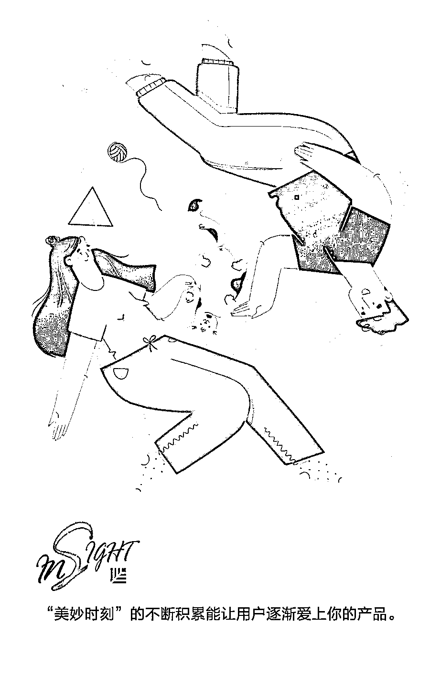
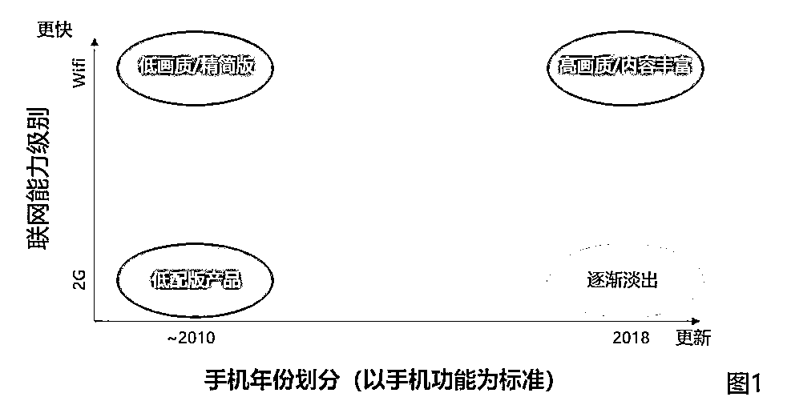
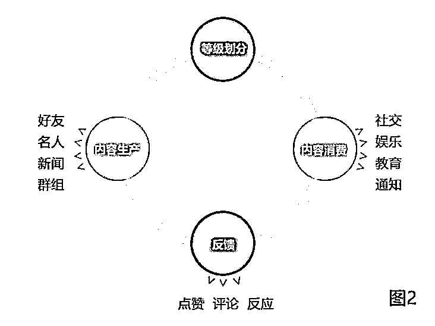
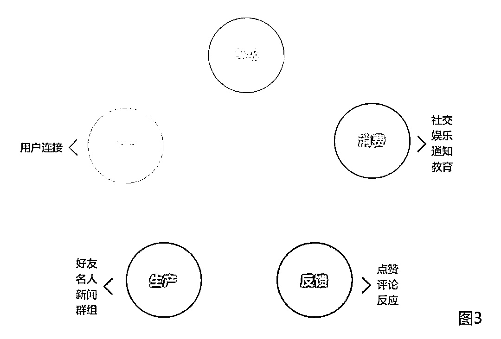

# 让人欲罢不能的产品：学会帮用户积累“美妙时刻” | 投资人说

> 原文：[`mp.weixin.qq.com/s?__biz=MzAwODE5NDg3NQ==&mid=2651226228&idx=1&sn=0dfa58e60ba6360c2367d121274e4d87&chksm=8080be20b7f73736952d30ff83936cd9d2bf96d81a4af17f1ffb5d4029c469fac7b441e0f855&scene=21#wechat_redirect`](http://mp.weixin.qq.com/s?__biz=MzAwODE5NDg3NQ==&mid=2651226228&idx=1&sn=0dfa58e60ba6360c2367d121274e4d87&chksm=8080be20b7f73736952d30ff83936cd9d2bf96d81a4af17f1ffb5d4029c469fac7b441e0f855&scene=21#wechat_redirect)

这是“让人欲罢不能的产品”系列的第三篇，围绕着参与度对打造成功产品的作用，在[《让人欲罢不能的产品：News Feeds 和 Content Production 的背后魔力 | 投资人说》](http://mp.weixin.qq.com/s?__biz=MzAwODE5NDg3NQ==&mid=2651225795&idx=1&sn=c3122f5ea139d3e435da3fb18caaacea&chksm=80804097b7f7c98133bf8edd39058a7e0a7dd8f2df2d8f33b1b52eaac3b54c518af28234eafc&scene=21#wechat_redirect)中我们介绍了新闻推送、内容生产，在[《让人欲罢不能的产品：数据探索与优化利用之间的权衡 | 投资人说》](http://mp.weixin.qq.com/s?__biz=MzAwODE5NDg3NQ==&mid=2651226169&idx=1&sn=9427ab83620b576244e2905e9288d68a&chksm=8080be6db7f7377ba03f0cfddc7509a68db81a22ab1a87e938da4c04da32121449a33ee4d993&scene=21#wechat_redirect)中我们介绍了连接和库存、即时动态排序。本文将着重介绍内容消费、反馈，并总结参与度对产品运营的重要启发。

本文研究成果来自红杉美国数据科学团队，Jamie Cuffe、Avanika Narayan、Chandra Narayanan、Hem Wadhar 和 Jenny Wang 对本文亦有贡献。以下是部分要点摘要：

▨ 随着产品的发展，优化产品以满足边缘用户的需求对于长期的成功至关重要。

▨ 保持跨平台使用体验的一致性，专注于打造梦幻般的消费体验。

▨ 反馈影响内容创作、内容排名和整体参与度。

▨ 了解反馈类型对创建一个高度吸引人的产品至关重要。

▨ 高参与度有助于增强用户粘性，提高用户留存率，并扩大用户群。

**内容消费**

在一个良好的即时动态环境中，用户生成内容，很快这些内容的潜在消费者就会与相关其他用户、页面和群体连接。适当的库存和排序算法能在适当的时间给适当的用户展示适当的内容。

但是，即使具备了以上所有这些要素，用户可能还是不会真正消费内容。如果这个产品没有针对他们所用的平台（如 iOS、安卓、电脑等）进行优化怎么办？如果他们没有 WiFi 呢？除非你能提供愉快的消费体验，否则大多数用户不会真正关注你的产品。

因此，在构建产品时，应该特别考虑以下影响内容消费的因素：

▨** 消费界面**

用户消费内容的空间（即消费界面）对于用户的参与度至关重要。设计优良的消费界面能让用户无缝切换各种功能，方便他们消费内容，或者识别内容划分的不同区域（例如，品牌推广的内容 vs 朋友在 Snapchat 上分享的内容）。

即时动态、故事、浏览、推荐和页面都是各种类型的消费界面。一般来说，团队应该了解每种类型及其最适合的界面。

值得注意的是，关于人生中的重大事件，比如婚礼，使用者可能想要一直置顶这件事。对于这类人生重大事件的内容，使用时间轴或活动简介比即时动态更合适，因为在即时动态中，即使是最重要的帖子最终也会消失。

▨ **低端设备和较差的网络连接**

随着新兴市场的持续增长，低端安卓手机和 2G 网络等相对较差的网络连接能力对产品团队构成了新的挑战。要设计一个能在这些区域无障碍工作的产品，就意味着要开发一个可以以较低速度加载和滚动的即时动态。解决这些挑战的方法包括突出显示更多文本和更少视频，以及在用户使用 WiFi 时提供低分辨率的图像并同时缓存视频，以便在稍后的时间播放，而不需考虑带宽。

如图 1 所示，年份和联网能力这两栏都会影响您的产品。例如，你可以为储存容量有限的旧款设备开发一个 “精简”版的产品，而为新款设备用户和无线网络用户提供显示高分辨率（包括全景）的视频和照片，以及向使用 2G 网络和旧款手机的用户提供以文本形式为主的访问服务。

**需要关注的关键消费指标：**

（注意：下面的指标有助于优化用户体验，但这并不是一个全面的列表，还有许多其他与基础设施、参与度相关的消费指标需要考虑。）

▨ **花费时间/每日活跃用户**

花在社交产品上的时间长短是社交产品是否吸引人的重要指标。用户花在产品上的时间越多，他们就越有可能获得良好的体验。但是，应该在产品的预期参与度与产品类型的不同情况下考虑这个指标。对于 Snapchat 这样的照片分享应用产品来说，花费时间/每日活跃用户是衡量用户参与度的很好标准。而对于 Yelp 这样的点评网站，会话次数则是更好的衡量指标。

▨ **市场占有率**

对于一个社交产品来说，应该从市场的角度来衡量其是否成功。即使用户为产品花费的绝对时间在增加，竞争对手夺得更多市场份额也会是一个问题。

▨ **会话次数**

会话次数相当于一个杠杆，能增加总花费时间，因此是衡量参与度的一个重要指标。会话次数增加是产品市场适销对路的最早指标，而会话次数的减少也可能是出现问题的早期预警信号。

▨ **浏览量**

了解用户观看相似内容片段的数量，以及了解用户是否“库存受限”（即他们没有足够的内容能观看）的情况也很有价值。

▨ **应用启动时间**

用户都希望应用程序能够快速响应，较长的启动时间可能会使他们放弃产品。必须关注冷启动（“从零开始”启动应用程序）和热启动（系统只是将应用程序从后台启动而不是重新启动）相比的时长。对于使用低端手机的用户来说，启动时间这个指标尤其重要。

▨ **划动刷新时间**

 “划动刷新”是指用户向下划动屏幕刷新内容的触摸屏手势。较长的刷新时间会对用户体验产生显著的负面影响，但请注意，这个问题可能由很多原因引起，需要仔细诊断。

▨ **缓冲时间**

我们都曾在流媒体视频中遇到过这样的烦恼：不断的暂停和播放，以及“加载”或“缓冲”消息。尽力缩短这段时间是提供良好用户体验的关键。

▨ **软件包大小**

特别是在新兴市场中，不稳定的 2G 和 3G 网络，或按字节付费计划更为常见，用户通常会避免下载相对较大的应用程序。

**▨ ****存储空间**

对于很多低端安卓机，手机的存储空间通常很有限。在这些情况下，如上所述提前缓存信息可能不会改善用户体验。

▨ **界面易于操作以及保持一致性**

许多用户会在多个设备上使用您的产品。给他们提供一致的使用体验有助于提高参与度。例如，如果不能在安卓系统和 iOS 系统上提供一致的使用体验，从一个平台迁移到另一个平台的人可能会觉得产品令人迷惑。

**反馈**

反馈是任何消息来源环境下的关键组成部分，影响着排名算法、促进用户的额外参与度（包括分享）以及花费的时间，由此提高整体消费（见图 2）。

反馈可以分成两种基本类型：显性型和隐性型。显性型，指用户通过喜欢、评论、回应、隐藏等活动直接分享他们的偏好和兴趣；而隐性型，比如用户花费的时间，一直停留在一个喜欢的活动或者一个页面导航内。在消息来源模式中，任何看到帖子的人都可以看到其显性反馈（而在故事模型中，评论和点赞只对作者可见）。

即使是两种类型中的一种，所有反馈也不尽相同。例如，评论通常比点赞更能促进用户参与。在某种程度上，这是由于点赞有来自社会压力的因素。因此，深入理解反馈类型和相关的用户行为有助于设计更好的产品。

用户将反馈视为他们帖子的一个验证。他们得到的积极反馈越多，就越有可能创作更多的内容。相反，相对较低的反馈可能会让他们感到沮丧，导致他们发帖的频率降低。因此，降低比较的压力，使产品能够让用户感受到分享的喜悦，这样才能够调动他们分享的积极性，促进用户参与度和长期的增长。

反馈还体现了用户的偏好和兴趣，对团队开发有效的排名系统价值很大。每个反馈“信号”都有助于提示分配给指定帖子的相关性，从而确定它出现的顺序，这个顺序促进用户花费更多的时间，最终促进增长。

**需要关注的关键指标：**

▨ **回应和评论的数量**

这些关键指标中，评论是真实参与度的一个更有力指标。正如上面所讨论的，许多很长的帖子用户实际上并没有阅读，因此也不会评论，但仍然会点赞。

▨ **评论的长度**

较长的评论往往比较短的评论更有吸引力。

▨** 花费的时间**

用户在一篇帖子上花的时间越多，他们就越有可能从中发现价值。

**参与度的总结及对产品运营的启发**

参与度有助于增强用户粘性，提高用户留存率，并扩大用户群。

好的产品通过提供优质的用户体验为用户带来价值。每一天，用户能够从与产品的交互中多次获得愉悦与满足，这些“美妙时刻”的不断积累让用户逐渐爱上你的产品，并增加使用产品的频率——他们每个星期使用产品的次数随之增加，最后成为了日活跃用户（DAU）。日活跃用户又慢慢变成周活跃用户甚至月活跃用户，从而提高了每个用户群组内用户的参与程度。由此可见，参与度有助于增强用户粘性，并提高用户留存率和扩大用户群。

在一个即时动态的环境里，要想提高用户的参与度，可以尝试让内容创造变得更加简单、向用户推送与他们密切相关的内容、以对的顺序向用户展示对的内容、确保用户无论使用什么设备或者什么网络都能轻松浏览各类内容、并且加强用户与你的产品之间的互动（即反馈）（见图 3）。

**对产品运营有哪些启示？**

▨ **社交压力**

随着关注人数的增加，你的用户会逐渐感受到压力，在发布和分享内容时会更加谨慎，唯恐呈现出低质量的内容。此时，你的产品团队必须得思考出一种战略来减轻这种压力，具体的做法可以是让用户在分享的时候，能够轻松地根据内容的类别选择分享的对象。此外，你也需要发散思维，通过各种方式让用户在分享时免于陷入竞争心理。

▨ **短暂性**

即时动态发布平台通常是分享近期相关动向的最佳选择。虽然用户可能希望某些内容，比如说重要人生事件的照片和其他记录能够永久置顶，并且与所有人分享。但对于一些“日常点滴”，他们也许并不想这种内容一直留在网上。因此，不妨考虑把“短暂性”这一特性融合到产品当中，推动用户发布这些“日常点滴”。“阅后即焚”的 Snapchat 显然是“短暂性”最为突出的一个典型例子，而 Facebook 和 Instagram 也同样推出了“Stories”新功能，来鼓励用户分享限时动态。

▨ **内容消费 vs 内容创造**

进入“消费模式”之后，用户会把时间都花在浏览视频、阅读文章等摄入内容的活动上，而投入到内容创造的时间便会自然而然减少。需要在内容消费和内容创造之间取得平衡，必须要分析创造和消费之间的负相关性，并且了解用户所消费内容的类别和数量。具体来说，你的产品团队需要通过收集和统计数据，计算出当用户进入深度消费模式后，用户创作量会降低至什么水平。

▨ **设想 vs 产品使用的实际情况**

人们使用产品的实际情况跟开发者对于产品的设想并不总是一致的，有些时候，两者甚至会背道而驰。举个例子，你的产品团队也许希望开发一个直播视频社交平台，供用户分享日常生活的点滴时刻，但在实际的使用过程中，某些用户可能会利用这个平台传播冒犯性或者不雅的内容。能否在你对产品的设想和用户实际的使用之间找到合适的平衡，将决定了你的产品能不能长盛不衰。

▨ **横向探索 vs 纵向开发**

无论是在内容数量较少还是内容丰富的情况下，要识别用户的偏好并进行个性化推荐都不是一件易事。内容数量较少的时候，收集不了足够的数据用作分析；而在内容丰富的时候，用户所消费的内容不过是内容总量的一小部分而已，难以判断他们是否会喜欢其他没有接触到的内容。此时此刻，你必须在两种做法中做决策：是根据已知的用户偏好数据纵向深挖价值，还是测试用户对其他尚未接触内容的反应作横向的探索。

▨ **模仿**vs**反馈**

模仿和反馈是推动内容创造的两个重要因素，因此在开发产品的时候，你就得考虑怎么处理这两者。虽然先谋求产品和市场的完美契合很重要，但要想产品迅速流行起来，就必须好好利用模仿和反馈的作用。** **

** 推荐阅读**

壹

[让人欲罢不能的产品：数据探索与优化利用之间的权衡 | 投资人说](http://mp.weixin.qq.com/s?__biz=MzAwODE5NDg3NQ==&mid=2651226169&idx=1&sn=9427ab83620b576244e2905e9288d68a&chksm=8080be6db7f7377ba03f0cfddc7509a68db81a22ab1a87e938da4c04da32121449a33ee4d993&scene=21#wechat_redirect)

贰

[让人欲罢不能的产品：News Feeds 和 Content Production 的背后魔力 | 投资人说](http://mp.weixin.qq.com/s?__biz=MzAwODE5NDg3NQ==&mid=2651225795&idx=1&sn=c3122f5ea139d3e435da3fb18caaacea&chksm=80804097b7f7c98133bf8edd39058a7e0a7dd8f2df2d8f33b1b52eaac3b54c518af28234eafc&scene=21#wechat_redirect)

叁

[爆款的诞生：如何利用框架打造让用户不能拒绝的产品 | 投资人说](http://mp.weixin.qq.com/s?__biz=MzAwODE5NDg3NQ==&mid=2651225387&idx=1&sn=9e67075d54a59b0e5fd2ce5328153e30&chksm=8080437fb7f7ca693112cef86137101def417a0b947ad09ab6f53fb937cc82257ebd923571a0&scene=21#wechat_redirect)

肆

[爆款的诞生：看重数据质量，看懂指标变化，产品成功的必备 DNA | 投资人说](http://mp.weixin.qq.com/s?__biz=MzAwODE5NDg3NQ==&mid=2651225474&idx=1&sn=1f7f9a6a8001136c617b25bd11e55ff5&chksm=808043d6b7f7cac0f4279bcee54de46cc67d188327016b3e352eaa38ebdd0bc4fb0bc0b21cce&scene=21#wechat_redirect)

伍

[爆款的诞生：打造成功产品的必备 DNA——指标变化分析 | 投资人说](http://mp.weixin.qq.com/s?__biz=MzAwODE5NDg3NQ==&mid=2651225412&idx=1&sn=194cb57cc1babad917b7cbd8dbed14b1&chksm=80804310b7f7ca068c3f2a958017855a98ab3c3964ea8455147596cd9790c0f320a102b0e3d0&scene=21#wechat_redirect)

