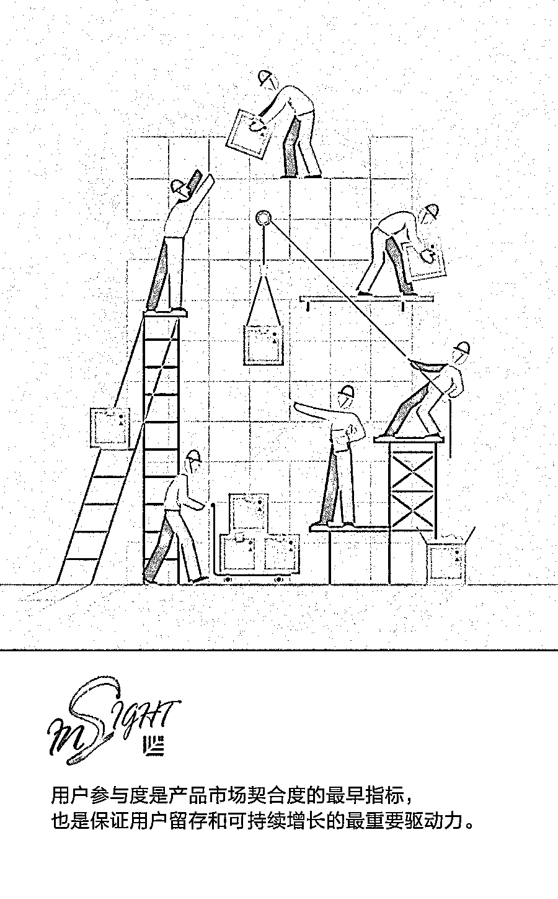
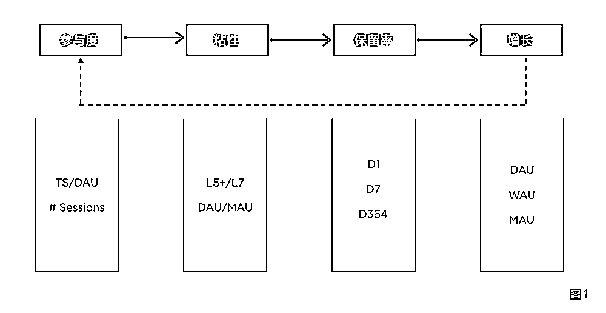
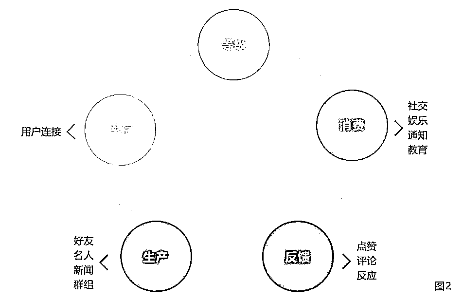
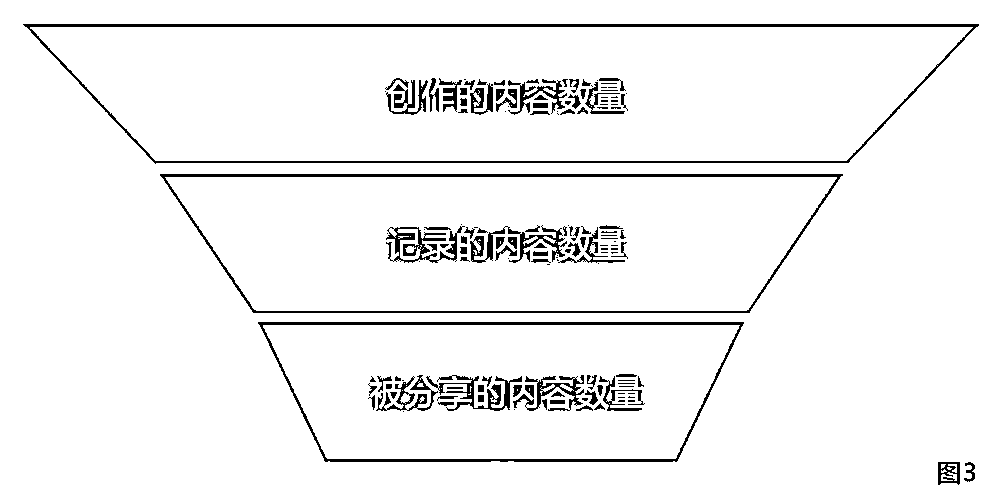
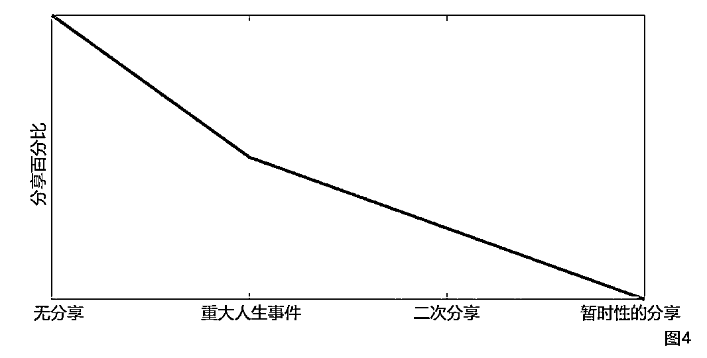

# 让人欲罢不能的产品：News Feeds 和 Content Production 的背后魔力 | 投资人说

> 原文：[`mp.weixin.qq.com/s?__biz=MzAwODE5NDg3NQ==&mid=2651225795&idx=1&sn=c3122f5ea139d3e435da3fb18caaacea&chksm=80804097b7f7c98133bf8edd39058a7e0a7dd8f2df2d8f33b1b52eaac3b54c518af28234eafc&scene=21#wechat_redirect`](http://mp.weixin.qq.com/s?__biz=MzAwODE5NDg3NQ==&mid=2651225795&idx=1&sn=c3122f5ea139d3e435da3fb18caaacea&chksm=80804097b7f7c98133bf8edd39058a7e0a7dd8f2df2d8f33b1b52eaac3b54c518af28234eafc&scene=21#wechat_redirect)

伟大的产品让人着迷，但如何判断一款产品是否真正触动了消费者的内心呢？参与度（engagement）这一特殊的衡量指标可以帮到你。"让人欲罢不能的产品"系列文章将围绕参与度对打造成功产品的作用展开，从新闻推送(News Feeds)、专业生产内容（Professionally Generated Content）、在线购物和通信类产品的维度进行探讨，提供有趣有料的视角和洞察。

本文研究成果来自红杉美国数据科学团队，Jamie Cuffe、Avanika Narayan、Chandra Narayanan、Hem Wadhar 和 Jenny Wang 对本文亦有贡献。以下是部分要点摘要：  

▨ 参与度会促进用户粘性，从而推动产品的用户留存，这又反过来推动了产品的发展。

▨ 深入理解用户参与的驱动因素对产品成功至关重要。

▨ 如果生产不出内容，就没有东西给用户消费，也无法从用户身上得到反馈。访问会从逐日逐月地减少，直到产品被淘汰。

▨ 和内容的生产和记录一样，内容分享也可以从多重维度来理解，包括受众、内容质量和类型、模仿、认知等维度。

**参与度和产品类型**

所有伟大的产品都有魔力，能带来真正的价值。这些产品的共性是能让人们为之着迷。

星期六早上，你独自一人，觉得无聊，琢磨自己待会儿想干什么。你在几个选项之间纠结，最终决定去看电影，因为这部电影里有你最喜欢的演员。这部电影很精彩，悬念一个接一个，你坐得笔直，全神贯注，仿佛也置身于其中，到了忘我的境界。这是一种能为我们的感官带来愉悦的特殊体验。

杰出的产品每天能为用户带来多次引人入胜的感觉，显示出其内在价值。如果用户真心喜爱你的产品，他们就会使用得更频繁，每周使用频率就会增加（图 1 中的 L5+/L7），在该产品上花更多时间（花费时间或 time spent/TS），最终成为每日活跃用户（DAU）。

这些用户也更容易留下来继续使用这一款产品，这就增加了产品从第一天到第 7 天的用户留存率。并且由于 DAU 也是每周活跃用户（WAU）和每月活跃用户（MAU），因此它们提高了每个组别（即 DAU/MAU 和 DAU/WAU）的参与度。换句话说，参与度会促进用户粘性，从而推动产品的用户留存，这又反过来推动了产品的发展。

因此，参与度能帮助实现产品与市场的匹配，进而实现可持续增长。产品团队应该把设计出真正受人们喜爱的产品作为目标。

参与度的细微差别取决于产品的类型。例如，Facebook、Instagram、Snapchat、YouTube 这样的用户生产内容模式（User Generated Content, UGC）不同于 Netflix、HBO 这样的专业生产内容模式（Professionally Generated Content, PGC)。同样，eBay、亚马逊和 Airbnb 等市场的参与度也不同于 iMessage、WhatsApp 和 Facebook Messenger 等消息产品的参与度。对参与度有重要影响的还有消费界面（如 Facebook 的动态消息）和设备（移动设备 vs 电视 vs 电脑）。

因此，为了指导企业家和产品经理设计出有吸引力和数据启示意义的产品，我们打算提供一些框架，帮助他们在不同的产品维度下理解参与度的重要性。本文作为参与度系列的第一篇，将先从动态消息（News Feed）和专业生产内容（PGC）开始探讨。

**动态推送**

每个主流社交应用，包括 Facebook、领英、Instagram、Reddit 和 Snapchat 等，都有动态推送、动态消息或其它类似的功能。用户订阅通常包括用户生成的内容，如照片、个人资料等，以及“专业”内容，如媒体机构的新闻报道和名人帖子。许多基于用户活动的社交应用产品也会对这些内容进行排名，每次用户打开这些应用，更新刷屏时，都会突出显示用户最常看的内容来源或类型的更新。

用于跟踪和改进产品使用的特定度量标准取决于用户。例如，动态推送环境下的用户参与就跟通过浏览版块或“故事”来消费内容的用户参与非常不一样。在这里，我们主要关注动态推送，它强调基于用户订阅的信息；在某些情况下，还强调基于人工智能的信息。

用户可通过多种形式参与动态推送。用户可简单滑动屏幕，浏览多个故事，或者他们可以通过点击链接，然后点赞或评论来互动，或者甚至可与其他用户进行对话。他们也可能会拍关于特定内容的照片，对其进行编辑或评论，然后分享给朋友。

为何用户参与度非常重要？因为用户参与度反映了用户是否真的喜欢某个产品、是否从中找到了价值，所以它是产品市场契合度的最早指标，也是保证用户留存和可持续增长的最重要驱动力。因此，深入理解用户参与的驱动因素对产品成功至关重要。

提高用户参与度的方式很多：为用户简化内容制作、让他们能浏览与自己最相关的内容、合理排序展示内容给用户、确保他们可在任何设备和网络状况下轻松查看内容，以及让他们能够与你的产品互动。

开始介绍之前，我们必须了解驱动社会产品参与度的“生产—消费系统”。在这些系统中，用户生成供其他人消费的内容(或库存），而来自这些消费者的反馈以点赞、评论、反应等形式激励用户生成更多内容(图 2)。

用户形成的内容是库存。一个用户的库存是如何随着他们的户连接数和应用系统中总内容的创建而伸缩的呢？如在 Twitter 和 Instagram 这样的开放式跟踪系统中，比起 Facebook 这样的互惠式跟踪系统，往往每个用户拥有的库存量更多。如在 Facebook 和 Reddit 等库存丰富的环境中，消息出现在用户动态推送中的顺序由排序算法决定。

用户参与度由生产-消费这个循环来促进，并且，在大多数应用程序产品中，这最终是通过“消费时间”指标来度量的，例如会话总数、浏览量和用户花费在产品上的总时间等。因此，增加一个或多个这样的指标通常会是用户参与度团队的最高目标。

**内容生产**

内容生产是影响参与度最重要的因素。如果生产不出内容，就没有东西给用户消费，也无法从用户身上得到反馈。访问会从逐日逐月地减少，直到产品被淘汰。

内容生产过程可以分解为三个阶段：创作、记录以及分享（图 3）。创作每时每刻都在发生——两个人之间的简单对话也是一种内容创作。当然，即便是今天，生产的多数内容也没有记录。但自从有了摄像手机，得到记录的内容数量，尤其是视觉内容大大增加。

许多社交产品，如 Instagram 和 Snapchat 这两款图片分享软件，进一步强化了视觉内容记录，从而弱化了文字记录。

即便内容得到记录，也不一定会被分享。目前，许多产品都通过“拍照优先”的策略鼓励用户分享内容。

▨ 内容创作和记录

内容创作和记录可以从多重维度来理解，包括创作者（如用户生产者、专业内容生产者）、种类（社交、娱乐、信息获取）、频率（每天或每周的次数）、媒介（VR、全景视频、文本）等维度。

▨ 内容创作者

以社交软件上的文章推送为例，创作者主要分为四类：熟人、网页、群组和新闻。熟人生产的内容往往比较私人化，但也可能包含链接和分享其他人生产的内容。网页生成的内容可能含有企业、名人信息甚至是宠物档案。群组往往反映了共同兴趣，如足球队成员或是职业机构成员组成的群组。新闻往往来自媒体机构，如《纽约时报》。不管是哪一类创作者，只要用户订阅了其内容，他们都可以出现在用户的新闻推送界面上。

UGC 愈发成为社交网络平台的主要特点，且由于速度更快、价格更低的智能手机和新型社交软件的出现，以及虚拟现实（VR）和增强现实（AR）技术的发展等技术进步，UGC 正日新月异地发展着。尤其是视频和照片画质的改善，让人人都有机会创作，使得 UGC 出现爆炸式增长，由于视觉内容的制作变得更加容易和更有乐趣，人们的分享习惯逐渐由文字转变为图片和视频（如全景视频）。

因为 UGC 往往是原创和个性化的内容，往往也可以提高参与度。因为人类天生就是社交动物，喜欢了解朋友和家人在做什么。

▨ 内容分享

为了增加产品的用户参与度，除了需要内容创作和记录，也需要内容分享。鼓励用户分享并非易事，尤其当你还要和市场上许多同类产品竞争市场份额。社交产品的成功最终取决于用户分享内容的数量，许多产品之所以失败了，都是因为产品上的内容生产活动随着时间逐渐停止。

和内容的生产和记录一样，内容分享也可以从多重维度来理解，包括受众、内容的社会接受度、反馈、认知、内容类型、产品简洁性和内容的持久性。下面，我们将具体阐述一些维度。

**影响内容分享的几个方面**

▨ 受众

我们天生就是缺乏安全感的社会人。而且，我们注意保护自己的隐私，生活中发生的大小事情，我们都不愿意四处散播，为众人所知。因此，有权利看到我们分享的照片的人数，决定我们分享的内容。当然，可以查看我们发布的内容的人跟我们关系的亲疏，也会影响我们选择要分享什么内容。

因此，从产品的角度，用户的受众数量对内容分享存在重要影响。当产品获得增长，每个用户的朋友数量和订阅人数一般也会增长。因此，一些用户在产品早期阶段会更愿意分享内容给更多的关注者。而随着关注人数增加，他们可能会完全终止分享，改用如一对一形式或群聊形式的其它替代产品。但是，受众的增加也有可能鼓励一些用户（如名人）增加分享。

▨ 内容类型和质量

用户愿意分享的内容类型也同样和受众规模有关。如果受众增加，用户通常仍会继续分享新闻文章或趣味视频等内容，但可能不再分享个人相关的内容，如家庭照片（图 4）。他们仍会公布诸如婚礼、新生儿出生等重大生活事件方面的情况，但分享“日常生活”的意愿则大大降低。

用户通常也不太愿意和更广泛的受众群体分享低质量内容。

▨ 模仿

人类常常有意或无意地模仿他人。模仿具有社会效益，有助于人和人、群体与群体之间纽带的建立。模仿可以是无意识的过程，在此过程中我们的认知（看到他人采取某一行为）和我们的行为直接相关；也可以是有意识的策略，当我们不确定哪种是最有利的行为方式或者想要融入某个群体，我们会选择有意识地模仿他人。

如在餐厅，我们可能会点其他人正在享用的一道菜，同时没有意识到这是一种模仿。或者我们可能会询问服务员哪道是菜单上最受欢迎的菜，从而进行有意识的模仿。对于社交媒体，人的模仿倾向是一个重要的现象，表现为使用流行的话题标签、在网红场所发布照片、给当红艺人的动态点赞、分享热点新闻等。模仿还会影响人们记录和分享的内容类型；如果他们在新闻推送中看到的更多是视频，他们会觉得分享视频的行为是社会所接受的，从而更可能分享视频。因此，从产品角度来看，加强用户之间的相互模仿或许能促进内容生产。

▨ 认知

在 Facebook 等推送过剩且用户只能吸收其中一小部分内容的环境下，出现在推送页面最上方的动态，往往是平台算法置顶的内容。也就是说，这类动态往往有较高的点赞数和评论数，因此也更有可能是高质量内容。这往往导致用户错误地以为大多数发布内容都比自己创建的内容更吸引人、质量更高，这可能会导致各种用户行为变化。用户可能提高其发布内容的质量，但也可能减少分享的频率，甚至可能完全停止分享行为，因为他们误认为自己发布的内容用户参与度比其他人低。

▨ 暂时性

公开后数秒内自行消失的内容，对青年群体具有强烈的吸引力。我们身处的世界中，人们记录下几乎每一个感受、每件值得庆祝之事和每个人生瞬间，拿去上传和分享，从而获得点赞、评论、搜索、买卖，而暂时性内容格式（受 Snapchat 推广而开始流行）的出现把我们从这样的世界中解救出来。对于那些不希望受到自己以前的“黑照”或者“黑历史”困扰的人，这种格式无疑具有很大的吸引力。于是那些自然发生的糗事更可能被用户分享，因为他们知道这些时刻只是暂时的。

而且，年轻用户敏锐地意识到通过网络分享的内容能持久存在，且会持续影响其未来生活。因此，例如 Snapchat（故事也是一种内容格式）等社交媒体上的内容的暂时性，也会强烈影响分享的内容类型和质量。

**需要关注的关键指标**

▨ **平均每位用户更新动态的频率**

频率越高，库存越高，相关的可能性也越高。

▨ **发布动态的特殊用户数量**

这类用户中发表动态的用户比例越高，人们访问此平台的可能性越高。

▨ **分享的内容类型**

独特和原创内容的种类越多，相关的可能性越高，人们会更经常回到平台上消费内容。

▨ **分享内容的质量**

用户角度理解质量及其如何随时间而改变，有助于打造正确的产品类型。

▨ **内容生产瀑布图分析**

例如，创作但未被分享的内容。人们可能创作内容但拒绝分享该内容，可能由内容质量、用户认知和受众等多方面原因导致。** **

** 推荐阅读**

壹

[红杉中国周逵：什么才是企业穿越周期的生存之道？ | 投资人说](http://mp.weixin.qq.com/s?__biz=MzAwODE5NDg3NQ==&mid=2651225572&idx=1&sn=155f2aa228a813456d46ad1e386ad881&chksm=808043b0b7f7caa6ba872b302817c359880b048ef9293f230e22f6d3ef95aebc7bf8e6c01023&scene=21#wechat_redirect)

贰

[爆款的诞生：看重数据质量，看懂指标变化，产品成功的必备 DNA | 投资人说](http://mp.weixin.qq.com/s?__biz=MzAwODE5NDg3NQ==&mid=2651225474&idx=1&sn=1f7f9a6a8001136c617b25bd11e55ff5&chksm=808043d6b7f7cac0f4279bcee54de46cc67d188327016b3e352eaa38ebdd0bc4fb0bc0b21cce&scene=21#wechat_redirect)

叁

[爆款的诞生：打造成功产品的必备 DNA——指标变化分析 | 投资人说](http://mp.weixin.qq.com/s?__biz=MzAwODE5NDg3NQ==&mid=2651225412&idx=1&sn=194cb57cc1babad917b7cbd8dbed14b1&chksm=80804310b7f7ca068c3f2a958017855a98ab3c3964ea8455147596cd9790c0f320a102b0e3d0&scene=21#wechat_redirect)

肆

[爆款的诞生：如何利用框架打造让用户不能拒绝的产品 | 投资人说](http://mp.weixin.qq.com/s?__biz=MzAwODE5NDg3NQ==&mid=2651225387&idx=1&sn=9e67075d54a59b0e5fd2ce5328153e30&chksm=8080437fb7f7ca693112cef86137101def417a0b947ad09ab6f53fb937cc82257ebd923571a0&scene=21#wechat_redirect)

伍

[爆款的诞生：健康的产品要满足哪些指标?｜投资人说](http://mp.weixin.qq.com/s?__biz=MzAwODE5NDg3NQ==&mid=2651225205&idx=1&sn=f1f4b328f5ff80db9953bbb86ab06837&chksm=80804221b7f7cb37a32599eae59767be28b65e6262e3b7fd6d6ec6b13d029eb075b2fbc4ddd0&scene=21#wechat_redirect)

