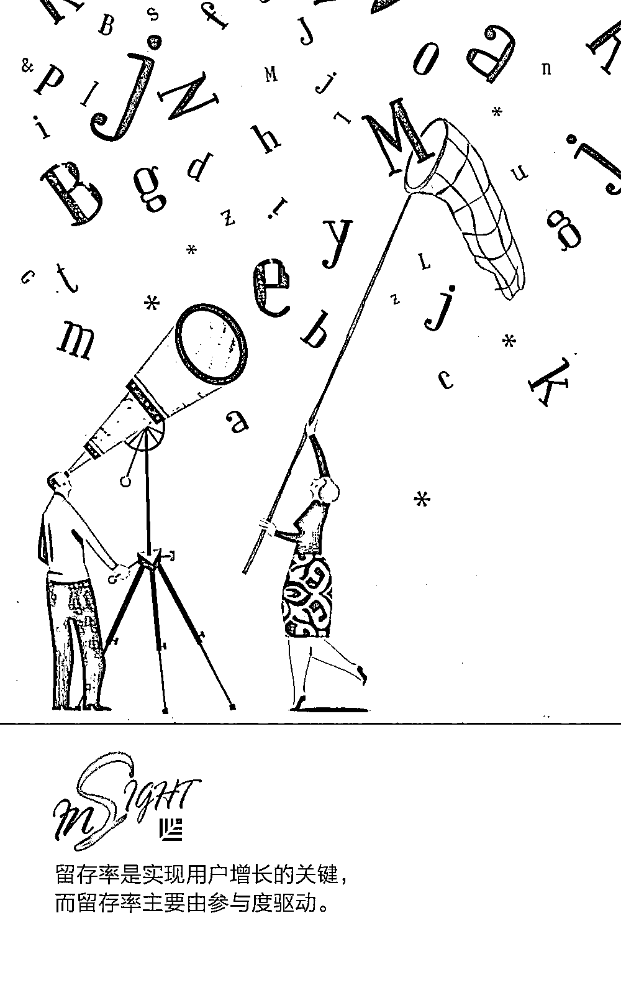
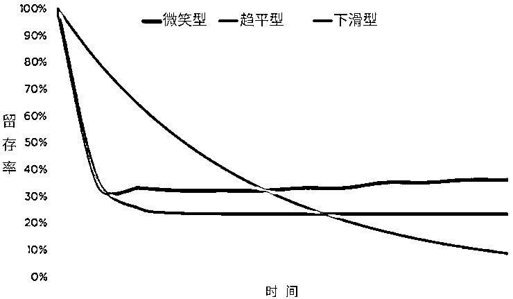
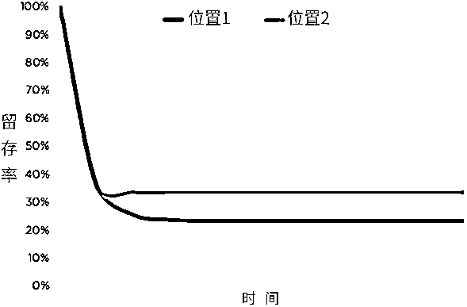
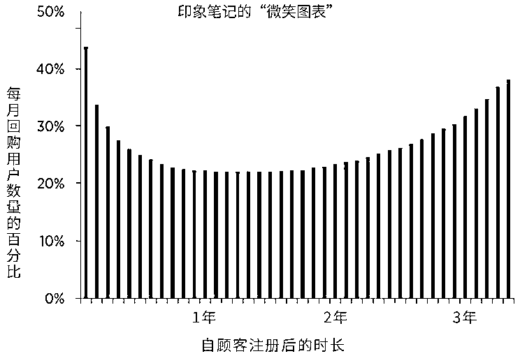
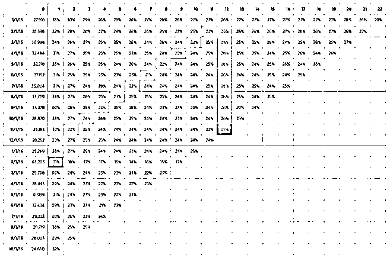
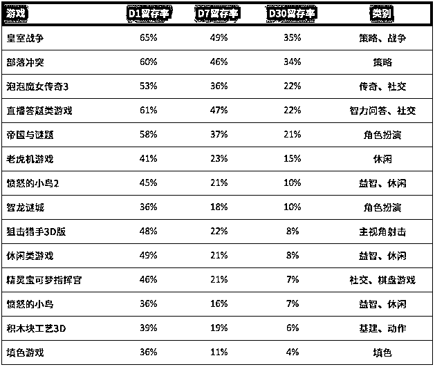

# 爆款的诞生：手把手教你提升用户留存率 ▎投资人说

> 原文：[`mp.weixin.qq.com/s?__biz=MzAwODE5NDg3NQ==&mid=2651225172&idx=1&sn=93955ba9920e04236aa0be0a6b6f8f68&chksm=80804200b7f7cb1627eb9901861e319ded707d760afcde8032ef01fa0a5fb4fb43c284df895e&scene=21#wechat_redirect`](http://mp.weixin.qq.com/s?__biz=MzAwODE5NDg3NQ==&mid=2651225172&idx=1&sn=93955ba9920e04236aa0be0a6b6f8f68&chksm=80804200b7f7cb1627eb9901861e319ded707d760afcde8032ef01fa0a5fb4fb43c284df895e&scene=21#wechat_redirect)

如果能够留住所有新用户，让其继续并永久使用你的产品，是不是很赞呢？想要达到这种效果，就要关注留存率，它是针对那些试用过你的产品并会复购的人群的一种衡量标准。

留存率是衡量产品和市场匹配度的好方法，也是目前为止产品增长率的最佳杠杆。深入了解留存率，将有助于我们对用户有更清晰的认识，还可以指导产品的发展方向。如果留存率很差，即使是处于增长期的产品最终也会失去用户的欢心。

如何才能提升用户留存率？阅读**红杉美国**近日在 Medium 上发布的这篇文章，你或能找到最佳方法。研究成果来自**红杉美国数据科学团队**，Jamie Cuffe, Avanika Narayan, Chandra Narayanan，Hem Wadhar 和 Jenny Wang 对本文亦有贡献。

如果你想进一步了解如何测量产品是否健康，了解自己产品优劣何在、增长态势是否良好、是否拥有核心用户群……敬请关注下期推送的“爆款的诞生”系列文章，我们将全方位解读各类指标，让你能够迅速为自己的产品诊断、治疗，成为专业的产品医生。

**理解留存率**

一般来说，通过绘制在一段时间后复购产品或拥有某种核心特征的用户的百分率，来反映留存率。典型留存率曲线有 3 种（参见图 1）：

▲ 图 1

▨ **趋平型曲线**

这种原型表明尝试过该产品的用户中，有一定比例人群发现了其中的价值且在一段时间后继续复购它。然而，不是所有的趋平型曲线都是相等的。曲线变平的位置越高，产品的长期留存率就越高，产品也就越可观。在图 2 中，曲线 2 在一个较高的位置变平，表明这是个较可观的产品。

▲ 图 2

▨ **下滑型曲线**

当某种产品未达成和市场的匹配时，留存率曲线将持续下滑，最终达到很少或零用户。在这种情况下，要专注于改变产品以找到某种针对核心用户群的价值定位，然后在此用户群基础上拓展，这一点很重要。从 BranchOut 的案例中可见，在不修复潜在薄弱保留率的情况下，在漏斗顶部运用增长黑客技术，即一种结合创新、分析能力、社会化指标的一种市场营销技术，将导致“漏桶”结果——用户对你的产品仅仅是一用而过。

▨ **微笑型曲线**

当某种产品真的很独特时，它的留存率曲线会呈上升趋势，因为产品开发和网络影响力在超高速增长期间驱使着流失的用户回归。在这些情况下（参见图 3），用户在最初用过该产品之后最终又复购。

▲ 图 3，来源：TechCrunch

对于大多数产品来说（包括具有微笑型曲线的产品），随着产品因竞争、用户行为转变和其它因素受到干扰，留存率最终会趋于 0。尤其是游戏类产品，随着用户往前走，这些转变的时间框架通常都相对较短。例如，《愤怒的小鸟》在近 10 年的早期极度火爆，积累了数百万的月用户数，但是目前只有区区 10 万左右。

**留存率衡量标准**

**衡量留存率涉及两个因素：时间框架和事件**。

根据产品的垂直结构，日、周或月时间框架可能是最有意义的。电商或旅游产品可能期待用户每个季度回归一次，但是社交应用或游戏则是期望用户每天使用。根据这些期望的时间框架衡量留存率十分关键；以自然周频率来看待产品的月保留率，将导致失去衡量的准确性。

考虑到与留存率有关的事件，**定义有意义活动的组成部分也很重要**。月活跃用户就是简单地每月至少登录一次的用户吗？就是一个月内有一次 5 分钟会话的用户吗？还是购物？发送消息？

诸如 Uber 或 Lyft 之类的共享出行应用会将事件定义为一次完整的搭乘，而不是打开应用。诸如 Spotify 和 Netflix 之类的内容流媒体服务可能将事件定义为开始收听或观看某个内容。对于通讯应用来说，可能是用户编辑或阅读消息的时候。

除了产品层面的留存率之外，你还可能想要定义特征层面的留存率，其中事件被定义为使用产品的某个特征。例如，亚马逊可以衡量其心愿清单特征的使用情况来帮助提高特征开发和产品路线图规划的优先级。

▨ **三角留存率图表**

来自暂时群组的留存率，是有待频繁监测的有用可视化显示。可视化显示短暂群组保留率的最普遍方式，就是利用三角留存率图表（图 4）。图表的每一列对应着一个暂时的群组，在第一列（0）列有用户或美元形式的群组规模。后续列（1-22）显示那个群组在一段时间后剩余数量的百分比。 

▲ 图 4

通过给某些百分比值配色，你可以快速地辨认出留存率的变化，通常这些变化将以水平、对角或垂直特征显示。

水平特征用来确定群组特异性。例如，如果你要在既定的一个月内运作一场营销活动或进行新市场扩张，你可能会看到水平特征的浮现，这表明那个特定群组的留存率提高或降低。在图 4 中，2016 年 2 月的群组明显多于之前或后续群组（可能是因为实验性收购活动或推荐人特征），且那个群组的留存率相对较低。

对角特征通常源自于影响整体使用的产品特征发布、新闻或其它活动。例如，#DeleteUber（译名：删除优步）活动影响到了所有 Uber 用户群组，不只是在 2017 年 1 月份（活动开始起势的时候）开始使用该服务的人们。对角特征可能还表明产品中断供应或破损：当 AWS 在 2017 年初出现服务中断时，许多公司的留存率图表展现出那天的对角特征，因为用户无法获取到它们的产品。

垂直特征普遍出现在具备年计划的订阅业务以及提供试验的业务中。例如，亚马逊金牌服务的美元或交易留存率图表可能每 12 个月会出现一次明显的垂直特征，这时部分群组发生的事情是，年付费会员更新了。

除了帮助留存率的可视化显示，三角保留率图表的第一列可以给你一种新用户增长的感觉：在增长吗？你看到更多的用户在周末注册了吗？你可能还会把外源性事件的影响看作第一列新用户注册的抑制或增长。

既然总留存率是你的群组保留率的加权平均值，追踪任何显著多于其它群组的群组是尤其重要的。例如，如果 1 月份产品获得的总用户数是 12 月份的 10 倍，那么你的整体保留率多少是由 1 月份的群组决定的。

如上所讨论，衡量留存率时选择合适的时间框架很重要。但是对于月、季或年产品来说，实施产品改变或更新收购策略到理解保留率受到的影响之间可能有很长的时延。

在这些例子中，我们可以将一个群组的长期留存率（下面方程中的 364 天）分解成多个比率。该方程可以从左到右理解为一个用户漏斗，其中 D1/D0 或“D1 保留率”是维持一天的你的群组的分数，等等。（D0 是群组中安装者的数量，D1 是一天后仍然使用该产品的群组数量。）

如果 D7/D1 对于所有群组来说保持相对稳定，但是 D1 留存率出现下滑，将注意力集中在提升 D1 保留率上，因为这将可能是长期保留率的最大杠杆。类似的，如果 D1 保留率是平坦的，但是 D7/D1 在下滑，专注于找到让第一周用户而非第一天用户参与的新方式。最终，你的目标是提升长期保留率，但是监测这些分数也很重要，因为他们是未来保留率趋势的早期迹象。

**如何提升留存率**

基于产品、技术和用户基础的情况，提升留存率的策略千差万别。如图 1 所明确的是，一旦你决定了正确的留存率度量标准，你的目标将取决于你的留存率曲线类型：

**下滑型曲线**：是每个群组的留存率曲线变平。

**趋平型曲线**：抬高平坦曲线的长期留存率。

**微笑型曲线**：庆祝吧！

以下技巧将有助于你提高你各个部分受众的留存率。记住：**所有的行动目的在于提高参与度，因为参与度驱动留存率**。

▨ **让保留下来的用户参与进来**

增长的关键在于保留现有用户，而保留现有用户主要通过提升参与度实现。你最重要的用户是“超级用户”，他们参与度最高，因此保留效果最佳。了解这个团体如何与产品互动是提升整体留存率的最佳方式。

为了辨别出超级用户，首先假设哪些特征是产品价值定位的核心所在，哪个经常被当做产品的“迷人瞬间”。Paypal 的迷人瞬间是成功的交易；而亚马逊则是完美的配送体验。一旦你发现了自己的“迷人瞬间”，基于用户的参与方式及参与频率来细分他们。使用任何有价值特征最频繁的用户，就是你的超级用户：他们观看的视频最多、分享的内容最多、发送的消息最多……

当你发现了这些用户，就可以研究他们的优先行为。他们在早期使用时有哪些特征？他们在达到“临界点”并且真正迷上产品之前遇到过的“迷人瞬间”有一定次数吗？例如，**Facebook 有一个著名的发现，即在 10 天内连接到 7 个好友，能大大提升留存率，这带来了一种鼓励用户到达这个里程碑的产品策略。**

产品早期应专注于取悦超级用户。确定了用户的关键行为和参与度临界点后，就可以利用这些见解做接下来的事情：激励参与度较低的用户做出相似行为，最终将驱动留存率的提升。

▨ **为新用户去除摩擦**

提升留存率的最有效方式就是尽可能早地去弯曲留存率曲线的形状。对于大多数产品来说——尤其是新产品，曲线在开始的数天、数周和一个月内都是相当陡的。在这个期间流失的用户是整体流失用户中的绝大多数，因此，在早期驱动新用户的参与（及由此提高留存率）非常有价值。

为了提升新用户的留存率，了解注册（或购买）漏斗是很重要的。例如，有多少人观看过这个产品的广告，是通过哪些渠道？有多少人点击过那个广告？有多少人然后创建了账户，以及 7 天后有多少保留下来？24 天后呢？84 天后呢？

研究每个阶段用户数量的骤降，有助于你理解渠道（付费和免费）的有效性以及发现注册和服务流程中的任何问题。例如，在注册和账户确认之间的明显骤降，表明确认邮件的递送有问题。又比如，当天气聊天机器人 Poncho 团队研究和修正注册流程中的问题数量时，他们的 7 天留存率从 60%增加到 80%。为了进一步隔离明显骤降点，要通过渠道、设备等过滤数据。去除这些摩擦源，有助于新用户尽可能快地到达“迷人瞬间”，这将极大地提升该团体的留存率。

设计完备的适应过程指引，清晰地传达产品的价值定位，指导新用户达到参与度的临界点，这也将大大影响留存率。

这不止针对新用户，而是所有用户。

**指导原则**

▨ **为产品设立基准**

为了建立产品的长期留存率的“正确”标准，要基于类别中的相似产品设立基准。例如，游戏开发者可以将他们的产品和其它同类型的游戏相比较。

表 1 展示了几款成功的休闲益智类游戏（7-10%）和著名策略类游戏（大于 30%）之间 30 天留存率的差异。拥有 20%+D30 保留率和 35%D30/D1 保留率的休闲益智类游戏将位列休闲益智类游戏榜首，比如《愤怒的小鸟》。但是拥有相同度量标准的社交或策略类游戏将明显落后于其类别中的领先者。

▲ 表 1

▨ **参与度驱动留存率**

因为参与用户流失的可能性较小，诸如日活跃用户比例（DAU）到月活跃用户比例（MAU）的参与度度量标准，将影响并驱动着留存率。如果参与度下降，在留存率受到影响之前要快速地挽回局势。

▨ **尽早减少流失**

监测和实施早期留存率（D1/D7/D28 等）的改变对于取得强大的长期留存率来说十分关键。对于大多数产品来说，用户在早期流失；止住这场外流的做法，将在更长的时间框架下带来更好的留存率。

▨ **新群组应该更好的保留**

产品开发、特征应用和网络影响应该在后期群组中驱动更好的留存率，三角留存率图表上的任何垂直线条，要保持上升趋势。对于拥有重要网络或社交成分的产品来说，增加的群组留存率可能还会显现为旧群组恢复的增加，因为用户跟随他们的网络重新回来使用产品。

▨ **留存率可以在特征层面应用**

产品的留存率特征不一定和个体特征相似。例如，产品可能整体上拥有优异的留存率，但是其通讯和图片上传的特征却不高。广泛的差异性在个体特征间是很常见的。为了保证你的产品充分发挥其潜力，你应该认清现实，分析个体特征和产品本身的留存率。

**走可持续增长道路**

留存率可以用作了解你的产品整体上的状况，从而评估它在用户子集中的使用情况以及确定具体特征的表现情况。最终，**减少新用户摩擦、提升参与度将有效驱动留存率的提升**。尽可能早、并且让用户频繁地看到产品迷人的地方，能够明确产品的价值定位，同时驱动用户复购，让用户更深入、频繁地参与进来。这将首先提升短期留存率，然后显现出更佳的长期留存率，将你的产品引上可持续增长的道路。

留存率是对尝试过你的产品并喜欢到足以复购的群组的衡量；同样，它支撑着所有重要的度量标准。

将留存率设想为一个漏斗。将某个群组的长期留存率分解成多个比率可以帮助你确定长期留存率的早期迹象，以及长期留存率的最大杠杆。

提高留存率的技巧也因用户群体的变化而各有不同；提升用户参与度，将新用户的磨合成本最小化；进行有效的数据分析将有助于发现每个群体的精确杠杆。

** 推荐阅读**

壹

[超过 2000 亿规模的红杉重仓天使投资，它想要找到什么样的创始人？](http://mp.weixin.qq.com/s?__biz=MzAwODE5NDg3NQ==&mid=2651225142&idx=1&sn=83cceab8d14910beeb4a5a64f84ee1f0&chksm=80804262b7f7cb744e1161fd0cee210240f9844e5e618d07b6c999db30357dc9b5cffb839151&scene=21#wechat_redirect)

贰

[求助：领导非要在工作时间让我看世界杯怎么办？](http://mp.weixin.qq.com/s?__biz=MzAwODE5NDg3NQ==&mid=2651225143&idx=1&sn=e24399065f6a487fae7b8f821f0fe552&chksm=80804263b7f7cb7584b1cd664f72551400a1612025e58c080b6305d0400b8f8269365b9b7827&scene=21#wechat_redirect)

叁

[真正优秀的产品经理不会告诉你的 5 个秘密](http://mp.weixin.qq.com/s?__biz=MzAwODE5NDg3NQ==&mid=2651225152&idx=1&sn=47bd4cb3ff2b88613d384ad69cf06d19&chksm=80804214b7f7cb02f2f4559c713ab954af7c6171d0320ff83dce1fbb138072527778ede1d3ba&scene=21#wechat_redirect)

肆

[神策数据桑文锋：如何在脆弱的起步阶段坚守并传递信仰、稳定军心？](http://mp.weixin.qq.com/s?__biz=MzAwODE5NDg3NQ==&mid=2651225155&idx=1&sn=f3cd019d9969260a3b39186c2abc7cf7&chksm=80804217b7f7cb0181f422528a80c7c69488db51fd42f2f54c7ba3227c5cfe1505d32ec3e701&scene=21#wechat_redirect)

伍

[1 分 18 秒抖音 style，见证 C 位基金的诞生｜红杉种子基金](http://mp.weixin.qq.com/s?__biz=MzAwODE5NDg3NQ==&mid=2651225160&idx=1&sn=a881d56d07ac454bc486cfb4973f695a&chksm=8080421cb7f7cb0a36bae73052f473d109dda22bbc40eb615899c0c2bad63efe0d9926a60392&scene=21#wechat_redirect)

