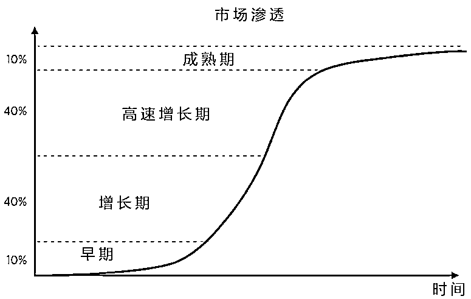
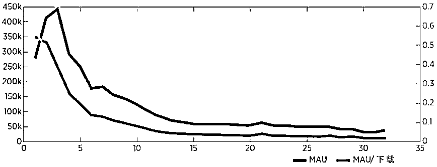
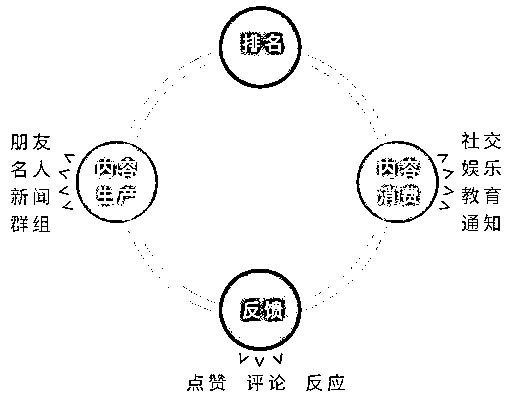

# 爆款的诞生：健康的产品要满足哪些指标?｜投资人说

> 原文：[`mp.weixin.qq.com/s?__biz=MzAwODE5NDg3NQ==&mid=2651225205&idx=1&sn=f1f4b328f5ff80db9953bbb86ab06837&chksm=80804221b7f7cb37a32599eae59767be28b65e6262e3b7fd6d6ec6b13d029eb075b2fbc4ddd0&scene=21#wechat_redirect`](http://mp.weixin.qq.com/s?__biz=MzAwODE5NDg3NQ==&mid=2651225205&idx=1&sn=f1f4b328f5ff80db9953bbb86ab06837&chksm=80804221b7f7cb37a32599eae59767be28b65e6262e3b7fd6d6ec6b13d029eb075b2fbc4ddd0&scene=21#wechat_redirect)

你的产品优劣势何在？增长态势是否良好？用户留存率高吗？用户黏度高吗？新老用户的表现一样好吗？有无互动？有无核心用户群？上述这些问题能够检测产品发展是否向好，当产品发展得好时，它就能深入市场，留住用户并产生互动，通过健康的内容循环让用户定期回流。

上周我们发布了首篇《爆款的诞生》系列文章，此篇为续篇，同样来自红杉美国，本文系统讲述了如何衡量产品健康度。关于增长、用户黏度、留存率、参与度，手把手教你打造一个真正能够满足人们深层需求的好产品。文中还指出了当前人们在产品打造上的 5 大误区，或能为你拨开眼前的云雾。本文研究成果来自红杉美国数据科学团队，Jamie Cuffe、Avanika Narayan、Chandra Narayanan、Hem Wadhar 和 Jenny Wang 对本文亦有贡献。

一个好产品能真正满足人们的深层需求，它能给人带来愉悦感，赢得用户的信任与青睐，成为强大的品牌大使。健康的产品覆盖范围广泛：它们可以是 To B 或 To C 的产品，专注于为特定垂直领域提供实用价值或提高效率。本文将从多角度探索健康的产品，重点关注 To C 企业如何衡量增长率、留存率、用户黏度和参与度等。

**用户采纳与增长**

活跃用户总数是检测产品影响力的最有效工具。提高用户采纳与增长对全面挖掘产品潜力、最大限度为大多数用户创造价值具有重要意义。

在整个市场的大背景下了解产品和用户增长十分重要。多少人使用了你的产品？产品的潜在市场规模（TAM）有多大？与潜在市场规模相比，你的产品用户数如何？竞争者占据多大的市场份额？随着时间的推移，竞争者的市场份额有什么变化？潜在市场规模未来走势如何？你的产品未来将占据多大市场份额？（见图 1）

▲ 图 1

另外，了解产品的具体增长指标也同样重要。产品增长率怎样？是有机增长吗？增长主要靠拉新推动吗？随着市场渗透率的提高，增长如何变化？如何平衡产品的流失以及让用户回流？

一个健康的产品会经历多个发展阶段，发展路径类似 S 型曲线（见图 2）。许多产品在早期增长较慢；随后进入增长期，曲线向上倾斜加速增长；接下来进入高速增长期，呈指数增长；在达到最大值后进入成熟期，增长趋于稳定，直至几乎不再增长。

▲ 图 2

如果产品的市场需求不够大，就很难取得成功。另外，健康的产品需要一个不断扩大的市场，否则，失败在所难免。在目标市场的发展过程中，安排好产品的发展时间，确保产品与需求同步增长，是取胜的关键。这一点通常很难实现，很多产品就是因为没掌控好时间导致失败。

如何检测自己的增长速率是否健康？可以与同阶段的其他产品进行比较。了解处于同一市场渗透水平的相似产品的发展速度，有助于你感知自身产品增长的异常状况。

随着产品进入增长期，用户安装/下载数会逐渐占据更大的潜在市场份额。因此，了解产品的用户安装/下载数非常有用。

在产品早期，用户下载数通常非常小，所有净增长都靠新用户拉动，没有流失和回流用户。但是，当一个健康的产品达到稳定期，在潜在市场规模中具有高渗透率时，流失用户抵消了回流用户，活跃用户数渐渐保持稳定。这种稳定意味着老用户群体基本保持稳定。

在这两个极端的中间，增长依赖于新用户、回流用户和流失用户三者之间的平衡。产品趋于稳定时，要做出重大改变为时已晚，所以你要确保增长期的稳定增长。

**市场指标**

**月活跃用户数/安装用户数**  通过追踪月活跃用户数（MAU）占总安装用户数的比例以及总安装用户数占产品市场的比例，便可监测用户增长情况。

如果产品总下载数开始达到潜在市场规模的高渗透率，那月活跃用户数/安装用户数之比应较高。随着安装用户数趋近潜在市场规模的最大渗透率，获取新用户不再是净增量增长的策略，因为较少有客户会再试用该产品。因此，净增长必须依靠流失用户的回流。换言之，需要不断留住老用户来实现净增长。这通常很难实现。如果活跃用户数与安装用户数之比逐渐变小，产品会慢慢失去上升动力。对于非常强势的产品，随着老用户开始回流，月活跃用户数/安装用户数之比逐渐缓慢增长。

务必记住，应用程序类型不同，情况也截然不同。比如，无论一款游戏在巅峰时期多么受欢迎，它都有保鲜期。以游戏“帝国与联盟”为例，大量用户安装了该游戏（见图 3），其中许多成为了活跃用户。但是，该游戏也流失了大量用户。即便有更多的新用户加入，流失的用户同样很多，月活跃用户数急剧下降。在稳定状态下，只有 2%的下载用户仍然保持活跃，而逐渐增加的新用户非常少。因此，除了死忠粉，现在基本没人玩这款游戏。

▲ 图 3，来源：App Annie

**增长指标** 

**月/周/日活跃用户数  **首要追踪的增长指标是活跃用户数。主要有三大相互关联的指标：日活跃用户数（DAU）指的是某一天使用该产品的活跃用户总数，周活跃用户数（WAU）指的是某一周特有的活跃用户数，月活跃用户数（MAU）指的是某一个月特有的活跃用户数。根据产品的预期使用频率，选择一种作为你的首要指标。

**日/周/月/年变化 ** 了解活跃用户数的日变化（D/D）、周变化（W/W）、月变化（M/M）和年变化（Y/Y）也十分重要。若产品的日活跃用户数不稳定，那么追踪周活跃用户数可能更有意义。总之，最好采用滚动指标而不是基于日历的指标。比如，对比二月和一月的月活跃用户数容易引起误解，因为这两个月的天数不一样；28 天的滚动月活跃用户数可能更可取。另外，对比 28 天的滚动需求还可避免周内效应影响结果的准确性。

**速动比率**  增长核算框架将增长分为新用户、回流用户、留存用户和流失用户四个方面，有助于我们了解哪些因素对增长的贡献最大。在任意两个时间戳（t1 和 t2）之间，增长变化=该段时间内获取的新用户数+在 t1 不活跃但在 t2 回流的用户数-出现在 t2 但没出现在 t1 的用户数。

**增长=新用户数+回流用户数-流失用户数**

速动比率是新用户数和回流用户数之和与流失用户数之比，当速动比率大于 1 时，净增长为正；当速动比率小于 1 时，月活跃用户数下降。大多数情况下，公司趋于成熟时，回流和流失几乎互相抵消，大部分净增长主要依赖新用户增长。对于饱和市场而言，比如 Facebook 获取的新用户极少，增长保持相对稳定，流失和回流互相抵消。

**新用户数/月活跃用户数** 处于早期的产品没有流失或回流用户，所有增长主要依赖新用户。在随后不久的一段时间内，新用户仍是净增长的主要推动力，占据月活跃用户总数很大比例，但这一比例会逐渐缩小。随着公司逐渐成熟，新用户对净增长的贡献减少，留存用户数占据月活跃用户总数的比例变大。若在产品达到市场高渗透率时，新用户有时甚至仍是增长的最大拉动力，那么这个增长就是一个死亡螺旋。产品在潜在市场规模占据很大比例之后，新用户增长在产品增长中必须占比更小才能保证产品的可持续发展。

**注册/安装用户数  **获取新用户与留住现有用户是 To C 企业最重要的两个产品重心。在产品生命周期初期，获取、留住并吸引新用户尤为重要。如果产品能够很好地留住用户，用户参与度也很高，那么将重心放到增加新用户上就很合理。获取新用户可以借助多重渠道和策略：联系人导入软件、社交媒体、广告（横幅、移动应用安装、视频等）、奖励安装和推荐、搜索引擎优化、应用商店优化、电子邮件营销、公关与媒体、APP 交叉推广等。知道用户在哪里并了解每种渠道的有效性，是决定获取新用户工作的优先顺序的关键。你必须清楚地了解用户获取漏斗的每一个环节，能够识别邀请的发送和接收情况、点击量、下载量、安装率、注册情况等环节，哪个地方达到了预期效果，哪个地方没有达到预期效果。

**影响增长的考量因素**

可行的细分策略: 通过多维度进行增长监测十分有用。首先确认以下哪一项对你的业务最有意义：国家、设备、年龄、性别、手机上市年份、网络质量、平台、使用产品年数等。特别重要的一点是，要持续记录推荐流量来源。（来源如付费搜索、自然流量、搜索引擎优化、应用商店等）

▨ **用户留存率**

用户留存率是体现产品是否有价值以及它与市场是否匹配的最佳指标，因为它可以反映一些重要信息，比如试用过该产品的人有多喜欢这款产品，以及是否会再次使用。通常来说，一群新用户刚开始接触一款新产品的第一天或第一周是最关键的。用户有没有在产品上看到关键信息？有没有一些好友可以跟他们聊一聊这款产品？他们心中对于这款产品有没有一个心智模型？

要拥有良好的留存率并打造成功的产品，必须有一群热爱且高度关心产品的核心用户。开始阶段，必须始终以这群用户为目标用户来打造产品，以他们最在意的使用案例为重心。这既包括创造一个用户初次接触产品的“奇妙时刻”，也包括找到提高用户留存率的临界点。

这个“奇妙时刻”对于 Facebook 来说，就是新用户首次看到某位朋友头像的那一瞬间。对于 WhatsApp 来说，就是用户收到第一条 WhatsApp 消息的那一刻。对于亚马逊来说，就是买家第一次收到包裹的时候或是第一次与亚马逊客服团队互动的时候。

成功打造这个奇妙时刻后，紧接着就要研究如何留住用户。产品不同，留存率临界点也不同：以 Facebook 为例，它的临界点是 10 天内加 7 个好友。

要使产品持续增长，既要找到产品的奇妙时刻，也要找到留存率临界点。

留存率对于产品增长来说也是最重要的杠杆。长期来看，留存率差的产品不可能实现可持续发展，因此它只能在全部潜在市场范围东打一耙西打一棒，没有长期用户可供依靠。在投入资金通过营销或付费渠道来获取用户之前，要了解所有会影响留存率、有助于稳定早期用户群组留存率的变量。你最终要的是长期留存率，而早期留存率可以强有力地预测出长期留存率。虽然留存率的绝对值取决于产品类型（社交、游戏、即时通讯等）、测量时间段（每日、每周、每月等），但是留存率越高越好这一点永远是对的。

留存率曲线有三种形态。第一种情景，即最差情景，长期用户留存率下降为零，产品最终消亡。第二种情景，留存率曲线在零以上的某个数字上呈扁平状态。这种情景下产品会拥有一些活跃用户，且扁平曲线越高，用户越多。第三种情景是最佳情景：当一个产品非常优秀、产品与市场匹配度达到最佳时，就会出现超高速增长阶段，原有用户群的留存率开始升高。这便是 Evernote（印象笔记）的微笑曲线（图 4），这条曲线到达一定高度后，最终会扁平化。

▲ 图 4

▨ **留存率指标**

**日/月/周留存率指标**  留存率通过用户群组进行评估，这就是说，记录在特定某天、某周、某月安装产品的一群用户，观察最终有多少用户回流，其目的在于让产品在较长时间段内保持高留存率。但新产品很难预测长期留存率，因此，要找到能够显示长期留存率的初期指标。以游戏为例，首日用户留存率（D1 留存率）就能说明长期留存率。

表示留存率的简单方式便是将大概一年（以 364 天计算）后用户留存数拆分成多重比例，如下方等式所示。首日留存率即 D1/D0（假设日期为 D），即第一天用户留存比例。（D0 是群组中的安装用户数，D1 是 1 天后群组中仍然使用产品的用户数）

假如 D7/D1 留存率在所有群组中保持相对稳定，但首日留存率在下降，那么就应该重点提升首日留存率，因为这很可能是影响长期留存率的最大杠杆。同样，如果首日留存率平稳，但 D7/D1 在下降，就应专注于寻找在第一周而不是第一天吸引用户的新方法。总之，要选择最能匹配你产品的指标。

**群组曲线 ** 除了日留存率指标，分析群组曲线也极为重要。群组曲线可以让你更好地了解用户留存率处于哪个阶段。

**以下是保持良好留存率的其他建议**：

□ 将新旧群组留存率进行对比，确保两者随着时间变化仍然保持在良好水平。

□ 将留存率与类似产品进行对标。

□ 确保群组留存率在相对高位的水平呈扁平化。

▨ **用户黏度**

即使产品在增长、用户留存率也不错，也可能没有用户黏度。如果说用户留存率指的是激励用户继续使用产品，那么用户黏度指的就是让用户自愿继续使用产品，这样一来也就可以减少对推送通知等策略的依赖。用户黏度越高，用户就越依赖这个产品或服务，也越难离开。举例来说，Facebook 的用户黏度直接来源于用户有强烈的分享欲望、对别人的生活充满好奇心。

▨ **用户黏度指标**

**DAU/MAU 值  **这是衡量用户黏度时用得最广泛的指标。DAU/MAU 值（日活跃用户数除以月活跃用户数的比例）可以显示产品的用户黏度程度。了解这些指标针对不同产品的基准，将产品放在特定环境下来看待很有用；比如，短信应用比 Facebook 这类社交应用的 DAU/MAU 值要高很多。DAU/MAU 值为 0.6 说明 60%每月使用产品的人，同样每天也在使用。一般来说，这就意味着该产品发展良好。社交产品在增长初期的 DAU/MAU 值往往相对较小，大概 30%。随着越来越多用户的加入（以及市场渗透率的提升），DAU/MAU 值开始变大。此外，新旧群组的留存率都开始改善。DAU/MAU 值具体是多少，很大程度上取决于产品的用途。如果你产品的 DAU/MAU 值比较低，并不一定意味着产品表现不好，DAU/MAU 值可能因为临时用户和高参与度用户混杂在一起而显得很低。这种情况下就需要想办法提高更多用户的参与度。

**打开率  **指的是安装了产品的用户在特定时间段打开产品的比例。对于 Facebook 这类用户黏度高的产品来说，用户每天要打开该应用好几次。对于用户黏度不高的应用来说，每月打开率可能是 10%或更低。用户黏度高的应用通常打开率也高。（若该应用很大程度是由推送驱动的话，就算用户黏度不高，用户仍然会打开应用）

**访问天数**  这是指在特定时间段的访问天数。举例来说，L5+/7 指的是每周至少访问 5 次的用户比例。类似的，L21+/28 就是每月至少访问 21 次的用户比例。比例越高，产品用户黏度越大。追踪一定时间内访问天数的分布情况，可以让你很好地了解产品的用户黏度。 

**用户黏度留存率或日/周/月环比留存率**  尽管用户群组留存率有助于我们了解每组安装用户的行为，但是却不能显示参与度最高的用户的行为。记住，你的目标是为参与度最高的核心用户打造产品。用户黏度留存率帮助我们了解产品在参与度最高的用户中的表现。用户黏度留存率的衡量通常需要借助日环比/周环比/月环比留存率，即后一天、下一周或下一月（不论用户从何时开始使用产品）继续使用产品的用户数。比如说，要确定周环比留存率，我们只需用某周的活跃用户数除以上一周的总活跃用户数。（为了摒除“新用户效应”，要去除过去 14 天内首次成为活跃用户的人）

▨ **参与度**

在大多数情况下，如果你的 APP 发展态势良好，具有较高的用户留存率和良好的用户黏度，那么你的产品就处于健康状态。但也可能出现这样的情况：用户对产品的使用频率不高，没有生产或消费足够多的内容，或者没有花足够的时间使用产品。这些都是参与度低的指标。尤其对社交产品而言，用户在产品上花费的时间是衡量产品是否吸引人的最简单的指标。花的时间越长，参与度就越高。当产品达到高参与度，产品才真正与市场匹配。

**是什么推动了参与度？**创建一个简单的框架有助于理解是什么因素推动了产品的参与度。Facebook、Instagram、Reddit、Snapchat 等社交产品都有一个生产/消费框架来推动参与度。图 5 展示了这种框架的一个简单版本。用户制作内容，展示给其他人，带来快乐。而内容的消费者给出支持、评论、反应等反馈，使用户想要再次生产内容。这个生产-消费的循环创造了参与度，可以通过用户频繁的反馈（会话数量）、消费更多内容（浏览量）和在站点上花费更多时间来衡量。

▲ 图 5

提高参与度有多种方法：简化创造不同类型内容的操作，帮助用户连接最相关的内容，以恰当的顺序展现恰当的内容，确保人们能够轻松地在任何设备和网络条件下使用内容等等。此外，随着更多的个人、大 V 和企业创作内容，用户更有可能参与到他们喜欢的相关内容之中。产品的设计也需要让人们更容易与内容进行互动，这能够增强正面的反馈循环。

另一种参与模式是电子商务模式。例如，eBay 将卖家与买家联系起来。在这种模式中，可以通过关注可用库存质量、独特列表数量、显示给买方的项目的相关性、列表价值、在正确的时间将正确的内容连接到正确的买方、简化购买过程、在体验的每一步建立信任等方法来提高参与度。优化漏斗的每个方面都能够提高整体的参与度。

▨ **参与度衡量指标**

请注意，以下许多指标仅适用于生产/消费模式的公司。

**花费时间/日活跃用户数** 这是判断产品是否具有吸引力的有力指标。同样，它在很大程度上取决于具体的产品和预期的参与度。花费时间的市场份额也有助于从市场的角度分析是否成功。

**会话数量**  每日会话数量也是衡量产品是否有吸引力的有力指标。会话数量增加也是衡量是否达到产品市场适配的最早指标。与之相似，会话数量减少则是出现问题的最早警告信号。

**花费时间/会话数量**  这两者都是增加总花费时间的杠杆。了解两者中哪一种能够更轻松地增加总花费时间非常重要。

**可用库存**  对于有新闻订阅源的公司（如：字节跳动、Instagram、Facebook、领英等等）来说，只有在有库存的情况下用户才能消费内容。了解有多少可用库存，以及库存如何分布，有助于了解如何将内容货币化。

**内容消费**（浏览量） 花费时间的度量标准往往因内容类型的不同而有所偏差，如视频比较耗时。因此，了解库存中的内容用户消费了多少很有帮助。是否有部分用户的库存受到限制，因而无法消费内容？

**内容生产**  每个用户每天、每周和每月生产多少内容？他们中有多少人定期制作内容？产品的总生产量是根据生产内容的用户数量和每个用户生产的数量来确定的。对于生产/消费模式中的生态系统而言，生产高质量的内容是该生态系统参与度最重要的衡量指标。

**内容反馈 ** 主要追踪的反馈指标是点赞、评论、反应。点赞是弱于评论的反馈形式。但所有的反馈对生态系统都很重要。没有反馈，内容生产会减少，最终会导致消费下降。

▨ **参与度的反思**

**划分参考  **建议按照国家、设备、年龄、性别、年级、连接级别、平台、产品年龄、内容格式（视频、图片、文本等）和内容类型（社会、娱乐、信息、教育等）进行细分。

**领先和滞后的指标  **设想你开始每天多次使用一个产品（多次会话），并花费大量的时间。随着时间的推移，你开始厌倦这个产品，减少使用频率——但你在许多方面仍然是参与用户，每周多次访问该产品，每月访问超过 20 次。此时，日活跃用户（DAU）、周活跃用户（WAU）和月活跃用户（MAU）这些指标并未改变。

但随着每周使用产品的次数减少，你最终会成为 WAU 和 MAU，而不再是 DAU。随着时间继续推进，你可能也不再是 WAU 或 MAU。且这种情况可能不是个例，很多其他用户也会感到厌倦。总之，这种行为变化会首先表现在会话数量等参与度指标中。随着产品的使用发生变化，你可能首先会减少内容消费，然后减少会话数和阅读数。会话数减少是 DAU 下降的最早先导指标。同样，DAU 的下降是 WAU 下降的先导指标，最终是 MAU。

**深度参与/超级用户  **最投入的用户是最需要关注的人。问题不在于让他们开心，因为这一部分用户不太可能流失。然而，正如前文提到留存率时所说，理想的状态是使产品针对核心用户，让客户能够轻松地使用产品，取悦他们。本文所定义的许多度量指标可以且应该对最活跃的用户进行细分。参与用户的数量是否在增加？他们的会话数量和花费时间是否在增加？参与度较低的用户是否变得更加投入？这些“高级用户”有多少好友？生产了多少内容？他们使用产品的哪些功能？这些问题的答案可以帮助你积累大量关于参与用户的经验。

**关于产品的误区**

✘ **产品好就没有麻烦事**

几乎所有产品在用户流失、新用户获取以及参与度等方面都存在问题。但是，如果你的核心用户仍然在参与，并且其中有相当数量的用户深度参与，那么证明你的产品与市场匹配。当产品与市场匹配，就有办法让产品回到正轨，并扩大用户基础。

✘ **增长策略可以解决一切问题**

虽然增长策略在产品与市场适配时非常有用，但无法解决产品-市场匹配的问题本身。产品必须为用户提供价值。例如，BranchOut 的迅猛增长是增长策略的结果，而随后的衰落则是由于产品与市场不匹配。

✘ **不惜一切代价实现快速增长**

事实上，可持续增长远比快速增长重要得多。低留存率的增长最终将扼杀你的产品。

✘ **打造适合所有人的产品**

人们常误以为应当满足所有用户的需求。但是，适合所有人的产品几乎都会沦为所有人都不适用的产品，并最终损害该产品。应该为最投入的用户构建产品，并确保他们有良好的产品体验。

✘ **只要有一定的留存率，一切便安然无事**

较高的绝对留存率对产品的长期可持续发展非常重要。保持较低的留存率当然比没有要好，但它仍然可能是不可持续的。

市场饱和会减缓增长。增长指标应加以考虑潜在市场范围（TAM）。

留存率是衡量产品市场匹配度的最佳指标，也是最重要的增长杠杆。“奇妙时刻”能帮助用户理解产品的核心价值主张，让用户达到“临界点”有助于留住用户。

参与度是客户留存最重要的推动因素。构建一个能提升用户参与度的框架，有助于识别用户行为变化的主要指标，并提供应对策略。

** 推荐阅读**

壹

[爆款的诞生：手把手教你提升用户留存率](http://mp.weixin.qq.com/s?__biz=MzAwODE5NDg3NQ==&mid=2651225172&idx=1&sn=93955ba9920e04236aa0be0a6b6f8f68&chksm=80804200b7f7cb1627eb9901861e319ded707d760afcde8032ef01fa0a5fb4fb43c284df895e&scene=21#wechat_redirect)

贰

[告别传统 HR 部门，谷歌们的用意是？](http://mp.weixin.qq.com/s?__biz=MzAwODE5NDg3NQ==&mid=2651225174&idx=1&sn=41ac3b708e1f7b858f8a496531c3e162&chksm=80804202b7f7cb14812a94f5179492ea3c31f05a0c11622e6883ac316b8d88a2ff9cb8db1eaf&scene=21#wechat_redirect)

叁

[创业企业都应该学习的亚马逊 14 条领导力原则](http://mp.weixin.qq.com/s?__biz=MzAwODE5NDg3NQ==&mid=2651225184&idx=1&sn=1911ebd5e4704cf4105b59bf273d1207&chksm=80804234b7f7cb22800ca9f3db8690c6f99554d5cea57e4a3a93ba0e691ca561920f83c23d0a&scene=21#wechat_redirect)

肆

[毛大庆说世界杯：把每天都当做人生的淘汰赛](http://mp.weixin.qq.com/s?__biz=MzAwODE5NDg3NQ==&mid=2651225190&idx=1&sn=b4a9a269676fde2669664252def2715a&chksm=80804232b7f7cb2414a4dcb8bb3722c2885976fcd13b5b6f40ae548bedc2cbee8cb3d60455e3&scene=21#wechat_redirect)

伍

[专属修习 ▎博学笃志、切问近思，与“耶鲁大师”面对面](http://mp.weixin.qq.com/s?__biz=MzAwODE5NDg3NQ==&mid=2651225201&idx=1&sn=fca74dccaf7336e78d954cb028f6ba7d&chksm=80804225b7f7cb3304f25e03ffd3545bdf300c85c0504f1a3dcf293bed1c01848dcbf86698df&scene=21#wechat_redirect)

