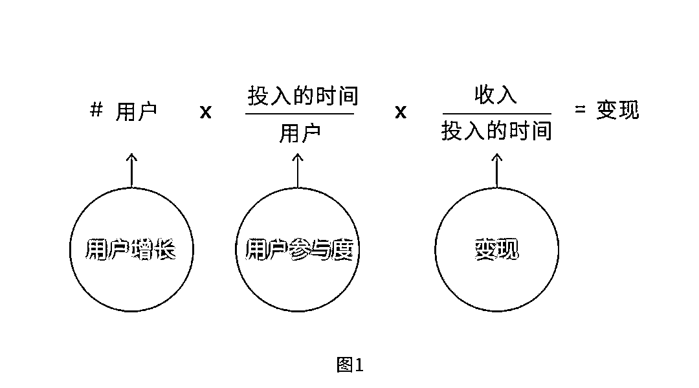
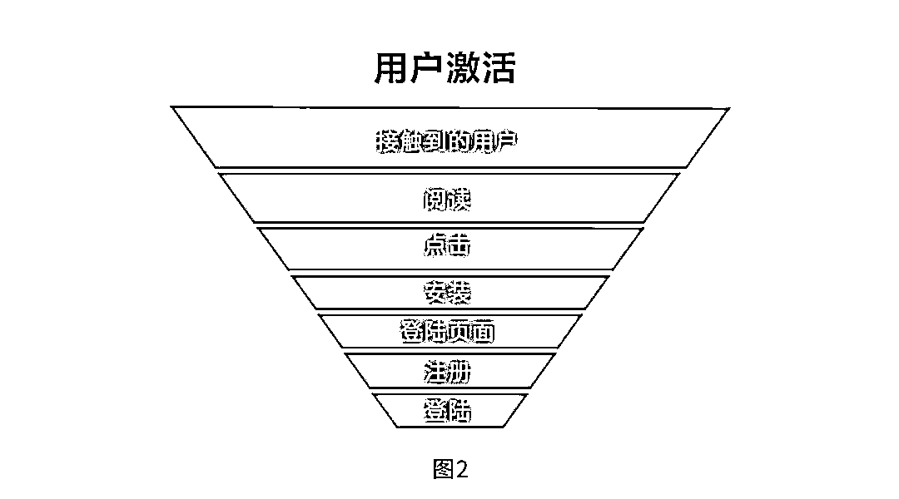
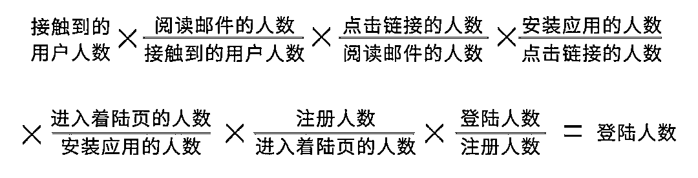
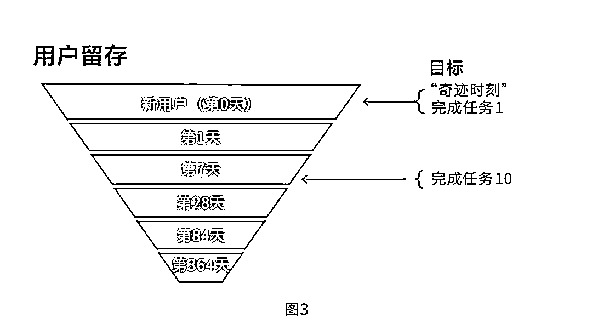
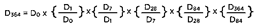
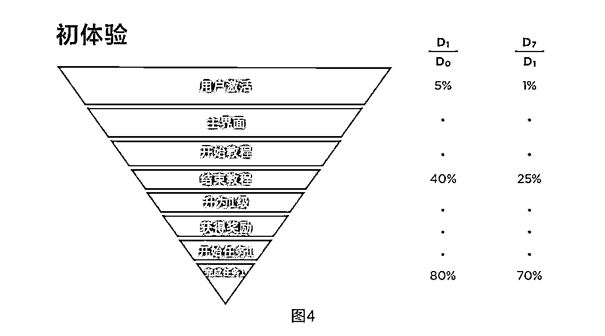

# 爆款的诞生：如何利用框架打造让用户不能拒绝的产品 | 投资人说

> 原文：[`mp.weixin.qq.com/s?__biz=MzAwODE5NDg3NQ==&mid=2651225387&idx=1&sn=9e67075d54a59b0e5fd2ce5328153e30&chksm=8080437fb7f7ca693112cef86137101def417a0b947ad09ab6f53fb937cc82257ebd923571a0&scene=21#wechat_redirect`](http://mp.weixin.qq.com/s?__biz=MzAwODE5NDg3NQ==&mid=2651225387&idx=1&sn=9e67075d54a59b0e5fd2ce5328153e30&chksm=8080437fb7f7ca693112cef86137101def417a0b947ad09ab6f53fb937cc82257ebd923571a0&scene=21#wechat_redirect)

你知道如何选择学校和专业吗？你知道团队与个人如何连接吗？你知道如何提高用户留存吗？这三个看似无关的问题都可以用一个方式解决，那就是建立框架。框架，能帮助团队打造成功的产品，扩充企业规模的同时保持权责清晰，也同样能帮我们做好人生中的每一次重大决策。

此前我们发布了《爆款的诞生》系列文章[《手把手教你提升用户留存率》](http://mp.weixin.qq.com/s?__biz=MzAwODE5NDg3NQ==&mid=2651225172&idx=1&sn=93955ba9920e04236aa0be0a6b6f8f68&chksm=80804200b7f7cb1627eb9901861e319ded707d760afcde8032ef01fa0a5fb4fb43c284df895e&scene=21#wechat_redirect)和[《健康的产品要满足哪些指标》，](http://mp.weixin.qq.com/s?__biz=MzAwODE5NDg3NQ==&mid=2651225205&idx=1&sn=f1f4b328f5ff80db9953bbb86ab06837&chksm=80804221b7f7cb37a32599eae59767be28b65e6262e3b7fd6d6ec6b13d029eb075b2fbc4ddd0&scene=21#wechat_redirect)此篇作为这个系列的第三篇，同样来自红杉美国，讲述了什么是框架、它的重要性，以及如何搭建。文中还介绍了一个可以帮助提高用户激活的漏斗模型，以及分享了用户初次体验和“奇迹时刻”的重要性，或许能帮你打造更好、更吸引用户的产品。本文研究成果来自红杉美国数据科学团队，Jamie Cuffe、Avanika Narayan、Chandra Narayanan、Hem Wadhar 和 Jenny Wang 对本文亦有贡献。

产品要想取得长足成功，就要满足以下几个条件：产品和市场匹配，具有正向单位经济效益，具备实现规模扩充和增长的能力。

产品和市场匹配要求产品具有足够的吸引力，能够为用户带来真正的价值，不断吸引回头客。实现正向单位经济效益需要小心留意企业的基本财政基础。实现规模扩充需要企业可持续发展。那么，如何通过框架搭建，打造长足不败的产品呢？

**什么是框架？**

**我们为什么需要框架？**

框架是一种思考问题和理解复杂事务的方式，能够帮助我们简化多数看似复杂的问题。

框架不仅存在于企业中，更是渗透到了我们的个人生活中。我们往往会利用框架来简化决策过程，并指导决策的制定，尽管有时是无意间所为。比如，选择学校和专业，就可以先确定学校、项目、预计收入、离家距离等关键因素，制定一些诸如学校排名前五、项目排名前五、预计收入高于 10 万美元、位处西海岸等标准，这个框架就能帮助我们更容易做决策。此外，这一过程还可帮助我们了解产品表现，学习如何建立有效的组织，如何留住用户，如何吸引更多用户等等。

离开概念框架，识别问题和解决问题的流程很难扩充、重复、扩展和再利用。要想对问题根源和相关推动因素进行有效理解和判断，以使见解转化为行动，或通过交流发现结果，框架十分必要。

框架的建立需要将问题分解为不同的部分，每个部分又能够再进行细分。下列示例可帮助你理解这一流程，并且可应用到多种情境中。

**示例 1：**

**框架将整个企业连接起来**

于公司而言，建立框架具有很大价值，它能将整个企业连接起来。这种框架能够帮助雇员了解什么对公司最重要，进而激励团队，并可以将公司的目标与个人的使命连接起来。此外建立公司框架还有利于化解冲突，确定团队构建方式。

Facebook 就很好地反应了框架是如何使企业变得信息完备的。Facebook 的宗旨是“赋予人们共同构建社区以及把世界紧密相连的力量。”Facebook 梦想能将每个人都纳入到它的平台，每个人都沉浸于社区化的交流中，从而拉近人与人之间的距离。

从指标的角度来看，Facebook 的使命是关注用户增长，即 Facebook 希望每个地球人都使用 Facebook。最适合用于反应这一目标的指标就是月活跃用户或每日活跃用户（DAU），因为强大社区的构建和人们距离的拉近需要用户沉浸到产品中。为了鼓励这一行为，近期，Facebook 对平台使用时间的“意义”（而非总时长）给予了重视。因此在用户所看的内容中，家人和好朋友的状态在增多，而病毒视频在减少。

为了不断促进产品发展，吸引用户，Facebook 必须在平台上投放广告，以此获利。影响 Facebook 收入增长的三个主要因素为用户增长、用户参与度和变现。图 1 中的简单框架介绍了这三种因素。

若企业可根据这些因素来组织业务部门，它们就可以使自己获得更多数据，并提高对指标的专注度。以 Facebook 为例，用户增长团队可以将 DAU 作为指向标，专注于增加 DAU。这种一致性有助于解决在方案价值判断上的冲突。比如，在其他条件相同的情况下，推出那些能够增加 DAU 的产品当然就是明智之举。

同样，用户参与团队可以侧重于增加单个用户的产品使用时间，而变现团队可致力于增加用户单位时间内带来的收入。

目标的实现也需要平衡制约，以确保这些关键指标的增长不会对其他企业级别的指标产生负面影响。例如，提高 DAU 时，用户增长团队还应对用户单位投入时间内带来的收入进行监测。

图 1 中的指标对整个团队或业务部门都非常有价值，而且一个简洁的公司框架也能够极大提高企业各个级别的监控能力。在最高等级的框架中，管理展示板则展示了各个业务单位的业绩表现。

展示板也可根据各个业务部门领导的需求，进行量身定做，以加深对团队表现的了解，帮助判定哪些因素有助于业务发展，以及应当采用何种策略。这些展示板还可以再细分到各个业务部门的子单位，并由中级管理人员进行监控，判断它们对终极业务目标的影响。被细分的框架可以帮助各个业务部门监测各自的指标，也使企业各级权责清晰。

**示例 2：**

**漏斗模型帮助用户激活**

该示例研究了用户增长团队如何构建用户激活框架。用户数的持续增长，通常是每个产品的关键目标。要想留住现有用户，挽回流失用户，吸引新用户，用户增长团队就要将新用户纳入漏斗模型的顶端，然后在后续步骤中改变其在模型中的位置。

企业可通过多种自有和付费营销渠道接触新用户，图 2 显示的漏斗模型是邮件渠道的用户激活情况。“接触到的用户”包括所有收到邮件的用户，其中只有一部分会阅读邮件。而点击链接的人中，又只有一部分会完成安装。最终的用户人数还要减去那些安装了应用但未打开登录页面的人数。最终只有一小部分用户会打开注册页面，注册新账号，并最终成功登陆。成功登陆的用户数可用下示简便公式进行计算：

该框架可用于构建新目标、新方案和新产品路线图，上述公式中的各个成分都可能会提高登陆总人数。为了提高用户激活人数，了解漏斗模型中的各个部分至关重要。企业应将公式中的各个成分都纳入监管展示板，深入了解并与相关基准进行对比，“利用数据进行判断”并预测其影响因素，根据这些成分构建目标、方案和产品路线图，从而“进行框架设计”。

**示例 3：**

**用户留存是最高层级**

为了促进整体用户增长，建立一个有助于了解用户留存机制的框架颇具价值。

产品是否具有价值，是否与市场契合，用户留存数就是最好的印证，因为用户留存数显示了使用过产品的人是否对其足够喜爱到愿意再次使用。留住大量用户的最佳方式是打造一款核心用户（产品参与度最高的用户）喜欢的产品。

图 3 显示了用户完成注册，成为激活用户或“新”用户后，用户留存漏斗模型中的各个用户组。

对许多产品来说，第一天或者第一周对用户留存至关重要。内容够不够用户消化？他们有一些可以聊天的朋友吗？他们对产品内容的理解是否清晰？

了解第 1 天、第 7 天、第 28 天、第 84 天和第 364 天后用户组的去留情况，能够帮助产品组制定具体的策略、路线图和方案。例如，若第 364 天/第 84 天的用户留存数=1（即第 84 天和第 364 天之间的用户留存数不变），则可得出前 84 天的用户净流失数。若第 84 天/第 28 天的用户留存数=1，则可得出前 28 天的用户净流失数。

这种情况下，公司应重点研究哪些措施可以在前 0、1、7、28 天为新用户创造最佳体验。要确定有哪些潜在措施，公司可进行探索性分析，为每次用户数下降假设一个或多个原因，分析潜在原因，识别问题和机遇，根据自己可用的操控手段和可采取的行动制定产品路线图。

如上述示例所示，监管用户留存模型中的各个层级对产品的改进至关重要。我们强烈建议企业构建展示板，将用户留存作为最高层级。

**示例 4：**

**初次体验和“奇迹时刻”**

对多数产品而言，初次体验对吸引并留存用户最为重要。第一次使用某个产品时，用户并不会知道该有哪些期许，产品偏向哪个方向，该如何使用它。因此，重要的是能为用户提供一个美好的初次体验经历以及一个“奇迹时刻”，使他们想要每天使用该产品。

这在游戏中尤为重要，因为用户人数通常会在开始使用的一两天内就会急剧下降。用户第一天在游戏产品上投入的时间越多，第二天继续玩游戏的可能性就越大。因此，多数游戏都会为新用户提供教程、等级、任务、奖金或奖励。

例如，假设图 4 的虚构游戏中，用户激活了帐户，来到了游戏的主界面，完成了教程并升为一级，获得奖励。这也就是“奇迹时刻”，用户被鼓励继续进行任务 1，其中一部分用户最终会完成该任务。

本例中，未登陆主界面的用户中，仅有 5％会在次日（图 3 中的“第 1 天”）继续玩游戏，而完成教程的用户中，40%会在次日继续玩游戏，完成教程和任务 1 的用户中，80%会继续玩。这表明，游戏的产品团队应鼓励用户完成任务 1。然而，若多数用户在教程阶段就不再玩游戏，仅有少部分人会完成任务 1。此时，产品团队就应该特别注重教程前的用户体验，因为这一阶段流失了最多用户。

了解模型各部分的用户留存数与一天、一周甚至更久之后用户留存率之间的关系，能够帮助企业更好地理解着力点，提高用户参与度。若某一阶段的用户流失数可忽略不计，则不应优先考虑这一阶段。另一方面，“蹩脚”的用户体验将对整体的用户转化率十分不利，企业应解决这一问题。多数情况下，解决方案都十分简单，只需更改设计流程或修复某个错误。

最终目标是尽可能多地提高达到任务 1 的用户人数，创造“奇迹时刻”，确保这些用户成为长期用户。产品组可通过对这些看似棘手的问题进行分解，构建框架，从而实现分而治之的目标。

**构建框架的技巧**

▨ 认清目标

创建模型前必须清楚自己想要的结果。示例 1 中的理想结果是构建一个公式，将企业的各个部门有逻辑地联系在一起；示例 2 的目标是提高激活用户的数目，使他们在产品里登陆；示例 3 的理想结果是提高用户留存数；示例 4 的目标是改善初体验，最终使产品契合市场。

▨ 确立基本模块

制定一个有用的产品路线图前必须小心选择漏斗模型的级层。所选的级层应可付诸实践，清楚地指向理想结果。示例 3 的目标是尽可能地留住长期用户。由于用户体验第一天、第一周和后续时间内的操控手段不同，就需要根据时间合理地分解用户留存问题。例如，产品路线图的目的可能是通过增加好友数目来提高第一周内的用户留存数。

▨ 创建一个公式

公式可将流程中的各个步骤或阶段连接起来，帮助企业了解哪些最为重要。它还可帮助企业改变那些与“指向标参数”一致且易于处理的参数。要创建这种公式，企业可将漏斗模型转化为一系列的比率指标，从而确定哪些操控手段有利于达成理想结果。

框架是帮助企业获得完备数据的宝贵工具，它能为制定路线图提供指导，以帮助企业打造持续不败的产品和扩充企业规模。如上文示例所示，企业可利用框架使企业向关键指标看齐，激活用户，留存用户，借助“奇迹时刻”和美好的初次体验提高用户参与度。** **

** 推荐阅读**

壹

[爆款的诞生：健康的产品要满足哪些指标?｜投资人说](http://mp.weixin.qq.com/s?__biz=MzAwODE5NDg3NQ==&mid=2651225205&idx=1&sn=f1f4b328f5ff80db9953bbb86ab06837&chksm=80804221b7f7cb37a32599eae59767be28b65e6262e3b7fd6d6ec6b13d029eb075b2fbc4ddd0&scene=21#wechat_redirect)

贰

[爆款](http://mp.weixin.qq.com/s?__biz=MzAwODE5NDg3NQ==&mid=2651225172&idx=1&sn=93955ba9920e04236aa0be0a6b6f8f68&chksm=80804200b7f7cb1627eb9901861e319ded707d760afcde8032ef01fa0a5fb4fb43c284df895e&scene=21#wechat_redirect)的诞生[：手把手教你提升用户留存率 | 投资人说](http://mp.weixin.qq.com/s?__biz=MzAwODE5NDg3NQ==&mid=2651225172&idx=1&sn=93955ba9920e04236aa0be0a6b6f8f68&chksm=80804200b7f7cb1627eb9901861e319ded707d760afcde8032ef01fa0a5fb4fb43c284df895e&scene=21#wechat_redirect)

叁

[Zoom 袁征：全美最受欢迎的 CEO 竟是山东大汉？ | 红杉七问之谈](http://mp.weixin.qq.com/s?__biz=MzAwODE5NDg3NQ==&mid=2651225371&idx=1&sn=485f191469c1eae6a3639d2399c9a412&chksm=8080434fb7f7ca596a60015fb0a04697709055514bced80bc5e44c08611f4418daca949aa066&scene=21#wechat_redirect)

肆

[红杉资本 Doug Leone：别做房间里最聪明的人｜](http://mp.weixin.qq.com/s?__biz=MzAwODE5NDg3NQ==&mid=2651225235&idx=1&sn=f4c30e3690311b7b634763371e6a65c1&chksm=808042c7b7f7cbd1c5281f0a213a13b248f223ab7147605bb150b5e94576cc38ba362b77e6fc&scene=21#wechat_redirect)红杉七问之谈

伍

[如何成为行业排名前 20%的赢家？](http://mp.weixin.qq.com/s?__biz=MzAwODE5NDg3NQ==&mid=2651225298&idx=1&sn=528dd0d2bdc0549cb564103b62070f95&chksm=80804286b7f7cb903dee16524ab7f36fa727ab70136ef2735eaa7b2fb8f4f93e29879a6a09e5&scene=21#wechat_redirect)

