# 爆款的诞生：打造成功产品的必备 DNA——指标变化分析 | 投资人说

> 原文：[`mp.weixin.qq.com/s?__biz=MzAwODE5NDg3NQ==&mid=2651225412&idx=1&sn=194cb57cc1babad917b7cbd8dbed14b1&chksm=80804310b7f7ca068c3f2a958017855a98ab3c3964ea8455147596cd9790c0f320a102b0e3d0&scene=21#wechat_redirect`](http://mp.weixin.qq.com/s?__biz=MzAwODE5NDg3NQ==&mid=2651225412&idx=1&sn=194cb57cc1babad917b7cbd8dbed14b1&chksm=80804310b7f7ca068c3f2a958017855a98ab3c3964ea8455147596cd9790c0f320a102b0e3d0&scene=21#wechat_redirect)

指标的监测对于判断产品是否成功至关重要。一旦选定了某一个能够准确反应产品整体目标的指标，努力让该指标朝着正确的方向变化便成了首要之事。那么应该如何判断哪些因素是关键指标变化的主要驱动因素，以及如何对其进行分析呢？

《指标变化分析》系列文章将从产品变化、季节性因素、竞争及其他外部因素、比例变化、行动指南这几个部分入手，深入探讨针对每个因素应作何考虑，以及如何分析产品指标的改变。本文研究成果来自红杉美国数据科学团队，Jamie Cuffe、Avanika Narayan、Chandra Narayanan、Hem Wadhar 和 Jenny Wang 对本文亦有贡献。以下是部分要点摘要：

▨ 产品变化，不管是新产品上线、通知方式的改变或是无意的漏洞，必然会导致指标的变化。

▨ 季节性因素通常会引起关键指标的剧烈波动。

▨ 竞争的影响很难测量和消除，但行业数据可以帮助指引方向。

▨ 严格监测关键指标，拥有强大的分析 DNA，能减轻外部事件的负面影响。

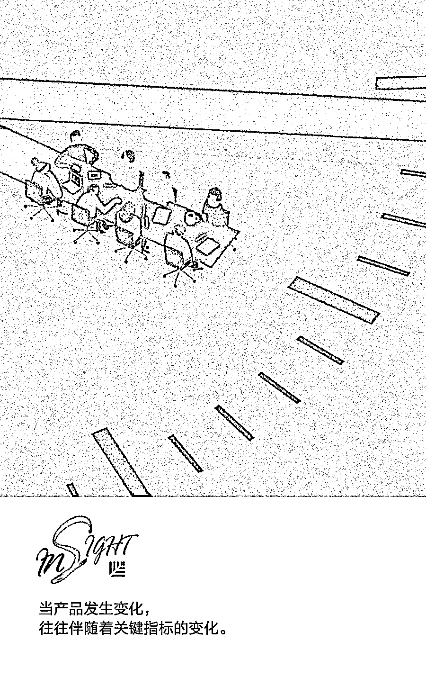

**产品变化**

由于试验性的产品更新的出现，近年来新产品开发也呈现爆炸性增长。当产品发生变化，往往伴随着关键指标的变化。因此，理解推出某一产品将会带来何种影响，确保能取得理想的结果，这点至关重要。

例如，2014 年 7 月，当 Facebook 开始通知用户他们将无法使用手机上的 Facebook 软件发送消息，此后一个月内近 2000 万美国 iOS 用户下载了另外的聊天软件（见图 1）。

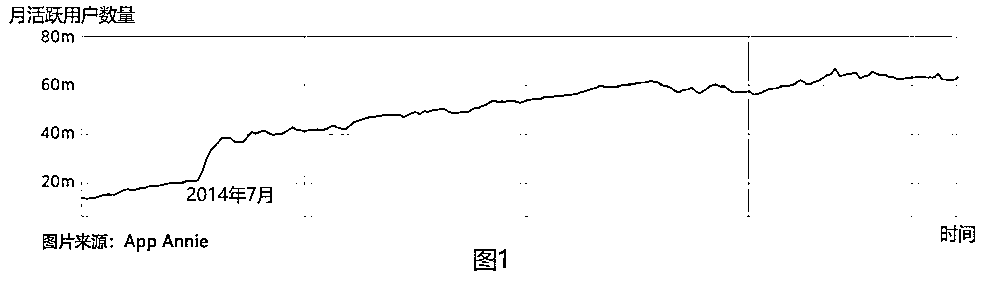

再举一个例子，试想下如果改变某一产品的通知算法，哪些指标会受到影响？看到通知的人数、对通知做出反应的人数百分比、进入登录页面的人数百分比、和产品积极互动的人数百分比……当产品发生变化的时候，这些指标以及其它等等都可能受到影响。

当然，产品变化不总是有意而为的。妨碍用户下载、更新软件或发送消息和接收通知的漏洞，也可能会严重影响关键指标。因此，认真追踪关键指标，当产品发生重大变化或是更新版本时，尤其要留心观察，争取发现和理解漏洞，以及采取措施减少漏洞造成的损害。

A/B 测试是评估变化给产品带来的影响的最好办法。进行 A/B 测试时，给不同用户随机呈现两个不同的版本中的一种，采用数据分析来判断哪个版本更符合预设目标。当变化相对较小的时候，进行 A/B 测试尤其重要，而大多数情况下变化也都是小改变。像上面 Facebook 例子中的较大变化时，可能被观察到。但是通常来说，如果没有 A/B 测试，则其影响几乎不可能被轻易发现和测量到。

**季节性因素**

季节性因素通常会引起关键指标的剧烈波动。随着时间和环境的变化，人们做出的表现也是不同的。季节性是可以使用数据进行分析的最显著的影响之一。

**季节性**

季节性是用户行为周期性变化的一个明显特征。例如，当人们在新年下定决心时，便会在每年年初有所改变——至少在短时间内如此。在图 2 中，我们发现，1 月 1 日之后，锻炼时间在 30 分钟甚至更久的人的百分比明显增加。季节性的其他例子还包括基于一天中不同时刻、一周中不同日子、一年中不同季节等出现的行为变化。将这些与外部因素分开是很重要的，例如游戏《精灵宝可梦》的发布，它对人们的锻炼行为也有着类似的影响（见图 2）。我们将在未来的文章中继续讨论这些外部变化。

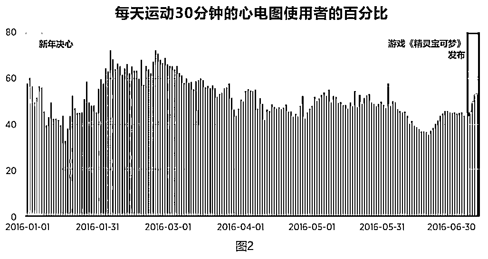

**季节性分析**

季节性通常是关键指标出现变化的根本原因；因此，这是第一个需要研究的行为变化因素。

要正确分析任何行为变化，就必须了解产品的整体生态系统。例如，了解年轻人在暑假期间做什么，中年女性如何购物，使用 Android 系统的人与使用 iOS 系统的人相比表现如何，或者谁可能是你公司产品的早期使用者，了解这些可能会很重要。

了解这个生态系统可以让你提出一些好问题并建立正确的假设，对行为变化的有效分析几乎都是这样开始的。问问你自己：关键指标发生变化，其根本原因可能是什么？然后，你可能会假设原因是季节性，用户感到了厌倦或是对产品的看法（正面的或负面的）发生了变化。一旦你对关于关键指标可能发生变化的原因有了综合的判断，你就可以进行进一步的调查了。

如果你正在验证季节性是发生变化的影响因素这一假设，你可以采取以下几种方法：

▨ **周间变化**

大多数产品表现出非常强烈的周内效应，因为人们在工作日的表现与周末相比截然不同。要消除这一影响，我们使用七天（或滚动七天）指标的平均值。例如，图 3 明确显示了 Yelp 使用时长以周为周期的变化模式，并会在周末时增加。如果没有 7 天的平均值，周与周之间的变化将会淹没在日常波动之中。

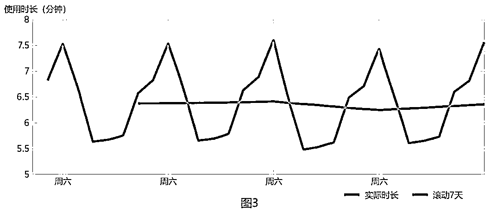

（注：社交应用程序通常也有类似的日内效应，因为大多数人晚上花在社交应用上的时间比白天多得多。如果你为这样一个应用程序研究的最低粒度级别是每日，你将错过这一信号。）

▨ **日间变化**

如果你有兴趣检查每日变化，那么要尝试覆盖一周中的每一天，如图 4 所示。此方法将为你提供更详细的信息。例如，与其他周相比，第 3 周出现了最大值和最小值。

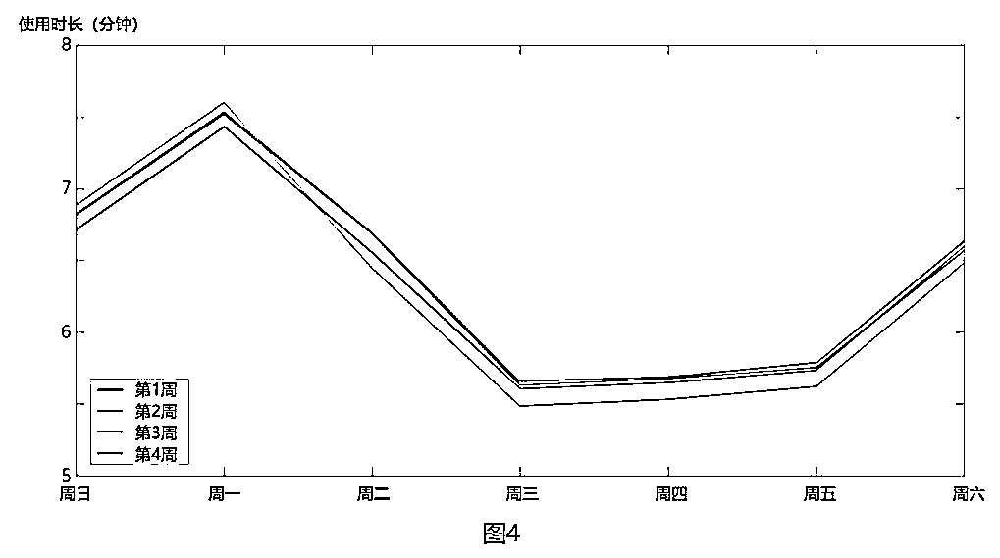

▨ **同比变化**

观察数据的年度变化趋势是确定季节性影响最有效的方法之一。这种方法将阐明假期、返校季、节日和寒冷天气等产生的影响，并帮助你确定这些对关键指标的影响是否会随着时间的推移而扩大或降低。

例如，图 5 上方的图表显示了电子商务公司明显上涨的 7 天滚动平均收入。在某些情况下，如果变化不那么明显，那么较长的滚动平均值（例如 28 天）（参见图 5 下方图表）可以帮助演示某一指标是如何随时间推移而变化的。

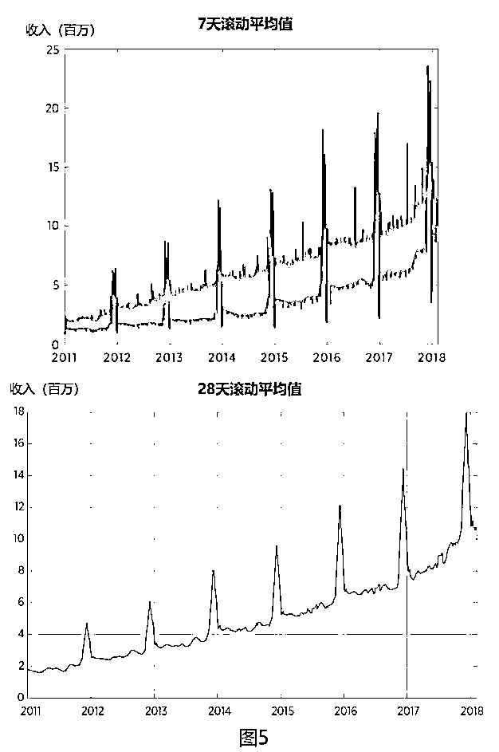

然而，关于一个关键指标是如何逐年增加的，我们从 28 天的平均滚动率中能看出的不多；我们看到年底（度假季）增长势头强劲，但其他模式则几乎没有这一现象。相反，我们应该看看年度指标（见图 6 上方图表），就能从中发现更多的季节性模式的信息。

图 6 下方的图表显示了同比 28 天的滚动平均值模式；而一年之内的变化更加明显。现在我们可以清楚地看到，5 月到 7 月之间的收入受到季节性的影响。5 月份收入减少，6 月初开始大幅增加，然后再次减少，直到 7 月 4 日左右，此时我们看到 2016 年和 2017 年都出现了大幅增长，可能是由于开展了促销活动。因此，了解每年发生的这些事件将有助于为未来规划。

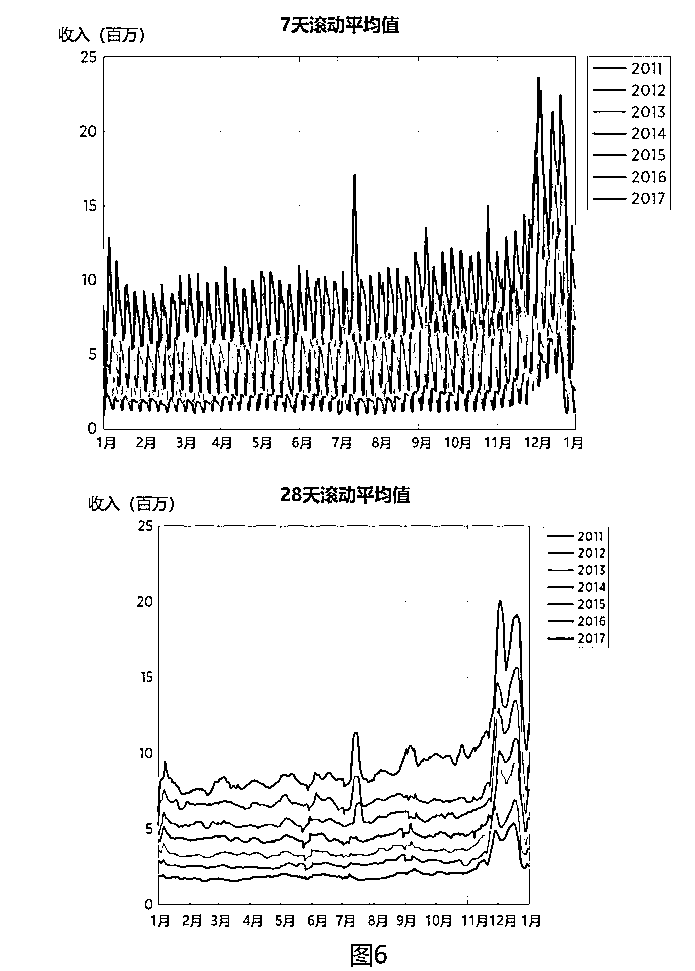

通过绘制一年到下一年的收入比率可以更好地理解同比变化（参见图 7 上方图表）。2016 年收入增长同比下降，但 2017 年，这一情况显著改善。“指数归为 1”（参见图 7 下方图表）是另一种有效的方法，可以观察从年初开始事情如何变化。在这种情况下，它表明 2017 年是同比增长表现最好的一年，因为该公司设法扭转了局面。

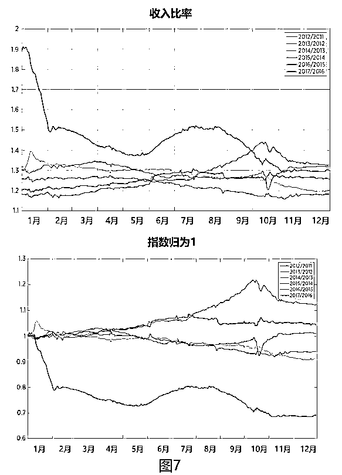

▨ **对比**

你还可以通过将关键指标与具有相似受众特征的其他应用进行比较来分析季节性。举例来说，如果你的应用针对年轻人群，并且你的关键指标在 8 月和 9 月发生了变化，你要尝试从具有类似受众特征的其他应用（例如 Snapchat）获取数据，查看这一应用是否经历了类似的变化。如果是，则有可能是返校效应导致了这一变化。

在此分析中，平均天数最好不少于七天，并将指数归为 1，以便确定宏观趋势。将你的指标与不同地点（以及不同开学日期）的应用程序进行比较，也有助于识别此效应。

**竞争及其它外部因素**

用户行为也会受到竞争及其它外部事件的影响，如政府行为、新产品广告和社交媒体广告。这些因素会显著地改变用户使用你的产品的方式。优步就因为“卸载优步运动”而损失了大量用户，整体市场份额也因此缩水（见图 8）。

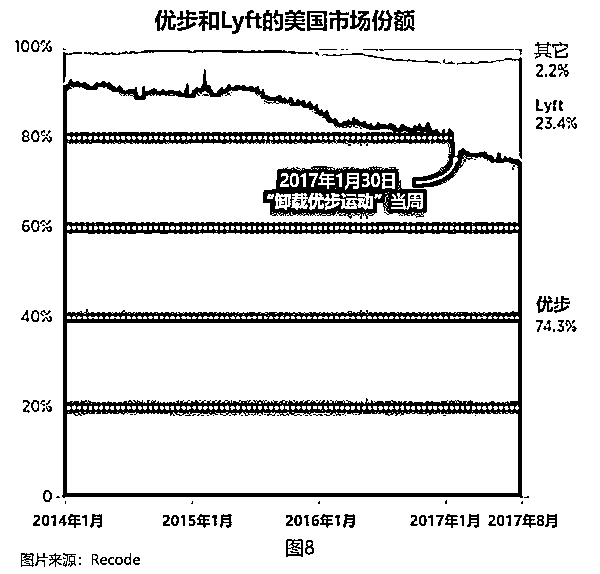

通常，关键指标的变化越大，变化发生的时间段就越短，原因也更容易发现。对于许多外部事件尤其如此，尽管竞争带来的影响往往难以量化。我们从下面几个对不同外部因素影响的分析入手：

▨ **分析竞争的影响**

竞争对你的产品的影响可能微妙而难以识别，消除其影响也更难。这是因为竞争的影响通常以客户流失为表现。虽然我们能够发现用户在流失，但如果不进行用户体验调查，则几乎不可能知道用户离开是否因为选择了竞争对手的产品。

如图 9 所示的音乐行业的例子，Pandora 原本稳步增长的趋势在 Spotify 开始迎头赶上的时候陷入停滞。

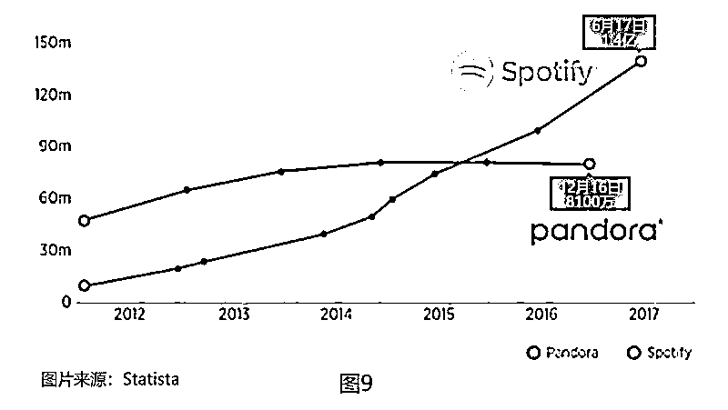

有可能用户开始由 Pandora 转向使用 Spotity，进一步加速 Spotify 的增长，并使得 Pandora 的增长走平。但是，很难将这一变化精确地量化。

利用覆盖你所在行业的第三方数据集（如通过 App Annie 了解使用信用卡情况和消费者消费情况等），频繁地开展用户调查，这能帮助你更好理解竞争如何侵蚀了你的用户基数。但是在这方面你很难做到很好，即便是最好的分析也常常只是方向性的。我们之后会发一篇文章专门探讨竞争、市场吞并和渐进性增长。

▨ **分析事件的影响**

了解某个异常的外部事件的影响通常相对容易，因为此类事件通常会导致关键指标的突然变化，从而使相关性变得清晰。图 8 所示的“卸载优步运动”就是这样的例子。

▨ **分析宏观趋势**

与竞争导致的行为变化类似，长期行为趋势难以发现，但可以通过用户体验调查获得指导。

这些宏观变化通常受到外部事件的驱动。例如，印度引入低成本 4G 连接（运营商为 Reliance Jio）使该国的互联网接入更便宜可靠，反过来又大大增加了印度人花费在 YouTube 上的时间（见图 10）。

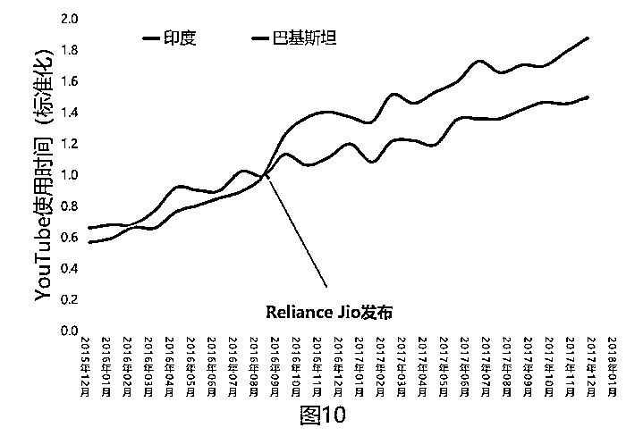

当然，这种宏观变化的影响并非都是积极的。在图 11 中，我们看到宽带互联网使用的增加改变了消费者获取新闻的方式。谷歌的广告销售大幅增加，而美国报纸的印刷发行量迅速下降，之后表现为报纸广告销售收入大幅下降。

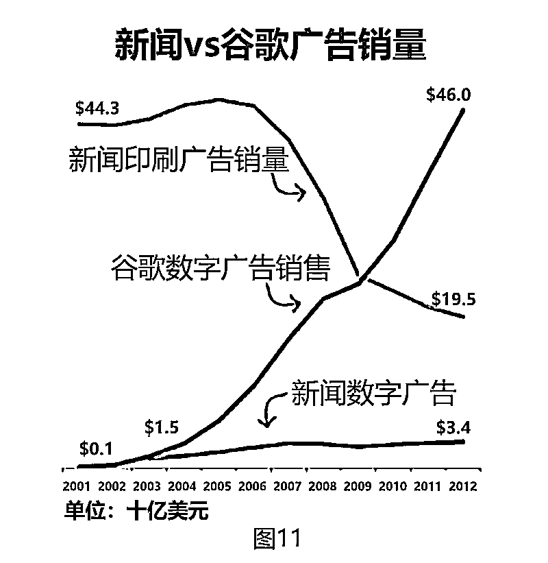

外部因素可以极大地影响产品的表现，而且除了宏观趋势之外，大多数外部因素都很难预测。但是，如果你严格地监测关键指标，确保公司具有强大的分析 DNA，那么你将能够更好地利用机会，减轻外部事件的负面影响。** **

** 推荐阅读**

壹

[爆款的诞生：如何利用框架打造让用户不能拒绝的产品 | 投资人说](http://mp.weixin.qq.com/s?__biz=MzAwODE5NDg3NQ==&mid=2651225387&idx=1&sn=9e67075d54a59b0e5fd2ce5328153e30&chksm=8080437fb7f7ca693112cef86137101def417a0b947ad09ab6f53fb937cc82257ebd923571a0&scene=21#wechat_redirect)

贰

[爆款的诞生：健康的产品要满足哪些指标?｜投资人说](http://mp.weixin.qq.com/s?__biz=MzAwODE5NDg3NQ==&mid=2651225205&idx=1&sn=f1f4b328f5ff80db9953bbb86ab06837&chksm=80804221b7f7cb37a32599eae59767be28b65e6262e3b7fd6d6ec6b13d029eb075b2fbc4ddd0&scene=21#wechat_redirect)

叁

[爆款的诞生：手把手教你提升用户留存率 ｜投资人说](http://mp.weixin.qq.com/s?__biz=MzAwODE5NDg3NQ==&mid=2651225172&idx=1&sn=93955ba9920e04236aa0be0a6b6f8f68&chksm=80804200b7f7cb1627eb9901861e319ded707d760afcde8032ef01fa0a5fb4fb43c284df895e&scene=21#wechat_redirect)

肆

[红杉发布 00 后泛娱乐消费报告：不懂 00 后的创业者们要小心了！](http://mp.weixin.qq.com/s?__biz=MzAwODE5NDg3NQ==&mid=2651225402&idx=1&sn=aedf0fd1209a4471e6bfbeae264a6cdf&chksm=8080436eb7f7ca78480bc7d780f4a50d56c540d78af4ff24e3eb44968fe1cc62ee1cc4975111&scene=21#wechat_redirect)

伍

[让创业置之死地而后生的决策智慧是什么？| 经典重读](http://mp.weixin.qq.com/s?__biz=MzAwODE5NDg3NQ==&mid=2651225407&idx=1&sn=3033f8f2e8d424c48085d37c46345bda&chksm=8080436bb7f7ca7dd8ec35a8f7fd49775e2627f4735dc825cbafcf8f8aed08c31f46cd29ca5f&scene=21#wechat_redirect)

