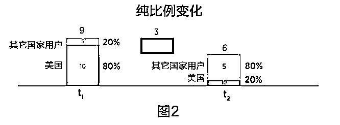
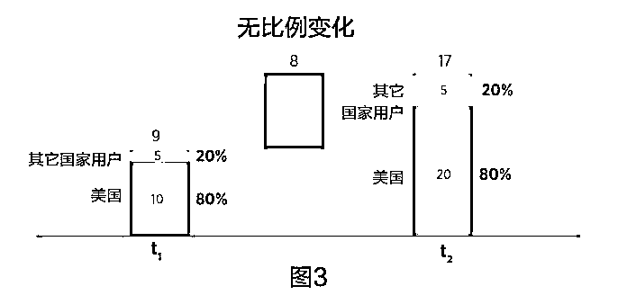

# 爆款的诞生：看重数据质量，看懂指标变化，产品成功的必备 DNA | 投资人说

> 原文：[`mp.weixin.qq.com/s?__biz=MzAwODE5NDg3NQ==&mid=2651225474&idx=1&sn=1f7f9a6a8001136c617b25bd11e55ff5&chksm=808043d6b7f7cac0f4279bcee54de46cc67d188327016b3e352eaa38ebdd0bc4fb0bc0b21cce&scene=21#wechat_redirect`](http://mp.weixin.qq.com/s?__biz=MzAwODE5NDg3NQ==&mid=2651225474&idx=1&sn=1f7f9a6a8001136c617b25bd11e55ff5&chksm=808043d6b7f7cac0f4279bcee54de46cc67d188327016b3e352eaa38ebdd0bc4fb0bc0b21cce&scene=21#wechat_redirect)

缺乏对指标变化准确而有效的监测和分析，就无法完全掌握一个产品，更无法将它完善。想要打造爆款，就必须运用科学的指标变化分析。之前《[爆款的诞生：打造成功产品的必备 DNA——指标变化分析 | 投资人说](http://mp.weixin.qq.com/s?__biz=MzAwODE5NDg3NQ==&mid=2651225412&idx=1&sn=194cb57cc1babad917b7cbd8dbed14b1&chksm=80804310b7f7ca068c3f2a958017855a98ab3c3964ea8455147596cd9790c0f320a102b0e3d0&scene=21#wechat_redirect)》探讨了产品变化、季节和其它外部因素对关键指标的影响，本文将继续从比例变化、数据质量两个方面分析指标变化因素，并提出如何应对指标变化的行动计划。

本文研究成果来自红杉美国数据科学团队，Jamie Cuffe、Avanika Narayan、Chandra Narayanan、Hem Wadhar 和 Jenny Wang 对本文亦有贡献。以下是部分要点摘要：

▨ 比例变化分析可以帮助你发现不同用户群所占比例变化相对于用户参与度变化所产生的影响。

▨ 无法简单加以解释的突然而剧烈的变化，是数据质量问题最常见的表现。

▨ 保证数据质量的最优作法分为三类：如何正确记录、如何识别问题和如何解决问题。

▨ 解决措施的有效实施要求企业对此全力以赴，形成长期机制，这也会让企业上下更加注重质量和追求卓越。

**比例变化**

“比例”有多种含义，有时候也称作辛普森悖论。一家公司的“销售比例”指的是其各个产品销售额相对于总销售额的权重。与此类似，“用户群比例”指的是某个特定用户基数（如某个国家的用户人数）在总用户基数中所占的比例。

比例随时间的变化称作“比例变化”。例如，可能 t1 时刻的日活跃用户量（DAU）美国用户占了 75%，其他国家用户（ROW）占了 25%；在 t2 时刻，前者则变为 60%，后者变为 40%。在这个例子中，每位美国日活跃用户和每位其它国家的日活跃用户所花费的平均时间（TS/DAU）单独来看没有改变，但是总体的 TS/DAU 却有所增加。

以亚马逊的 Prime 会员服务为例。如图 1 所示，Prime 平均交易价值一直随着时间而变化，一方面是因为价格调整，另一方面则是因为各消费群体所占比例发生变化。Prime 会员服务为一般用户、学生用户和低收入用户提供不同的价格，拥有年付和月付的不同付费计划，偶尔会有折扣活动。

2016 年到 2017 年平均价格的下降主要是因为低收入群体会员、月付会员和学生会员的增加，这些群体支付的价格均低于其他客户。每种产品的定价在这一时期都是固定不变的，变化的是不同客户的比例。客户比例的完整信息可以让我们准确地将图 1 所呈现的变化归因于比例变化因素。

想象你分别在 t1 时刻和 t2 时刻调查某一家公司的日活跃用户的平均时间，想要把 TS/DAU 的变化归因于比例变化而不是其它变化，下面就是两个极端的例子来展示发现比例变化影响的方法。

例 1：**纯比例变化的影响**

在 t1 时刻，美国用户的 TS/DAU 是每天 10 分钟；而其它国家用户则是每天 5 分钟。80%的用户为美国用户，因此总体的 TS/DAU 为每位用户 9 分钟。

在 t2 时刻，美国和其它国家用户的 TS/DAU 均保持不变。但是，不同用户群所占比例变了：美国用户现在只占 20%，而其它国家用户占 80%。新的 TS/DAU 数值变成了每位用户 6 分钟，减少了 3 分钟，而这一改变完全来自于比例的改变。

正如上述例子所示，即使产品或是每个用户参与度没有发生变化，比例的变化仍可能导致整体参与度降低。

例 2：**无比例变化因素的影响**

在 t1 时刻，美国用户的 TS/DAU 依然是每天 10 分钟，其它国家用户 5 分钟。美国用户仍占 80%，总体的 TS/DAU 仍为每位用户 9 分钟。

但在 t2 时刻，美国用户的 TS/DAU 变了，增加到每天 20 分钟，而其它国家用户保持不变，比例也保持不变。而新的 TS/DAU 数值则因此变成每位用户 17 分钟，这增加的 8 分钟完全由美国用户参与度发生了变化导致，没有受到比例变化的影响。

上面两个例子都是极端的案例，整体参与度的改变通常同时受到比例变化和参与度变化的影响，提出量化这些影响的公式也相对比较简单。

比例变化的影响可以通过国家、地区、平台、年龄、性别、连接类型、设备类型等多个维度来分析。要使得比例变化分析最为有效，首先你应该认真思考这一问题，提出关于比例变化影响的假设。

**数据质量**

最近几年，企业负面新闻、监管环境改变和大型金融机构的倒闭等因素，使得人们开始给予企业信息质量必要的关注。例如，Facebook 因为数据错误面临多项问题。数据质量低下会侵蚀相关群体对产品的信任，包括消费者、投资者和产品开发者，不利于人们对产品健康的准确评估。

无法简单加以解释的突然而剧烈的变化，是数据质量问题最常见的表现。为了更好理解数据质量问题的深层根源，我们可以制定解决这些问题的行动计划。但在要做到这点之前，首先我们必须找到问题，限制它的范围，这两项任务都具有挑战性。

数据不一致往往是因为数据记录错误。要解决这些问题，需明确记录错误可能发生的各个环节：

▨ 数据丢失

如果你最近刚发布新产品，或是在新的国家发布了产品还未有数据记录，你可能会低估关键指标的总值。因为在刚开始，数据丢失这类错误通常不会显著影响指标总值，而是会随着时间逐渐增加影响，因此难以被我们所发现。

▨ 重复记录

一些情况下，数据的提取、转化和上载过程中，可能会出现某个值重复多次记录的情况，导致总值人为上升。同样地，重复记录这类错误也难以一开始就被发现，其影响会随着时间的过去逐渐显现。

▨ 错误记录

数据质量问题的出现常常是因为数据记录出错。例如，将变量 2 的数值输入给变量 1 或是输入了错误的数值等等。

▨ 数据转化问题

虽然对原始数据进行“转化”可以增加数据的可用性，但同时也会导致错误的发生。重复记录会导致多种问题，包括错误的连接、对象之间关系错误（如对两个不同对象使用同一名称）、合并不正确的来源及老化问题（如新旧数据组前后不一致）。在过程中的每一关键节点进行检查，实施质量控制，可以确保数据转化问题的识别。有些问题更容易发现（发现的代价较低）和解决，但所有问题都可以参照下面列举的最优做法来解决。

保证数据质量的最优作法分为三类：如何正确记录、如何识别问题和如何解决问题。

▨ 正确记录

产品开发的早期阶段，理解记录哪些数据、变化将如何发生并如何体现于这些数据中，这点十分关键。你还应将任何可能影响数据质量的公司规定及技术要求记录在案，有利于更全面地发现问题。

▨ 识别问题

监测数据质量问题时，要主动去发现而不是被动地反应。可从以下两个角度寻找问题：自下而上和自上而下；在上下两端均采用警报系统是识别问题最有效的办法。

▨ 解决问题

一旦你找到了某一数据质量问题的原因，解决问题就相对容易。评估问题对企业的影响和产生的成本也同样重要；这些对下游造成的影响往往难以量化，特别是如果问题本身难以发现。

解决措施的有效实施要求企业对此全力以赴，形成长期机制，这也会让企业上下更加注重质量和追求卓越。

**行动计划**

一旦确认确实存在值得认真研究的指标变化，你需要制定系统性和结构化的解决办法来找到每个可能的原因，并努力消除它们。

首先要做的就是选取两个最能体现你要研究的指标变化的时间点（变化越大，时间越短，发生变化的原因就更容易被发现）。然后确定究竟哪些因素可能导致关键指标的变化，你要对此提出多种可能性。列出所有可能性后，逐个因素地去排除或调查。

▨ 数据质量

首先调查是否存在数据质量问题，因为它们最容易发现。寻找和产品变化有关的记录问题，如导致某个地区、语言、国家、设备的日活跃用户量记录错误的漏洞。

为了确认问题是否为局部性问题，需要调查变化是否涵盖了所有维度的系统性变化还是只局限于某些维度。另外，检查其它相关指标是否同样发生变化。例如，如果会话次数与日活跃用户量相关，而你仅看到日活跃用户量发生变化而会话次数没有改变，原因可能是记录过程存在漏洞。

▨ 产品变化

列出指定时间段内产品发生的变化。如果没有变化，可以排除此项因素，但要注意这项因素很可能被忽视。需要通过对变化进行追踪，找到一种方式对此进行解释。

如已有实验框架（进行了 A/B 测试），需要量化每项产品变化对关键指标的影响。

寻找由产品变化导致的行为变化。检查每个群体的行为变化（如不同国家、使用不同设备的用户群体等）来判断变化是否仅限于局部，然后看看这些群体的这一指标变化发生的时间。如果这个时间不在你根据产品变化发生的时间而推测的时间段内，则很可能是行为变化导致了产品变化。还要记住，网络效应还可能导致某一问题的影响扩散到首先抵达的人群范围以外。例如，如果某个漏洞导致一个国家的人无法使用某个交流平台，它同样也会减少其他国家或地区的用户参与度。

▨ 行为变化

季节性通常是导致行为变化的最大原因，但是外部事件和竞争也可能导致行为变化。关于如何调查行为变化的具体建议可以参考之前的《[爆款的诞生：打造成功产品的必备 DNA——指标变化分析 | 投资人说](http://mp.weixin.qq.com/s?__biz=MzAwODE5NDg3NQ==&mid=2651225412&idx=1&sn=194cb57cc1babad917b7cbd8dbed14b1&chksm=80804310b7f7ca068c3f2a958017855a98ab3c3964ea8455147596cd9790c0f320a102b0e3d0&scene=21#wechat_redirect)》的内容。

▨ 比例变化

要判断是否存在比例变化，首先要提出变化发生在哪个维度的假设。在上文中我们已经对如何量化比例变化的影响提出了具体的建议。需要额外注意的是，比例变化可能是长期变化发生的主要原因，但不太可能是周和周之间的变化原因。** **

** 推荐阅读**

壹

[爆款的诞生：打造成功产品的必备 DNA——指标变化分析 | 投资人说](http://mp.weixin.qq.com/s?__biz=MzAwODE5NDg3NQ==&mid=2651225412&idx=1&sn=194cb57cc1babad917b7cbd8dbed14b1&chksm=80804310b7f7ca068c3f2a958017855a98ab3c3964ea8455147596cd9790c0f320a102b0e3d0&scene=21#wechat_redirect)

贰

爆款的诞生：如何利用框架打造让用户不能拒绝的产品 | 投资人说

叁

[爆款的诞生：健康的产品要满足哪些指标?｜投资人说](http://mp.weixin.qq.com/s?__biz=MzAwODE5NDg3NQ==&mid=2651225205&idx=1&sn=f1f4b328f5ff80db9953bbb86ab06837&chksm=80804221b7f7cb37a32599eae59767be28b65e6262e3b7fd6d6ec6b13d029eb075b2fbc4ddd0&scene=21#wechat_redirect)

肆

[爆款的诞生：手把手教你提升用户留存率 ｜投资人说](http://mp.weixin.qq.com/s?__biz=MzAwODE5NDg3NQ==&mid=2651225172&idx=1&sn=93955ba9920e04236aa0be0a6b6f8f68&chksm=80804200b7f7cb1627eb9901861e319ded707d760afcde8032ef01fa0a5fb4fb43c284df895e&scene=21#wechat_redirect)

伍

红杉发布 00 后泛娱乐消费报告：不懂 00 后的创业者们要小心了！

