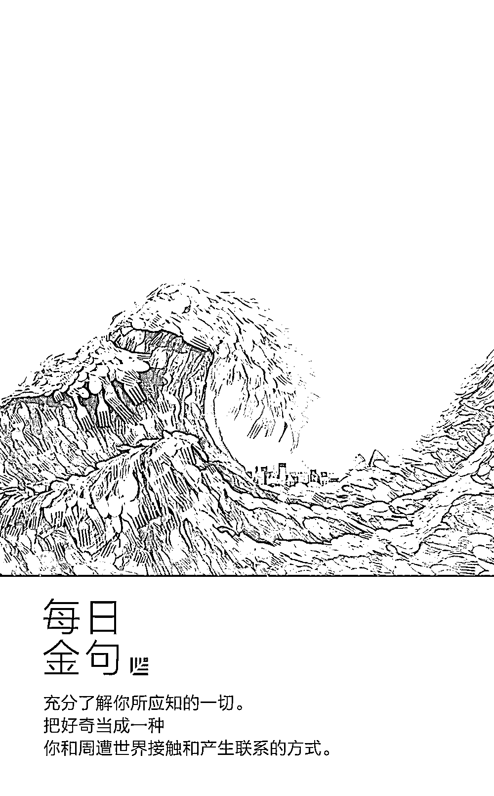
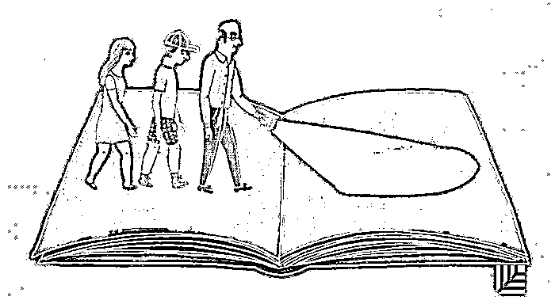
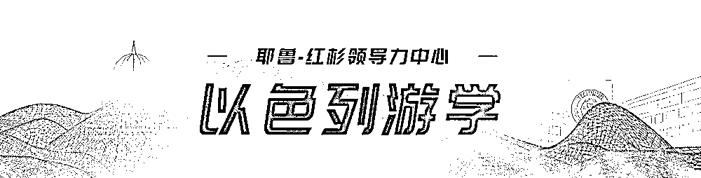
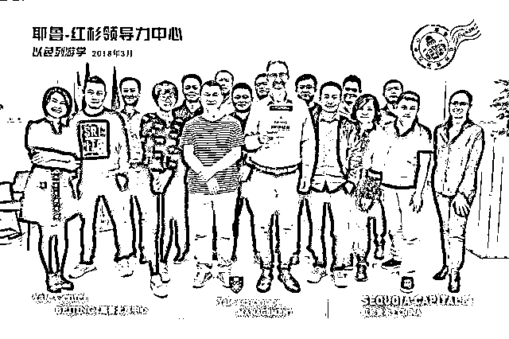
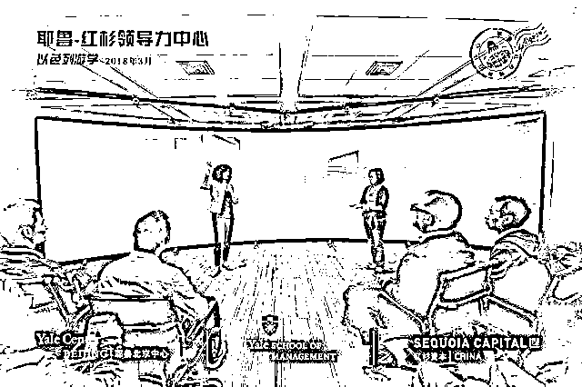
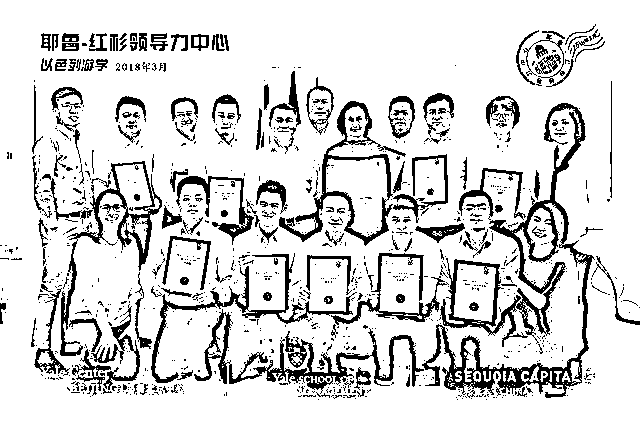

# 如何持续赢？制造爆款不如制造爆款的规程重要｜红杉汇内参

> 原文：[`mp.weixin.qq.com/s?__biz=MzAwODE5NDg3NQ==&mid=2651224598&idx=1&sn=c583e9b98e029acd0ccf4e81f7c9c137&chksm=80804442b7f7cd5464ebf56814f3015b1045ba5db70d36cd0d2c3958df6f6f6014d67ee7eb5c&scene=21#wechat_redirect`](http://mp.weixin.qq.com/s?__biz=MzAwODE5NDg3NQ==&mid=2651224598&idx=1&sn=c583e9b98e029acd0ccf4e81f7c9c137&chksm=80804442b7f7cd5464ebf56814f3015b1045ba5db70d36cd0d2c3958df6f6f6014d67ee7eb5c&scene=21#wechat_redirect)

[ 编者按 ] 推出一款流行产品很容易让创业者沾沾自喜，但仍有相当部分的产品或公司真的成了昙花一现的“现象级”。

创业之所以更考验长跑的耐力，是因为它需要持续赢。

本期内参主文的作者是美国一家创业公司的创始人，在过去一年内，他的团队花了 326 天将一个想法成功转变为一个产品，但这得益于在此之前，花了 10 年时间才建立的行之有效的产品发展策略，包括如何形成一个伟大的想法、如何更高效地工作、如何给用户提供最好的服务。

在詹姆斯・柯林斯的名作《基业长青》里，把伟大的 CEO 称之为“造钟师”，而不是“报时人”。造钟师的工作，是发明、调校正确的规程，有了它，下一个和下下一个爆款产品才会有源源不断诞生的可能。

每期监测和精编中文视野之外的全球高价值情报，为你提供先人一步洞察机会的新鲜资讯，为你提供升级思维方式的深度内容，是为 **[ 红杉汇内参 ]**。

** 内参**

如何做出拥有 320 万用户的产品

**以及下一个**

作者 / Aytekin Tank（JotForm 创始人）

编译 / 洪杉

去年，我们团队只花了 326 天的时间就将一个新想法变成了现实，但这得益于在此之前，我们花了整整 10 年时间才摸索制定出了一个聪明的产品开发策略——找到最佳方式来树立远大梦想，聪明灵活地工作，并为客户提供我们最好的产品。

在创业头五年，我们好似没头苍蝇般疲于奔命，向整个用户群推出不太完美的产品，经历了失败和痛苦。

在接下来的五年里，我们不断推出微小的产品改进。没有重磅产品推出。没有公关，没有好消息，没有兴奋感，也没有长期目标。结果，我们推出的产品看起来过时又杂乱，用户认为我们已经抛弃了他们。

最终，我们学会了如何制定宏观计划，同时依然继续提供微小的改进。我们发现了如何开发出色的产品。

为什么要花这么长的时间来制定方法呢？

过去，我们花了太多时间在客户支持、人力资源运行和泡咖啡上。

曾经有一度，我从早到晚都在回答问题咨询，我一个人扛下了所有的营销推广任务。看来我有严重的超级英雄情结。

最后，我聘请了一个专业的团队来分担工作量。随着我们公司继续发展壮大，我发掘了更多聪明的人才，并委之以要职。

我将自己从繁重的工作中解放了出来，专注于制定战略。当我们创立跨职能的产品团队时，我终于可以喘口气了。

现在我有时间和空间来思考大局了。

战

略

**制定指导全年的战略计划**

从收集客户反馈到老派的 SWOT 分析，有很多方法可以引发想法。

然而，最重要的两个问题应该是：

▨ 这个计划是否能够激励我——和我的团队？

▨ 这个项目是否有潜力改变大局并改善人们的生活？

组

织

**组建小型跨职能产品团队**

以设计为先的产品开发——我深信这种方法，并将之奉为信仰。

在我们公司，我把 100 名员工分成了 5-6 人一组的跨职能团队。

没有人会试图单枪匹马解决问题，因此每个项目都能汇集集体的想法、技能、背景和策略。

让每个人都能发挥关键性作用，他们可以一起开发出更好的解决方案。

挑

战

**开启黑客周**

我们喜欢开展黑客周活动。黑客周能拓宽我们的思维，并引导我们找到创造性的解决方案。

黑客周也可以成为找到创新型产品创意的绝佳方法，尤其是当您的客户不知道他们下一步想要什么，或是对您没有具体要求之时。

说得更清楚一点，这些并不是艰难的冲刺之举，而是开放式的、沉浸式的。

我们欢迎奇思妙想，在黑客周结束之时我们会推出一个模型——无论它是多么怪异或未完成的。

黑客周允许您的团队另辟蹊径，遵循自己的直觉。之后，你可以通过真实的用户测试你的想法。

为了开发即将推出的一个产品，我们与三个产品小组一起开展了七个黑客周，得到了 21 个不同的模型。

虽然有趣的选择很多，但最好的方案总能脱颖而出。一向如此。

测

试

**悄然发展、持续发布**

虽然不能进行大规模的发布，但是要将你的新产品或版本展示给一个测试小组。

先从 1%的用户群开始，逐步扩展到 10%。

收集反馈，找出问题，并将新版本与之前的历代版本进行比较（如果你有的话）。

测试是必须包含在内的—— 这是精益求精的最佳方式。 

衡

量

**设置并监控成功的指标**

用户激活是我们的重要指标。它是我们密切关注的一个数值，也是我们如何衡量新产品或新版本是否成功的标准。

例如，如果有 100 个人成为注册用户，是否能让其中的 10 或 20 个成为活跃用户吗？

这也是测试组为何如此重要的原因。当我们发布一个新的变化或功能之时，最终激活的用户是多是少？

无论你的身份是创始人还是员工，都离自己的产品太近了，以至于会“身在此山中，云深不知处”。

除非你设定了明确的基准和关键指标，否则无法确定某个新的设计或升级是否成功。

测量这些数据，忽略旁人的议论，并相应地进行调整。

反

馈

**鼓励客户分享他们的想法**

持续的反馈是无价之宝。

我们做了很多可用性测试，经常看到人们与我们的产品互动，这可以打开你的眼界。

突然之间，你会看到能让软件变得更直观的微小转变，或者是没人考虑过的重大突破。

我们将在新产品上放置反馈按钮和“回到旧版本”的行为召唤按钮。

如果有人点击了该按钮，会打开一个文本框，询问用户为什么想要切换回去。他们的反馈会发起支持单，每天通过电子邮件进行跟踪。

这种小型互动通常会确切地告诉我们，是什么没有起到作用及其背后原因。

改

善

**精进和细化**

我们永远都不想推出不合格品。因为这对我们的用户以及为了实现该愿景而努力的团队来说是不公平的。

我们的目标是在推出产品的几个月而非几周之前开始消除问题。每天都会通过电子邮件追踪问题，开发人员则竞相比较谁能消除最多问题。

如果你能够及时对新发布的产品进行调整，人们就能看到该产品是如何解决他们的问题的，以及它比之前更迅速、更智能或者更精美的原因。

庆

祝

**让发布成为里程碑**

在发布之前制定一个详细的计划。

考虑哪里会出现差错（或不会出现差错），并决定如何做出应对。之后你就可以将突然燃起的报警火苗扑灭——不应该出现任何失控的火灾。

最后，享受你的发布日吧。享受将一个金点子变成一场大混乱再到一个闪亮成品这样一场心满意足的过程。记住令人头痛的挑战和大获成功的时刻。

现在举起酒杯敬一敬你的团队吧。你们齐心协力赢得了这一刻。

** 读数**

**70%**

MIT 一项发表在《科学》杂志上的研究发现，在 Twitter 上不实消息被转发的概率比真相高**70****%**，真消息扩散至 1500 人所需的时间平均是不实消息的**6****倍**。

** 情报**

#不要为了创业而盲目创业#

**从-1 到 0：如何为成功创业打下基础**

任何产品的成功都不是突然发生的。如果你想成为一个企业家，那就要有所准备：

▨ 不要轻易辞去当前工作。在朝九晚五的岗位上也能学到很多，你的当前工作经历会教会你如何有效地工作。

▨ 启动一两个副项目。提前测试自己的想法，这些实验会给你最终辞去工作所需的安全网。

▨ 分享你的成果。可以帮你在创办公司前就建立一个访问群体；帮你理清和优化想法；建立业绩记录。

▨ 向专家学习。还在全职工作时，我就阅读了所有能找到的关于建立成功公司的资料。

▨ 掌握新兴技术。

▨ 设计和可用性优先。

总之，追求真正让你兴奋的想法，相信你的本能，在一个安全低压的环境中经营自己的副项目，并在这个过程中学着成为企业家。

#他的一切成就都可以追溯到好奇心上#

**达・芬奇与创业精神的共通之处**

▨ 在不受已知区别的干扰下进行观察。对达・芬奇来说，科学和艺术是同样的事物，在观察各个领域时，他不会着力进行区分，由此才能在不同领域的交叉线上有所创造。

▨ 质疑平平无奇和显而易见的事物。达・芬奇几乎对任何事物着迷。如果深入探究那些从表面上看枯燥无味甚至显而易见的东西，那你也能发现它们其实是尚未被发掘的宝藏。

▨ 就像创造一个尚未完工的作品那样不断尝试。他创作的大部分作品最终都没有完工。意味着，即使某项工作已经完成，你还可以继续进行改进。

▨ 充分了解你所应知的一切。把好奇当成一种你和周遭世界接触和产生联系的方式。

📬 **您有一张来自以色列的**

**明信片**

▲ 点击图片查看大图

**以****色列游学** Day3｜追溯 2000 年犹太教的传承历史，深入探究教育、社会、文化的以色列创新基因，与索尔・辛格对谈“创业的国度”、与夏罗默・迈特尔对谈“创新的基石”……3 天密集的大脑碰撞和深度学习，祝贺学员们顺利“结业”！

**红杉汇**将每日与您分享学员们的学习感悟

为您呈送来自以色列的明信片

** 推荐阅读**

壹

[陆潇波：基因测序将怎样影响我们的生活？](http://mp.weixin.qq.com/s?__biz=MzAwODE5NDg3NQ==&mid=2651224584&idx=1&sn=f0ebb9a6eb182d48cc496dec9b23b688&chksm=8080445cb7f7cd4ade744687aaa782bdf04842a2c7b0d11d3aea3b0bd1ae7be2ba60ec5d0177&scene=21#wechat_redirect)

贰

[在大量分析对比后，我们来聊聊数字世界里 3 个最紧迫的工作问题](http://mp.weixin.qq.com/s?__biz=MzAwODE5NDg3NQ==&mid=2651224591&idx=1&sn=71e2dc37d5bd3d7a42eff51894c643a1&chksm=8080445bb7f7cd4de36867daf5ade75bbfd8e7d4641781cdfc14943d1619c6fc8a6ed7a5e516&scene=21#wechat_redirect)

叁

[被误解的知识、智力和智商：怎样让你的大脑更聪明](http://mp.weixin.qq.com/s?__biz=MzAwODE5NDg3NQ==&mid=2651224552&idx=1&sn=71d70aa3784377afee15247a37e7961f&chksm=808047bcb7f7ceaa690c9c739ad1e5981a8dfbb5c95f187253e2aa697cf73687966536d6c20b&scene=21#wechat_redirect)

肆

[从 9 位福布斯潜力女性，看商业领域的女性之美｜致「不同凡想」的女性](http://mp.weixin.qq.com/s?__biz=MzAwODE5NDg3NQ==&mid=2651224568&idx=1&sn=d4401812cc89b152c4289edce874c36c&chksm=808047acb7f7cebab49f8fa5009da57bedef253b81675aed9d43ec57a871848ac9c1b0e7ac69&scene=21#wechat_redirect)

伍

[带着好奇心去重新发现以色列：一份绝对专属的创新修炼游学课](http://mp.weixin.qq.com/s?__biz=MzAwODE5NDg3NQ==&mid=2651224580&idx=1&sn=03df83f051c09a585c8b9d53db46ff6c&chksm=80804450b7f7cd46604b0160024c3f2b378c9605e0ca7e753400249713850e29fa3adc4fc8bf&scene=21#wechat_redirect)

