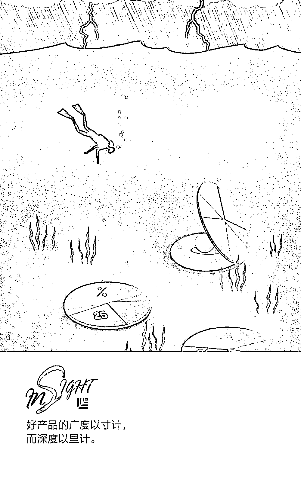
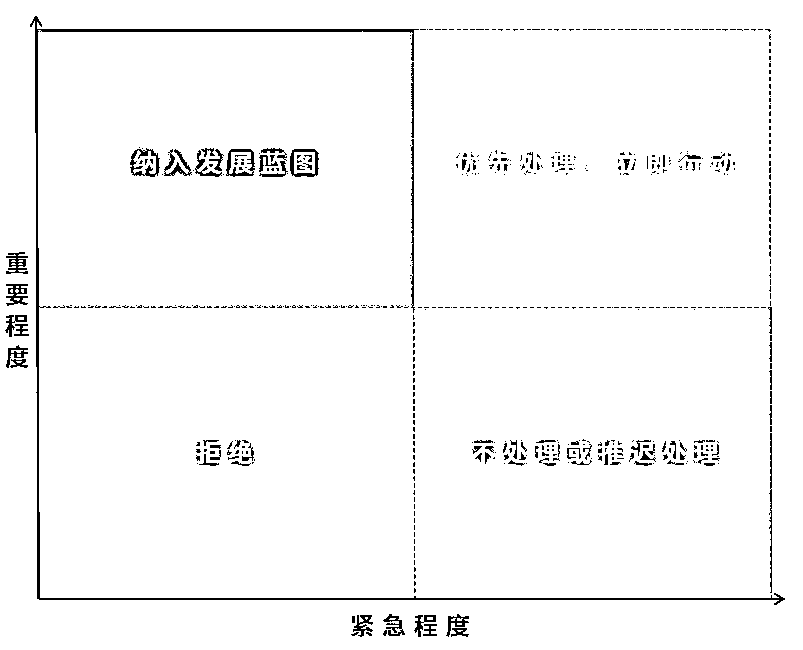
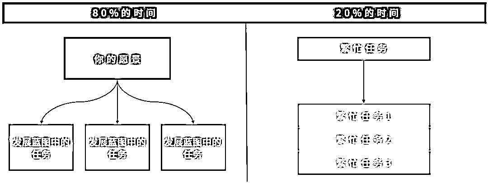

# 真正优秀的产品经理不会告诉你的 5 个秘密｜红杉汇内参

> 原文：[`mp.weixin.qq.com/s?__biz=MzAwODE5NDg3NQ==&mid=2651225152&idx=1&sn=47bd4cb3ff2b88613d384ad69cf06d19&chksm=80804214b7f7cb02f2f4559c713ab954af7c6171d0320ff83dce1fbb138072527778ede1d3ba&scene=21#wechat_redirect`](http://mp.weixin.qq.com/s?__biz=MzAwODE5NDg3NQ==&mid=2651225152&idx=1&sn=47bd4cb3ff2b88613d384ad69cf06d19&chksm=80804214b7f7cb02f2f4559c713ab954af7c6171d0320ff83dce1fbb138072527778ede1d3ba&scene=21#wechat_redirect)

[ 编者按 ] 如果一个产品能够经得住时间的考验，那么其产品决策一定建立在最优的长期结果之上。

产品经理的目标就是确保选择了最优结果。但在执行中，做出这样的决策很难。因为，短期利润会让我们专注那些不符合长期愿景的决策；当用户感到不便时，就会希望问题立刻得到解决。如果所有的任务都升级为了重要任务，那么事事也就都不重要了。

要想构建可靠的产品，摇头的次数可能要多过点头的次数。做决策向来是件困难事，但你可以通过“放长线，钓大鱼”来降低难度。毕竟，短痛换长利。

每期监测和精编中文视野之外的全球高价值情报，为你提供先人一步洞察机会的新鲜资讯，为你提供升级思维方式的深度内容，是为 **[ 红杉汇内参 ]**。

** 内参**

**真正优秀的产品经理**

**不会告诉你的 5 个秘密**

作者 / Joe Van Os

编译 / 洪杉

产品组每天面临的决策错综复杂，产品经理的目标就是确保选择了最优结果。如果一个产品能够经得住时间的考验，那么其产品决策一定是建立在最优的长期结果之上的。这似乎显而易见，但不幸的是，对于我们来说，大脑常常会怂恿我们在做决策时追求“及时行乐”。

人们厌恶不适，常常会选择阻力最小的道路。但在复杂的决策中，及时行乐通常等同于目光短浅，它只是把痛苦进行了延迟。做产品决策时，选取眼前的康庄大道可能会牺牲产品的长期寿命。

下面我们来谈一谈如何认识到大脑正在驱使我们做出短视决策，以及如何专注于长期目标。

**区分紧急任务与重要任务**

在做出最优长期决策的过程中，区分紧急任务和重要任务举足轻重。重要任务能够使你的产品不断进步，朝着终极目标走去。而紧急任务所能带来的长期利益微不足道，它常常披着重要任务的外衣，赫然出现。

紧急任务常常出现在错误报告中。用户感到不便时，就会希望问题立刻得到解决。有时，这些问题确实需要加以重视，但多数时候，小问题之所以成了大问题，只是因为当时情况下，用户把目光集中在了这一个问题上。很多时候，这些错误完全是捕风捉影，用户只是想要不同的功能而已。冒出来的火不能一概而论，次次都扑。

**重要任务鲜为燃眉之急，燃眉之急鲜为重要任务。**

—— 艾森豪威尔 美国总统

用户在电话一头怏怏不乐，很容易让人服软，同意升级他们的请求。问题在于，一项任务升级后便会被视为重要任务。如果所有的任务都升级为了重要任务，那么事事也就都不重要了。如果一个产品经理能够意识到一项任务紧急但不重要，他就可以推迟提出解决方案或直接拒绝该项请求。

把自己看作团队时间的守护者，令开发团队专注于那些有助于实现长期目标的重要任务。拒绝不容易，因为它会带来不适，但它能够保证在最短的时间内实现长期目标。而向紧急任务点头只会拖累你的长期目标。

艾森豪威尔矩阵能够帮助我们分清任务的优先主次：

紧急任务成了拦路虎时，你可以把它和你的长期愿景和目标进行比较，以此来确定其重要程度。把多数时间投入到重要任务上，而在一周中划出一小段时间来集中处理紧急任务。

**评估决策的真正成本**

作为产品经理，了解一个请求的真实成本至关重要。一些成本为显性成本——当下的功能开发成本和时间成本，以及后续的支持维护成本。

还有一些隐性的机会成本。开发时间有限，所以不同功能的构建时间此消彼长。选择构建功能 A 会延迟功能 B 的构建。

假设功能 A 重要但不紧急，功能 B 紧急但不重要。但由于某个因素，功能 B 的构建可能会成为紧急任务，使得功能 B 看起来至关重要。

在功能 B 上花时间能够消除你的短期压力，但长远来看则会造成一定的后果：

▨ 某项重要功能的发布将被推迟

▨ 你需要承担这项重要功能推迟发布所带来的后果

▨ 这一切都将给你的工作增加复杂性，造成不必要的额外成本

为了控制成本，一个产品无法满足每一个功能需求。所以，鲜有重要决策会显得十万火急。因为这些决策通常需要经过深思熟虑，确保恰当的功能范围。

**产品深度大于产品广度**

专注于核心策略能够增加产品实力，进而提高竞争者效仿的难度，增加产品对当前用户的价值，帮助潜在用户了解企业。

好产品的广度以寸计，而深度以里计。缺乏深度的产品在解决办法上存在缺陷，重要功能缺失，因此，其用户体验通常较为糟糕。几个设置精良的功能要好过多个复杂的功能。建立稳固的核心功能后，或许你才需要考虑添加其它的功能。

一些成就可能看似不值一提，没有什么实际意义，但事实常常恰恰相反：它们会迅速失控。每当我们追求短期成就时，这个错误都会带来后续麻烦：用户会有更多的后续要求，开发时间也会随之延长。最后的结果要么是解决方案惨不忍睹，要么是由于恰当的解决方案需要充足的时间，计划失控。

**专注核心问题，保持主观能动性**

用户能够很快就找出问题。他们在提出问题的同时，通常还会附上自己的建议解决方案。如果 10 个用户都提出了相似问题，那么几乎可以确定的是，他们也会给出 10 个不同的建议解决方案。

多数用户的处事作风不同，他们的处理方式未必是最优选项。专注核心问题能够让团队构建出用户真正需要的解决方案，而非他们自以为需要的方案。

找出一个能够满足多数用户需求的解决方案并加以实施。史蒂夫·乔布斯有句名言：“多数时候，在你揭晓答案以前，人们并不了解自己的真实需求。”即便一个完美的问题解决方案并没有与用户最开始的要求契合，但体验过后，他们还是很有可能会感到心满意足。

一个体现了主观能动性的问题解决方案能够减少解决问题所需的时间，控制产品复杂程度的增加。

**发展不朽蓝图**

有些人认为发展蓝图正走向消亡，但发展蓝图永存，因为它直观地展现了你的长期目标。而你需要找到自己的长期目标，以此来确定当前任务的重要程度。或许，真正走向消亡的是制定发展蓝图的能力。

只有重要任务才应被列入发展蓝图。发展蓝图上的某些任务令人手忙脚乱时，问题也就随之而来。紧急但不重要的任务不应该出现在发展蓝图上，你应该把它们划在单独的区域，对它们进行优先处理。

发展蓝图中任务的增减事关重大，因此做出变更时应考虑销售、开发等各个产品团队的意见。如果团队所增加的任务难以实现，或任务在不断增减，这就说明任务评估过程不够严格。很可能那些令人手忙脚乱的任务已经悄然在发展蓝图上占据一席之地。

一个常见误解是，产品经理应该单枪匹马，确定所有的发展战略或产品策略。实际上，产品经理的任务是确保最优的产品决策。而实现这一点的唯一途径就是了解决策对各个商业环节的影响。不要让自大妨碍你做出正确选择。

遵循以下简单规则能使发展蓝图成为帮助团队专注重要任务的利器。一些工作能够帮助你朝着发展蓝图上的任务不断前进，而一些工作则令人手忙脚乱，难以规避，把 80%的时间花在前者，20%的时间花在后者。注意把重要任务和繁忙任务区分开来，因为倒向繁忙任务可能就会造成重要任务的完成时间延迟。

** 预测**

**“钴”****时代**

回顾半导体产业上一波的材料革新，是 15～20 年前的 0.13 微米关键制程，IBM 率先以“铜”取代“铝”，在半导体史上书写了划时代的一页。20 年后的今天，属于**“钴”**的时代在半导体产业正式登场，美国应用材料公司、英特尔等纷纷计划在制程技术上导入“钴”作为新的导体材料，将从 7/10 纳米起步，使得芯片的体积可以更小，效能更强。“钴”，将引领未来 10 年的信息产业时代。

** 情报**

#论经理人的重要性#

**向冰岛队学学公司管理的秘密**

在本届世界杯上，冰岛队再次给球迷留下了无比深刻的印象；2 年前，他们在欧锦赛中击败英国队已经让人十分惊艳。经验丰富的经理人对提升冰岛队的战斗力至关重要，这和管理公司异曲同工：

▨ 好的经理人向球队灌输能力。无论是足球场还是职场，目标都是一致的：建立携手共进的团队，同时认可队员的个人优势。

▨ 好的经理人带来技术转移。这类似于业务经理从高业绩公司向欠发达市场的子公司调动以提升业务操作，或者寻求接受海外顶尖商学院教育的国际学生激增。

▨ 好的经理人会运用国际经验。足球经理人和当地文化间的分离性越大，起到的影响越小。文化差异也会阻碍企业成功，但是国际经验可以克服这个问题。

#确认过眼神，这就是未来#

**2020 年，创业者必备的 4 种能力**

▨ 新媒体素养——通过有效利用新媒体形式来批判性地评估和开发内容的能力。

▨ 跨文化能力——在不同的文化背景中运作的能力正变得越来越全球化。

▨ 设计思维——能够阐述或开发出能够创造期望结果的任务和工作流程。

▨ 虚拟协作——作为虚拟团队的成员推动参与和证明存在的同时有效率地工作的能力，是一种日益流行的业务处理方式。

** 推荐阅读**

壹

[超过 2000 亿规模的红杉重仓天使投资，它想要找到什么样的创始人？](http://mp.weixin.qq.com/s?__biz=MzAwODE5NDg3NQ==&mid=2651225142&idx=1&sn=83cceab8d14910beeb4a5a64f84ee1f0&chksm=80804262b7f7cb744e1161fd0cee210240f9844e5e618d07b6c999db30357dc9b5cffb839151&scene=21#wechat_redirect)

贰

[求助：领导非要在工作时间让我看世界杯怎么办？](http://mp.weixin.qq.com/s?__biz=MzAwODE5NDg3NQ==&mid=2651225143&idx=1&sn=e24399065f6a487fae7b8f821f0fe552&chksm=80804263b7f7cb7584b1cd664f72551400a1612025e58c080b6305d0400b8f8269365b9b7827&scene=21#wechat_redirect)

叁

[调查过全球 4300 多名领袖，我们找到了正确应对数字化的方法](http://mp.weixin.qq.com/s?__biz=MzAwODE5NDg3NQ==&mid=2651225109&idx=1&sn=3ad980aff3ede0d6488f64730bedb432&chksm=80804241b7f7cb57715d0126ce9c1702b90a77827e4eec3012f7c2d39512bbcd3dfbe617bebf&scene=21#wechat_redirect)

肆

[CBD 的「社交浅滩」之上，是一场谁都输不起的尬聊](https://mp.weixin.qq.com/s?__biz=MzI2NDk5NzA0Mw==&mid=2247513597&idx=1&sn=e52ba2fbd2efa814553e6e582e4b34b2&chksm=eaa6e421ddd16d370c8ac37263011e7060d24b21fbc7e7ff7d7fe92b09949285bc637a3b0809&scene=21#wechat_redirect)

伍

[红杉中国单列专项种子基金，全面发力天使投资](http://mp.weixin.qq.com/s?__biz=MzAwODE5NDg3NQ==&mid=2651225130&idx=1&sn=04e41ed94adafe62d4b14ebf72a674a0&chksm=8080427eb7f7cb68419a7ce2b1bc0ae5421d4590b65ab58eef88795909d2b597f6ee249cc372&scene=21#wechat_redirect)

