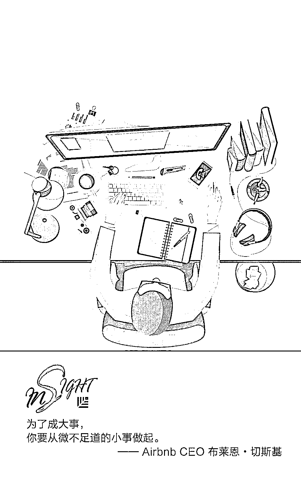
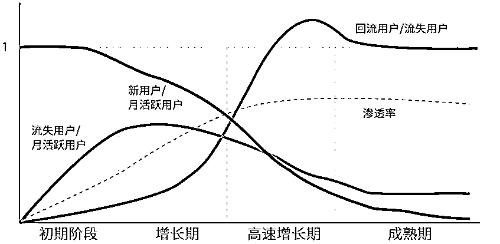
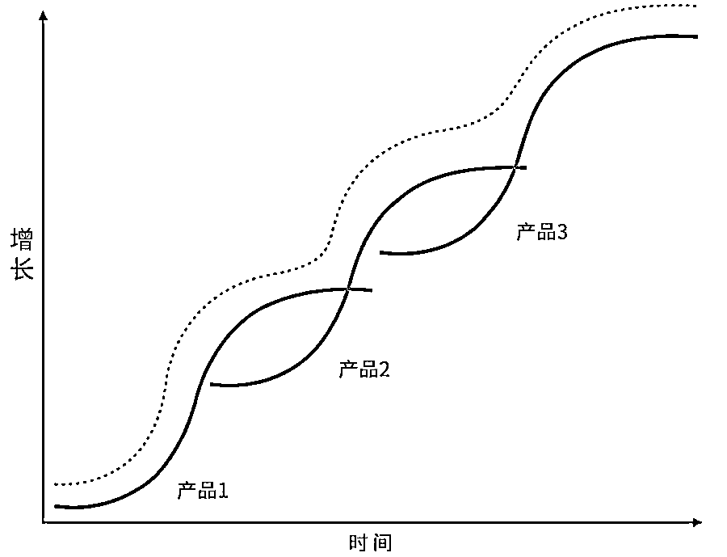
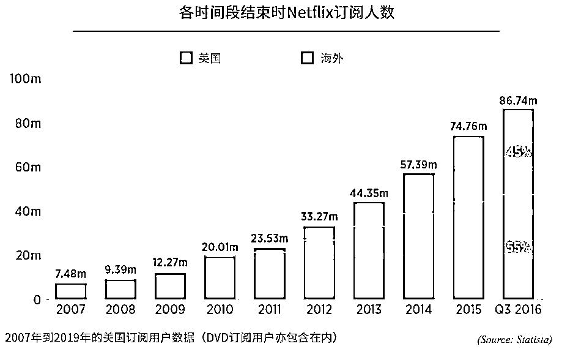
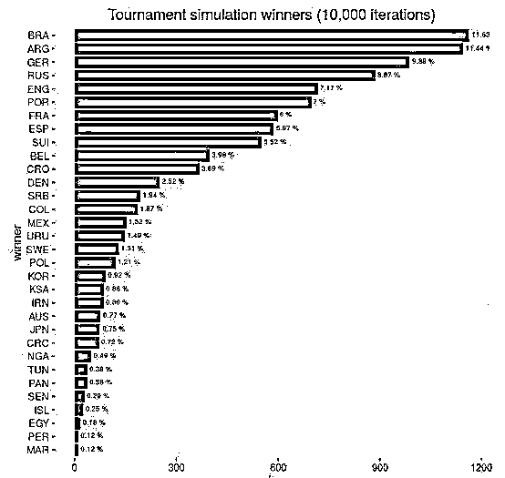

# 优秀产品都要经历的 S 型生命周期｜红杉汇内参

> 原文：[`mp.weixin.qq.com/s?__biz=MzAwODE5NDg3NQ==&mid=2651225074&idx=1&sn=10210e43e096388a7fd630bd4bed460e&chksm=808045a6b7f7ccb0f8a5eceada6fcecc47557fde9e964842b2696e0bd515f5bc5b467ca4e1a9&scene=21#wechat_redirect`](http://mp.weixin.qq.com/s?__biz=MzAwODE5NDg3NQ==&mid=2651225074&idx=1&sn=10210e43e096388a7fd630bd4bed460e&chksm=808045a6b7f7ccb0f8a5eceada6fcecc47557fde9e964842b2696e0bd515f5bc5b467ca4e1a9&scene=21#wechat_redirect)

[ 编者按 ] 市面上最优秀的产品，如 Facebook、Instagram、WhatsApp、亚马逊、Netflix 等都有一个共同点：经历过高速增长时期。在此阶段，它们的新用户不断增加，月活跃用户数大幅度增长，同时实现了产品-市场匹配和规模化扩张。

但如果只看到这点，你会产生错误的期待。因为，产品会随着时间演变，优秀产品的生命周期好比一条 S 形曲线：首先是增长缓慢的初期阶段，随后从缓慢到快速地爬坡，接着才是高速增长期。在达到最高点后，增长逐渐停止，进入成熟期。正确理解了产品的生命周期，才能用心为你的客户服务，并逐渐赢得他们的信任。

每期监测和精编中文视野之外的全球高价值情报，为你提供先人一步洞察机会的新鲜资讯，为你提供升级思维方式的深度内容，是为 **[ 红杉汇内参 ]**。

** 内参**

**优秀产品**

都要经历的 S 型生命周期

来源 / Sequoia@Medium

编译 / 洪杉

产品会随着时间演变，产品初期的特性与成熟后的特性迥然不同。

优秀产品的生命周期好比一条 S 形曲线：首先是初期阶段，产品的市场渗透率增长比较缓慢。随后，渗透率将进入一个从缓慢到快速的爬坡过程，也就是增长期。接着便是渗透率呈指数级增长的高速增长期。在达到最高点后，增长逐渐停止，标志着产品成熟期的来临。

接下来，我们将描述每个阶段的动态演变，以便大家为自己的产品设定期望值。注意：消费品企业经历这些阶段的速度要远远快于企业服务公司。比如，谷歌搜索只用了短短几年便有了很大规模，而谷歌推出的域名注册应用服务则要晚好几年才成熟。

**初期阶段**

一个新产品刚投入市场的时候，很难知道用户是否会像预期的那样使用它。企业的初始目标是要让目标群体——你认为会热爱这个产品的几千名用户——接受这个产品。有少数真正热爱产品的用户，要好过一大群对产品只是有好感的用户。产品投入市场约 1 个月后，许多追求新奇的人会尝试购买该产品，其中一些会接受这款产品并成为早期用户，而另外一些人会放弃这款产品。

在这一阶段，可获得的数据非常少，就算你手上有一些数据，很可能也不可靠，或者不能说明产品未来的长期发展趋势。所有月活跃用户都是新用户，不存在流失用户或回流用户。（注：单位时间内的活跃用户总数即留存用户、回流用户、新用户三者之和）

这种情况在第 2 个月就会改变。虽然仍然没有回流用户，但是你将看到初始用户中开始出现流失的情况。第 3 个月的时候，新用户数、流失用户数和回流用户数渐趋平衡。回流用户仍然很少，新用户占比仍然最多，但流失用户开始显著增多。用户月环比净增长率完全等同于下述速动比率：

初期阶段，流失用户数远超回流用户数，新用户是月活跃用户的主力。慢慢的留存率曲线趋于平稳，显示出该产品的流失用户和回流用户渐趋持平。对于较差的产品来说，这个曲线不会趋于平稳，最终会走向零点。与之相反，优秀产品的曲线会有上升的过程，最后趋于平稳。

优秀产品在 **初期阶段 **的特征

▨ 与有着相似渗透率的产品相比，优秀产品的用户留存率高。

▨ 用户群体非常喜爱产品，极高的留存率可以充分反映。

▨ 新用户构成最大一部分的活跃用户。

**增长期**

在初期阶段末，可能会有数万人接受并开始定期使用这个产品。然而，这并不一定意味着这个产品与市场匹配。重要的是要去思考下一批大量采纳产品的用户是谁，应该要做出什么改变以迎合这些用户的需求。

在初期阶段，产品在目标市场的渗透率低，发展缓慢。在增长期，增长加快（新用户群规模扩大），产品开始与市场匹配。这时，你会看到令人欣慰的情况：用户逐渐发现产品价值，并开始对产品回粉。

随着活跃留存用户数量的增长，新用户在月活跃用户数量中比例减少。产品的市场渗透率开始缓慢而稳固地增长。在旧用户群体中，留存率稳定，流失用户数和回流用户数持平；在新用户群体中，流失用户数持续远超回流用户数。因为旧用户数占到了总用户数较大的比例，所以总回流用户数相对流失用户数来说是呈增长态势（尽管回流用户数仍然较少），并开始成为月活跃用户数量的主力部分。在此阶段，留存用户是总积极用户最主要的部分。

优秀产品在 **增长期 **的特征

▨ 旧用户的留存率曲线趋平，或有小幅上升。

▨ 总用户数中，新用户数逐渐减少。

▨ 总流失用户数仍高于回流用户数，但主要是新用户群体所导致的。

▨ 各种参与度指标表现更为强劲。

**高速增长期**

市面上最优秀的产品，如 Facebook、Instagram、WhatsApp、亚马逊、Netflix、优步和印象笔记，都有一个共同点：它们都曾经历过高速增长时期。在该阶段，同一时间范围内，新增用户群单月内的留存率相对于老用户群有所提高，从而提高了回流用户和流用户的比率。这往往要么说明了产品对总的目标市场已达到某一水平的渗透率，要么说明产品已经获得了很高的知名度。并且，之前的用户群在该阶段的回流用户也会增加，流失用户则会减少。无论是新用户还是老用户，都认为产品具有价值。

在本阶段，随着回流用户超过流失用户，且新用户不断增加，MAU（月活跃用户数）大幅度增长。这或许是企业可能达到的最快年增长率，同时实现了产品-市场匹配和规模化扩张。

优秀产品在 **高速增长期 **的特征

▨ 老用户群的留存曲线呈上升趋势。

▨ 回流用户大于流失用户。

▨ 参与度指标表现强劲。

**成熟期**

经历过成功的高速增长期，产品就进入了成熟期，在本阶段，产品对目标市场实现了高渗透率，没有剩下多少可以增加的用户了。产品不再增长，无论是新用户群还是老用户群内，回流用户和流失用户都实现了平衡，且每个用户群内留存用户的总和相当于总的活跃用户数。同时，总留存用户数还构成了总活跃用户数的绝大部分，回流用户和流失用户只占活跃用户的一小部分。

优秀产品在 **成熟期 **的特征

▨ 回流用户和流失用户达到平衡。

▨ 新用户数量相对于留存用户数而言极小。

▨ 各项参与度指标保持在高水平。

**增加产品线**

抵达成熟期后，产品如若要获得进一步增长，就必须增加产品线，扩大总目标市场。可以开拓新市场，也可以发布新产品。

问问自己：产品的下一个百万计的用户群在哪里？哪些产品还未进入的国家可以从该产品受益？增加哪些新功能可以使得产品对于这些市场更有价值？为了获得这些市场，你可能要重新思考实现产品-市场匹配的方法。

新产品或是新市场环境下的增长依旧遵循 S 曲线：最初增长缓慢，随后开始加速，进入高速增长期后达到饱和。通过增加产品种类，各个产品的增长曲线互相叠加，从而保证了整体的持续增长。

以 Netflix 为例，该公司 2007 年在美国推出了流媒体产品，2010 进入高速增长期。在此阶段，企业高层已经在为海外扩张做准备，2010 年末该平台正式在其他国家上线。当几年后其产品在美国达到成熟期，其国际业务已成为了新增订阅用户的主要来源（呈现为重叠的 S 曲线）。大多数企业都应该向 Netflix 学习，在主要产品尚处在增长期的时候主动思考如何创造新产品和发掘相近的垂直市场。推迟后续行动或是放弃行动都会阻碍增长。

**有意义的指标**

注意：以上分析的前提是我们选择了有意义的指标和时间段，两者都是能正确理解增长的关键，大大影响你如何看待新用户、流失用户和回流用户这三个决定增长的因素之间的平衡。

例如，可以想象这样两种极端：如果追踪每分钟活跃用户量，则相应的流失用户和回流用户数量都会相当庞大，留存用户量也会相当可观，但新用户数量则会很少。另一方面，如果追踪年活跃用户量，流失和回流用户量将只占到活跃用户的很少一部分。而相反地，留存用户和新用户会占绝大部分。

** 预测**

**巴西夺冠**

微软的 AI 和数据科学专家 Sorin Peste 运用机器学习算法，公布了今年世界杯的预测结果：**五星巴西队将再次夺冠**。他使用了历年世界杯结果以及欧洲杯、奥运会等大型比赛的数据和各队胜率分布。下图展示了该模型迭代 1000 次后的结果，巴西获胜，阿根廷第二。这和其它人使用机器学习预测的结果一致。

** 情报**

#成大事，要先做小事#

**Airbnb 创始人告诉你：如何将个人体验普及化？**

Airbnb 成立之初，CEO 布莱恩会挨家挨户地拜访 Airbnb 上的房主，了解他们的看法。这听起来效率低下，却是成功的基础。

▨ 积极重视用户。因为产品规划路线图就在你的目标用户的脑海里。

▨ 设计一个 11 星级的体验。尽管这不可能实现，但在思考过程中，你可以找到让用户舒服的点。

▨ 开发一种技术将体验扩展到每个人。如果你已经知道如何打动人，想办法落实到产品设计中。

▨ 利用好小体量时的时光。客户越多，阻力就越多，系统越大，就会越归于传统。

#找好队友再出发#

**创业团队不可或缺的班子成员**

▨ 融资者。企业的第一规则就是维持运营，缺乏资金是许多好的企业倒闭的原因。

▨ 领导者。他们为组织奠定基调，决定参与进来的团队成员名单，设法让所有人达成共识。

▨ 销售员。有能力的销售员可以为公司产生 50%的现成销售线索，降低 33%执行成本。

▨ 全能选手。可以担任广告文字撰稿人、社交媒体协调员、平面设计、电视录像制作人、编辑、会计，或者兼具数项专门技能从而驱动收入。

▨ 顾问委员会。这些个体对你的运营几乎不用负责，对你也没有法律责任或义务。但他们知道经营一家企业面临的最危险的陷阱是什么，可以指引你避开。

** 推荐阅读**

壹

[新消费浪潮下，想抢红利必须知道这五大趋势](http://mp.weixin.qq.com/s?__biz=MzAwODE5NDg3NQ==&mid=2651225061&idx=1&sn=059a769941a88cc292560de46624b9cc&chksm=808045b1b7f7cca7069ef8e8c2ebd7f3a245b5e02f54530d69cfb1e6ceed39d0097cdb44068d&scene=21#wechat_redirect)

贰

[硅谷最牛 PPT，Netflix 靠它建立自由和责任并存的企业文化](http://mp.weixin.qq.com/s?__biz=MzAwODE5NDg3NQ==&mid=2651225066&idx=1&sn=eb5f44f602db7a03ba2a328dea73cd8b&chksm=808045beb7f7cca8db92d29c9877a1521c74381549f9af1ae4092de44c592b66658142d8f4f9&scene=21#wechat_redirect)

叁

[未来职场：人机搭配，干活不累](http://mp.weixin.qq.com/s?__biz=MzAwODE5NDg3NQ==&mid=2651225037&idx=1&sn=5fc291cc625e166b5e8ed0e0ed9d11c7&chksm=80804599b7f7cc8f4df89c13e21bce9ceb1487662195e6d78fd360b971f0db6f843331a345e3&scene=21#wechat_redirect)

肆

[2018，即将引领医疗行业深刻变革的五大力量](http://mp.weixin.qq.com/s?__biz=MzAwODE5NDg3NQ==&mid=2651225041&idx=1&sn=b7cbc361b32d102f7ce1e632d954aab7&chksm=80804585b7f7cc93e17744517dc1fe42df1c411cabab18e182c9417f5963b17e07e3d29014ab&scene=21#wechat_redirect)

伍

[很忌讳决策失误？一时冲动？错失良机？诺贝尔经济学奖得主给你解决方案](http://mp.weixin.qq.com/s?__biz=MzAwODE5NDg3NQ==&mid=2651225048&idx=1&sn=943ee74ac8ac605549e8287653e88995&chksm=8080458cb7f7cc9a21d74d44912b464934a038295f03c5fb9e25fd40c1371aa7f1a551cb87ab&scene=21#wechat_redirect)

