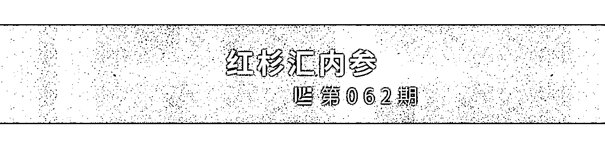
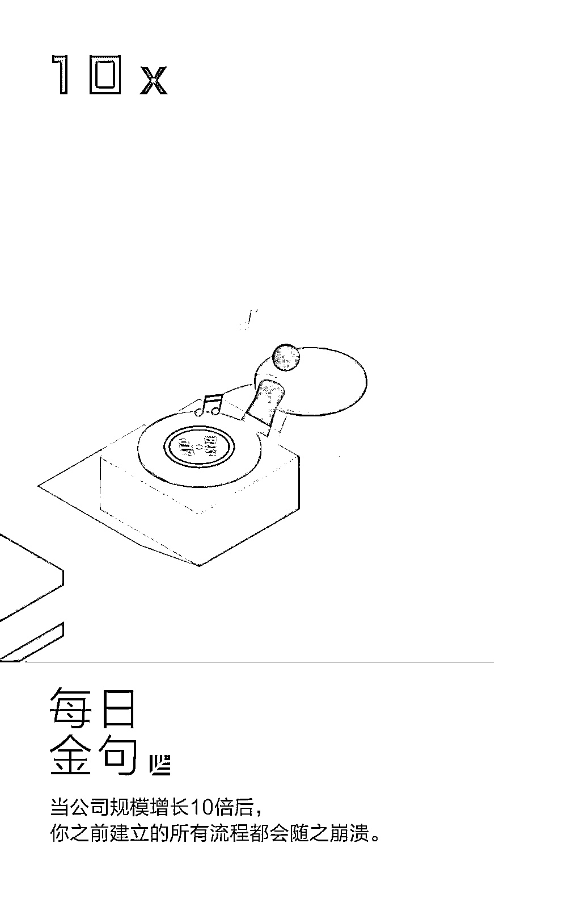
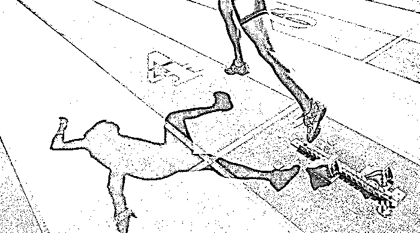
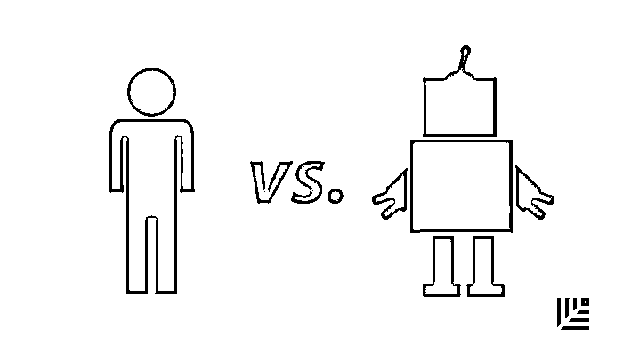

# 这个产品「有毒」！如何设计出令人上瘾的产品？｜红杉汇内参

> 原文：[`mp.weixin.qq.com/s?__biz=MzAwODE5NDg3NQ==&mid=2651224329&idx=1&sn=756334958a221ee78b1af3f056adf49a&chksm=8080475db7f7ce4b3d9fcfce5d3c5dc8282a2b3bb49e2b1ae3a2d4bcd856ff06de6026c255b3&scene=21#wechat_redirect`](http://mp.weixin.qq.com/s?__biz=MzAwODE5NDg3NQ==&mid=2651224329&idx=1&sn=756334958a221ee78b1af3f056adf49a&chksm=8080475db7f7ce4b3d9fcfce5d3c5dc8282a2b3bb49e2b1ae3a2d4bcd856ff06de6026c255b3&scene=21#wechat_redirect)

[ 编者按 ] 好的产品经理和创业者，一定得是心理大师。

游戏、社交甚至是让人买买买的电商，能够让人上瘾的秘密，一定是洞悉了用户的两个心理动机需求：不断探索寻求新鲜的欲望，和获得情感回报奖励。就像微信的“跳一跳”游戏，不经意间，居然达到了 1 个亿的日活。

理解激励的基本系统原理，是创造能让用户得到丰富而满足的人生的产品/服务的关键。今天的内参主文简述了一个可被称为“内在激励”和“寻求系统”现象的形成历史，并从电视到 Facebook 来举例说明，企业是如何制造出让人上瘾的产品的。甚至于，对企业管理者来说，也需要用新动机科学的方式思考，如何改变对员工的激励方式。

每期监测和精编中文视野之外的全球高价值情报，为你提供先人一步洞察机会的新鲜资讯，为你提供升级思维方式的深度内容，是为 **[ 红杉汇内参 ]**。

** 内参**

**这个产品「有毒」**

——如何设计出令人上瘾的产品？

作者 / Jeff Davidson

编译 / 洪杉

在绝大多数人眼里，“设计”就是让某个东西更实用、操作更直观、更舒适，最终更加合乎用户心意。但如果现实与设想是南辕北辙的差别呢？如果打开幸福大门的钥匙其实是制造困难呢？我们在什么时候应该让产品变得简单，而在另一些时候让它变得复杂？这些都是每一个产品设计师和企业家应该自问的问题，因为只有透彻了解用户的心理动机，才能创造出满足需求的、让生活丰富多彩的产品和服务。

这篇文章可以看做是为认识论上的转变而写的——这个转变我觉得早就该发生了。以下七个部分将简述一个被称为“内在激励”和/或“寻求系统”的现象的形成历史，我将举出从电视到 Facebook 的一些例子来说明，企业是如何制造出让人上瘾的产品的，它们既冲击了寻找系统，又冲击了社会情感强化系统，从而使它们成为只需投入最低限度的创意就能大火的产品。

**过去式：“内驱力降低理论”**

要理解令人上瘾的产品是由什么组成的，我们必须首先了解激励的科学、旧的范式以及彻底打破旧范式的理论发现。

早在 20 世纪中期，主流理论认为人类的激励主要是出于生理目的。如口渴、饥饿和性是主要的驱动力，而金钱和物质财富等追求则是通过条件作用习得的。根据罗伯特・赫尔和肯尼斯・斯宾塞等科学家的说法，大多数行为都被解释为想要减少先天冲动的欲望表现。在当时，它与弗洛伊德和马斯洛的“需求层次理论”虽然不同但概念上相似，都解释了人类的需要和激励，无论我们意识与否，食物和性始终处于这些欲望的最前沿。

此外，内驱力减弱理论学家们还认为，食物和性（这些是外部刺激）是生物的“初级”驱动力，可以通过赐予食物和性来调节生物的行为。简而言之，这就是一种强化机制。直到 20 世纪中叶，一位科学家的发现才彻底改变了我们对激励、调节作用以及人生价值的认识。

**偶然发现：恒河猴实验**

这一发现最初似乎是偶然的，当时美国科学家哈里・哈洛正在研究恒河猴的问题解决能力，这是他常选的实验对象。他注意到，在进行实验之前和之后，他的实验对象会继续玩机械拼图——即使没有典型的奖励（即食物）。从本质上讲，猴子是为了学习而学习的。这违背了传统的观点，即正面的强化肯定会正面地塑造行为，以达到预期的结果。

令人震惊的是，**当哈洛试图加强“玩”（或探索）这种行为而加入一种正面的奖励时，它对行为有一个熄灭的作用。**更简单的说，当猴子被鼓励或奖励去玩耍时，它们会因为某种原因失去兴趣，停止玩耍。

这种违反主观直觉的观察结果最终被证实，这与科学家们对“根本激励”的看法背道而驰，人们通常把根本激励看作是为某些生理目的服务的。哈洛创造了“内在激励”一词来描述这种探索性行为，而它是研究人类参与模式的关键。

**现在式：内在激励**

2000 年，心理学家爱德华・德西与理查德・瑞恩发表了一篇名为《自决理论与内在激励、社会发展和健康幸福三者的促进作用》的论文，其中明确了内在激励的定义：

内在激励指的是生物自发的“寻求新事物与挑战，拓展和实践自身能力，不断探索和学习”的倾向。

锻炼、游戏、旅行、阅读甚至看电视，都能成为寻求系统里不同付出强度的行为。在这个系统里，其中一极可以是去爬珠穆朗玛峰，另一极则可以是刷 Netflix 追剧。神经学家扎克・潘克赛普认为，这种探索性行为受生物内在寻求系统所驱动。

但要重申一下，这种寻求的背后存在一种矛盾，那就是它并没有提供什么实用的价值——它没有填补心理需求上的空缺，但我们还是会做这些事。我们是从内心满足感出发，自己创造了它们的价值。同样令人着迷的是，我们现在已经了解到，各种生物**即使在缺乏食物、水或住所等“基本”需求时，它们的行为都还是会受内在激励的控制。**你是不是也看到过，那些生活困苦甚至无家可归的人也在读书？你会觉得他们是在为面试做准备？不，他们是在寻求。

**要为寻求系统而设计产品**

企业都知道，人的天性就是追求新潮事物，从没变过。这就是人们如此痴迷互联网的原因——它让人们能够动动手指就瞬间开始运用自己的寻求系统，探索无限可能。旅行则是人们实践的另一种方式。但寻求系统并非人类特有——所有动物都有。

电视就是我们在家实践寻求系统的一个活生生的例子，尤其是随着遥控器的出现，人们可以一直沉浸在寻求状态里。现在，我们又有了像 Netflix 等工具，可以通过搜索各种关键词来无限地刷屏、追剧。人们甚至从浏览图片和对尚未观看的内容做预判中就能获得愉悦感。

期待和想象是有价值的，而这些价值则是我们内心赋予的。人们从看到新事物里获得的满足感似乎因为更具动态的“社交”内容而大幅增加。社交媒体平台能持续地给予你信息流，并让你能够与发布者进行互动。这就是 Facebook、Instagram 等工具让人欲罢不能的原因，也把我们引向了令人上瘾的产品设计里的第二种构成成分——发挥强化作用的社交情感。

**发挥强化作用的社交情感**

**社交情感是非常有力的行为强化剂，它不像外部的奖励，实际上它能强化人的“寻求”行为。**这里的情感指的是社交里的各种暗示——微笑、皱眉以及各种人类用以表达感受的姿态（这些都是无意识的交流工具）。绝大多数人都体验过，当别人热情地向他人介绍你时的那种良好感觉，或是当你真的做错事，别人的怒气都写在脸上时感觉有多糟。我敢肯定这种肢体语言对你接下来的行为有很大的影响。社交媒体就是抓住了这种现象，使用户可以通过点赞、分享、转发、评论来展现出他们的认同。

社交媒体里的情感强化有一个很重要的特征，那就是展现你的认同远比展现不认同要容易得多（有“赞”，但极少见过有“踩”）。这就意味着，**在社交媒体的反馈生态系统里，通常都是奖励多于惩罚**，而那些不招人待见的行为所受到的负面影响则可谓微不足道。所有这些都增强了社交平台想要实现的强化效应。他们想要你继续创造内容，因为这种商业模式太美好了，用户做了所有的活，而你只需要设立发现和奖励机制（就可以坐享吃鸡）。有了社交媒体，用户就不断追求当有人给他们点赞时那种多巴胺的刺激，而这些赞就会强化他们的表达行为，使用户参与进入“恶性循环”。

**让激励更有效：可变的、间续的奖励**

如果你在一群钓鱼者中，每次把鱼线抛出去都能钓到一些东西，那钓鱼会变得有趣吗？对这个问题极其复杂的回答是：不会。当强化机制里出现了随机性，我们就会碰到这种奇怪的现象——尽管出现了“断流”问题，我们反而会更有可能重复这种行为。博彩业对这一点简直了如指掌，这也是为什么人们那么沉迷于 21 点的原因。想象一下，如果你每次下注，都会收到一笔金额很小但都相同的金额，你会觉得好玩吗？不会。即使可能你会获得更多奖励（例如赢得头奖），你最终也会感到厌倦，意识到无论怎样你都可以回来持续获得这些奖金，那时你就会去做别的事了。

奖励的变化，甚至是缺乏奖励，都会强化我们的行为，这就是另一个违背我们直觉的与调节作用相关的现象。Facebook、Instagram 等社交平台就是抓住了这一点，控制你每天在这些平台上的赞数、浏览量和推送量。人们审美的主观性以及算法也会不可避免地导致行为强化存在差异，这种强化让用户生成的表达性内容流就像是一种燃料，可以持续不断地让系统维持运作。

**自然选择的寻求者**

所以，人类为什么要寻求？如果我们常常是为了做一件事而做这件事，常常还没有回报，也没有具体的理性的目标，那做这件事的意义是什么？这种行为为什么会植根于我们的 DNA？

从进化论的角度来说，“寻求”行为一定是有益于生物生存的。人类的工具制造能力已经把这种寻求行为推向了令人敬叹的极限，我们学会了畅游大海、翱翔天际，今天还能跳到太阳系之外。

人类总是在寻求、学习、探索和操控中获得最多的幸福感，这种操控包括在生存环境里的自我操控，也有对生存环境的操控。**如果你想创造出一款用户参与度高并且能让用户上瘾的产品，那就要满足他们寻求系统和情感奖励系统的需求——即基于用户发布的内容，使他们可以去探索、表达自我和收到正面的社交信息。**当然，如果你的企业本来就是以实用性产品为目标的话，我就不会建议你让用户有机会去体验寻求（这个世界已经不缺令人上瘾的产品了）。让用户有所选择，鼓励他们“浏览”，而不是热情地向他们种草。方法可谓是比比皆是。

**结论**

如果你剥夺了人们去寻求的能力，或者当他失去了精神上的人类特质，变得压抑。“寻求”让人类生活有了意义，更重要的是，让我们的工作和贡献也有了意义。这种对激励全新而合理的科学认知，应该彻底改变企业奖赏员工的方式，以及看待自身产品或服务的方式。你有没有注意过，当你想要强迫一个小孩去玩一个玩具时，他/她反而会没有兴趣，转头去玩那个玩具盒了？

** 情报**

#怎样从第一次赢到持续赢#

**创业公司在业务扩大规模后必须知道的四个警示**

▨ **长征刚刚开始。**许多初创企业之所以倒闭，是因为它们没有撑到最初的增长拐点。然而，真正困难的阶段其实是以企业的第一个发展高峰为起点的。当公司规模增长 10 倍后，你之前建立的所有流程都会随之崩溃，并成为了其他同业追赶和打击的目标，你不再是无名小卒。

▨ **有好事发生时，不要让心态受影响。**让首次成功成为一个起点而非终点。为了应对未来挑战，对任何人来说，提前学习都是一个非常重要的一课。

▨ **不要让发展势头中断。**如果你有办法让最初的发展势头持续下去，那么让企业达到第二个增长拐点就会容易许多。

▨ **与商业伙伴一起迎接更多挑战。**避免个人决策对公司产生负面影响的唯一方法就是制定一个清晰的决策流程，让每个成员分别对企业运营的不同环节承担起责任。

#人际互动和判断力，机器难以替代#

**CEO 是“专为人类而设的”工作吗？**

当人工智能越来越有可能替代人类的很多工作，看起来有些工作仍然是“专为人类而设”的，比如同时需要人际互动和判断力的任务，所以，CEO 在这类工作方面位居榜首。他要招聘、指导和监督他人；他要与客户、监管者、工人和其他各方进行直接谈判等。

那么，CEO 应该如何思考人工智能对员工的影响呢？可以从以下四个步骤开始：

▨ 确保你了解什么是人工智能，以及怎样在组织中使用它。

▨ 深入了解你的公司和所在行业正在发生什么事——不仅是人们从事的岗位，还有他们实际的工作任务。人们常常徒有头衔，却不了解这项工作的真正要求。

▨ 确定技术可以从哪些方面辅助到你的员工。人工智能可以更好地完成哪些日常工作？员工在哪些领域可以完全独立地工作，而不需要使用广泛的判断力？

▨ 帮助员工向新的工作方式过渡。重新培训重要员工，让他们在组织中扮演新的角色。********************

** 推荐阅读**

壹

[红杉 FM｜郭山汕：零售物流发展背后的三重推动力](http://mp.weixin.qq.com/s?__biz=MzAwODE5NDg3NQ==&mid=2651224315&idx=1&sn=1480e864924de599e92ff4b2e2b53fdd&chksm=808046afb7f7cfb9cdab587878cc24f9049b3d1c693e72b398cf651543e6a78c65fa909b8112&scene=21#wechat_redirect)

贰

[红杉新年又有企业上市了，这次是 A 股快运第一股德邦物流](http://mp.weixin.qq.com/s?__biz=MzAwODE5NDg3NQ==&mid=2651224323&idx=1&sn=85bba773d76dee9ccdf367d32979faf1&chksm=80804757b7f7ce417cd035342b4538fc4b8e7da1584cdb0616697c3513a54cddd1e572df98e9&scene=21#wechat_redirect)

叁

[以最有冲击力的智慧浓缩出的创业「摩西十诫」](http://mp.weixin.qq.com/s?__biz=MzAwODE5NDg3NQ==&mid=2651224302&idx=1&sn=a805c14090163d78e4a9c95fc4e6a7ff&chksm=808046bab7f7cfac6316ce009626fa9736f2f582cedeeae5227521233badcd7860c824b56606&scene=21#wechat_redirect)

肆

[第四范式戴文渊：在企业决策中，AI 比人类更有优势](http://mp.weixin.qq.com/s?__biz=MzAwODE5NDg3NQ==&mid=2651224306&idx=1&sn=36211f4b66caa404b93e31235b2f9498&chksm=808046a6b7f7cfb0e9e986ac909fb5fd45192349fa695bf7a443f1a2110ccbe237f20baa8cee&scene=21#wechat_redirect)

伍

[《刷新》：没有野心的人做不了 CEO？](http://mp.weixin.qq.com/s?__biz=MzAwODE5NDg3NQ==&mid=2651224307&idx=1&sn=f0df52089e5533f18a55d071895d5ce4&chksm=808046a7b7f7cfb165a9bf0a5437769f4fd10268504272c0b0370db216b0a470b98da7ac0c37&scene=21#wechat_redirect)

