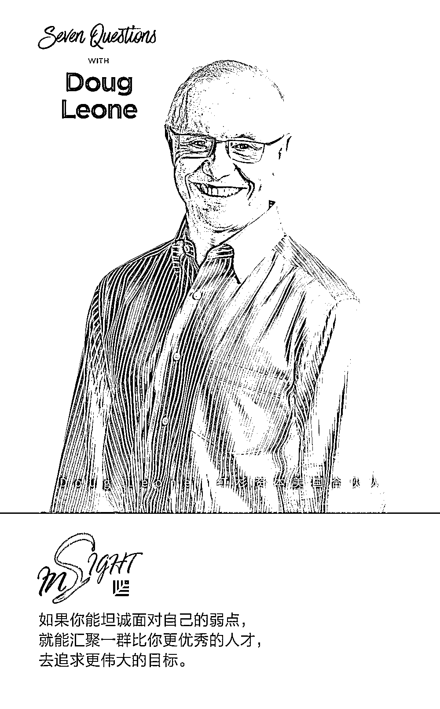
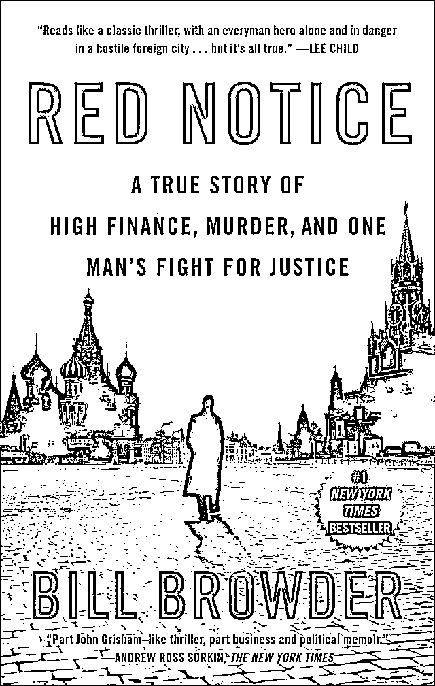
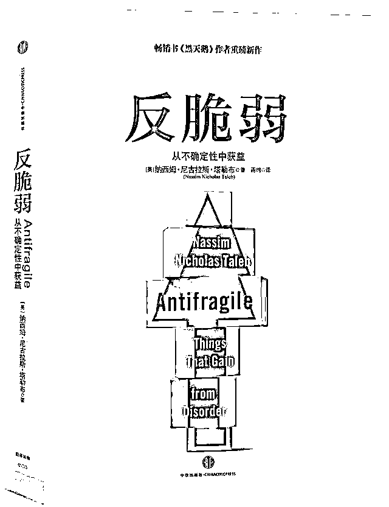

# 红杉资本 Doug Leone：别做房间里最聪明的人｜红杉七问之谈

> 原文：[`mp.weixin.qq.com/s?__biz=MzAwODE5NDg3NQ==&mid=2651225235&idx=1&sn=f4c30e3690311b7b634763371e6a65c1&chksm=808042c7b7f7cbd1c5281f0a213a13b248f223ab7147605bb150b5e94576cc38ba362b77e6fc&scene=21#wechat_redirect`](http://mp.weixin.qq.com/s?__biz=MzAwODE5NDg3NQ==&mid=2651225235&idx=1&sn=f4c30e3690311b7b634763371e6a65c1&chksm=808042c7b7f7cbd1c5281f0a213a13b248f223ab7147605bb150b5e94576cc38ba362b77e6fc&scene=21#wechat_redirect)

红杉资本的“七问之谈”（Seven Questions WITH）通过 7 个简单的问题，探寻创业路上的成功密码。被访者均为红杉资本合伙人及成员企业创始人、CEO，在他们的奋斗道路上，收获了哪些经验？最重要的改变是什么？对创业者有哪些建议？关于创业的诸多问题，你或能在这里找到自己的答案。

本期嘉宾是红杉资本美国合伙人 Doug Leone，他将与我们分享以下问题：

▨ 哪些重要的经验已成为您日常遵循的原则？

▨ 您会给即将创业的人一条什么样的建议？

▨ 哪些小的改变对您产生了深刻的影响？

▨ 哪些东西是您不具备却希望能够拥有的？

▨ 睡前您会看什么书？

▨ 在什么时候您会意识到自己出错了？

▨ 哪个时间跨度最重要，为什么？

**哪些重要的经验已成为您日常遵循的原则？**

**Doug Leone**：诚实坦率地审视自身。万事皆从内心开始：内在的平和，对成功的渴望，自律和条理性。但要看清自己是谁却不容易，这需要莫大的勇气。我清楚自己的不足，明白自己能做到什么、不能做到什么。如果你能坦诚面对自己的弱点，就能汇聚一群比你更优秀的人才，去追求更伟大的目标。

这样的追求应该源自于我的童年。我出生于意大利，因为是独生子，家人十分溺爱。但在 1968 年，我们家搬到了美国，这可以说是一场巨变的开始，所有事情我都得重新学起，包括新的语言和习惯。一个从小被娇惯的小男孩就这么被扔到了一个满是尖刺的环境中，每时每刻、方方面面都饱受打击和轻视。这个小男孩从 10 到 15 岁经受了现实的磨练。这样的经历会让人内心柔软敏感，而外在却有一种锋芒毕现的锐气。我有一颗争强好胜的心，但同时我也明白自己的局限。

**您会给即将创业的人一条什么样的建议？**

**Doug Leone**：创业的动机要正确：以制造影响力，渴望改变世界，或者希望自己的产品能够被数百万人使用为目标，而非为了金钱以及满足自己的虚荣心。你成立一家公司，是因为你看到了缺口的存在，你可能会为此辗转反侧、夜不能寐，直至你采取行动为止。企业创始人要证明自己的想法，为了这个目标，他们会永不言弃。没有人会把成功送到你面前。我每天都会告诫自己的孩子说，这个世界是不公平的，我不希望他们认为世界欠了他们什么。最后，不管你的想法有多么精彩绝伦，你都得行动起来将其变为现实。

**哪些小的改变对您产生了深刻的影响？**

**Doug Leone**：我慢慢意识到聆听是关键。我现在还是个很糟糕的聆听者，但比起以前已经好多了，随之而来的改变可以归结为一个词，那就是：成熟。成功并没有使我懈怠，而是给我带来了平静。我现在能够以更加平和的态度与世界相处、与自己相处。

另外，保持强健的体魄也很重要。早上 4:30 我就会起床去锻炼。这是为了让自己的身心都保持在最健康的状态，以应对接下来一天将会遇到的挑战。

**哪些东西是您不具备却希望能够拥有的？**

**Doug Leone**：我希望自己能拥有更具创造性的基因。我属于线性思维型的人，在提出问题的瞬间，我的大脑就自动构建起思维的树形结构。从中我可以看到各种根和枝节，但却看不到跳出常规的亮点，缺乏发散性。

这就是为什么我会常常逼着自己做些不擅长的事，去锻炼大脑的各个部位。比如说，我会坐在钢琴前面瞎弹。我也喜欢跟与我不同的人相处，专心地听着他们的各种想法，这有助于开阔我的思维。

**睡前您会看什么书？**

**Doug Leone**：不久前我才看完 Bill Browder 的《Red Notice》。我偶尔也喜欢读些间谍小说，我发现在读完后的一个月里，整个世界都变得不一样了，因为我学会了像间谍般思考。纳西姆・尼古拉斯・塔勒布所著的《反脆弱》也是一部非凡杰作。我隐隐有所感悟却无法诉诸言语的许多东西，这本书都清楚地进行了说明，具有深刻的启发和教育意义。

** **

**Red Notice**

A True Story of High Finance, Murder, and One Man's Fight for Justice

Bill Browder **/ 著**

Simon & Schuster 2015

** **

**反脆弱**

从不确定性中获益

纳西姆・尼古拉斯・塔勒布 **/ 著**

中信出版集团 2014

**在什么时候您会意识到自己出错了？**

**Doug Leone**：无时无刻。我大概打破犯错的世界纪录了吧。不过这没什么大不了的，虽然犯了错误，但我能从中进行学习。我经常会根据新的数据改变自己的想法。不是基于情绪，而是完全从数据出发。我常常在会议上发表自己的观点，但在听完一个年轻同事的反驳之后，我会说，“比起我自己的观点，我更喜欢你的观点。”这样的情况稀松平常。我从不认为自己需要证明“我是房间里最聪明的人”。你可以是个天才，然后常常作出正确的决断；你也可以允许自己犯错，然后在自己身边汇聚一群能人精英，组成一个强大的团队促使你不断前进。我相当肯定的一点是：胜利总落在团队手中。

**哪个时间跨度最重要，为什么？**

**Doug Leone**：我觉得是 12 个月。谁能保证每一秒钟都做到最好呢？我不可能在每一秒都做到最好，但我会尽量每天都做到最好。即便是这样，偶尔还是有一天或一周没法做到全心贯注，所以我会选择着眼于更广阔的图景。不能只关注每一秒或每一个小时，而是要从战略的高度出发。如果以一年为单位，你就能得出前进的总体方向，这当中包含了战略、计划和目标的元素，同时也关乎于执行，因为在一年中，你有足够的时间去犯错，去找到正确的道路。

**成     为     创     造     者**

**团队更受成功青睐**

**清楚自己的局限**

**聆听是关键**

—— Doug Leone  

红杉资本美国合伙人

** 推荐阅读**

壹

[爆款的诞生：健康的产品要满足哪些指标？](http://mp.weixin.qq.com/s?__biz=MzAwODE5NDg3NQ==&mid=2651225205&idx=1&sn=f1f4b328f5ff80db9953bbb86ab06837&chksm=80804221b7f7cb37a32599eae59767be28b65e6262e3b7fd6d6ec6b13d029eb075b2fbc4ddd0&scene=21#wechat_redirect)

贰

[留不住、招不到？可能是人才管理体系出了问题](http://mp.weixin.qq.com/s?__biz=MzAwODE5NDg3NQ==&mid=2651225209&idx=1&sn=e2efb78e284660702acf8d8e73c61ced&chksm=8080422db7f7cb3b11cd972b42e94767a9dfe49f16d7e3552ab1787c88585937ce8134191599&scene=21#wechat_redirect)

叁

[颠覆组织：让人人都成为“迷你 CEO”](http://mp.weixin.qq.com/s?__biz=MzAwODE5NDg3NQ==&mid=2651225214&idx=1&sn=9fa64294faa93b2251c2c88e92fe5c9f&chksm=8080422ab7f7cb3cfa25225616150bfadecd2afc7c7633010ddc618233429bde6dba21f7ebc0&scene=21#wechat_redirect)

肆

[出门问问李志飞：少谈算法，多想想 AI 商业落地](http://mp.weixin.qq.com/s?__biz=MzAwODE5NDg3NQ==&mid=2651225222&idx=1&sn=1f06ad40e9eb9fdbfde937ac82ee2441&chksm=808042d2b7f7cbc472b94ea8feb01753d0eca98642a1fae217eeba0267a325090db9291edd6b&scene=21#wechat_redirect)

伍

[专属修习 ▎从耶鲁走出来的人，都有哪些共同点？](http://mp.weixin.qq.com/s?__biz=MzAwODE5NDg3NQ==&mid=2651225230&idx=1&sn=03ac80df4dd654399e6679b934fbfb57&chksm=808042dab7f7cbcc6cba2e3779aa92742eb31347f94e6a6a8e3a207dacd290b27d3df60d2f5e&scene=21#wechat_redirect)

