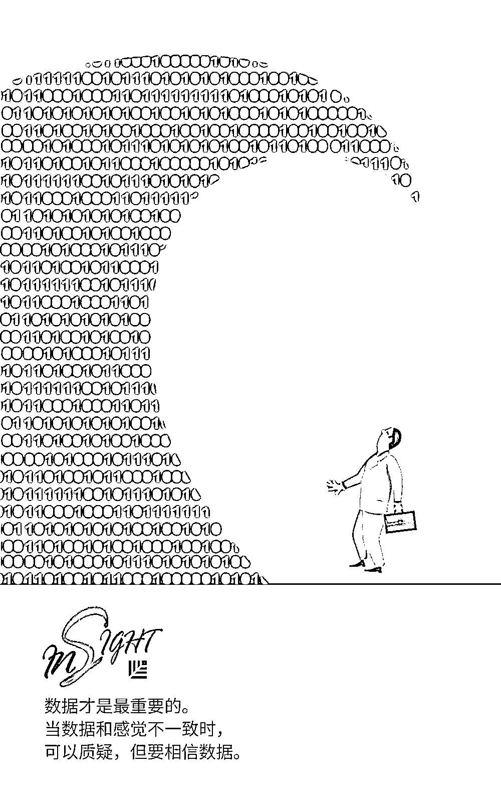
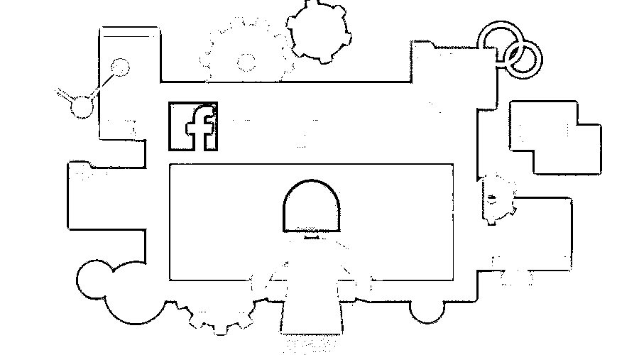

# 创业企业都应该学习的亚马逊 14 条领导力原则 | 红杉汇内参

> 原文：[`mp.weixin.qq.com/s?__biz=MzAwODE5NDg3NQ==&mid=2651225184&idx=1&sn=1911ebd5e4704cf4105b59bf273d1207&chksm=80804234b7f7cb22800ca9f3db8690c6f99554d5cea57e4a3a93ba0e691ca561920f83c23d0a&scene=21#wechat_redirect`](http://mp.weixin.qq.com/s?__biz=MzAwODE5NDg3NQ==&mid=2651225184&idx=1&sn=1911ebd5e4704cf4105b59bf273d1207&chksm=80804234b7f7cb22800ca9f3db8690c6f99554d5cea57e4a3a93ba0e691ca561920f83c23d0a&scene=21#wechat_redirect)

[ 编者按 ]对于大多数人来说，成为企业家并不是有意识的、故意的决定，不可能像点菜一样随口说“我想要当企业家”，你就能真的成为企业家。实际上，很多优秀的企业家走上创业道路的时候，并非有意选择，而是迫于无奈。

因为，一旦你真的变成了企业家，就必须确保自己不断向前推进，不断加速，一直做出正确决定，争取让自己和企业最终获得成功。你需要很多的指导，不只是朋友、家人和值得信赖的顾问的指导，还有你的团队所坚守的价值观或原则的指导。

亚马逊总结了 14 条领导力原则。初次读到这些原则，你可能会觉得奇怪，甚至费解，而当你真正运用了这些原则，它们会像军队一样服从你的命令，引导并帮助你理清思绪。

每期监测和精编中文视野之外的全球高价值情报，为你提供先人一步洞察机会的新鲜资讯，为你提供升级思维方式的深度内容，是为 **[ 红杉汇内参 ]**。

** 内参**

每个创业企业都应学习的

**亚马逊 14 条领导力原则**

作者 / Marc Hoag

编译 / 洪杉

如果是第一次读到这些原则，你可能会产生以下各种想法：哇，这么多原则；有些听起来很奇怪（比如“节俭”）；有些听起来很费解（“正确，很多”——这是什么鬼？！）；有些是重复的；这是在搞笑吧？……等等诸如此类的感受。 

Gartner 的技术成熟度曲线也“描述”了我接受亚马逊 14 条领导力原则的过程。我的心路历程大概可以总结为：从“哇这太棒了”到“这太奇葩了”再到“好的，说得很有道理，我要把它应用到职业生活的各个方面”。

这些原则就像《星球大战》中的“原力”概念。正如绝地武士欧比旺所说：“它是所有生物创造的一个能量场，包围并渗透着我们。有着凝聚整个星系的能量。”

***1.***

**顾客至上**

*Customer Obsession*

简而言之，客户永远是第一位的，不管发生什么。这一点超越了所有的职责要求。从客户的角度出发、为客户牺牲自己的利益，实际上是说，你要愿意承担损失以便让客户获利，哪怕是违背你自己的使用条款或者政策。如果你知道自己犯了错，要主动考虑退款，也就是说，要在客户要求之前作出补偿。

***2.***

**主人翁精神**

*Ownership*

主人翁精神意味着两件事：

（1）总是优先考虑长期目标而不是短期目标；

（2）始终代表团队和整个公司行事。一切都是“你的工作”。

***3.***

**创新与简化**

*Invent & simplify*

成功的关键是保持简单。为此，需要不断创新。

***4.***

**正确，很多**

*Are right, a lot*

这个原则应该被理解为“领导者要正确决策”。它说的不仅仅是不犯错误，而是要有全局观，在必要时能够并且愿意 180 度转变态度。史蒂夫·乔布斯正是因此而出名：今天他相信 XYZ，第二天他就会意识到自己完全错了，突然间他就完全支持 ABC 了。从这个角度来说，他做出了正确的决策。

***5.***

**学习并充满好奇心**

* Learn & be curious*

这项原则可以说是不言而喻。领导者必须时刻努力吸收更多的知识，进行自我提升。

***6.***

**雇佣人才，**

**更要实现人尽其才**

*Hire and develop the best*

这一点也是显而易见，但除了要确保提高雇佣标准外，更重要是，确定雇佣关系后，你要不断地培养员工，使他们发挥出最大潜力。

***7.***

**坚持高标准**

*Insist on the highest standards*

伟大的领导者总是在提高标准，创造最优质的产品和服务。

***8.***

**往大处着眼**

*Think Big*

这项原则并不是说脱离实际，好高骛远，往大处着眼的同时也要遵从第一条“顾客至上”的原则。

***9.***

**积极行动**

*Bias for action*

这项原则常常令人困惑不已。它的原理在于，由于多数错误并非不可挽回，所以冒险犯错也无可厚非。因此，伟大的领导者要积极行动：快速前进，而非被分析捆住了手脚，裹足不前。

***10.***

**节俭**

*Frugality*

这条普遍适用于所有创业公司创始人：不能毫无节制地花钱。基本上，就是用最少的钱干最多的事，在投入最小化的同时做到产出的最大化。

***11.***

**赢得信任**

*Earn trust*

这是一条双行道：不仅需要取得他人的信任，也需要使他人感受到被信任的感觉。

***12.***

**深入研究**

*Dive deep*

数据才是最重要的。当数据和感觉不一致时，可以质疑，但要相信数据。

***13.***

**节俭坚守核心，**

**处理好争议与承诺**

*Have backbone; *

*disagree & commit*

虽然排到第十三位，但这条原则至关重要。它是说：当两方存在争议时，这很平常，有人最后坚决反对，十分坚定地说“不”，也说清楚了个中缘由，在这样的情况下，你依然能同意去尝试不同的选择，并且给予全力支持。也就是说，即使你不同意，你也会给出自己的承诺去尝试。

***14.***

**达致成果**

*Deliver results*

永远不要轻易屈从或妥协于任何事情，直到最终获得最好的结果。并且，无论出现什么情况，总要找到方法克服一切困难。

以上就是亚马逊的 14 条领导力原则，尽管它们会部分限制你的行为，但如果你能真正理解和内化这 14 条领导力原则，并根据实际情况加以运用，你一定可以变得更坚定、更专注，更卓越。

** 预测**

**先罚球，赢点球**

世界杯进入淘汰赛阶段，点球大战也越来越多。有没有规律可循？《经济学人》杂志最近报道了伦敦经济学院的伊格纳西奥·帕拉西奥斯-韦尔塔的分析结果，在 1000 次点球大战中，先罚一方获胜的概率是**60%**。

对守门员而言，高球射门最难扑救，但也会出现 18％的高球射偏的情况。综合而言，高球射门的成功率为 79％，低球射门为**72％**。

** 情报**

#金融为本，科技为用#

**传统金融机构如何智能化？**

▨ 客户服务个性化。通过虚拟助理和实时对话等定制客户支持方案；通过使用商业智能和自动化软件，激活瞄准了细微问题的即时性故障排除流程。

▨ 优先考虑安全性和透明度。虽然安全是首要条件，但交易的透明度也是不可或缺的考量因素之一。金融机构需要向大众公开安全数据和相关信息，努力和客户建立相互信任关系。

▨ 全渠道综合策略。利用网络、聊天工具、电子邮件和电话等多种平台与客户交流，把客户乐于使用的多个平台无缝对接到一起，创造流畅的即时客户体验。

#领导公司扩张的艺术与科学#

**Facebook 首席运营官的三个宝贵心得**

用远见和灵活性保障快速扩张，同时也要了解制定和打破计划的必要性：

▨ 打造开放的交流文化。领导者必须接受员工说出真相，尤其是当他们知道自己有问题之时。

▨ 设立之前从未有过的岗位。在创业公司的早期阶段，你们需要愿意亲力亲为的多面手。之后，你们需要的是懂得如何任人唯贤的优秀管理人员。

▨ 寻求值得尊重的不同意见（并接受失败）。思虑周到的扩张领导者会在分歧中进取，因为这为他们提供了在制定和打破计划之前测试自我想法所需的信息。

** 推荐阅读**

壹

[真正优秀的产品经理不会告诉你的 5 个秘密](http://mp.weixin.qq.com/s?__biz=MzAwODE5NDg3NQ==&mid=2651225152&idx=1&sn=47bd4cb3ff2b88613d384ad69cf06d19&chksm=80804214b7f7cb02f2f4559c713ab954af7c6171d0320ff83dce1fbb138072527778ede1d3ba&scene=21#wechat_redirect)

贰

‍[调查过全球 4300 多名领袖，我们找到了正确应对数字化的方法](http://mp.weixin.qq.com/s?__biz=MzAwODE5NDg3NQ==&mid=2651225109&idx=1&sn=3ad980aff3ede0d6488f64730bedb432&chksm=80804241b7f7cb57715d0126ce9c1702b90a77827e4eec3012f7c2d39512bbcd3dfbe617bebf&scene=21#wechat_redirect)‍

叁

[对自身创造力的怀疑，是创新最大的阻碍](http://mp.weixin.qq.com/s?__biz=MzAwODE5NDg3NQ==&mid=2651225024&idx=1&sn=85415e8b11eb83f23fe0c24c80c7fd32&chksm=80804594b7f7cc829fdd675af65541745fbea836d615b2ee525751bc80ba82bcd9b09ec22182&scene=21#wechat_redirect)

肆

[苹果 CEO 库克：迈出第一步，哪怕你不知道会走向何方](http://mp.weixin.qq.com/s?__biz=MzAwODE5NDg3NQ==&mid=2651224991&idx=1&sn=8ae6cf1d5075fa13dd756409857357bb&chksm=808045cbb7f7ccdd84b66399ff88045751ee20335714f6a8d5109eac763ed3257819e4fce609&scene=21#wechat_redirect)

伍

[如何助力企业跑得快、走得稳？蔚来 HRVP 谈科技赋能人才管理](http://mp.weixin.qq.com/s?__biz=MzAwODE5NDg3NQ==&mid=2651224923&idx=1&sn=b1241497169259894d4276f2c86bce24&chksm=8080450fb7f7cc1951ade903d58a2783421bc659012799ae430b41f71605b0baf36997d5228d&scene=21#wechat_redirect)

