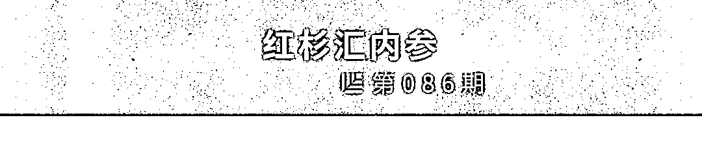
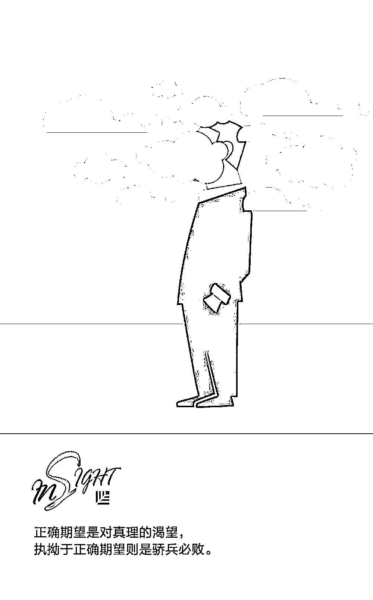
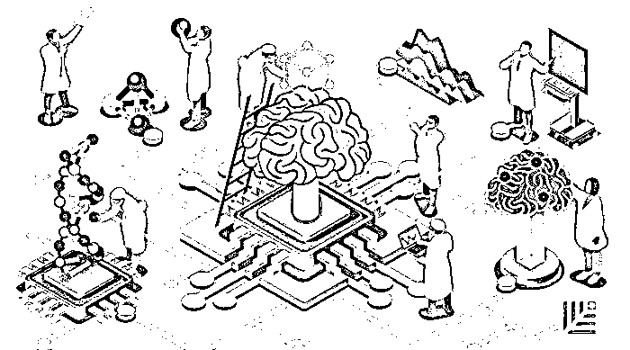
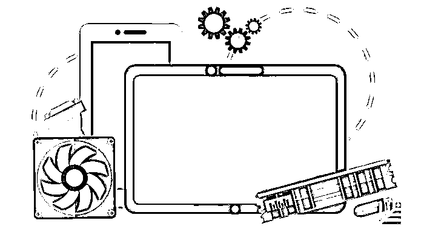

# 优秀领导者都要克服的五大偏见 | 红杉汇内参

> 原文：[`mp.weixin.qq.com/s?__biz=MzAwODE5NDg3NQ==&mid=2651225311&idx=1&sn=97edb88c689d72d3145a13b710742a00&chksm=8080428bb7f7cb9d73de17482d04d4f56139140cb1035fe29cce41d49e24fc873e6e49ecfdc2&scene=21#wechat_redirect`](http://mp.weixin.qq.com/s?__biz=MzAwODE5NDg3NQ==&mid=2651225311&idx=1&sn=97edb88c689d72d3145a13b710742a00&chksm=8080428bb7f7cb9d73de17482d04d4f56139140cb1035fe29cce41d49e24fc873e6e49ecfdc2&scene=21#wechat_redirect)

[ 编者按 ] 如果你把一个绝佳的主意给了一个平庸的团队，他们会把它搞砸；如果你把一个平庸的主意给了一个出色的团队，他们要么完善它，要么直接扔掉它并提出更好的主意。

对于创业企业来说，领导者的核心任务就是去发现和培养顶级的人才。但偏见，如固有思维、光环效应、认知偏差……往往会蒙蔽我们的双眼。如何认识和掌控偏见，快速找到适合企业发展的最佳人选？这是每一位领导者都要正视的问题。

每期监测和精编中文视野之外的全球高价值情报，为你提供先人一步洞察机会的新鲜资讯，为你提供升级思维方式的深度内容，是为 **[ 红杉汇内参 ]**。

** 内参**

**优秀领导者**

**都要克服的五大偏见** 

作者 / Jake Wilder

编译 / 洪杉

皮克斯创始人之一艾德文·卡特姆在描述“人才的确比想法更重要”时写道：

如果你把一个绝佳的主意给了一个平庸的团队，他们会把它搞砸；如果你把一个平庸的主意给了一个出色的团队，他们要么完善它，要么直接扔掉它并提出更好的主意。

——艾德文·卡特姆

领导者的核心职责之一就是寻找和培养顶尖人才，但很多人最终都不能得偿所愿。不是因为不够努力，而是因为他们没能认识到培养人才的关键。另外，他们错失了帮助人才成长的机会。

**无论我们是否能意识到**

**我们其实都心怀偏见**

诺贝尔奖获得者、心理学家丹尼尔·卡尼曼如此描述内心的偏见如何影响我们的信念并助长自我想法对我们的误导：“人们对自己观点的信心并不是衡量论据质量的标准，而是用来衡量我们大脑所构建的故事的连贯性。”

我们每个人都在不断寻求节省精力的方法。因此，我们形成了心理捷径，以便更轻松地处理新信息并做出艰难的决定。虽然这些心理捷径确实减少了认知负担，但也导致了糟糕的判断。

作为领导者，这些判断经常会影响我们评估和培养人才的方式，从而限制领导和组织工作的有效性。

**光环效应**

在一项经典研究中，美国社会心理学家所罗门·阿希描述了两个人的性格，并询问了参与者对这两个人性格的看法。

**艾伦：**

聪明–勤劳–冲动–挑剔–顽固–嫉妒

**本：**

嫉妒–顽固–挑剔–冲动–勤劳–聪明

如果你跟大多数人一样，那你看待艾伦的态度会比本积极正面得多。尽管两人列出了完全相同的特征，但列表中的初始特征改变了后来出现的特征的含义。一个聪明人的固执可能会被视为是合理的，也许还会引起别人的尊重，但一个嫉妒且顽固之人的智慧会使他更加危险。

当一个正面特征主导我们对某人的看法时，光环效应就会产生，从而导致我们原谅他的负面倾向并忽略其关键弱点。

在这些情况下，我们忽略了人们成长的机会，而且我们总是依据一组有限的特征选择候选人。

克服光环效应的重点在于找到其他观点来平衡自己的想法。个人观点可能有失偏颇，了解情况的同事们的一般观点往往更加准确。

**可得性偏见**

人们倾向于通过从记忆中检索问题的轻松程度来评估问题的相对重要性，而这在很大程度上取决于媒体报道的程度。

—— 丹尼尔·卡尼曼，《快思慢想》

可得性偏见使我们过度重视那些最近发生的经历，以及在我们的记忆中更容易被想起的经历。

我们往往会记住重大事件，而不是典型的日常活动。和相对久远的事情相比，最近发生的事情更容易从我们的记忆中检索出来。因此，当我们试图回忆起某一时期的事情时，我们的看法会被最先想到的那些生动的事情所左右。然后，我们会把这些回忆投射到整个时期。

最典型的事例之一是防范鲨鱼，如何“意外”拯救了潜在溺水者的生命。对圣地亚哥附近海域死亡事件的详细分析表明，当出现游泳者被鲨鱼所伤害事件后，溺水造成的死亡人数也会下降好几年。之所以产生这种效应，是因为鲨鱼袭击造成的死亡报道比溺水报道更令人记忆深刻。

同样，当领导者依据记忆评估个人时，他们会过度重视最印象深刻的事例。无论这些事例是包括重大事件还是仅仅是最近发生的事件，结果就是在较长的一段时期内，有一小部分行为不能被准确评估。

为了抵消这种偏见，领导者可以试着更加频繁地评估员工的表现，用月度或季度评估取代过时的年度绩效评估模式。然后，人们会获得更加频繁的反馈，也会有更多改进的机会。

此外，我们应该为人们的成功制定（并分享！）客观标准。一组特定的标准会消除记忆交互的主观性，并将评估重点放在实际结果上。

**确认偏见**

人类最擅长的就是解释所有新信息，以便使得他们先前的结论保持不变。

——沃伦·巴菲特

这样的事情经常发生：两个人面对同样的证据，但却对同一个主题持相反观点。这就是确认偏见。它反映了我们往往会选择性地接受那些能证实我们现有观念的信息，而拒绝与其相矛盾的信息。

确认偏见符合我们对一致性的渴望。尽管一致性与稳定性和合理性相关，我们通常还是会将前后不一与“犹豫不决和缺乏可靠性”联系起来。此外，我们总是在寻找潜在的捷径和节省精力的方法。正如罗伯特·西奥迪尼在《影响力》中所描述的：“一旦我们对一个问题下定决心，棘手的不一致性就会让我们产生一种非常吸引人的奢侈想法：我们真的不必再仔细思考这个问题了。”

在一个你的思想变成你的弱点的世界中，确认偏见成了重要的威胁。受其影响，保守的选民不承认之前的判断错误。而在人才发展方面，我们要么忽略一些负面品质，要么看不到努力奋斗的人想要进步。

要克服这种偏见，我们需要把正确期望和既定正确期望区分开。正确期望是对真理的渴望。执拗于正确期望则是骄兵必败，它使我们看不到自己的错误，从而阻碍我们获取知识。

我们需要积极找出可以冲击我们最初印象的证据。不断问自己“我需要看些什么来改变我的想法”？这可以改变我们看待潜在证据的方法。

我们还需要记住卡尔·萨根“谎言检测工具箱”的第五条原则——不要因为是你自己的假设就过度依恋它。

**叙事谬误**

我们都会给自己讲故事，以此来理解世界并获得愉悦。讲故事可以影响我们的行为。

类似地，我们倾向于通过讲一个故事来评价别人。我们会讲给我们自己、老板们和同事们听。我们考虑雇用或提拔某人的时候，会去找那些能帮我们讲最好故事的人，而不是最合适的人。

当公司的最佳人选的故事不是最激动人心的时候，问题就会出现。比如，下面这两个故事哪个听起来更激动人心？尽职尽责来上班并处理她所有的分内之事的人；不断扭转局势解决关键问题的人。

我们喜欢解决关键问题带来的刺激，因为这会是个更好的故事。但这会导致公司奖励那些在最后关头逞英雄的人——即使问题是由他本人造成的。然而，那些在问题出现之前就能解决问题的人大部分会被忽略。

公司奖励问题解决者而不是问题预防者的时候，只会鼓励员工把一些小问题放到之后再解决。

要避免这些谬误，我们需要提前明确成功的客观标准。先让员工根据自己对成功的预想和对表现的评价方式参与工作，当每个人的绩效与公司的任务要求相符时，我们就更容易确定，所鼓励的是最好的行为方式，从而也可以降低叙事谬误带来的主观性。

**乘法系统**

请快速计算：365×24×60×60×0＝？

希望你能在借助计算器之前得到答案。我们都学过，任何数字乘以零都等于零，也做好了关于这个问题的数学突击考试，但我们经常忽略乘法系统如何应用于领导力。

你的车有很多功能和安全性能，然而一个关键部件的毁坏就会破坏整体功能。如果爆胎，那么正常运作的变速器也无济于事；如果发动机过热，再好的悬架也不起作用。这些特性都会成为潜在的“零”使整个系统瘫痪。

所以，你的汽车是一个乘法系统而不是加法系统。汽车每个配置的功能所发挥的作用是按乘法计算的而不是按加法。

同样的道理也适用于商业中的人才发展。我们经常把人的品质和能力看作可以相加的因素，但事实上，我们大部分优点和缺点都是乘法性质的可变因素。

人的大部分技能都是相互依赖的，所以改变关键性弱点——例如社交、情商、销售、策划、执行和影响——通常比仅仅增强某种能力会带来更广泛的影响。

有太多领导者要么盲目追从强势领导信条，要么以最终走向平庸的全面技能为目标。他们应该花点时间去搞清楚哪些品质会有乘法效应。因为在今天的商业世界，真正的领导者会寻找可以带来 10 倍增长的机会。

** 预测**

**二氧化碳变汽油燃料？**

中国科学院大连化学物理研究所孙健在这篇论文中探索了二氧化碳在直接转化为汽油方面的工业潜力，二氧化碳可否变的有用，不再是祸害？

这是《Nature》杂志最近从 2017 年所刊登的论文中，推选出的最有可能改变世界的 250 多篇文章之一。《Nature》连续四年举办这一活动，旨在发掘那些应对现实挑战的科研解决方案，也鼓励更多科研人员去关注有关重大社会挑战的研究。

** 情报**

#人工智能重塑医疗产业#

**未来 10 年，AI 能为人类健康做什么？**

▨ 改善诊断流程。我们也许不再需要采集生物组织样本，医生可以通过 AI 提供的影像信息判断肿瘤性质。

▨ 引进大脑-计算机交互界面。当病人丧失表达、活动以及与环境互动的能力，人脑和计算机的直接交互可快速恢复患者的机能，实现有效交流。

▨ 减少看护成本。埃森哲预测，截至 2026 年，人工智能将每年为卫生保健机构节省 1500 亿美元的成本。

▨ 实现重复性工作的自动化。AI 将帮助卫生保健机构透过大量数据发现新的关系，精简流程，提高服务的速度和质量。

#六年来，出货量首现增长趋势#

**PC 的春天回来了吗？**

Gartner 数据发现，今年第二季度全球计算机出货量总计 6210 万台，比去年同期增长 1.4%，这是自 2012 年第一季度以来首次出现同比增长趋势。增长动力主要来源于企业客户。

▨ 新的计算能力要求使用新的计算机。过去几年，人工智能、商业智能、大数据以及大数据集已经成为企业标配，企业对硬件的需求正急剧增长。

▨ 各行各业都要求强大的计算能力。实现 AI 产业化以及人类知识在网络各个节点的应用，使得企业界和教育学术界对高端计算机的需求不断增长。

▨ 处理密集型应用的关注。AI 的兴起，特别是机器学习，引起了人们对处理密集型应用的关注，由此产生了对 CPU 密集型计算和 GPU 密集型计算的需求。

▨ AI 将与企业活动和软件深度融合。相比智能手机，计算机、云计算与云服务兴起的主要原因在于其适于聚合、存储、人工智能/机器学习模型运行以及分析。

** 推荐阅读**

壹

[如何成为行业排名前 20%的赢家？](http://mp.weixin.qq.com/s?__biz=MzAwODE5NDg3NQ==&mid=2651225298&idx=1&sn=528dd0d2bdc0549cb564103b62070f95&chksm=80804286b7f7cb903dee16524ab7f36fa727ab70136ef2735eaa7b2fb8f4f93e29879a6a09e5&scene=21#wechat_redirect)

贰

[电影领导力：英雄给激励团队的启示｜首席人才官](http://mp.weixin.qq.com/s?__biz=MzAwODE5NDg3NQ==&mid=2651225300&idx=1&sn=cda77a88a72de97c2bc0d8025fca32c5&chksm=80804280b7f7cb9662cc5c6079be58e634afd1864db3d0adfc2b41209ad5b0e556c99c9bdba2&scene=21#wechat_redirect)

叁

[为什么极致高效、灵活的沟通是个坑?｜红杉汇内参](http://mp.weixin.qq.com/s?__biz=MzAwODE5NDg3NQ==&mid=2651225273&idx=1&sn=72d63710df276f1ed24d60c244106c54&chksm=808042edb7f7cbfbf5cb7c86128a2f973932b4b5a745149fe751575f01898b72b8b8b8e8d518&scene=21#wechat_redirect)

肆

[热烈祝贺红杉投资企业拼多多成功挂牌纳斯达克](http://mp.weixin.qq.com/s?__biz=MzAwODE5NDg3NQ==&mid=2651225295&idx=1&sn=00a3e83af9114c5ab79844f0098f2909&chksm=8080429bb7f7cb8dabb8fc076155bfae83a326e78718adbeb903962477144ab63f76bc8a0095&scene=21#wechat_redirect)

伍

[为什么伟大艺术的真谛在于 Do Nothing｜欧美新书推荐](http://mp.weixin.qq.com/s?__biz=MzAwODE5NDg3NQ==&mid=2651225296&idx=1&sn=5a354e7ac10e043ff0231b92b50b8bee&chksm=80804284b7f7cb9229c4252587cf42723f0a70d6c5e758aa90fb546bf38a22f2caa6ed486403&scene=21#wechat_redirect)

