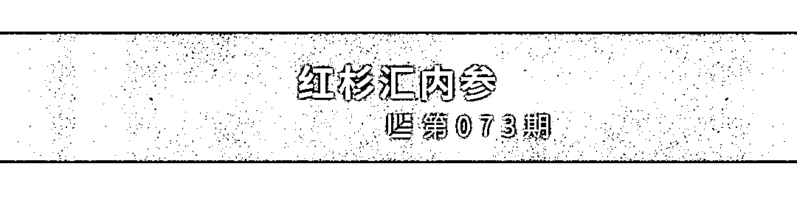
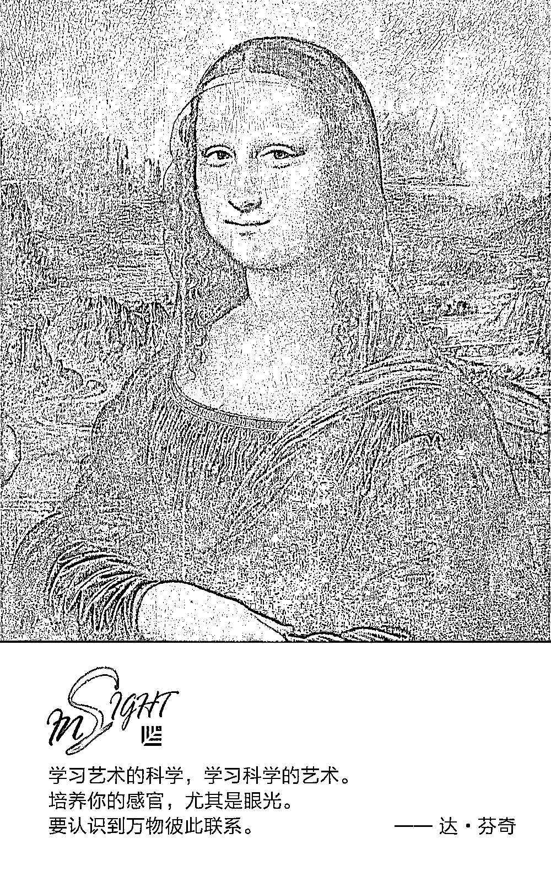
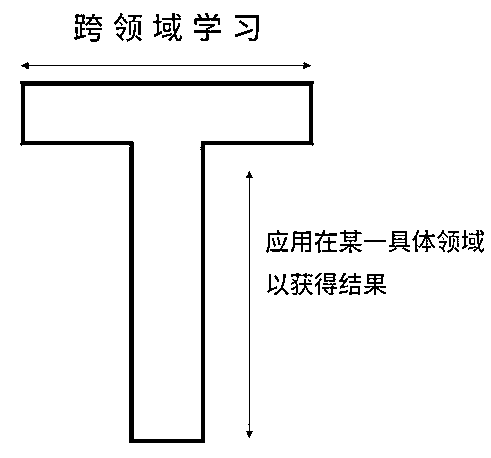
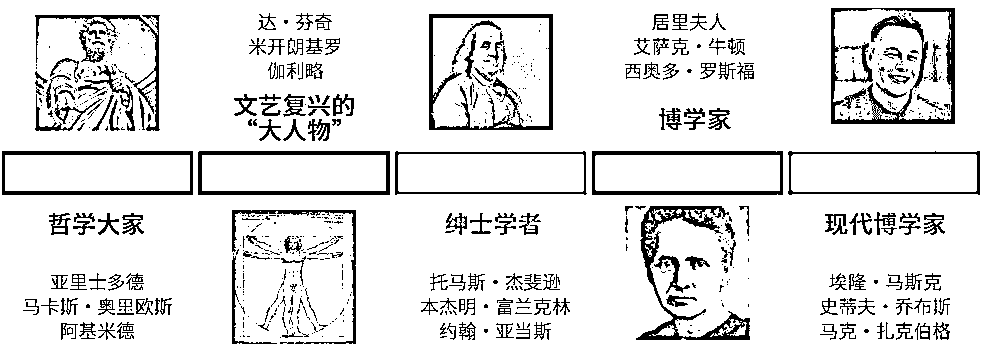
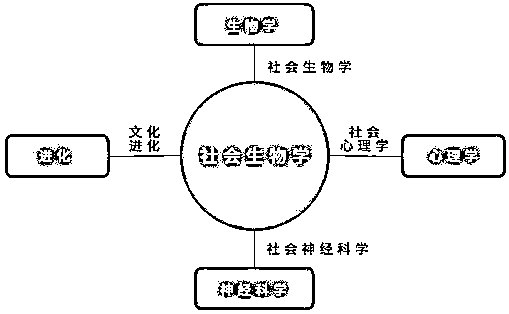
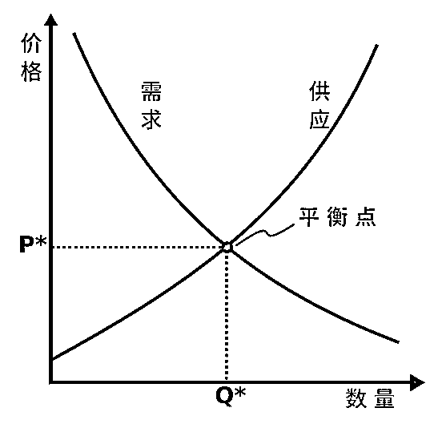
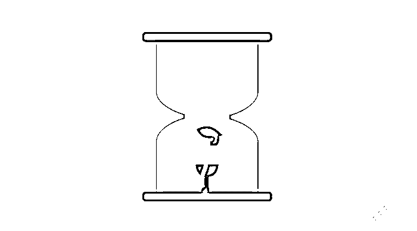

# 如果通才注定平庸，为何这 15 位不同凡响的人物都是通才？| 红杉汇内参

> 原文：[`mp.weixin.qq.com/s?__biz=MzAwODE5NDg3NQ==&mid=2651224808&idx=1&sn=fd92612664461bb79f1c39ad7d6a8060&chksm=808044bcb7f7cdaaaecd9ac415bb61f1dd04b7e27461e4a80c1d86780dd90ce31efb435a531c&scene=21#wechat_redirect`](http://mp.weixin.qq.com/s?__biz=MzAwODE5NDg3NQ==&mid=2651224808&idx=1&sn=fd92612664461bb79f1c39ad7d6a8060&chksm=808044bcb7f7cdaaaecd9ac415bb61f1dd04b7e27461e4a80c1d86780dd90ce31efb435a531c&scene=21#wechat_redirect)

[ 编者按 ] 怪才马尔科姆・格拉德威尔出版过一本关于成功学的书，取名《异类》。他在书中大胆地提出了“一万小时定律”，即要将某项技能提升至一流水平，必须先完成一万小时的刻意练习，才能打败竞争对手，尽可能深入到一个领域。这一观念被很多人接受。

而今天，我们要提出一个“现代通才”的概念，现代通才与这一流行的观念背道而驰，他们打破常规，掌握了不同领域的技能知识，然后整合到一起，产生突破性的想法，甚至创造出几乎没有竞争对手的全新领域和行业。例如，乔布斯将设计与硬件和软件结合在一起；马斯克将设计和工程结合在一起，在完全不同的领域创建了几家价值数十亿美元的公司。通才真的比专家更容易成功吗？值得好好思考。

每期监测和精编中文视野之外的全球高价值情报，为你提供先人一步洞察机会的新鲜资讯，为你提供升级思维方式的深度内容，是为 **[ 红杉汇内参 ]**。

** 内参**

**通才更有可能成功？**

编译 / 洪杉

“门门懂，样样瘟。”

在几十种不同的语言里，都有不要成为通才的警句，流传百年。在中国，人们警告说：“周身刀，无张利”。

然而，当代或是历史上许多具有影响力的人物，都是通才，如：埃隆・马斯克、史蒂夫・乔布斯、本・富兰克林、托马斯・爱迪生、莱昂纳多・达・芬奇、玛丽・居里等等。

这是怎么回事？

如果通才注定平庸，那么为什么有研究发现，历史上最重要的 20 位科学家中，有 15 位是通才？如：牛顿、伽利略、亚里士多德等。世界五大公司的创始人——比尔・盖茨、史蒂夫・乔布斯、沃伦・巴菲特、拉里・佩奇和杰夫・贝佐斯——都是通才。是因为这些传奇人物是天才，异于常人？还是说，若想在现代知识经济中取得成功，他们是我们能够并且应该效仿的榜样？

**T 型人才** 

未来属于集成商。

—— 教育家欧内斯特・博耶

现代通才能够掌握至少三个不同领域的技能，并能够将这些技能整合成一个排名前 1%的技能组合。

换句话说，他们带来了人类在各个领域最伟大的发现，以提高自己在核心领域的效率。由此组成了下面的 T 形。而另一方面，专家只专注于自己领域的知识。

马尔科姆・格拉德威尔在《异类》一书中提出了一万小时定律，即要将某项技能提升至一流水平，必须先完成一万小时的刻意练习，才能打败竞争对手，尽可能深入到一个领域。这一观念现在被很多人接受。而现代通才则与这一流行的观念背道而驰，他们打破常规，掌握了不同领域的技能知识，然后整合到一起，产生突破性的想法，甚至创造出几乎没有竞争对手的全新领域和行业。

例如，人们研究生物学和社会学已经有几百年的历史。但直到 20 世纪 70 年代，研究员爱德华・威尔逊开创了社会生物学，才把两者放在一起研究，综合成一门新的学科。我们也有像史蒂夫・乔布斯这样的现代科技英雄，将设计与硬件和软件结合在一起。又如埃隆・马斯克，他结合了对物理学、工程学、编程、设计、制造业和商业的理解，在完全不同的领域创建了几家价值数十亿美元的公司。

通过比较，可以看出两个组织在思维上的差异：一个能够将设计和工程结合在一起（马斯克的太空探索技术公司），另一个只专注于工程（美国宇航局）。结果不言自明。

许多人没有看到的是，每一种身份都具备一些有价值的东西，所有这些技能结合在一起，使得伟大的想法呈现于世人面前。

**现代通才何以成为新常态**

学习艺术的科学，学习科学的艺术。培养你的感官  ，尤其是眼光。要认识到万物彼此联系。

—— 达・芬奇

通才一直存在  ，他们确实往往比他人领先于西方文明进程 ，而在历史上，他们有着不同的称呼。下图显示了通才这一称谓的历时变化。

但大多数人都应该朝通才发展吗？

如今，我们的知识经济有几个显著的变化趋势，它们正在颠覆关于专业化价值的传统观念。在当今世界，多样化的利益不是诅咒，而是祝福。成为通才而非专家，是优势，而不是弱点。

1

**多个技能结合能让你成为顶尖人才**

史考特・亚当斯创造了有史以来最受欢迎的漫画之一——呆伯特（Dilbert），他本人既不是世界上最风趣的人，也不是最优秀的漫画家或职场老手（创立呆伯特时，他才 20 多岁）。但是，他将自己的幽默与插画技巧进行了结合，关注了商业文化，因此，他站在了行业的顶端。他写过一篇颇有见地的博文，并在其中揭示了自己成功的秘诀和复制这种模式的方法：

在生命中创造辉煌的途径有两种：

▨ 成为某一个领域的尖端人才

▨ 成为两个或多个领域（前 25%）的优秀人才

第一种策略难于登天，基本上不可能实现。鲜有人能够成为 NBA 球员或者白金唱片歌手。第二种策略就相当简单了。每个人都可以通过努力，成为至少几个领域内前 25%的佼佼者。

2

**多数创造性突破来源于打破常规的技能结合**

回顾科学史上最有影响力的论文，我们就会发现非常规结合的力量。西北大学凯洛格商学院的教授兼研究员布莱恩・乌兹分析了数百年来 2600 多万篇科学论文，发现影响力最大的论文多出自有着非常规背景结合的团队。乌兹的另一项综合研究对比了学术论文被引用和引用其他文献的次数，结果出现了一种有趣的模式：最优秀的研究引用了其他研究的非典型组合（90％为领域内的常规引用，10%为其他领域的引用）。

3

**掌握新技能比以往更简单快捷**

想要为你的技能表添砖加瓦，学习有用的新技能？这件事比以往更为简单：

▨ 每个领域的知识质量都在提高。研究人员和从业人员正在对各个知识领域进行系统的改进和测试，使其更为强大。日积月累，老旧的错误观念正在被摒弃，新想法正在逐渐壮大。例如，科技领域的智能程度要高于 20 年前。物理和生物领域也是如此。

▨ 在任何媒介中，你都可以从顶级专家那里获得免费或经济能力可承受范围内的内容。需要学习团队和专家指导？现在，有几十万的在线课程和数十亿的在线视频供你选择。对于那些重视学习，愿意自我投资，并且足够自律、可以主动行动的人来说，这是一个黄金时代。

虽然知识爆炸使得任何人都不能或者至少很难无所不知，但我们也因此更容易找到大范围、非常规的领域或技能组合。成为通才者的难度比以往任何时候都要低。

原因如下：

首先，创造新技能组合、行业、领域的一个主要方式就是将它们与旧的结合起来：

其次，新兴学术领域和商业产业的数量正在呈指数增长。

最后，随着新技能数量的增加，潜在组合的数量也呈指数增长。理论上，每一块新知识都可以与其他知识进行组合。每一次新突破都可能会带来更多新突破的指数增长。

4

**你的职业将不受未来的冲击**

能够生存下来的不是那些最强壮或者最聪明的人，而是能够应对改变的人。

—— 查尔斯・达尔文

以下六种职业有何共同之处？

1\. 手机 App 开发者

2\. 社交媒体经理

3\. 无人驾驶汽车工程师

4\. 云计算专家

5\. 大数据科学家

6\. YouTube 内容原创者

答案是，15 年前这些职业还不存在。试想如果你能穿越回过去，掌握这些技能，并当这些领域大获成功时成为行业顶尖人才，那么你现在的生活将会发生多大的改变。实际上，无需猜测，我们就知道，你很有可能会成为百万富翁。

那么，20 年后又有哪些技能会变得有价值呢？你知道吗？

所以问题是，现在我们该如何进行知识投资，才能在将来有所回报呢？

时代变化的节奏越来越快，要想不被淘汰，唯有成为通才。我们一生将从事多种职业，而每一种职业都需要新技能。

5

**让你为解决更复杂问题做好准备**

社会和个人面前所出现的许多非常严重的问题，都能从融合了多学科、多领域的解决方案中得到缓和。

以肥胖问题为例，如下图所示，导致美国人死亡有 15 大原因，其中 4 大死亡原因就是饮食和肥胖造成的。这数百万人完全可以避免死亡。

从旁观者的角度，你可能会脱口而出，解决肥胖危机易如反掌。少吃多运动就行了。对吗？没有这么简单。

研究员斯科特・佩奇在著作《多样性红利》（Diversity Bonus）中，简单说明了肥胖危机有多复杂。这一问题的解决涉及到多个不同领域：运动生理学、遗传学、行为心理学、社会学、经济学、市场营销、普通心理学、教育系统和营养学。

6

**助你在全球经济中脱颖而出、保持竞争力**

供求关系是经济学当中最基本的心智模式之一。它关系到就业市场、关系到商品和服务、关系到理念世界，以及许多其他东西。

在这一模式当中，有两种方式可以提升你所掌控的溢价：

▨ 减少供应（**蓝色**曲线往**左**移）

▨ 增加需求（**红色**曲线往**右**移）

你或许拥有这世界上最具价值的技能组合，但如果每个人都掌握了这种技能组合，那你就没什么特别可言。只有成为一名通才并掌握少数人具备的特殊技能组合，你才能使自己脱颖而出，要求更高的酬劳。

作为硅谷最顶级的投资者，彼得・蒂尔会问潜在雇员和投资者一个问题：“在哪一件事情上，你觉得自己是对的，但别人都不同意你的观点？”这一简单问题可以快速说明你是否拥有罕见而有价值的想法。如果你什么都答不出来，那就说明你可能不像自己之前以为的那样具备原创性思维。

通才将会是新常态。

** 读数**

**$5000 亿**

麦肯锡最新研究显示，中国未来可能成为全球最大的自动驾驶市场，预计到 2030 年，相关新车销售及出行服务的市场规模将超过 5000 亿美元。

** 情报**

#日程表中有 1 万条代办事项#

**如何保持高效，抢回更多时间**

效率并非天注定，想变得更高效，可以从改善工作方式开始。

▨ 每天定一个主题。然后把精力集中到主题上。比如，周一与团队交流、周二开全体大会、周三解决用户反馈、周四专注产品研发、周五处理未完成事项及一周反思。

▨ 提前计划并把事情按优先顺序排好。设置一个工作日历，为自己和团队设定季度目标，同时确保有充分的时间完成每日计划。

▨ 不要让电子邮件占据工作日。尽量每天只查两次邮件，尝试设置自动筛选，并按照重要性重新排序，归整到相应的文件夹中。

▨ 将会议人数降至最小。提前分享议程，并指定专人做会议记录，会后分享笔记和行动计划。

#B2B 的销售环境日新月异#

**2018 年值得关注的销售战略和趋势**

除了要适应科技带来的变化外，优秀的营销人员更要学会利用科技开发更有效的新销售技巧。

▨ 信任营销。信任是促使人们做出购买决定的第一驱动力。学会讲一个好故事，因为它能刺激“信任荷尔蒙”。

▨ 个性化营销。75%的客户更愿意为定制化产品买单。

▨ 目标客户营销。过去习惯广撒网、抓大量小鱼，而现在需要用长矛，抓大鱼。

▨ 互动营销。84%的千禧一代希望保持实时互动。

▨ 社群营销。社交媒体将潜在客户发展为忠实客户的概率比其他方式高 7 倍。75%的 B2B 买家通过社媒互动做购买决定。

▨ 挑战者销售。洞察影响客户购买决定的因素并向其灌输独特的观点，能促使客户的想法向产品靠拢。

▨ 视频推销。59%的决策者更愿意看视频而非文字，视频会让推销过程更有人情味。

** 推荐阅读**

壹

[为什么说“害怕”是对“恐惧”最大的误解？](http://mp.weixin.qq.com/s?__biz=MzAwODE5NDg3NQ==&mid=2651224783&idx=1&sn=fa692d526942377afc67807b65a30ff4&chksm=8080449bb7f7cd8de64b942fcdd967d2aa40c60c00e55cbf932733ebf85dfbcc2166c82ed5ba&scene=21#wechat_redirect)

贰

[招聘高管又快又准的 3 个秘诀，苹果、雅虎都曾这么做](http://mp.weixin.qq.com/s?__biz=MzAwODE5NDg3NQ==&mid=2651224800&idx=1&sn=85fbc5af15c36ab88648f1a6b2b3bfef&chksm=808044b4b7f7cda29b814f7c6922d7f6bee2d92dbc66928f251490cd561fd242058782ccb5a4&scene=21#wechat_redirect)

叁

[把责任当“皮球”踢的团队，到底出了什么问题？](http://mp.weixin.qq.com/s?__biz=MzAwODE5NDg3NQ==&mid=2651224768&idx=1&sn=13bece9e77226fb89f67f50e71806d64&chksm=80804494b7f7cd825878c2c2f4d0a4c3a734c2557af905f896116584fc0fdeb9e885c8f3f214&scene=21#wechat_redirect)

肆

[用口碑裂变撬动“超级用户”，VIPKID 做对了这 4 件事](http://mp.weixin.qq.com/s?__biz=MzAwODE5NDg3NQ==&mid=2651224772&idx=1&sn=9757febe33d7dc969e390841a67fbc5c&chksm=80804490b7f7cd86268bb7b07676d3d4881adcbaa865ce6759dccb3ea3bd4a37bf5d60ccf324&scene=21#wechat_redirect)

伍

[为什么你读过的书全忘了？](http://mp.weixin.qq.com/s?__biz=MzAwODE5NDg3NQ==&mid=2651224776&idx=1&sn=3871c92139d16aa6e8aa951a0b16ce8d&chksm=8080449cb7f7cd8a20d1469f3a7c69fdf27bb73d14a976348bc389573c2d25a260e8126c1ea6&scene=21#wechat_redirect)

