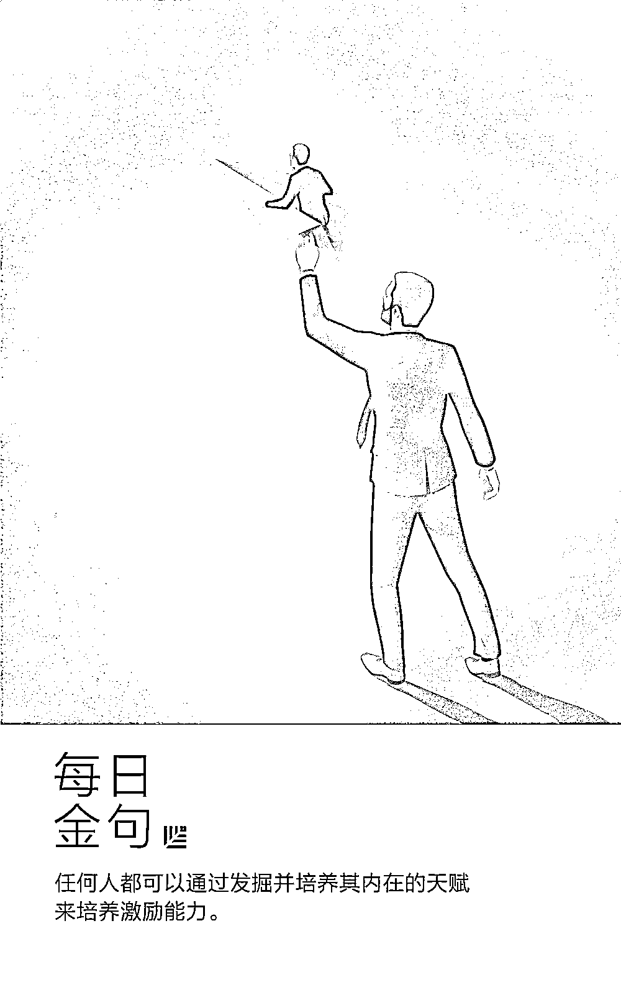
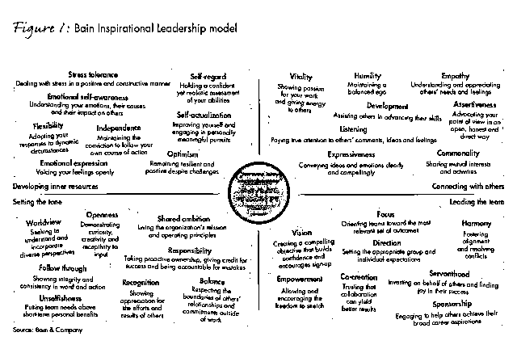
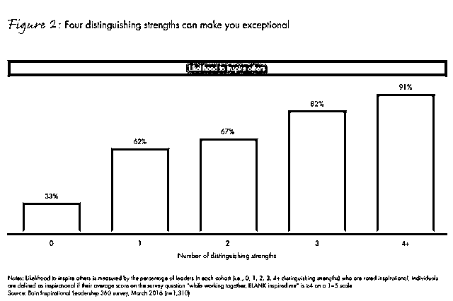
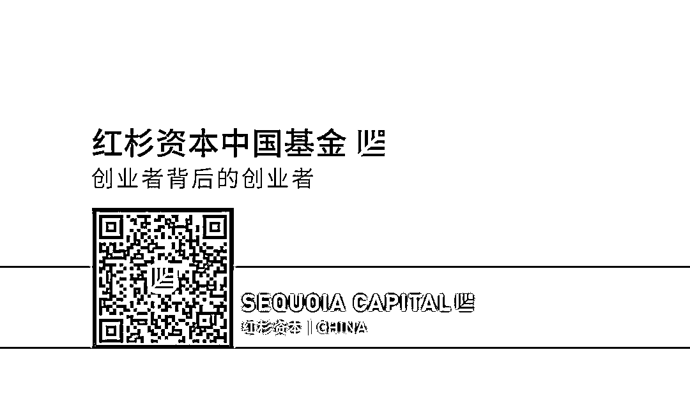

# 经过 5 年研究，我们发现这 33 种领导者最擅长激励人心

> 原文：[`mp.weixin.qq.com/s?__biz=MzAwODE5NDg3NQ==&mid=2651224615&idx=1&sn=7e7f7b2962dcd7310a1ae60bc21ce52c&chksm=80804473b7f7cd65a0ad409af4c39e43bb7fd19a5cd9279afa06dffa34a6cabfc1ef990cf273&scene=21#wechat_redirect`](http://mp.weixin.qq.com/s?__biz=MzAwODE5NDg3NQ==&mid=2651224615&idx=1&sn=7e7f7b2962dcd7310a1ae60bc21ce52c&chksm=80804473b7f7cd65a0ad409af4c39e43bb7fd19a5cd9279afa06dffa34a6cabfc1ef990cf273&scene=21#wechat_redirect)

有研究表明，受到领导激励的员工比其他员工的生产效率高一倍以上。但“激励人心”的能力是一种无法量化、没有具体指标衡量的无形的品质，因此，你会看到许多公司在培养领导的激励能力上投入大量精力和资金，却很难看到成正比的产出。

究竟如何让领导者具备激励能力？培养这一类领导者需要什么？

贝恩公司就上述问题，设计了一套分析方法，花费 5 年时间，对超过 2000 名员工进行调查，最终确定了 33 个激励他人的特质，并创建“贝恩激励型领导力模型”。本文就调查结果进行了详细说明，以下是部分要点摘录：

▨ 中心意识是最重要的特质。它是一种更强的正念状态，能够提高保持冷静、应对压力、同情并倾听他人的能力。

▨ 即使只具备独特优势中的一种也会使你的激励能力将近加倍，而且你拥有的独特优势越多，你的激励能力就越强。

▨ 个人可以通过优化自身优势、消除自身劣势的方式来增强激励型领导力。

▨ 激励能力和每一位员工都息息相关，所以个人优势的校准需要来自组织从上到下整体的反馈。

▨ 任何人都可以通过发掘并培养其内在的天赋来培养激励能力。

什么使领导者有激励能力？能回答这个问题的公司可以强有力地增加其竞争优势。我们近期与经济学人智库进行的联合研究表明，受到激励的员工比正常员工的生产效率高出一倍以上。

对于一个拥有能够激励组织内部各层面的领导层的公司，其力量不容小觑。这些公司不断地在业务中做出创新或宏伟之举，因为许多员工被激励着去实现那些目标。公司花费数十亿美元用于领导力培训，以加强和提高能够激发、激励并创造参与度的软技能，然而大多数公司发现这样做似乎很难。

很少有严格的方法来衡量一个人的激励能力，或系统地培养这种无形的品质，或将这些技能嵌入组织中并贯穿始终。正如哈佛大学甘乃迪学院公共领导中心的执行主任 Barbara Kellerman 所说：“领导力作为智力调查的一个领域仍然很薄弱，并且很少有人对于二十一世纪第二个十年中的领导者应该是什么样子有独到的见解。”

培养有激励能力的领导者需要什么？是通过年复一年的训练而不只是人才管理的偶然吗？为了回答这个问题，我们自 2013 年起开始进行全面研究，利用贝恩资本并选择客户作为测试平台。具体而言，我们设计了一种分析方法来定义、衡量并培养激励能力。引导我们研究的三个关键问题是：

▨ 当激励他人时，什么特质是最重要的？

▨ 为了激励他人，需要有多少体现激励能力的行为才能体现其可靠性，又是什么样的行为方式最具说服力？

▨ 我们如何将个体这些特质的强度标准化？

虽然激励能力看似难以破解，但我们确定了 33 个独特而有形的特质，这些特质激励他人的效果在统计学意义上十分显著。而将其中 4 个特质作为独特优势便足以使某个人有极强的激励能力。调查结果还表明，具有激励能力的人竟然不尽相同。任何独特优势的组合都是有效的，即有激励能力的领导者并没有固定的原型。

**产生激励能力的 33 个特质**

为了了解什么特质能够激励他人，我们调查了所有员工，而不仅仅是正式的领导者或 HR 专家。原因就是，组织中的各级员工都希望被激励，员工最清楚什么才能激励他们。要确定领导者的哪些特质具有激励力，重要的是了解其所有客户或追随者共同的声音，而不是领导者自身所言或 HR 所说。

因为受到激励是主观的，所以它有助于理解分析的基本框架。从对贝恩 2000 名员工进行的初步调查开始，我们要求受访者评价他们受到同事激励的程度。我们还要求他们评估什么是该激励能力产生的主导因素。为此，我们根据从多个学科（包括心理学、神经病学、社会学、组织行为学和管理科学）收集的数据以及广泛的访谈选择了一系列特质进行测试。

根据追随者的反应，我们进行了联合分析（典型的消费者研究），以评估一系列使受访者受到激励的特质之间的相关性。其结果是 33 个特质激励他人的效果在统计学意义上十分显著。接着我们使用这套行为来创建“贝恩激励型领导力模型”（如图 1）。

这些产生激励能力的 33 个特质千差万别。例如，自尊是对自身能力的自信而现实的评估；表现力能够清晰且强烈而地传达想法和情感；而赋权则允许并鼓励了自主性和独立性的延伸。其他特质或许也能激励他人，但总体而言，我们所确定的这 33 种特质对激励能力的贡献是最大的。

我们将这些特质分为 4 个象限，强调它们所倾向的 4 种应用环境。例如，一个象限包含与领导团队相关的品质，另一个象限包括培养内在素养（如抗压力、乐观和情绪自我意识）的行为。虽然这些象限提供了一个使模型更容易被理解的结构，但它们并没有强调任何具体的能力分布。我们的研究表明，若要保持组织集体士气的良好状态，每种特质都很重要，并且没有任何特质组合对个人激励能力的贡献更大。而且没必要让每个象限的每种特质都发挥作用。

一个令人惊讶的结果是：中心意识是其中最重要的特质。在所有特质中，中心意识是员工最想培养的技能。中心意识是一种更强的正念状态，它的实现需要意念的所有部分充分参与。虽然越来越多的公司提供可选的正念计划，以提升健康和工作场所的满意度，但我们的研究表明中心意识是领导力的基础。中心意识提高了保持冷静、应对压力、同情并倾听他人的能力。

中心意识是由其他 32 种特质通往一项强制技能的枢纽。例如我们认识到，正如领导者需要达到绩效目标才能令人满意那样，领导者需要保持中心意识从而才能激励他人。保持中心意识是有效利用自身领导力优势的先决条件。

**拥有的独特优势越多**

**激励能力就越强**

一个人需要具备多少种如上的特质才能真正激励他人？我们在超过 10000 项评估数据的数据库中，把个人的优势劣势与其同事所述的激励程度联系了起来。

我们将排名在同龄人群中前 10％的特质定义为个人的独特优势；将排名在 70%到 90%之间的特质标记为潜在的区别优势；将最末的 10％列为劣势。10%到 20%之间的特质是中性特质，因为他们的激励能力水平对他人没有任何影响。

结果是令人兴奋的：即使只具备独特优势中的一种也会使你的激励能力将近加倍，而且你拥有的独特优势越多，你的激励能力就越强。事实上，超过 90%的拥有四种及以上独特优势的人，都能够激励他们的同事（如图 2）。这一发现增强了这一说法的可靠性：在统计学意义上不存在哪种优势组合比任何其他优势更能激励他人，拥有激励能力的领导者不尽相同。

这些研究结果中有前景的关键发现是：个人可以通过优化自身优势、消除自身劣势的方式来增强激励型领导力。数据还表明，培养一种独特优势比消除一种缺点更有效——优化一种独特优势平均比消除一种劣势对激励能力的贡献多 1.5 倍。

**与其消除自身劣势**

**不如强化自身优势**

为什么要创建一个以优势为绝对关注点的领导力计划？越来越多的研究表明，鼓励人们强化自身优势比竭力消除他们的劣势更有效。根据 Gallup 的研究，当一个组织领导关注员工的优势时，员工的参与比例为 73％，反之，员工的参与比例仅为 9％。

“我们所知道的是，当事情消极时人们能够留意到的选择会更少，他们解决问题的能力也就越弱，大脑也因此停止运转，”芝加哥职业心理学学院副教授 JenniferThompson 说，“当人们处于积极的环境时，他们就会更有创造力，工作效率也会更高。”

激励能力和每一位员工都息息相关，所以个人优势的校准需要来自组织从上到下整体的反馈。因此为评估个人在某种特质上的优势，我们根据其同事的意见建立了一个 360 度全方位评估。然后将这些意见与这个人同行的结果进行比较，找出他或她的相对优势。了解自身是凭借何种独特优势脱颖而出的，有助于个人确立自己的领导力品牌，并更有效地将其应用在日常交互中。

任何人都可以通过发掘并培养其内在的天赋来培养激励能力。我们的激励型领导力体系包括结构化反思，即来自 360 度全方位调查和自我评估的意见。每个员工根据他们现有的优势和真实的感觉，从 32 种特质中选出 4 或 5 种。这种特质组合成了自己的“砥柱”亦或是激励型领导力品牌，使得每个人都能将其作为个人发展目标然后应用于日常工作中。

**打造一个有激励能力的组织**

典型的领导力项目只针对组织内有限数量的人，即传统的高管人员和高潜力人群。包括绝大多数员工在内，其他人却从来没有机会提升他们的领导力。然而若要真正发挥系统的作用并将激励能力有组织地融入工作中，领导力计划就需要更加深入。越早开始，他们的能力就越强、越有价值。

我们的大多数员工均使用贝恩的激励型领导力系统，最终目标是覆盖到每位员工。2014 到 2015 年间，称得上激励型员工的数量增长了 18％，且其影响力正在扩散：根据贝恩的“净推荐系统”，自项目开始以来，伴随着员工敬业度相关应对措施的实施及贝恩的文化优势，称自己受激励的员工比例不断增加。

当然，贝恩并不是唯一一家想了解是什么导致激励型领导不尽相同的公司。例如，Aetna 在公司 CEO 的支持下开展了企业范围的正念培训。Telefonica 德国公司为员工开展移情培训，努力提高客户满意度。这些计划虽然也有价值，但许多计划并没有充分发挥其潜力。我们的研究表明，采取更全面的分析方法能创建一个强大的系统，从而增加整个组织的激励能力。

随着工作性质越来越具协调性和自我导向性，可以用激励能力来区别表现优异的团队和落后的团队。之所以构建系统的激励型工作，是因为那些系统本质上尊重人际关系的复杂性，培养可靠性，并创造一个共同平台使得人人都能在其上作出独特贡献。开发出这种强大组合的公司将拥有几乎无人能匹敌的竞争优势。

文章来源 / 贝恩咨询：Mark Horwitch, Meredith Whipple Callahan

编译 / 慎思行（ID:shensixing2014）

** 推荐阅读**

壹

[陆潇波：基因测序将怎样影响我们的生活？](http://mp.weixin.qq.com/s?__biz=MzAwODE5NDg3NQ==&mid=2651224584&idx=1&sn=f0ebb9a6eb182d48cc496dec9b23b688&chksm=8080445cb7f7cd4ade744687aaa782bdf04842a2c7b0d11d3aea3b0bd1ae7be2ba60ec5d0177&scene=21#wechat_redirect)

贰

[在大量分析对比后，我们来聊聊数字世界里 3 个最紧迫的工作问题](http://mp.weixin.qq.com/s?__biz=MzAwODE5NDg3NQ==&mid=2651224591&idx=1&sn=71e2dc37d5bd3d7a42eff51894c643a1&chksm=8080445bb7f7cd4de36867daf5ade75bbfd8e7d4641781cdfc14943d1619c6fc8a6ed7a5e516&scene=21#wechat_redirect)

叁

[如何持续赢？制造爆款不如制造爆款的规程重要](http://mp.weixin.qq.com/s?__biz=MzAwODE5NDg3NQ==&mid=2651224591&idx=1&sn=71e2dc37d5bd3d7a42eff51894c643a1&chksm=8080445bb7f7cd4de36867daf5ade75bbfd8e7d4641781cdfc14943d1619c6fc8a6ed7a5e516&scene=21#wechat_redirect)

肆

[汪静波：想清楚方向，才是控制风险最重要的核心](http://mp.weixin.qq.com/s?__biz=MzAwODE5NDg3NQ==&mid=2651224606&idx=1&sn=9db90de587756a48e3484fafabf84039&chksm=8080444ab7f7cd5c27655f4f4cae0cae3f4336936e9b409ceb8d19edd3b19f5178fcb269fdc8&scene=21#wechat_redirect)

伍

[带上 9 本书去重新发现以色列：一份需要深读的创新修炼书单](http://mp.weixin.qq.com/s?__biz=MzAwODE5NDg3NQ==&mid=2651224608&idx=1&sn=44655974581332a8d0a635bc9baf38d2&chksm=80804474b7f7cd622a1fc42ef0b18ba04f8fce380d435df917708265e8a6a21f488139ca2356&scene=21#wechat_redirect)

