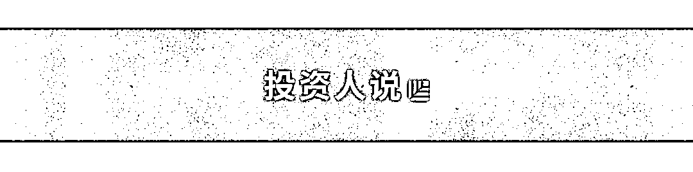
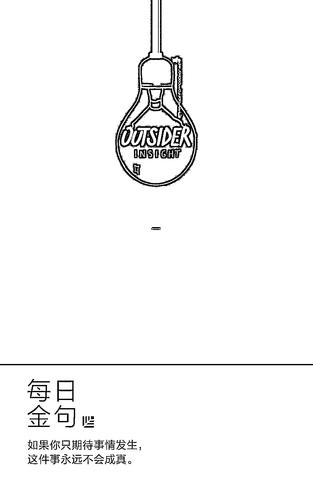

# 2018，致创始人的洞察箴言｜红杉 Outsider Insight

> 原文：[`mp.weixin.qq.com/s?__biz=MzAwODE5NDg3NQ==&mid=2651224446&idx=1&sn=7b29b581691bd329caddb245bcac39db&chksm=8080472ab7f7ce3ceb9275fc28830c357704e5fba297536c0c6aca6ebcf1411a8ec74b1433c4&scene=21#wechat_redirect`](http://mp.weixin.qq.com/s?__biz=MzAwODE5NDg3NQ==&mid=2651224446&idx=1&sn=7b29b581691bd329caddb245bcac39db&chksm=8080472ab7f7ce3ceb9275fc28830c357704e5fba297536c0c6aca6ebcf1411a8ec74b1433c4&scene=21#wechat_redirect)

“局外人洞察力”（Outsider Insight）是什么？

过去 46 年来，红杉资本投资了众多领先的创新企业，包括苹果、思科、甲骨文、谷歌、阿里巴巴、Airbnb、京东等产业潮流领导者。在这些企业所创建的网络中，有很多创始人、合作伙伴和专家都拥有 Outsider Insight 这种特质。这样的洞察力有的来源于同一个概念在不同领域的实践；有的则来自于个人独特的经历、背景或观点。认真聆听来自不同视角的洞察，或许能影响人们看待世界的方式。

红杉资本始终致力于帮助创业者成就基业常青的伟大公司，为成员企业带来丰富的全球资源。为了让每一种“局外人洞察力”都能为创业者提供实用的灵感——这是我们红杉资本美国团队出品系列短视频《Outsider Insight》的由来。

在本期《Outsider Insight》中，我们红杉资本美国的 3 位合伙人分享了他们的“局外人洞察力”。Doug Leone 为何认为“希望”是个糟糕的词？Jess Lee 给想要走得长远的创业公司什么建议？Mike Vernal 做产品优先级决策时有什么秘诀？本文带你一探究竟。

**Hope is not a plan**

[`v.qq.com/iframe/preview.html?vid=p05488ynzdr&width=500&height=375&auto=0`](https://v.qq.com/iframe/preview.html?vid=p05488ynzdr&width=500&height=375&auto=0)

**Doug Leone **

**When someone says I hope for something, the very first thing you should say is stop.**

对于企业而言，“希望”是最糟糕的词，因为“希望”意味着没有计划。当你听见有人说“希望”时，要立刻叫停。

“希望”？“希望”是什么？计划是什么？怎么为自己的成功作打算？如果你只期待事情发生，这件事永远不会成真。但如果你为它做个规划，它就有可能发生。

**Build your company like a product**

[`v.qq.com/iframe/preview.html?vid=p0548uz1vpj&width=500&height=375&auto=0`](https://v.qq.com/iframe/preview.html?vid=p0548uz1vpj&width=500&height=375&auto=0)

**Jess Lee **

**What you're trying to do is to build an operating system for your company, the same way that you try to build a system in your product.**

在创业公司成立早期，创始人要专注于打造产品。如果你做过产品，你就知道有许多方面需要进行测算，比如用户转化率、产品优化和数据分析等，你需要构建一个严密的系统来监测产品的运营状况。

随着公司的发展，创始人不仅要关注产品状况，还要关注公司和组织发展，实际上你的产品就变成了你的公司。你同样需要对组织进行严密检测和管控。正如你要检测产品的用户转化率，你也必须检测公司的招聘成功率和员工流失率，你应该定期考评员工的敬业度。正如你需要做产品的风格或品牌指南，你也同样需要设定明确的目标和指标，给公司正确的价值和理念指导。

所以，创始人要做的是为公司构建一个操作系统，就像在你的产品中构建系统一样。我认为这对长期成功是非常重要的。

**Do the most important thing**

[`v.qq.com/iframe/preview.html?vid=v0548l09op9&width=500&height=375&auto=0`](https://v.qq.com/iframe/preview.html?vid=v0548l09op9&width=500&height=375&auto=0)

**Mike Vernal **

**Closing the loop trains your intuition on how impactful something is going to be, and what your estimation biases are.**

刚开始做产品经理的时候，我认为构建产品路线图的方式是通过头脑风暴提出一些想法，然后选出那些看似不错的想法，做出来看看效果如何。

在最初加入 Facebook 时，我们也是这样开发产品的。但是有一个团队的运作方式完全不同，他们试图为他们可能做的每一件事制定一个严格的优先级框架，并努力弄清楚下一步能做的最重要的事情是什么。我们发现这个问题居然很难回答，因此事先花了很多时间了解哪一个是最好的度量标准。

你需要做三件核心的事情：

▨ 第一，清楚地定义你要实现的定性目标，以及与此目标进展非常接近的度量标准。
▨ 第二，对于你所拥有的每一个想法，估算它对核心指标会有什么影响，然后估算成本，最后根据投资回报率对想法列表进行排序，重点关注那些投资回报最高的想法。特别是早期的创业公司，仅仅是修复所有的错误并使已经存在的机制良好运行，就是一件最有影响力的事情。

▨ 第三，测量你的影响力，可能还要测量你所面临的成本，并计算出你的预期与实际影响的差距。

这样的闭环训练可以锻炼你的直觉，让你清楚一件事情的影响力，以及与你的预期偏差有多大。

** 推荐阅读**

壹

[最重要的事情只有一件｜精力管理](http://mp.weixin.qq.com/s?__biz=MzAwODE5NDg3NQ==&mid=2651224416&idx=1&sn=5c11803894c0a2bba8bdbe4dea1dd5a0&chksm=80804734b7f7ce225fb155f17736633a3fa49cbcdc4f535366467c63d5767a6270ec84d18ea2&scene=21#wechat_redirect)

贰

[9 件小事，厘清伟大团队的本质](http://mp.weixin.qq.com/s?__biz=MzAwODE5NDg3NQ==&mid=2651224419&idx=1&sn=ae11c6ec8240699bf37eb05db01ef008&chksm=80804737b7f7ce21579a6f0d1259e578e820c46c9c466a043e6e1fd3eeaeadd02bc74ec42d6b&scene=21#wechat_redirect)

叁

[京东金融 CEO 陈生强：最正确的路总是最难走的路](http://mp.weixin.qq.com/s?__biz=MzAwODE5NDg3NQ==&mid=2651224426&idx=1&sn=384dbe556f86bd8d27b6f531c9cadd79&chksm=8080473eb7f7ce287f23bb333e84c7ee0a83ac64af3e02605d0ca54f5187cce85385c3739a96&scene=21#wechat_redirect)

肆

[红杉中国投资企业华米科技登陆纽交所 智能可穿戴市场的创新与发展提速](http://mp.weixin.qq.com/s?__biz=MzAwODE5NDg3NQ==&mid=2651224440&idx=1&sn=20b275a28a777feb6769bf5c4bc4a8c4&chksm=8080472cb7f7ce3a0cfae86b79fb6b694457213506b7fbbd5990803ddff290808a74e5225214&scene=21#wechat_redirect)

伍

[领英创始人说：不颠覆，就会被淘汰](http://mp.weixin.qq.com/s?__biz=MzAwODE5NDg3NQ==&mid=2651224441&idx=1&sn=70f85835c05d898889ebb344561d0e47&chksm=8080472db7f7ce3b58f793f7eb0e44d36ea9f36e507bd55319e05407eecd65761490dc21efc6&scene=21#wechat_redirect)

