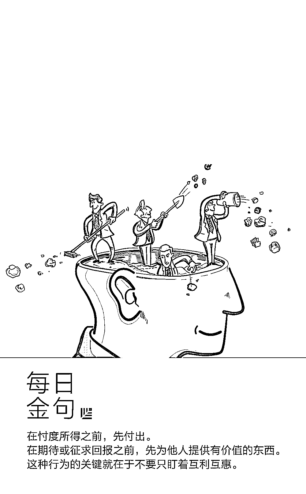
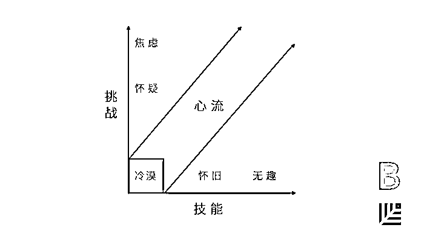
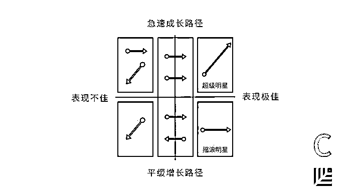
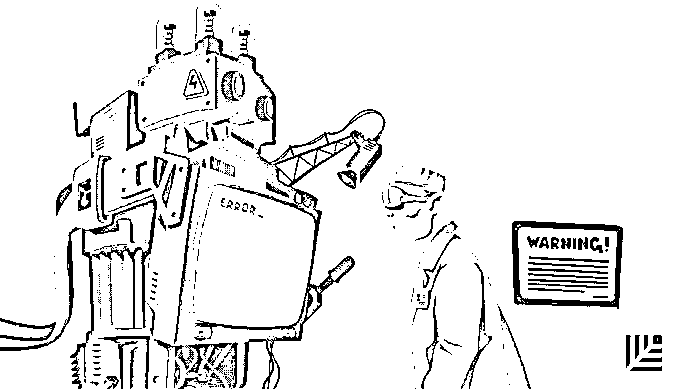
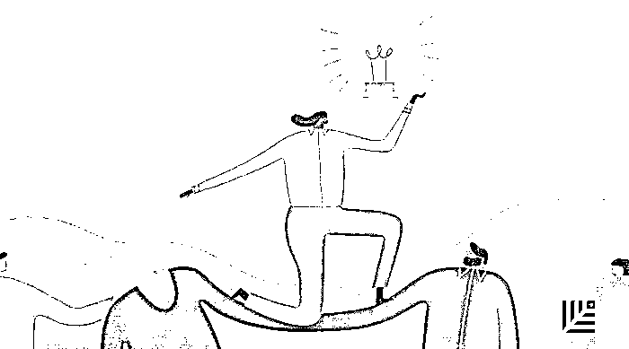
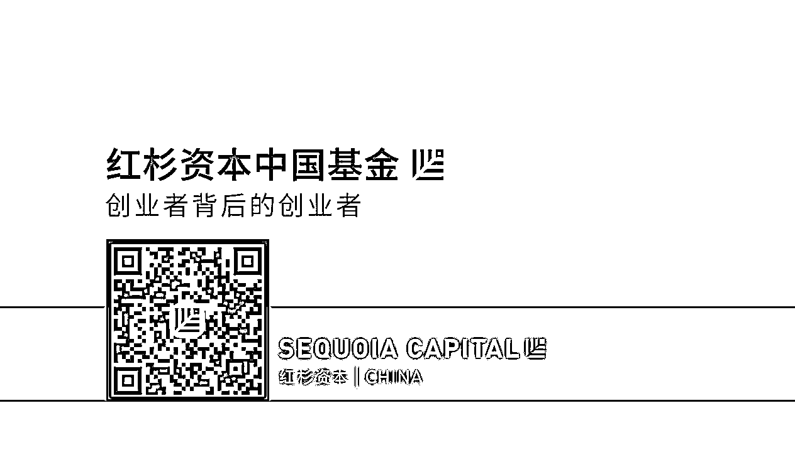

# 以最有冲击力的智慧浓缩出的创业「摩西十诫」｜红杉汇内参

> 原文：[`mp.weixin.qq.com/s?__biz=MzAwODE5NDg3NQ==&mid=2651224302&idx=1&sn=a805c14090163d78e4a9c95fc4e6a7ff&chksm=808046bab7f7cfac6316ce009626fa9736f2f582cedeeae5227521233badcd7860c824b56606&scene=21#wechat_redirect`](http://mp.weixin.qq.com/s?__biz=MzAwODE5NDg3NQ==&mid=2651224302&idx=1&sn=a805c14090163d78e4a9c95fc4e6a7ff&chksm=808046bab7f7cfac6316ce009626fa9736f2f582cedeeae5227521233badcd7860c824b56606&scene=21#wechat_redirect)

[ 编者按 ] 子曰：“择其善者而从之，其不善者而改之。”

如果让字幕组翻译成大白话，那就是：听人劝，吃饱饭。

你的 2017 年过得怎么样？是顺流还是逆流？是破茧成蝶，还是作茧自缚？2018 年，你希望有一个怎样的开始？

今天的红杉汇内参特别荐读来自 10 位商业老兵的经验之谈，为了跑得更快，变得更强，你需要在某一时刻停下来问自己这些问题：我们追逐的是不是虚荣性指标？决策过程是否去中心化？是否偶尔打肿脸充胖子？是否一直让团队保持“心流”状态？

这些于创业者极为有益的最佳建议，是在提醒我们，要有零基思维（Zero Thinking），不受限于过去的成绩或习惯，从零开始思考和审视目标、路径、资源和起点。

每期监测和精编中文视野之外的全球高价值情报，为你提供先人一步洞察机会的新鲜资讯，为你提供升级思维方式的深度内容，是为 **[ 红杉汇内参 ]**。

** 内参**

给创业者的

**「摩西十诫」**

编译 / 洪杉

这里列举了那些如今成功的创业者们一直都会被问到的问题，或者是一些他们所知道的、让很多人熬夜奋战的事情，浓缩出他们分享过的最重要、最有冲击力的智慧，包括他们发明或应用过的策略、行动、系统和框架。当形势危急，又不允许创业失败时，他们凭借着这些智慧获得了成功。

现在，通过阅读，你也将通晓这些智慧了。就让这些智慧把 2018 变成你大获成功的一年。

***1***

**每天从零开始**

身为 LaunchDarkly 的 CEO，伊迪斯・哈博领导产品和研发团队已经接近 20 个年头了，但并不是敲代码就让她掌握了所有的管理知识。她时常号召员工一起长途骑行单车，在过程中，她学会了如何管控自己的能量，适应变化的出现以及在分岔路面前做出选择。

要问她在建立初创公司和设计软件方面最值得分享的经验，那就是每次开始行动之前，都从零开始。伊迪斯每天开始骑行前，都会把里程计调回至零，然后给当天设立一个目标，例如说 50 公里。不管是骑行，还是软件开发，管理都非常重要——**可视化的进展能非常激励人。**如果总想着前面还有 80%的工作未完成，那一个人每天的工作成果对整体目标就显得微不足道。一旦你设定了自己的方向，每天就从零开始。这种做法能提高团队的专注度，产生一种具体的成就感和“工作正向前推进”的感觉，还能帮助避免自满的出现。

***2***

**聘用像主厨或士兵**

**那样行事的产品经理**

Eaze 的 CEO 吉姆・帕特森曾服役于空军，创业后曾连续聘请了几位之前做过主厨的人来担任产品经理，他列举了理想中的产品经理应具有的特质，和做过主厨、当过兵的人很像：

▨ 能够在没有上级的情况下领导团队。

▨ 过错总由自己承担，成绩全归功于他人。

▨ 在信息不全面的情况下仍能当机立断。

▨ 注重充分的事前准备。

▨ 从错误和危机中恢复元气时能保持有条不紊。

▨ 能在极大的压力下以最佳状态运营。

***3***

**让团队保持“心流状态”**

作为 Slack 的设计总监，辛西亚・麦克斯维尔曾对团队进行了一次参与度调查，调查结果中有一项数据让她最为自豪：团队中的每一个人都认为，他们有参与到与自己工作相关的决策过程里。苹果、雅虎和 Pinterest 等公司留住老员工的秘密是什么？她设计了一个框架来帮助团队实现和保持心流状态。

以下这些简单的图表能方便团队成员快速直观地绘制出工作满意度，同时也为管理者提供了一个管理视角。

在一对一的面谈里，你可以向下属展示图 A。这个图形很简单，就是一个象限里射入了一条“心流光束”。心流光束区域指的是人们希望达到的、自身技能和任务挑战相匹配的目标境界。图 B 则是管理者看待图 A 的视角，它十分有用，是管理者理解下属的关键。它标识了下属不在状态的时间点，因此管理者能帮助他们回到正轨。

**这并不是绩效考核，而是时效考核。要关注的问题是：我怎样才能让你更加进入工作状态，而不是从你身上获得更多工作成果？**

***4***

**与人建立起持久的关系**

二十年前，克里斯・弗拉里克还只是甲骨文公司里众多软件销售员中的一名。今天，他已是 First Round 合伙人。当被问及，是什么给他带来了如今的成就时，他会马上告诉你是因为人际关系。在此，他解密了自己一直遵循的 7 条建议：

▨ 向别人表达真诚的赞赏。

▨ 专注地倾听。

▨ 使用谦语，承认你自己也会犯错、并非完人能让你长久保持魅力。

▨ 毫无掩饰的坦诚。你只需记得，要把你的坦诚用于他人觉得有用的地方。

▨ “蓝天式”头脑风暴。（也许你未能提供他们想要的东西，但如果能改变他们的思考方式，你就能让他们感觉到好像获得了某些特别的收获）

▨ 把握开会节奏。

▨ 切莫打肿脸充胖子。

***5***

**不要根据潜力来****评估员工能力**

金・斯科特曾帮助谷歌、苹果和推特等大公司建设团队。因此，当这位“坦诚相待管理法”的创始人发现自己多年以来都采用了错误方法来评估团队表现时，着实让人惊讶。她犯了什么错误？——根据潜力来评价员工，但却没有认识到不同人有着不同的成长之路。其中最常见的两种路径分别是「超级明星模式」和「摇滚歌星模式」：

▨ 超级明星是指进步神速、快速升职的那些人。他们是促进团队成长的力量来源。

▨ 摇滚明星虽有本事，但一直满足于自己本来的角色。他们让团队更出色，为他人指点迷津，让团队更趋稳定。

两种模式下的员工都需要得到恰当的机会，都应该在公司里拥有同样迅速且受尊敬的成长路径。她设计了一个表格（见下图）来帮助判断员工在哪一种模式，并鼓励管理者每一年都和团队成员开展讨论，标出每个成员在表上的位置。

***6***

**为了跑得更快，更涨知识，**

**停下来问自己这些问题**

线上支付公司 Stripe 已经高速成长多年，COO 克莱尔・休斯・约翰逊说，公司面临的最大挑战就是如何让新员工融入这样一家如此复杂且快速增长的公司。她建议初创公司每隔一个阶段都停下来问问自己这六个问题：

▨ 我们有否将经营理念记录下来？你需要将工作方法的核心原则写成明文细则。

▨ 什么样的结构有助于我们取得目标？你希望企业采用扁平化管理还是等级分明？你得确定哪一种最适合。

▨ 公司采取的哪些措施到目前为止较为成功？

▨ 是否制定了五年计划？能用三到五个段落简洁描述企业在未来五年打算完成的几个总体目标。

▨ 有衡量员工经验的方法吗？

▨ 决策过程是否去中心化？

为了保证决策去中心化，约翰逊采用了医生培训项目中常用的方法：看别人做一次、自己做一次、教别人做一次（see one, do one, teach one）。

***7***

**不忘初心，坚忍不拔**

作为创始人，你很可能会发现，自己在创业早期是非常孤独的。Foursquare 联合创始人丹尼斯・克罗利说，这正是你需要加倍努力、保持初心的时刻。“每周公司会议上，都要强调一遍你正在做什么，和伙伴之间互相提醒，你到底如何定义成功并牢牢记在心里。”

***8***

**不要选择害怕风险的人做导师**

理想情况下，你希望选择那些在必要时能阻止你冲动冒险的导师，选择那些站在制高点上拥有广阔视野的导师，他们看过太多公司的兴替。这样的人因为见多识广，也就懂得如何说服你。但是，你更应该选择那些敢于冒险的人作为自己的导师或者榜样。

***9***

**建立事件流**

**来规避虚荣性指标**

劳埃德・泰伯有数十年管理技术团队的经验，他得到的最重要的教训是你一定想不到或者也不想听到的：你的衡量指标有错。

技术公司衡量的指标——从每日活跃用户数到收益增长——可以有效地用来在不同公司间做比较，但却不一定能帮助公司发展得更好。他把这些指标称作是**虚荣性指标**。相反地，他鼓励公司跟进**清晰指标**：类似活跃参与分钟数（Active engagement minutes）这种驱动增长的运营指标。

为了避免掉入虚荣性指标陷阱，泰伯建议把用户活动和重大事件集中为一条单一的事件流。事件流可以全面地展示人们对产品的态度的变化，让你能够分析他们的行为，并追踪你的各项指标之间如何相互影响。

***10***

**安排独处的“明晰会议”**

**来进行专注的、意图清晰的工作**

费姬・西莫是 Facebook 视频、新闻和广告部门的产品副总裁，而在 6 年前，她只是一名产品营销经理。是什么让她快速晋升？她的员工会告诉你，是可怕的专注力。

这条建议的关键，是她会主动安排出独处时间，让工作更清晰更有目的性。

她每周的“明晰会议”有固定议程：

▨ 列出大团队或企业的优先考虑事项。

▨ 检查个人的本周优先事项是否和第一条相一致。

▨ 检查是否有新信息或新数据需要你改变优先度。

▨ 检查优先事项和本周的时间分配、会议安排及任务是否冲突。

▨ 调整个人日程以更好地保证优先事项。

▨ 注意任何会影响团队或者需要与团队沟通的优先事项调整。

**所谓专注，就是你的行为要符合目标。**当行为反映意图，你才可以真正地发光发亮。

** 情报**

#他所说的，可能都是错的#

**2018 年，有关深度学习的 10 大“警世醒言”**

▨ 大多数深度学习硬件初创公司将失败。因为它们忘了提供优质软件来支持新的解决方案。

▨ 无监督学习将会不断取得进步，主要是由元学习算法驱动。

▨ 深度学习在经济建模中的应用将是你看到更多活动的领域之一。

▨ **自我对局是自动化的知识创造**，对 AlphaGo Zero 来说是巨大的突破。

▨ 人工直觉的概念将不再是一个边缘概念，而是一个更广为接受的理念。直觉机器和理性机器之间的语义鸿沟将得到填补。

▨ 可解释性是无法实现的，我们只能伪造它。原因是，**由机器创造的概念将是完全陌生且无法解释的。**

▨ 深度学习方面的研究信息将泛滥成灾。

▨ 通过教学环境实现产业化。

▨ **会话式认知。**需要通过一种新模式来解决现实世界的动态复杂性。

▨ **合乎道德地使用人工智能。**但是，预计不会有任何新规定出台，政策制定者们还需要过几年才能真正理解人工智能对社会的影响。

#让数据说话#

**具有创新精神的公司是否赚更多？**

▨ 一家重视创新的公司，是否会成长更快？如何证明这一点？《斯隆管理评论》对 154 家企业最近 5 年内的数据进行了研究，答案是，**具有创新精神的企业的确更赚钱。**

▨ 更多想法被接受能促进利润增长。而那些创意落后者——每 1000 名活跃用户产生不到 100 个成功创意的企业，其中约一半公司的利润根本没有增长。

▨ 有益创意和净收入增长均源于第三个因素：**创新文化。**管理者知道创意来自于公司员工，而员工认识到自己在发现问题和传播解决方案方面起到重要作用，最终对运营和产品的影响将远远超出他们的日常经验。********************

** 推荐阅读**

壹

[陈春花：领导力源于自我塑造，而非教与学](http://mp.weixin.qq.com/s?__biz=MzAwODE5NDg3NQ==&mid=2651224289&idx=1&sn=ca2eab217a0ee3c014e0c408d3397ad3&chksm=808046b5b7f7cfa3c7db3c11df3a23a168c0a9d0add1a410da9f88f43c7f0eb4de7f29cfc3dc&scene=21#wechat_redirect)

贰

[员工「爱跳槽」，错不在年少轻狂](http://mp.weixin.qq.com/s?__biz=MzAwODE5NDg3NQ==&mid=2651224297&idx=1&sn=cb794dce1c9fab75157bb4e02039da48&chksm=808046bdb7f7cfab8268e0788b44d7083c78c1375f611273f19613cf7950f52091813780e784&scene=21#wechat_redirect)

叁

[人不应为了外部赞誉而工作，工作本身就是奖赏](http://mp.weixin.qq.com/s?__biz=MzAwODE5NDg3NQ==&mid=2651224264&idx=1&sn=b7aca7ac8d658d269f797658c14109d6&chksm=8080469cb7f7cf8a5e8f0dc8781584c40885b867b4c3fe1172bcd88ed3f0b6e5ef4bff9e577f&scene=21#wechat_redirect)

肆

[罗振宇跨年演讲，十五大密码带你看懂中国式机会](http://mp.weixin.qq.com/s?__biz=MzAwODE5NDg3NQ==&mid=2651224277&idx=1&sn=ba6363d6ba501f5799251ffbea630475&chksm=80804681b7f7cf97fdfd217d2dfa54ea945140eb336e98d7c6faf690513fd7ddec3cd64cc4b4&scene=21#wechat_redirect)

伍

[《原则》：成功之前，必先领悟“犯错”的哲学](http://mp.weixin.qq.com/s?__biz=MzAwODE5NDg3NQ==&mid=2651224285&idx=1&sn=5307469c85cc0e8898dffde94fd3f943&chksm=80804689b7f7cf9f09885b2b1ddba3948dcfd0c63576a9f4c9b3da7add573ff3cdd664a1aa83&scene=21#wechat_redirect)

