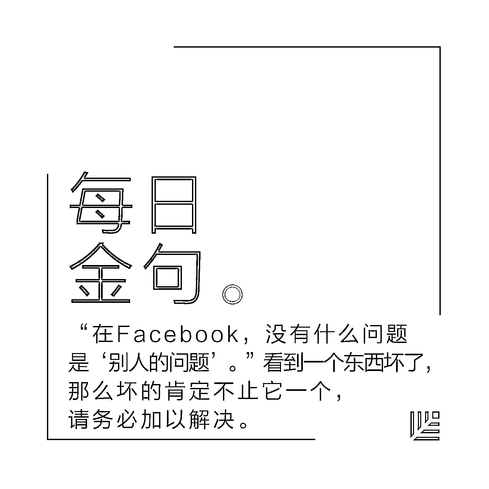
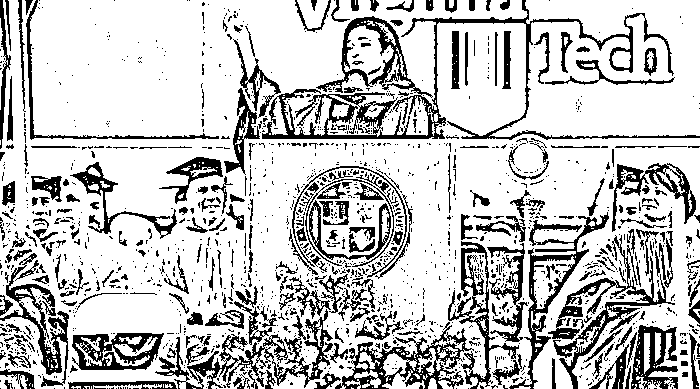
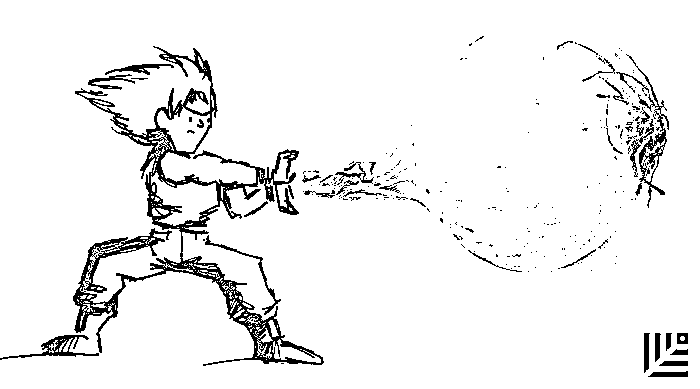

# Facebook COO 桑德伯格毕业演讲：人生需要韧劲 | 红杉汇内参

> 原文：[`mp.weixin.qq.com/s?__biz=MzAwODE5NDg3NQ==&mid=2651223223&idx=1&sn=09fbf0351cff1cfe3a43d92b05903233&chksm=80804ae3b7f7c3f5410155d243a1def6ace1af675aea6f965b0c57a2d4e3df49711548e4a600&scene=21#wechat_redirect`](http://mp.weixin.qq.com/s?__biz=MzAwODE5NDg3NQ==&mid=2651223223&idx=1&sn=09fbf0351cff1cfe3a43d92b05903233&chksm=80804ae3b7f7c3f5410155d243a1def6ace1af675aea6f965b0c57a2d4e3df49711548e4a600&scene=21#wechat_redirect)

[编者按] 2 年前的 5 月 3 日，Facebook 首席运营官雪莉·桑德伯格（Sheryl Sandberg）的丈夫意外去世。失去一生挚爱的打击，让桑德伯格重新学习如何变得坚强：“最终被用以塑造你的是你所走过的那些艰难，而非浮名虚利。”

今年 5 月 12 日，桑德伯格受邀在弗吉尼亚理工学院毕业典礼上演讲时，再次回忆起 2 年来自己如何挺过艰难时光，并特别谈到了一个主题词：韧劲。

而对创业公司团队来说，也需要构建集体韧劲。这意味着站在他人的立场，理解他人的观点，并寻求共识。进一步地，要学会建立有韧劲的企业，能够抗击风暴、能够熬过冬天、能够从挫折中成长。

每期监测和精编中文视野之外的全球高价值情报，为你提供先人一步洞察机会的新鲜资讯，为你提供升级思维方式的深度内容，是为** [ 红杉汇内参 ]**。

 ***

**【内参】**

Facebook COO 桑德伯格毕业演讲

**人生需要韧劲**

翻译：雁行    编辑：洪杉

**祝**贺弗吉尼亚理工学院（Virginia Tech）2017 届的毕业生们！

今天，我想谈谈韧劲。

近两年来，我都在研究韧劲这个东西，因为我经历的事情，它所要求我具备的，是以前的我自认为做不到的。

两年零十一天前，我的丈夫戴夫突然意外离世。有时候，这些话我至今仍难以启齿，因为我到现在还是不太能接受那个现实。那天早上，我同往常一样醒来，以为那又是个普普通通的日子，然后，我的世界就彻底地改变了。

我知道，这么重要的一个日子——天还下着雨，我却在这里谈论死亡。但我向大家保证，这样做是有原因的，而且，这个原因并不悲伤。

因为，戴夫死后，我明白了一些道理，它们从根本上改变了我看待世界的方式，以及处世的态度。我想在今天和大家分享一下，因为我认为，这能帮助你们过上更加幸福、健康、快乐的生活，而你们值得拥有这样的生活。

大家走到这一天，都走过了各自独特的历程。有的经历过真正的创伤，但所有人都面对过挑战。失望、心痛、失落、病痛，这些遭遇都是非常私人的，然而同时它们也具有普遍性。

每次面临生命中的艰难时期，我都会用读书的方式加以克服，在戴夫死后，我也采取了同样的办法。我的朋友亚当·格兰特（Adam Grant）是一名心理学家，研究人类如何在生命中找到意义。于是我和他一起，开始钻研韧劲的相关研究。

**我学会的最重要的一点是，坚韧不拔这种品质并不是天生的，也不是一成不变的。它是一种力量，也就是说，它是可以在锻炼中增强的。**

**集体韧劲，通过共同经历来构建**

人的韧劲是锻炼出来的。我们可以将它传递给挚爱之人，也可以作为群体，共同构建，即“集体韧劲”。这是一种强大的力量，是当前我们的国家和世界都亟需补充的力量。我们在彼此的联系中找到活下去的意愿，找到爱的心胸，以及改变世界的能力。

2017 届的毕业生们，你们尤其适合构建集体韧劲这项任务，因为你们毕业于弗吉尼亚理工。这种社群的形成并非偶然，它们的出现离不开人们具体而微的构建与巩固。

不论你们有没有意识到，你们都是这个社群的一部分。在你们离开学校、成为领导者的过程中——没错，你们会成为领导者，并注定成为领导者——你们可以让所在社群更加强大。

这里就是你们开始的地方。

集体韧劲可以通过共同经历来构建。我们都需要后援团，尤其是当前路遇阻时。一旦离开校园，踏上社会，你们就需要组建自己的后援团，有时，这意味着寻求帮助。

对我来说，开口求人从来不是件容易的事。戴夫在世时，我能不麻烦别人就不麻烦别人。没错，在我的观念里，求助就是“麻烦别人”。但经过这场变故，我对朋友、家人和同事的需要超过了我历来的想象。

今天，我的父母也来到了现场，就像你们的父母一样。最初的几个月，他们时刻陪伴在我的左右，看着我痛哭着睡去。我从未感觉如此脆弱。但我学会了一点：依赖他人也需要勇气。有的时候，我们需要“向前一步”，但有的时候，我们也需要依靠他人。

组建后援团还意味着对朋友的困境表达同情。在失去戴夫之前，如果我的朋友有难，我通常会表示同情，但不会重复第二遍。过后，我就不愿再提，怕勾起他们的痛苦回忆。

但失去丈夫的经历让我明白，这样想是多么天真。我的那种痛苦无止无尽，岂是外人所能“提醒”的。但当人们在我面前，却又不敢提及那件事的时候——就像我当初所做的一样，无论我走到哪里，尴尬的气氛就会尾随到哪里。

可以造成这种尴尬的，不仅仅是死亡。想知道怎么让一屋子的人鸦雀无声？很简单，就说你得了癌症，或者你父亲进了监狱，或者你刚刚失业。我们恰恰会在最需要彼此的时候，陷入沉默。

诚然，并不是所有人都想对自己的苦难喋喋不休。但如果你能告诉朋友：“我知道你难过，我陪你。”那么，任何阴霾都会随之消散。

如果你是谁的后援团，请不要只提供泛泛的帮助。在我失去戴夫之前，当朋友经历艰难时，我总会说：“有什么我能帮忙的吗？”虽是真心实意，但这样做的问题在于，你把包袱甩给了对方。我面对这个问题时，就完全不知道如何回答。难道说，“你能取消父亲节吗？”

不妨换个方式。

一次，我朋友丹·莱维（Dan Levy）的儿子生病住院，他的朋友发来短信问：“汉堡要什么馅儿的？”另一个朋友从医院大厅发来短信说：**“我会在医院大厅里呆一小时，提供拥抱，下不下来由你**。”

你大可以出现在他们身边，不用做什么惊天动地的大事，不用等到人家开口，也不必是人家的发小。如果你们能在彼此有难时相互陪伴，如果你们能一起开怀大笑、抱头痛哭，甚至没问清楚，就擅自带来一个选错配料的汉堡——那么，你们不但将更加坚强，还能过上更加深入、更有意义的生活。

**构建集体韧劲**

**意味着理解他人眼中的另一个世界**

集体韧劲还可以通过共享的故事来构建。这听起来也许不算什么——一个故事能有几斤几两？但故事至关重要。**我们用故事解释过去，并为未来设置期待。他们帮助我们构建共识，而社群就是在共识之上建立起来的。**

共享的故事对抗击不公与发起社会变革至关重要。几年前，我们创立 LeanIn.Org，倡导性别平等，帮助男性与女性形成 Lean In Circles（中文译为励媖圈），即互相扶持以实现个人抱负的小型团体。目前，这样的团体已经有 3.3 万个，分布于 150 个国家。但直到失去戴夫，我才理解励媖圈欣欣向荣的原因——因为它们能建立起集体韧劲。

不久前，我去了趟北京，并有机会见到来自中国各地的励媖圈的女性。在中国，就跟在很多地方一样，做一名女性着实不易，只要过了 27 岁仍未婚嫁，你就会被称为“剩女”。

相比之下，“寡妇”还算是客气的，“剩女”背负着深重的负面含义。一名 36 岁的经济学教授 15 次相亲被拒，不为别的，就因为她学历太高。后来，她的父亲便不允许她妹妹读研究生了。

但还是有 8 万多女性加入了励媖圈，创造新的故事。《剩女独白》就是其中之一，这场话剧歌颂了“剩女”，探讨了那些不被提及的话题，比如性骚扰、约会强暴以及同性恋恐惧。世界为她们设定了一个框架，但她们却说，我们的故事掌握我们的手里，我们不是剩女，我们是强大的，我们将共同谱写属于自己的故事。

构建集体韧劲也意味着理解他人眼中的另一个世界——因为他们属于别的种族、来自别的国家、来自不同的经济背景。我们每个人都有自己的故事，但团结起来，我们也能谱写新的故事，而这意味着站在他人的立场，理解他人的观点，并寻求共识。

**我最喜欢的希望是“有谱的希望”**

你们是否对未来感到一丝丝的焦虑？不确定未来会走向何处？有时候，我也会这样。你们知道克服这种担忧靠的是什么吗？不是别的，正是希望。这个小小的单词捕捉到了一个伟大的概念。

希望分很多种。希望你心仪的她不要漠然以对。希望你们坐在这里的时候，行李就能自动打包。很遗憾这不能实现。**我最喜欢的希望是“有谱的希望”，也就是说，只要采取行动，你就能改善局面。**

我们通常认为，希望是个人的。但和韧劲一样，希望是我们共同培育的东西。就在两天前，我拜访了查尔斯顿的以马内利圣母教堂（Mother Emanuel）。我们都知道，两年前，那里发生了枪击案，一位牧师和八名礼拜者不幸丧生。

但后来的进展令人肃然起敬。这个社群非但没有被仇恨所淹没，反而联合起来，对抗种族主义和暴力。正如当地牧师杰梅因·沃特金斯所言：“对于仇恨，我们说，今天没门。对于分裂，我们说今天没门。对于失去希望，我们也要说，今天不可能。”

这就是我读过的最动人的 Facebook 帖子的主题。要知道，我读过的 Facebook 帖子不在少数。

另一篇帖子的作者是巴黎记者安托万·莱里斯（Antoine Leiris），他的夫人埃莱娜死于 2015 年的巴黎恐怖袭击。

两天后，仅仅两天之后，他就公开致信杀死妻子的恐怖分子：“周五晚上，你们夺走了她的生命——一个了不起的人，我的一生所爱，我儿子的母亲。但你们不会收获我的仇恨。我那 17 个月的儿子会像往常一样玩耍，他一生都会快乐、自由，让你们无法得逞。因为，你们也无法收获他的仇恨。”

这样的力量让所有目睹它的人都变得更加强大。这样的希望让所有人都满怀信心。我们彼此鼓舞，这就是集体韧劲的作用。对霍奇们（指弗吉尼亚理工学院毕业生——编者注）来说，这也许是理所当然的，因为集体韧劲的这些品质——共同的经历、故事和希望——照耀着这所大学的每一个角落。

你们证明了勇气、信念和爱，十年来如此，十年前的几个世纪都是如此。这所大学对你们意义重大，但也对美国和世界意义重大。无数人都将你们作为强大、勇敢和真诚的榜样。

这就是你们留下的宝贵遗产，2017 届毕业生们，你们将随身携带这种能力——这种在自己身上寻找力量，并赋予周围人以力量的能力。

弗吉尼亚理工给了你们一个目标，这个目标就体现在校训之中：“为了服务”（That I May Serve）。而服务和领导的一个重要方式，就是构建韧劲。我们有责任帮助家人与社群变得更具韧劲，因为我们无法单独渡过难关。只有团结起来，我们才能克服一切。

在你们离开这座美丽的校园、踏足社会之际，请构建起自己的韧劲。当悲剧或失望降临时，要知道一点，在你们内心深处，你们有能力渡过一切。我保证，你们可以做到。正如格言所说，我们比自己想象中更脆弱，也比自己想象中更坚强。

**没有什么问题是“别人的问题”**

建立有韧劲的机构。看到不公要敢于发声，拿出自己的时间与精力，投入有意义的事业中去。**我最喜欢的 Facebook 海报上有这样一句话：“在 Facebook，没有什么问题是‘别人的问题’。”看到一个东西坏了，那么坏的肯定不止它一个，请务必加以解决。**这是校训给你们提出的要求。

两年前，如果有人告诉我，我将失去一生所爱，并变得更加感恩，我是怎么都不会相信的。但事实就是如此。因为今天，我比以往任何时候都要感恩，感恩我的家人，尤其是我的孩子们。感恩我的朋友、我的工作，感恩生命本身。

几个月前，我的表姐劳拉过 50 岁生日。作为毕业生的你们也许无法体会这种年近半百、年岁日长的心情，但你们的父母能够体会。那天上午，我给她打电话，我说：“生日快乐，劳拉。不过我还想说一句，千万别抱怨什么‘我都 50 了’。不要说这样的话。因为戴夫要是活着，今年也 50 了，但他没有这个机会。”

**我们要么变老，要么没机会变老。不要再拿年纪大挖苦自己了。**每一年，每一刻，都是一种恩赐，哪怕你坐在瓢泼大雨之中。

你们不用等到特殊的场合，比如毕业典礼，才来感受并表达对家人、朋友、教授、咖啡师和所有人的感恩之情。细数自己的福分，能够让它们更加深厚。会花时间感恩的人也更加健康、快乐。

去年，我的新年决心是在每天睡觉之前，写下一天中的三个快乐时刻。这件简单的事情改变了我的生活。因为我意识到，**曾经，我每天睡觉前都想着自己做错了什么，明天会做错什么。现在，我想的是我做对了什么。**

而且当这些快乐的时刻发生时，我也会更加关注它们，因为我知道，晚上要把它们记录下来。大家不妨一试。从今天晚上开始，从这个充满快乐回忆的日子开始。

毕业生们，在未来的道路上，你们会有顺利的时候，也会有艰难的时光。请携手共进，寻找共同的经历。写下共同的故事，创造出你们想要生活的世界，在你们加入和形成的社群中构建共同的希望。最重要的是，感恩生命，感恩它带来的意义、快乐和爱的机会。

今晚我记录三个快乐时刻时，我就会写下这个时刻，记下这种希望，以及这个社群的惊人韧劲。也许你们会写：这人总算唠叨完了。

整个世界就在你们面前。你们会有怎样一番作为呢？我将拭目以待。

祝贺大家，加油霍奇们！

（译文转载：微信公众号[造就] ID:xingshu100）

 ***

**【情报】**

#加油，全速前进！#

**为何你在不急需的时候就应该融资**

*   可以快速地获取机会：当你试图积极地扩大公司规模时，动力是关键。如果你在为产品、团队及其他增长机会寻求合适的投资上花的时间过多，机会就会溜走，潜力也会下降。

*   零压力的决策更佳：谁也不知道未来 6 个月内的经济走向，融资环境瞬息万变。如果你在紧迫关头才被迫筹资，你可能会长期受到市场的摆布。

*   获得喘息的空间：在经济低迷时期做出更明智的决策，在经济繁荣时期做出改革性决策。

#灵感是创造差异化的唯一且最重要的催化剂#

**怎样建立一个灵感创新的企业？**

“启发（inspire）”在拉丁文中意为“呼吸”和“勇气”，在中古英语中意为“融入灵魂的理性”。获得灵感就是从各种不同形态、类型和语境的事物中学习并不断发现的过程。现代企业中，管理者需要将“灵感创新”作为一件长期的工作来看待。

*   **最佳的学习地点，可以来自意想不到的地点、部门和实践。**而如果一个公司或部门陷于“体量太庞大，不能失败”的心态，那么跨界思维真的显得尤为重要。

*   **Re-Mix。获得灵感的最佳方式之一是练习横向思维。**这是一种将看似分离的区域上的点连接起来的能力，是关于混合和对习惯的微调。

*   **学习时装界思维。**设计师常常在“街上”取材，并把精英理解为对旧有范式赋予新观念和解读。

*   **俯瞰思维。**停下脚步抽象地思考一下，在元数据层面上，该行业需要询问的问题是什么？如果你是家玩具公司，你是否过于关注市场份额，而应该以思考“为什么孩子喜欢玩？”这一问题来引导市场研究？

*   **经常与合作伙伴沟通能够极大促进您的商业灵感。**

#自满是一件非常愚蠢的事情#

**一家 Fintech 公司的创业感悟**

*   在职业生涯的早期阶段，除非你拥有超乎常人的创业天分，否则加入一家能够提供培训的大型机构可能更好。

*   为犯错做好准备。

*   ……因为失败是一件好事。与客户首次接触时，商业计划总会被毙掉。所以没有必要认为第一次就一定要做一些完美的事情。

*   创业必须出手迅速，动作敏捷。

*   不要因为发展太快而让公司变得庞大。

*   是否做好创业失败的心理准备。

*   不要自鸣得意。

*   学会适应新技术变革的冲击。

***

**【往期回顾】**

红杉汇内参第 033 期

[你准备好应对一场企业危机了吗？](http://mp.weixin.qq.com/s?__biz=MzAwODE5NDg3NQ==&mid=2651223172&idx=1&sn=6fe5ca6893119f5749202949dffbc106&chksm=80804ad0b7f7c3c60debfd4936472cc1fc7b4d1fd2ecb1a686d450eba69d8ed2119a25d8fd5c&scene=21#wechat_redirect)

红杉汇内参第 032 期

[从烧钱数百万到七个月内扭亏为盈，](http://mp.weixin.qq.com/s?__biz=MzAwODE5NDg3NQ==&mid=2651223122&idx=1&sn=b990caa2eb4870ce38b7023df8853823&chksm=80804a06b7f7c310fbc5b99409535f5a18b288df6b765b6d9264f3e76ada5720a1a4640e3308&scene=21#wechat_redirect)

[这位创始人如何做到的？](http://mp.weixin.qq.com/s?__biz=MzAwODE5NDg3NQ==&mid=2651223122&idx=1&sn=b990caa2eb4870ce38b7023df8853823&chksm=80804a06b7f7c310fbc5b99409535f5a18b288df6b765b6d9264f3e76ada5720a1a4640e3308&scene=21#wechat_redirect)

红杉汇内参第 031 期

[创业公司如何实现高增长？](http://mp.weixin.qq.com/s?__biz=MzAwODE5NDg3NQ==&mid=2651223072&idx=1&sn=d59f1af3a43bd0945b66333cd630b992&chksm=80804a74b7f7c362ef2127ee20f3fc0de723d8004558c6f28afa96ba9ddfc7e96e848d754d94&scene=21#wechat_redirect)

[这里有 8 位老司机的朴素经验谈](http://mp.weixin.qq.com/s?__biz=MzAwODE5NDg3NQ==&mid=2651223072&idx=1&sn=d59f1af3a43bd0945b66333cd630b992&chksm=80804a74b7f7c362ef2127ee20f3fc0de723d8004558c6f28afa96ba9ddfc7e96e848d754d94&scene=21#wechat_redirect)

