# 他们经历过创业路上的“丧”，但成功活过来了！警记这 12 段话｜红杉汇内参

> 原文：[`mp.weixin.qq.com/s?__biz=MzAwODE5NDg3NQ==&mid=2651223379&idx=1&sn=81825e41ba10e6fda2707248f5ad0562&chksm=80804b07b7f7c211812c88010edfed7acea8c2c24227abdd66e25b4a2c343e6532752df75cbe&scene=21#wechat_redirect`](http://mp.weixin.qq.com/s?__biz=MzAwODE5NDg3NQ==&mid=2651223379&idx=1&sn=81825e41ba10e6fda2707248f5ad0562&chksm=80804b07b7f7c211812c88010edfed7acea8c2c24227abdd66e25b4a2c343e6532752df75cbe&scene=21#wechat_redirect)

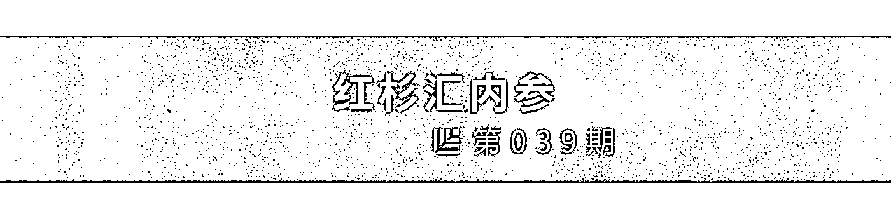

[ 编者按 ] 有人说，创业者本身就是“精神不正常”的人，就像 X 战警，是基因变异后的一群疯子，能够承受非比常人的煎熬，一心追求不甘平庸的极致。

而美国的一项访问了 242 位企业家的心理健康调查也的确发现，49% 的 CEO 都曾经出现过不同程度的心理疾病，其中抑郁症占到 30%，远远高于美国一般大众 7% 患病比例。

过度疲劳、焦虑、焦躁、抑郁……它们是压力所产生的副作用，却不是创业附赠的礼物；它们常见，但并不意味着正常。

这里整理了 12 位企业家/投资人关于如何度过和面对心理疾病的经验、看法、建议，包括埃隆・马斯克、马克・安德森等，他们就是这样成功挺过来了。

每期监测和精编中文视野之外的全球高价值情报，为你提供先人一步洞察机会的新鲜资讯，为你提供升级思维方式的深度内容，是为 **[ 红杉汇内参 ]**。

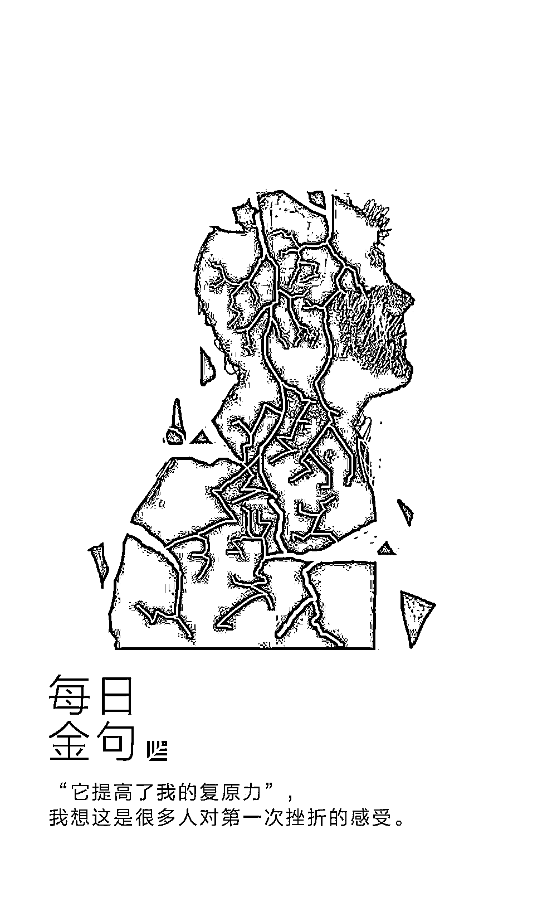

** 内参**

**过度疲劳、焦虑、抑郁：**

**他们经历过创业路上的“丧”**

**但成功活过来了**

综合编译 / 洪杉

几年前，一位名叫迈克尔・费里曼的医生曾对 242 名企业家进行一项心理健康调查，结果发现，49% 患有心理疾病。这其中，**患抑郁症的企业家最多，占 30% 。紧随其后的是多动症（29%）和焦虑（27%）。**

任何一位企业家可能都会告诉你：创业本身就是一件充满压力的事情。

如果你是一个创业者，如果你正经历焦虑、抑郁、失眠等难熬阶段，要知道你并不孤单——以下这些著名的企业家、投资人，都曾经历过这一切。

**1.马克・安德森**   ︳网景/ A16Z 创始人

“创业会让你的心情像过山车一样，这和你之前一切的经历都不同，而且变化相当快——

有时你信心满满，确信自己会赢得全世界；

而在另一天你又会感觉厄运似乎在几个星期后就会到来，所有的一切都将毁掉，必须从头再来。如此反反复复。

实际上，你所做的一切有太多的风险和不确定性。而你的压力又会以难以想象的力量将事情无限放大，有时会膨胀到不可思议的高度，有时又会跌入难以置信的深渊。但这很有趣对吗？”

**2.埃隆・马斯克**    ︳特斯拉/ SpaceX 创始人

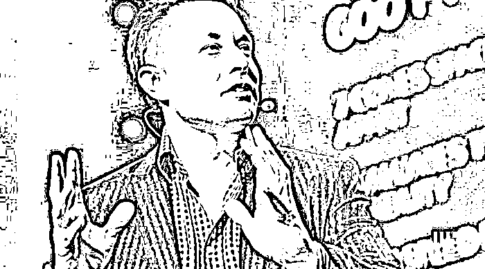

“创业就像嚼玻璃和凝视深渊一样。虽然有时，你不再望向深渊，但是却不会停止嚼玻璃。”

——《嚼玻璃与创业》

*（Eating Glass and Starting Up） *

**3.蒂姆・菲利斯 **   ︳ 纽约时报畅销书作家、天使投资人

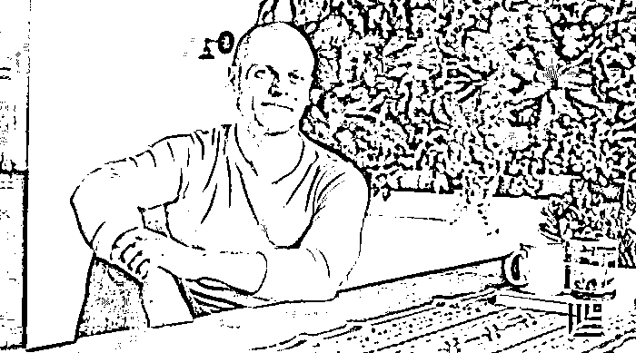

“事实是，无论你是怎样的人，驱动型人格也好，易紧张的 A 型人格也好，企业家也好，别的职业也好，你都无法幸免于情绪波动这件事，因为它是你基因中的一部分。我们要正视情绪上的波动，这是一把双刃剑。”

——《关于自杀的若干实用思考》

*Some Practical Thoughts on Suicide*

**4.  本・霍洛维茨**   ︳A16Z 联合创始人、《创业维艰》作者

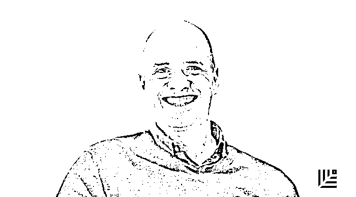

“怎样应对压力？我见过 CEO 疯狂饮酒、退出、甚至放弃。每当这种情况发生时，CEO 们都会有一个绝妙理由来解释他为什么可以这样做。但伟大的 CEO 会直面痛苦，去应对不眠之夜、冷汗、以及所谓创业‘酷刑’。

每当遇到一位成功的 CEO，我就问他们是如何做到的今天的成就。一般的 CEO 会回答说，这是因为绝妙的战略举措、卓越的商业嗅觉或其他沾沾自喜的解释。而伟大 CEO 的答案往往非常一致，他们会说：‘我没有放弃。’”

——《什么是最困难的 CEO 技能？管理自己的心理学》

*What’s The Most Difficult CEO Skill? Managing Your Own Psychology *

**5.  布拉德・菲尔德**   ︳Foundry 集团联合创始人

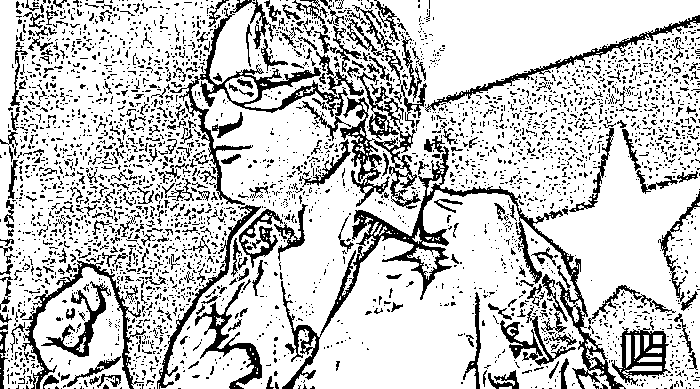

“这是初创企业不太了解的话题。毕竟，这是将‘让自己振作起来’这句陈词滥调变成流行热词的文化。承认自己与抑郁作斗争就像是承认自己无法振作起来。大家都认为成功人士能够轻易‘摆脱’。

但事实并非如此……抑郁好像带有一种耻辱感。我们听说的很多故事，都描述一个企业家如何逼迫自己超越身体和心理的极限。他没有获得平衡。

我自身的经历让我意识到，这种不平衡性绝非创业所需要的。事实上，是有害处的。

我度过那段黑暗的日子的唯一方法，就是不断更新自己和关于自己的看法。

从头再来是创业过程的一部分，这是创业者应该比任何人都清楚的一点。”

——《创业生活不应该是这样的，对吗？》

*Entrepreneurial Life Shouldn’t Be This Way–Should It?*

 **6\. 米尼・英格索尔   **︳Shift 联合创始人

“但是，对于我而言，这是一次意义深远的经历。

‘它提高了我的复原力’，我想这是很多人对第一次挫折的感受。

它让我变得更富同情心，这在工作上的重要性超乎你所想。

它还丰富了我在这个世界的经历。

我曾因为它而感到羞愧——抑郁、想自杀、饮食不规律。

但随着时间推移，我渐渐放开了，因为也有很多人与之抗争。”

——《 9 位女创始人如何学习庆祝失败》

*9 Female Founders on How They Learned to Celebrate Failure*

**7\. 马克・萨斯特**   ︳Upfront 投资管理合伙人

“我很幸运，我的大脑并没有被抑郁症纠缠，但我也很清楚，这是一种需要正名的疾病和临床状况。我一生中结交了太多有抑郁症却不知道这一点的人。

如果你也像我这样幸运，没有抑郁倾向，那么请你付出更多的同情心对待那些和我们有着不同思维方式的人。

通常我们面对抑郁症患者会说‘振作起来，朋友！生活没那么糟糕。没有什么好郁闷的！’

但通过阅读我逐渐认识到，它是一种状态，缠绕着大脑，而不是能简单‘摆脱’的东西。”

——《我们要对那些有抑郁症的人抱有同情心。这是一种疾病》

*We Need to Have Empathy for Those With Depression. It is an Illness *

**8\. 诺亚・卡根**   ︳Sumo 创始人

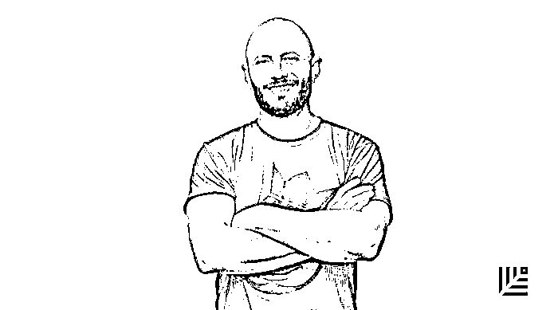

“当你悲伤时，写出所有的感受。当你感觉好一点的时候一笑置之。

找出其中的模式：自己是何时、何地、为何处于这种心情的。

我把它写在便利贴上，难受的时候试着让自己回到开心时的环境。”

——《 36 种处理抑郁症的方法》

*36 ways to Deal with Depression*

**9\. 詹姆斯・阿尔图切尔**   ︳畅销作家

“ 2002 年年中，我很抑郁，束手无策。

抑郁症会烧焦大脑的每寸土地。

我会静坐在凌晨 3 点的黑暗里。如同一个摇摇欲坠的王国的君王。每一天我都会变得更穷一点，却又无能为力。破产非常可怕。

我用酒精助我入眠，然后拒绝醒来。接着恐惧重演，直到我再次睡着。

我假装对我的孩子微笑。我假装对我的妻子微笑。

人们说，当你假装微笑时，常常能带来幸福，因为你在愚弄你的大脑，以为你很开心。

我可以告诉你：我的大脑没有被愚弄。相反，假笑让我更加抑郁。”

——《点子数学的魔法》

*The Magic Of Idea Math*

**10\. 克里斯蒂娜・华莱士**   ︳BridgeUp 创始董事

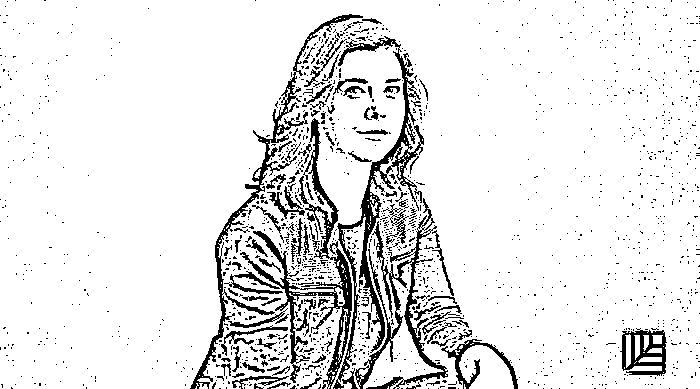

“当我的创业公司处于危险边缘时，我陷入了恐慌。我不知道这算不算一个抑郁症的临床病例。我爬到床上呆了三个星期，没有跟任何人说话，除了开门取外卖时我才离开床。我从头到尾看完了整整七季的《白宫风云》，并且一边抽泣。

我为公司的终结哀悼，为三周前逝世的、养育我的祖母哀悼。而且，坦白说，我还在哀悼我和我的创业合伙人撕破脸了。

但我第一次有这种感觉并不是在我的公司关门的时候。在创业的两年中其实也有太多这样的时刻，我是哭着入睡的。但那时我有朋友可以倾诉、有同甘共苦的同事、有请我吃饭的朋友们，他们的电话阻止了我做傻事。”

——《让我们了解创业与心理健康 》

*Let’s Get Real About Startups And Mental Health*

**11\. 兰德・费西金**   ︳Moz 创始人

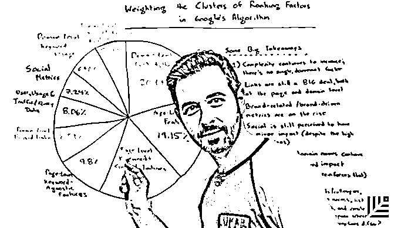

“抑郁的兰德很怪异。别误会，正常的兰德也很怪异。但是，抑郁的兰德会将坏事放大十倍，将好事最小化。他甚至拒绝承认好消息，这是因为他是个聪明人，他可以论证为什么好消息实际上只是暂时的，而且随时都可能变成坏事。怪异的是，我觉得抑郁的兰德实际上是真实的我。”

——《一个漫长而丑陋的压抑年终于过去了》

*A Long, Ugly Year of Depression That’s Finally Fading*

**12\. 山姆・奥特曼**   ︳Y-Combinator CEO

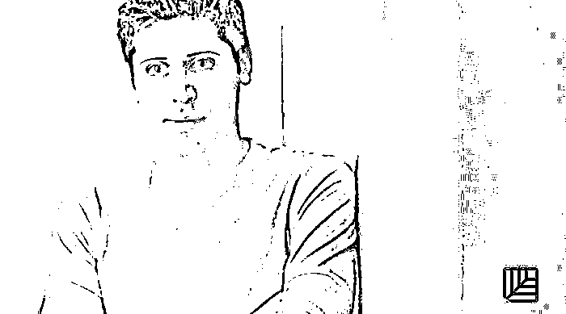

“如果你问一个创始人，他的创业公司怎么样，答案几乎都是各种‘好’。

作为创始人，既要对内对外都不能展现弱点，还要加油鼓劲，这造成了巨大压力。你周围的世界会崩塌，而你又必须强大、自信和乐观。

失败很可怕，但显现出愚蠢的姿态也很可怕。

创始人的肩上最终会有许多重担——他们要顾及员工、家人、客户和投资者等。创始人通常觉得有责任让大家开心，尽管这常常跟利益相悖。从某种意义上说，创业者是孤独的，即使有联合创始人。

因此，很多创始人最终在某些时候感到非常抑郁，而且他们一般不会和任何人说。公司通常难以度过这些黑暗时期。”

——《创始人抑郁症》

*Founder Depression*

** 情报**

#新赛道已铺就#

**混合现实将在与 AR/VR 的竞赛中完胜**

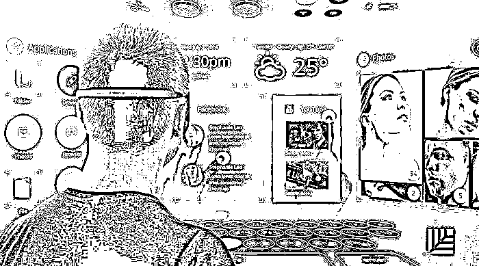

▨ 混合现实（MR）完全有成为主流应用的潜力。因为它并非将现实世界替换成其他环境来欺骗用户，而是通过扫描空间，再将数字动画叠加其上，用户可站在原地无需移动，也不会被困在黑暗的环境中。

▨ 混合现实解决了 VR 环境所带来的不适感（如眩晕、恶心等），你既能与外界互动，又不会产生身处陌生环境的错觉。

▨ 其工作原理是将周围世界映射出来，也就是“空间映射”，从而渲染真实图像，并将其呈现在一个三维环境中。它将物理世界和虚拟世界融为一体。

▨ 在教育、医疗保健、自动化、航空和建筑等不同领域有广泛应用前景。如设计师可在结构和概念设计时使用头戴式设备，从而自由查看模型内部的情况。

▨ 美国 NASA 已采用混合现实技术训练宇航员。今年，宝马也在即将发布的新车上部署了 MR 。

#除了自建业务能力，你还不妨考虑：#

**如何成功收购另一家创业公司？**

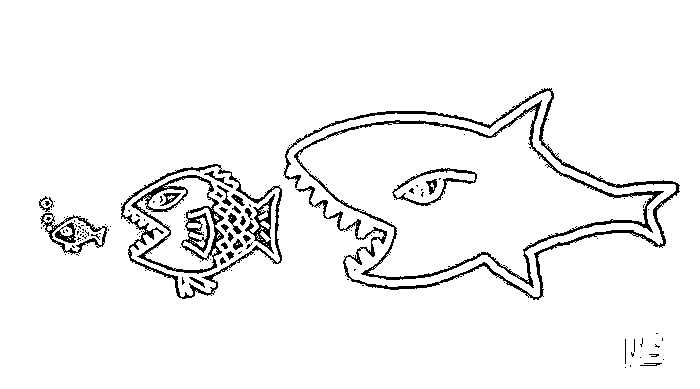

其方法论与一般的并购整合大同小异：

▨ **调查候选对象**。避开那些看起来像是陷入困境的公司，因为没有人想接手一堆问题。

制定战略收购方案。采取过程研究法，包括方法、时间表、协议、沟通以及交易最终达成等一系列步骤。

▨ **花时间互相了解。**这一经历有点类似于约会，花时间一同出游、互诉过往和信息、讨论你们对于未来的信念和抱负。你会真正明白双方是否志趣相投，你们之间的关系是否能长久。这一过程包括访问团队的所有成员、分享财务信息、记录战略内容并量化结果。只有完成这些工作后，你才能真正将这次收购视作正确之举。

▨ **不要急于推进整合过程。**找到协同之处很重要。

▨ **莫忘收购初衷，实现预期结果。**

#它的“自由与责任”早已是硅谷名篇#

**Netflix 是如何建立强大的企业文化的？**

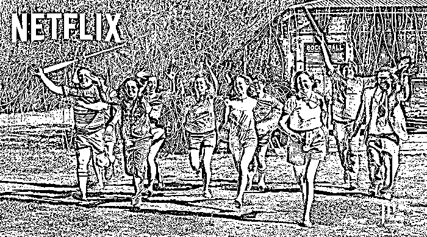

▨ CEO 里德・黑斯廷斯亲口阐释强大的文化是如何帮助公司走出低谷、挑战客户满意度的极限并促进创新的：

▨ **戒除“新奇事物综合症”。**“我们从战胜百视达的过程中学到的是，意识到追求卓越和专心致志有多么重要。”

▨ **让每个人都 All in 。**“不断地鼓励员工去思考如何改善文化而不是保守传统的方法。”

团队不是家。让一个家族强大起来的特质——忠诚、持续的支持，在企业环境中不会起作用。团队更像是一支体育队伍，为夺冠而努力。

▨ **信任员工，让他们自主管理时间。**

▨ **诚实为上策。**组织以“开始、停止、继续”为主题的餐会：每个人都向别人倾诉自己希望对方开始、停止和继续哪些行为。

▨ **更多一对一会面。**“我尽全力让员工明白，我并不是要当他们的管理者，而只是想了解事情的进展并帮助他们了解公司的变化。” ****

** 推荐阅读**

壹

[赫拉利再论“未来简史”：哪些人类将沦为无用阶层](http://mp.weixin.qq.com/s?__biz=MzAwODE5NDg3NQ==&mid=2651223372&idx=1&sn=4336b249f0965146c8c7b3c19c4f2923&chksm=80804b18b7f7c20e50a200a0858a57bb6131c4c017ad9fc7244ca228571403d17aa389a07b53&scene=21#wechat_redirect)

贰

[领英《全球 AI 领域人才报告》：华人力量正在崛起](http://mp.weixin.qq.com/s?__biz=MzAwODE5NDg3NQ==&mid=2651223375&idx=1&sn=430e52a2842e6c96cb7333539521cee3&chksm=80804b1bb7f7c20d19f9ae14aa3d2c8691a8613a347e4fe19c792607833f15a94889596e1f17&scene=21#wechat_redirect)

叁

[怎样打造一支地表最强战斗力的铁军](http://mp.weixin.qq.com/s?__biz=MzAwODE5NDg3NQ==&mid=2651223361&idx=1&sn=7eddea3a2438979c72b9030395b84d4e&chksm=80804b15b7f7c203c7d4735420c54084afa12d50f56bbfae33dbc9b9445bad7c5c269284dbaf&scene=21#wechat_redirect)

肆

[德邦崔维星：用速度跑赢时间，是我们唯一的生机](http://mp.weixin.qq.com/s?__biz=MzAwODE5NDg3NQ==&mid=2651223364&idx=1&sn=0c32937f0647195ee3294cd7c62254e3&chksm=80804b10b7f7c206207852365fc02e006ea605d6e86830bafb4a4245bc9634b6cdafa2e81ae2&scene=21#wechat_redirect)

伍

[通用、Twitter……连美国 FBI 都在使用的管理方法](http://mp.weixin.qq.com/s?__biz=MzAwODE5NDg3NQ==&mid=2651223367&idx=1&sn=84372101747d2997acb50e0f35e8989a&chksm=80804b13b7f7c205e3bc0b554dd00ee462834f5d3f05b770e4daa32526d4fa930466f49928fc&scene=21#wechat_redirect)

