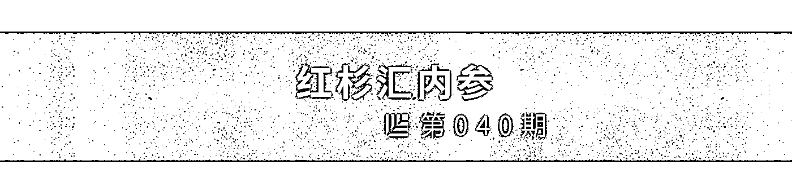
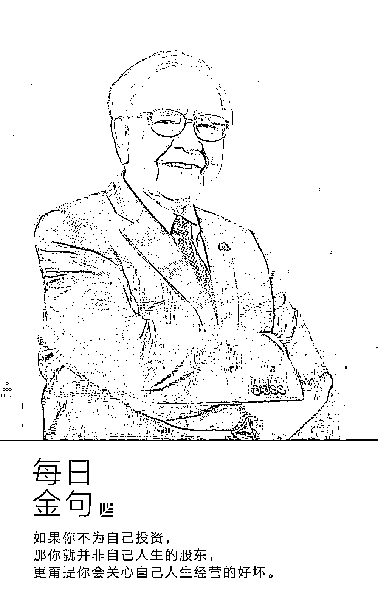
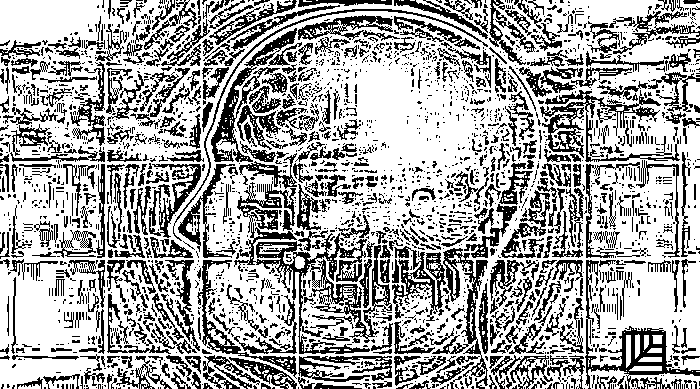

# 成为巴菲特，不如说成为更好的自己｜红杉汇内参

> 原文：[`mp.weixin.qq.com/s?__biz=MzAwODE5NDg3NQ==&mid=2651223408&idx=1&sn=dbfc1d892c51421a0b042b0e732c3111&chksm=80804b24b7f7c2325e3521a8e8ee192a1808c690ced607b55a5c30173242efc213ed7a7e0f1d&scene=21#wechat_redirect`](http://mp.weixin.qq.com/s?__biz=MzAwODE5NDg3NQ==&mid=2651223408&idx=1&sn=dbfc1d892c51421a0b042b0e732c3111&chksm=80804b24b7f7c2325e3521a8e8ee192a1808c690ced607b55a5c30173242efc213ed7a7e0f1d&scene=21#wechat_redirect)

[ 编者按 ] 美国商业哲学家吉米・罗恩说过：跻身百万富翁之列所得到的最大回报，不在于你挣了多少钱，而是为了这一目标，你成为了什么样的人。

如果人生也是一项资产需要经营、需要投资的话，那么你首先应该投资的就是你自己。

比如：把目前收入的至少 10% 投入到自我教育中；把业余时间的 80% 用于学习；工作的目的不是为了赚钱，而要在工作中去学习；以及，学习的目的不是为了获取知识，而是为了获得智慧。

许多人有钱，却在生活中的其他重要领域“资本”匮乏。说到底，财务自由的真相，不是拥有多少金钱，而是你不再为金钱所奴役。

创业，难道不就是为了成为更好的自己么？

每期监测和精编中文视野之外的全球高价值情报，为你提供先人一步洞察机会的新鲜资讯，为你提供升级思维方式的深度内容，是为 **[ 红杉汇内参 ]**。

** 内参**

**成为巴菲特，**

**不如说成为更好的自己**

综合编译 / 洪杉

大多数人寄希望于自己的境遇能够来个神奇的转变，却不曾想过通过提升自己，主动地改善自己的境遇。

不同于那些只会一味等待和祈求幸运降临的芸芸众生，你可以选择为自己加持十八般武艺，去实现卓越。

你能成为多么好的人，你的工作能具有如何重要的意义，这完全掌握在你的手中。但空想祈祷从来不是实现的途径，你得修炼自我，让成功到来。

**1\. 收入里至少 10% 要用于投资自我**

“

跻身百万富翁之列所得到的最大回报，不在于你挣了多少钱，而是为了成为百万富翁这一目标，你成为了什么样的人。

”

—— 吉米・罗恩（美国商业哲学家）

如果你不为自己投资，那你就并非自己人生的股东，更甭提你会关心自己人生经营的好坏。

如果你不为人际关系投资，那你关注更多的也许只是你能得到什么而非你能付出什么。在关于自我提升的投资上，投入收入的 10%，将会得到百倍甚至更多的回报。花在教育、技能和人际关系上的每一分钱，至少将会以百倍的形式回馈于你。

最佳的师友关系中，导师是你花钱请来的。多数情况下，向导师支付的费用越高越好，因为你会更加严肃地看待这段关系。你不会随意对待，也不会做一个单纯的消费者。

只有当你在某一件事上进行了投资，你才会有动力去行动。

你的首选投资对象一定要是你自身。

**2\. 投入至少 80% 的空闲时间到学习上**

我们中大多数人是消费者而非创造者。

工作之外，大多数人也在消磨着自己的时间。然而，只有投资时间，你才能从时间中有所收获。

耗在社交媒体的每一秒几乎都是被消费的时间。这非但不会让你的未来变得更好，实际上只会让你的未来变得更糟。如果你一直不停无意义地在刷屏，你如何能期望会有高价值的工作产出？你的投入直接转化为你的产出。进的是垃圾，出的也只会是垃圾。

**3\. 不要为钱而工作，而要在工作中去学习**

正如大部分空闲时间应该用于学习一样，工作时，你也应该分出大量的时间去学习。

投入到实际工作的精力只能占据你全部精力的 20%，剩下的所有都该花在学习、自我提升和休息当中。

**4\. 不为学习而学习，要学会创造更多价值**

“

成功最重要的秘密不是丰富的经验，而是能够运用经验的能力。知识只有在得到运用的时候才有价值。

”

—— 马克斯・卢科明斯基

信息和知识是两种非常不一样的东西。

知识和智慧又是两个非常不一样的东西。

智慧决定你要学什么，为什么要学，什么时候学。

每当学习的时候，你都应该从学习中得到回报。现在，很多人的读书目的只是为了说明他们读了很多书。如果你不运用所学的知识，你只是在浪费时间而已。

**5\. 将 10% 的收入投资于能够创造更多财富的工具中**

那些高收入的人并非真正的有钱人。大多数人的生活方式与他们的收入水平相对应。他们赚得越多，花得越多。事实上，大多数人赚钱就是为了花钱。

很少人赚钱是为了用这些钱来投资。

你最好将你的工作看作是你收入的一半。你的工作给你带来收入。然后，你还会有一个投资实体将你的收入变为更多的财富。

从今天开始吧。投入收入的至少 10%，创造一个或者几个致富工具。最后，你的投资工具给你带来的收益可能会比你工作还多。与很多高收入者不同，你可以在任何时候决定不再工作，因为你从投资里赚的钱已经足够你过上非常享受的生活了。

**6\. 将你的动机从索取变为给予**

“

世界向给予者给予，向索取者索取。

”

—— 乔・波利希

大多数人只会关注他们能从生活中拿到什么。

什么都是“我、我、我”。

事实上给予比索取更让人满足。而且，你会被你所深信不疑的原因所驱使，不断给予。

当你的动机变为给予以后，你就会经常发现你对人际关系的改善有了更深刻的理解。一些不经意的念头随时从你的脑海中蹦出，让你对不同的人心怀感激。

**7\. 公开承认你对别人的依赖**

即使你的初衷是给予，也不意味着你不会寻求帮助。

事实是，每个人都非常依赖别人来完成自己想要做的事情。但你必须足够智慧、足够谦卑，才会承认这一点。不要将依赖看作弱点，而要意识到这是优势。

你还要不断对你身边的人表达感激之情。而你感激的人，也会对你心怀感激。

人际关系是一种能够并且需要随时间而变得更大更好的资产。所有的人际关系都像是银行账户一样，如果一人不断存款，另一人不断取款，最终所有资源都会耗尽。

**8.创造双赢战略合作伙伴关系，实现十倍甚至百倍目标**

大多数人处于竞争状态，而不是合作。

合作是一个比竞争更高的层次。

竞争侧重自我。这也是非常低等的思维，因为一个人的力量非常有限。

他们更注重输赢，而不是创造真正的解决方案。

但是，合作能创造出独自工作时无法取得的独特联系。只懂得单打独斗的人则会陷入自己狭隘的世界观和固有模式。

当你与其他人合作时，你的想法和目标会发生变化，变得更大、更好，变成不同于自己所能塑造的模样。

不要追求交易式的关系。

**9.设置 10 倍目标，直面恐惧**

看看你现在的目标。

为什么这是你“成功”的指标？

好好想想：如果把目标放大 10 倍会怎么样？

有可能吗？

当然有可能。有的人现在就能赚那么多。

他们和你唯一区别在于他们的教育水平、人际关系和策略。

设定 10 倍目标会是你为自己做的最好的事情之一。你应该在巅峰状态设定这一目标。

只有你自己知道怎样进入充满激情的巅峰状态，尽你所能让自己达到巅峰，然后写下你的目标。说明你要做什么，然后写下这个目标，并将它看作每一天的成就，直到它成为现实。

你可能会被自己的想法吓到。当你把这一想法付诸行动，你就跨越了大多数人从未跨越的边界。这种大胆的工作往往是高利润、高价值的。

**10\. 学会营销**

人们不会无缘无故来买你的东西。

人们也不会无缘无故来读你的文字。

营销，即你“如何”去完成你想做的事。

大多数人不成功是因为他们害怕或避免营销。同理，大多数人都是坏老师。因为他们更注重内容而不是内容的传递和设计。

但是传递——这关于“如何做”的部分——和你正在 “做什么”及其“为什么”做同样重要。

**11\. 关注结果，而非时间和精力**

如果你处在时间-精力型经济中，你的焦点是让自己变得忙碌。你内心相信你投入到某件事中的时间和精力会值得别人的称赞。而当你处在结果型经济中时，你的焦点只是要得到一个确切的结果。

无论身处哪种情形，最根本的都是要确定你认为最重要的是什么，因此，找到实现目标最有效的方法就变得非常重要。这是企业家和雇员之间的一个重要区别。

大多数人不会从结果的角度去思考，因为他们通过薪水就获得了安全感。然而，当你把注意力从你能力的有限转移到你能力的无限，你就改变了自己的工作方式。

**12\. 定期改变你的环境**

工作环境反映了你在做的工作。

在同一个环境中做几种类型的工作是低效的。但是人们总是这样做。他们坐在同一个位置，脑海中变换着一个又一个任务。

一个更好的方法是分批处理你的工作并且在相关环境中完成它。

**13\. 为你自己定义“财富”和“成功”**

成功和财富不仅仅只是金钱。

许多人有钱，却在自己生活中的其他重要领域“资本”匮乏。

对于那些视自身职业为最终信仰的人来说，钱只是一个帮助他们做更多工作的工具。

**14\. 有一个坚定的立场，它会成为你的品牌**

为了成功，你必须有信仰。

你必须有立场。这个立场会成为你的品牌。它会成为你的标志。它会成为让你与众不同的原因。

人们要么对你青眼有加，要么厌恶你。这就是你的目的。不冷不热意味着你不重要。

只有有坚定立场的人才真正擅长营销。他们对自己的信息足够重视，并且把它呈现出来。他们意识到“怎么样”和“是什么”、“为什么”同样重要。

** 情报**

#当会议室装不下所有人时#

**到达 30 人规模的初创企业必读的 6 条建议**

从 30 到 50 的人数变化会引发从大家庭到企业的过渡，由此开始，一切事物都会变得很艰难。这里有六条极富价值的行动指南和建议，来自 Facebook 等硅谷公司的资深人士：

▨ 开始着手建立业绩和薪酬体系。对小公司而言，3 个等级就够了。这听起来很残酷，但却是正确的企业经营之道。

▨ 管理和鉴别最好的产品功能创意。给团队主要成员每人分发 30 美元的投资额度，为数不清的新点子进行民主投票，获得最高“融资额”的想法将得以真正实现。

▨ 当客户数据变得复杂，适时升级你的业务分析工具。

▨ 重新审视并敲定定位描述，但不是制定一份新描述。

▨ 指定安全负责人——兼职的也可以。因为你开始受到关注，某些黑客可能会尝试着不经意地挑衅一下。

▨ 在此时阐明你的价值观。不要太晚，否则那些价值观会朝着自己的方向肆意发展。

#不创新者的窘境#

**为什么说大数据能实现颠覆性创新**

大数据是一种颠覆力。意味着人们需要的不只是新技能、技术和工具，还要以开放性思维来重新思考长期以来遵循的流程和运作方式：

▨ 按照颠覆式创新的提出者克里斯坦森的理论来划分，很多大数据产品尚处于该技术生命周期的早期阶段：出现了各种新市场参与者，伴随着诸多混乱，客户的关注点主要集中在新兴功能上。

▨ 如果掌握了颠覆式创新的核心能力，从各个角度来看，都有攻击传统行业的新机会。

▨ 不一定是从低端市场开始。它是从数据源处开始，然后创建信息化系统来攻击现有行业。

▨ 对新公司来说，这是一个从市场波动、市场变化和颠覆中获益的机会。

▨ 传统企业需要评估：面对新型竞争，你该如何适应？如果数据是颠覆式创新的关键部分，你需要什么能力，这些能力可从哪里获得？

# MBA 课堂上不会告诉你的事#

**如何开一个大家都喜欢的会？真的可以**

我们常常被无休止的会议搞得焦头烂额，工作反而好像变成了会议之间茶歇。事实上，以下三种会议形式已被实践证明有效：

▨ **早餐会：**在早餐店开会能营造出一种传递“内部消息”的感觉，增加信息的价值，还能加固老板与员工之间的关系。

▨ **“社论”讨论会：**效仿媒体关于社论主题的编前会那样，把职级放一边，在平等氛围中进行百家争鸣式的辩论，每个人都充分参与，鼓励不同的想法、意见和批判性思维。

▨ **焦点会议：**确定一个简明扼要的会议主题，有效共享信息，不说任何与会议焦点无关的话，不浪费一分钟。

以下是让会议效果最大化的建议：

▨ 在纸上或者屏幕上有一个准备充分的议事流程；

▨ 明确阐述会议目标；

▨ 培训出高效熟练的会议参与者；

▨ 会议前可以采取一些能提高参与者专注力的措施。****

** 推荐阅读**

壹

[红杉资本：最简明好用的 BP 撰写指南](http://mp.weixin.qq.com/s?__biz=MzAwODE5NDg3NQ==&mid=2651223388&idx=1&sn=b7cb3fdc09ca497195ec7eec75acc693&chksm=80804b08b7f7c21eeef1b74561167de5b957b8713c670bbc0634d4b1b179e1cf865ea1e44085&scene=21#wechat_redirect)

贰

[精彩、简洁、有设计感！这个公司的 Offer 被硅谷热捧](http://mp.weixin.qq.com/s?__biz=MzAwODE5NDg3NQ==&mid=2651223402&idx=1&sn=6ca5d5485087599393c1c7042f46c8f6&chksm=80804b3eb7f7c228740c7e0095b3b9f6d92a02ab539ffa294f2034d6fbc7dad0af57c59ec4f2&scene=21#wechat_redirect)

叁

[他们经历过创业路上的“丧”，但成功活过来了！警记这 12 段话](http://mp.weixin.qq.com/s?__biz=MzAwODE5NDg3NQ==&mid=2651223379&idx=1&sn=81825e41ba10e6fda2707248f5ad0562&chksm=80804b07b7f7c211812c88010edfed7acea8c2c24227abdd66e25b4a2c343e6532752df75cbe&scene=21#wechat_redirect)

肆

[汪静波：坚持自己认为正确的事，而不是一味喂养市场的贪婪](http://mp.weixin.qq.com/s?__biz=MzAwODE5NDg3NQ==&mid=2651223382&idx=1&sn=e1ccb374e4587d8a5d14fb4d806192c3&chksm=80804b02b7f7c214b538f5c130e74f3dacc468d881993e66784ab71e82d95d45bee09011a93f&scene=21#wechat_redirect)

伍

[苹果、Facebook、Google，从科技巨头崛起之路窥探未来趋势](http://mp.weixin.qq.com/s?__biz=MzAwODE5NDg3NQ==&mid=2651223386&idx=1&sn=f2cbee5b8a5631a5e7483b2ef76de5d3&chksm=80804b0eb7f7c218d23f64a9a4dd52d152051f85414e041cadd1145628cc2d448e93285cdd4f&scene=21#wechat_redirect)

