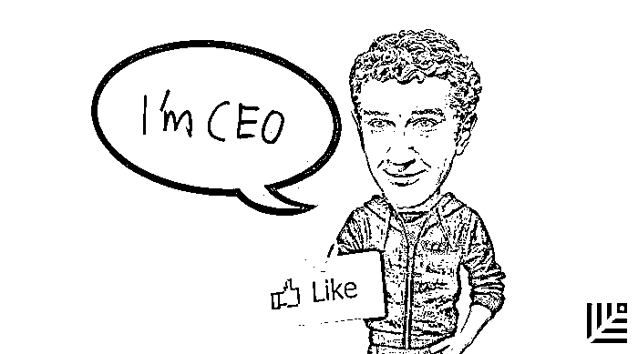

# 贝恩观点：成为一流 CEO 的特别技巧 ｜ 首席人才官

> 原文：[`mp.weixin.qq.com/s?__biz=MzAwODE5NDg3NQ==&mid=2651222638&idx=1&sn=31ef51e8b10ce2bdc9317055eafce426&chksm=80804c3ab7f7c52c3ea8af97929cc819743ca6e07bf552e56a8f760d84ebaaee16a2b5353228&scene=21#wechat_redirect`](http://mp.weixin.qq.com/s?__biz=MzAwODE5NDg3NQ==&mid=2651222638&idx=1&sn=31ef51e8b10ce2bdc9317055eafce426&chksm=80804c3ab7f7c52c3ea8af97929cc819743ca6e07bf552e56a8f760d84ebaaee16a2b5353228&scene=21#wechat_redirect)

CEO 到底是干嘛的？他们可能同时充当着家长和保姆，时不时还要扮演救火队长的角色，似乎公司中的各种事务都必须面面俱到。但贝恩公司根据几十年的观察发现，一流 CEO 其实只需着力于四个任务：沟通、沟通、沟通，以及确保所沟通的重点事项获得充分的资源分配。由此，他们对 CEO 提出了 6 点建议，部分要点如下：

*   一流的 CEO 会抵挡住对其它诱人目标的渴望与追逐。他们会自始至终地坚持不断沟通，确保战略落实成为一线员工的行为准则。

*   着力于最重要的事情，开始对员工说不。

*   一流的 CEO 能在一张纸上列出所有的战略要点。

*   CEO 们会因为职业经理人的利己主义和芝麻小事浪费大量时间，尽早从“内部斗争”中解脱出来。

*   赞赏真正做事情的人，是他们在推动公司的使命落地。

*   做提问者，而非回答者。

***

**【每日金句】**

CEO 的职责其实不是领导公司，

而是领导一群人沿着同一个方向前进。

而这需要上千次的真诚谈话。

***

**如**果你是一位 CEO，那么你的工作是执行，而且这个职责直接写在了你的头衔里。然而在每天的工作里，身为公司最高执行官到底意味着什么？毕竟 CEO 既不必亲自建造工厂，也不必销售产品。

我们一般倾向于把 CEO 视为一个思考者，一个对战略思虑再三，并使之塑造成型的人。当然，这也是 CEO 工作的一部分。但是一流的 CEO 知道，战略如果不能落实到一线的日常工作中，公司的其他人员不能真正地执行战略，那也只不过是纸上谈兵的理论罢了。

CEO 的工作就是确保战略落地。**一流的 CEO 主要着力于四个任务：沟通，沟通，沟通，以及对资源分配的监督，确保他们所沟通的重点事项获得充足的资源分配**。

上述任务中，前三项所面临的问题是：难以置信的乏味。同样的沟通信息必须重复到吐。但是，一流的 CEO 会抵挡住对其它诱人目标的渴望与追逐。他们自始至终地坚持不断沟通，确保战略落实成为一线员工的行为准则。

重复并不意味着简单。新上手的 CEO 们常常感到整个公司都在齐力淹没这些消息。根据我们的研究和与 CEO 们几十年的合作经验，我们发现，如果想要更好地完成这项枯燥却又格外重要的工作，这六个特别的技巧可供 CEO 们参考。

**从员工事务中解放自己**

**你的时间和精力是你最宝贵的资源。着力于最重要的事情，开始对你的员工说“不”——从你的直接下属开始**。

普通 CEO 拥有一群照本宣科的下属，他们致力于满足 CEO 办公室的规章制度，而不是 CEO 的战略议程。如果你不能竭尽全力地保护你的时间，你的工作日程就会被退休欢送会、剪彩仪式或其它与推进战略毫无关联的繁琐事务所填满。

很多 CEO 遵从 60/40 规则：他们为“必须做”的任务投入 60％的时间，比如公司管理以及维护投资者关系；剩下的 40%则投入心目中战略执行的重点部分。他们时常评估 60％的部分，判断是否真的需要他们亲自去做，还是委托给他人。举个例子，一家连锁零售药房的 CEO 本身不是特别擅长投资者关系，所以他指定了更适合的人负责这项工作。

**从内部斗争中解脱出来**

大多数公司都有一支职业经理人团队，他们占据了太多时间和精力，也分散了 CEO 和其他人员对客户以及一线的关注。CEO 们会因为职业经理人的利己主义和芝麻小事浪费大量的时间：那些本可以用在直接与一线人员接触并解决他们需求的时间。

我承认这听起来很刺耳：然而事实就是这样。当然，每个组织都需要职业经理人，许多企业创造的巨大价值也归功于他们的付出。但是，我们必须说实话：如果有管理不足的公司，那肯定也有管理过度的公司。在后一类型的公司中，职业经理人鼓捣他们自己的小算盘上与支持一线的时间差不多。

在贝恩著作《创始人精神》中，我们研究了公司为什么保留或失去了“创始人精神”。创始人精神可以帮助公司避开扼杀增长的复杂性，专注于服务客户的使命感。我们的调查、研究和广泛的访谈表明，公司的中高层是最早也是最快失去这种使命感的，就在他们逐渐被职业经理人所稀释的时候。

职业经理人往往最关心自己那一亩三分地里的人和事。他们更愿意给家人吹嘘自己与 CEO 会面时的故事而不是帮助不知名的客户解决问题。**相比让自己成为别人饭桌上的谈资，CEO 应该花时间去提振一线员工的士气和使命感，支持他们全力为客户提供服务**。

**提炼出一页热情满满****的“战略真经”**

一流的 CEO 能在一张纸上列出所有的战略要点，并且经过无数讨论的千锤百炼。他们不断地用最简单的话来说明最重要的事。CEO 对哪部分工作分配了更多时间和精力，就说明这些工作是公司的战略重点，但这还是无法让他们摆脱工作中枯燥的部分：他们还必须一遍又一遍重复这些信息。

我们甚至认为，**CEO 应该把战略简化成一只手可以数得过来的 5 个要点。拇指代表了简单易懂的“我们存在的价值”，而其它手指则是指三到四种公司必须拥有的能力，有了这些能力“我们存在的价值”才得以体现**。

在印度消费品公司 CavinKare，拇指代表“富人享有的东西，普通人应当同样负担得起。我们的工作便是找到解决这一问题的方法。”在某个巴西零售商的眼中，就是“通过帮助低阶层客户解决融资需求，鼓励他们拥有自己的家具、白色家电和消费电子品。”在谷歌，代表的就是“整合全球信息，使人人皆可访问并从中受益。”

一流 CEO 从复杂的战略中提炼出几个明确的要素，方便从上而下传达给公司各部门，而这些 CEO 也非常热衷于此。一位奢侈品公司的 CEO 告诉我们：“CEO 的角色是把复杂问题简单化，始终坚持几个容易理解的战略主题。”亦或如一位航空公司的 CEO 向我们所说的那样：“在任何一家我曾效力过的公司里，都没有多少人拥有退一步纵观全局，使复杂事情简单化的能力。然而，这正是真正价值所在。”

**赞赏真正做事的人**

每个公司都需要思考者，但 CEO 们不要只称赞那些占据公司高位的思考者们。相反，他们必须提醒大家：**那些真正做事情的人才是直接服务客户的关键员工，他们的行动真正推进了公司使命的落实**。

一位消费品公司的 CEO 这样告诉我们：“我的销售队伍是我的业务英雄。我希望他们整天在销售东西，打败竞争对手，让我们的产品出现在合适的货架上。我已经一遍遍告诉过他们，他们不是公司的大脑，而是公司的手臂、大腿、耳朵和眼睛。”

他继续道：“如果销售代表发现了竞争对手的新活动或店里值得注意的事情，他们会用手机拍照，加上几行说明文字，然后发送给销售和渠道营销负责人。然后他们再回去做销售。总部的思考和决策者们每周可以收到 150 张左右的照片，其中一些由营销人员转化为新的销售方案。每个月，公司会对最好的新销售措施给出奖励，不是给营销部门，而是给激发了新措施的销售代表。”

**成为提问者，而非回答者**

**会有成千上万的问题分散 CEO 对真正重要事务的关注，但是你并不需要解决每一个问题**。正如一家食品公司的 CEO 告诉我们的那样：“我需要了解那些问题，如果我没有，我会生气的。但我不必去解决这些问题。

”如果执行者遇到了一个问题，那 CEO 应该确保这个问题得以解决，除此以外的事情都可以委托给你团队的另外一个人来弄清楚。大多数 CEO 在刚上任的时候认为他们能解决所有问题，但随着时间的推移，他们意识到他们需要做的不过是提出好的问题，比如“这个活动如何能够帮助我们的战略落实到一线行为和结果？”于是我们又回到这枯燥的问题上来了。

**忽略那些“CEO 应如何如何”的老生常谈**

CEO 们听到过许多错误的建议，比如待在自己应该待的位置上，通过下属管理团队完成工作。请提防以下**错误**的建议：

*   “CEO 应该向上和向外看。”这句话的意思是，CEO 的工作是管理董事会和外部利益相关方，把公司的日常运作留给别人。纯属胡说。CEO 之所以是 CEO，是因为她或他是企业中最出色的运营者之一。CEO 既然已经坐上了企业最高的位置，为什么不在整个公司发挥其优势呢？

*   “CEO 应通过不同的管理层与一线进行接触，不应该与他们直接接触。”又是一个误区。信息必须直接传递。我们在小时候都做过传话游戏，知道游戏结束时最初的那句话已经变得面目全非。通过层层传达，CEO 只能听到公司的胡言乱语。这并不意味着你要忽略中间的管理层，而是应该带上他们，共享舞台，进行总结，然后给予指导。然而一定要直接传递信息。

*   “CEO 必须摆脱业务的细枝末节。”这完全是无稽之谈。收入来自于客户，而客户非常重视业务的细节。把细节做好，才能做出无数个正确的决定，赢得超高的客户忠诚度。CEO 必须立足于此。

*   “CEO 的工作是指明战略方向，然后把执行留给他人。”纯属无稽之谈。没有执行的战略毫无意义。执行就是将战略落实到结果。两者都要做。

是的，通过沟通推动执行是枯燥乏味的。然而，你经常会发现这些信息需要一再重复，而每次如此去做的时候，你都能了解在公司各部门什么是有效的，什么是无效的。从长远看，这些简单的信息可以让工作变得更简单。绩效管理与这些简单的战略主题相关联，鼓励公司各级领导了解和推进相同的战略重点，使员工明白他们的成功是与战略紧密相联的。同时，简单明了的战略主题也能赢得投资者和分析师的心。

问题是，你必须要发现其中的乐趣，而沟通确实也存在乐趣。每次对话都是相互发现、洞悉彼此的机会。只有当你能调动成千上万的人的心力和智慧，才能成为一名成功的 CEO。所以你必须积极调动员工的积极性，帮助每个团队和每个人去发现战略对他们来说究竟意味着什么，并且真正地享受这个过程。**CEO 的职责其实不是领导公司而是领导一群人沿着同一个方向前进。而这需要上千次的真诚谈话**。

作者/韩微文 詹姆斯·艾伦（James Allen） 丁杰

来源/贝恩公司（ID: bain_and_company）

**点击文末“阅读原文”查看最新招聘信息**

**加入红杉中国大家庭。**

