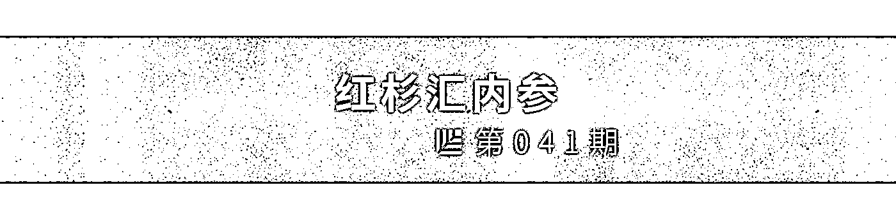
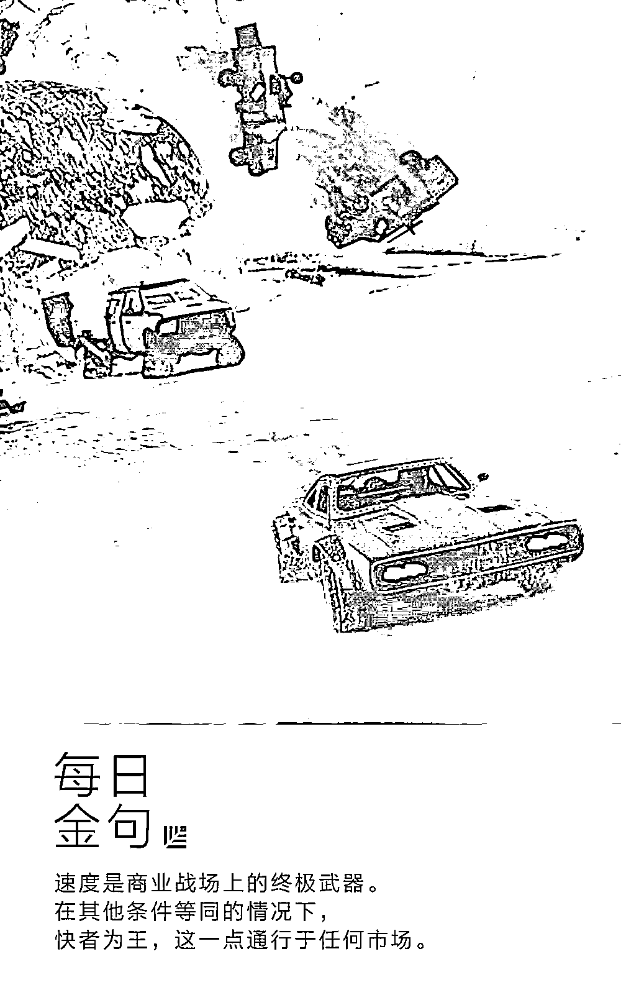
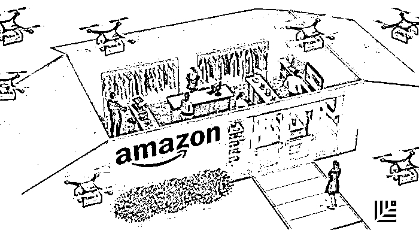
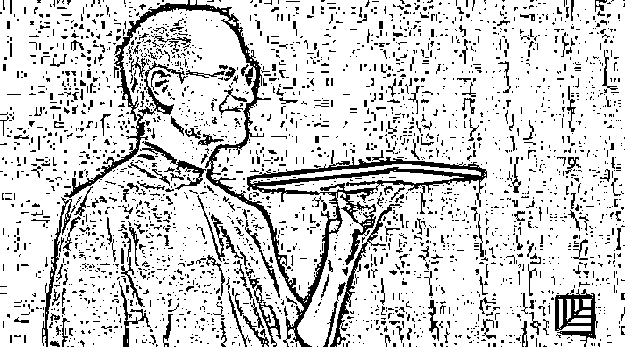
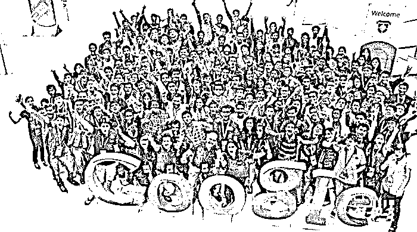

# 消除创业倦怠、原地满血复活的 6 个领导力养成大法 ｜红杉汇内参

> 原文：[`mp.weixin.qq.com/s?__biz=MzAwODE5NDg3NQ==&mid=2651223434&idx=1&sn=014ba06f1a86d0b42e5b412e7b85f29c&chksm=80804bdeb7f7c2c8f6d872601f2e78aba47496930e04c27e31649c770e270ef9aac176383b45&scene=21#wechat_redirect`](http://mp.weixin.qq.com/s?__biz=MzAwODE5NDg3NQ==&mid=2651223434&idx=1&sn=014ba06f1a86d0b42e5b412e7b85f29c&chksm=80804bdeb7f7c2c8f6d872601f2e78aba47496930e04c27e31649c770e270ef9aac176383b45&scene=21#wechat_redirect)

[ 编者按 ] 作为领导者，你有多久没有“内省”过自己了？

你相信自己的智慧和能力，拼命工作，一整天粒米未进，只靠咖啡硬撑，或者你觉得一天只睡三小时也没问题？

你有时会激动、不安、绝望等。殊不知情感能量驱使着你一半以上的行为和决策。

感觉自己的“精神能量”不够用，你必须用尽一切方法才能保持敏锐的观察力、理解力和专注力。

这些都是领导力不足的表现。做为一个优秀的领导者，你或许会成为经理，不断壮大团队；如果你偏爱单打独斗，那么你要扩大自身影响力，面对更严峻的挑战——成为公司的领导者，无需再向谁做直接报告。

无论哪一样，这其中的关键都在于提升自我。这不仅是技能的提升，还有你的精力，如何管理时间，如何知人善任，如何说不，如何避免倦怠等。

每期监测和精编中文视野之外的全球高价值情报，为你提供先人一步洞察机会的新鲜资讯，为你提供升级思维方式的深度内容，是为 **[ 红杉汇内参 ]**。

** 内参**

**消除创业倦怠，原地满血复活**

**6 个领导力养成大法**

综合编译 / 洪杉

经理人教练卡蒂亚・弗雷森曾助力 Facebook 和多家创业公司领导者的成长，她发现当“三种能量”达到良好状态互相依存时，人们就有机会实现“绩效+”状态，可以在非常短的时间内让你的领导效率指数般地上升。

但是，极少领导者会意识到这一点。他们仅相信自己的智慧，依靠不健康的饮食支撑着自己。他们口若悬河，募集资金，却又受制于自我怀疑和内心深处的不安。他们在傍晚时主持全体会议，即便那时精力已逐渐匮乏。弗雷森认为这些做法都限制他们的潜力，好在旧有模式和习惯可以改变。

**协调“三种能量”，实现“绩效+”**

时间管理众人皆知，但其实精力管理才是完成更多工作的要诀。但精力并不是单指一件事，人共有三种能量，它们互相依存：

**身体能量**：这是你做任何事的基础，这种能量最易被影响，也最常被忽视。

**情感能量**：这关乎你每时每刻的感受，情感能量驱使着你一半以上的行为和决策。

**精神能量**：这是最高级别的能量，你必须要有足够的体力能量和情感能量来保持敏锐的观察力、理解力和专注力，唯有如此才可获得精神能量。

**用说“不”来表达“别占用我的时间”**

CEO 和公司创始人如何更好地利用自己的时间？你可以削减 50% 处理邮件的时间，用来召开大多数会议。除此之外，最受人们关注的是：如何拒绝他人。如果要想省出更多时间，你必须得这样做。

**避免“决策债”，**

**建立可以抽身的流程和架构**

**真正的风险在于：作为领导，你可能忙得不亦乐乎。你觉得自己在创造无数价值时，问题成堆的日子实际上已经不远了。**

一项有用的举措是建立工作节奏，比如定期开会评估各种岗位和职责，了解公司高层次目标的状态，策划下一步行动并进行优先级排序。此外，还要学会**将不那么重要的问题交给下属去办**，并且使公司一直走在正确的轨道上。

**挑战时间，快者为王**

戴夫・吉鲁亚德是速度的推崇者。在创立公司 Upstart 并担任其 CEO 前，吉鲁亚德曾是谷歌企业应用部的总裁，在谷歌里，他得以目睹埃里克・施密特和拉里・佩奇做出无数重大决策的过程。因为这段经历，他坚信：**速度是商业战场上的终极武器。在其他条件等同的情况下，快者为王，这一点通行于任何市场。而纵览所有行业，速度即便不是领袖身上最具有决定性的特质，也必然是其中之一。**

如何让速度成为公司的基石，最重要的是：**挑战时间，落实最后期限。**要做到这一点，只需问一个简单的问题：“**这件事不能尽早完成吗？**”有方法有逻辑地去问，认真严肃地摆出问题，并且将此养成一种习惯，这样做将会极大地加快公司的执行速度。

**避免倦怠的模板“填空”大法**

罗丽・萨克塞纳在 Clever 公司身兼数职，管理着销售、客户成功和支持、商业运营等部门，这些还只是其中的一部分。在此之前，她曾担任领英的北美销售部门主管一职。

她到底怎么做到的？

对她来说，一项非常有效的做法，是采**用框架模板来减轻肩上的职责，并且保证自己的精力能够投入到既需要她同时又对公司业务有重要影响的任务之中。**

下面就是她定期使用的框架的浓缩精华版：

萨克塞纳把自己负责的所有项目分门别类地填入象限图中，然后再决定处理的方式。她会毫不犹豫地舍弃第三象限里的事项。然后，针对第四象限里的工作，她会在团队里挑选出会珍惜学习机会并乐于承担更多责任的初级员工，把那些涉及维持公司内部运营的事务交托给可靠的他们。

第二象限里面的任务，她会交付给团队里表现最出色的人才，这些人才在她的栽培下已经具备获得成功的必要素养。

最后来到第一象限，也就是那些涉及公司发展前景、影响重大却挑战性强的项目。通常来说，这些项目需要反复的深思熟虑、大量的协调合作、来回的修正完善，以及无数的难题攻克。如果你处于公司领导层，这正是你关注的重心。在这些项目上，你比其他人拥有更丰富的信息和更宽广的眼界，借此你也能对公司有更为深刻的影响。

利用上述四象限图做好分析和评估之后，你需要跟他人说出你的决定，进行有效沟通。在沟通过程中，**不要害怕承认你已经不堪重负了。**

萨克塞纳说道，“在我的事业生涯中，我曾经想要倾尽全力去完成很多事情，但发现这些我确实做不来。这意味着负责任的做法应该是不断地进行评估，在发现确实超负荷时明确地告知其他人。**沟通唯有坦诚才能频繁。**”

** 知人善任之前，要先“知己”**

哈里德・哈利姆与他人联合创办培训公司 Reboot 。如今，他致力于帮助企业管理层与身边员工进行更加清晰的交流——最大化他们可以施加的影响。作为领导者，要做的第一件事情就是了解自己和身边人。明白自己是属于自我激励型还是外界激励型，能够帮助你在对应的自我或外界中获得更大的激励和动力；而明白他人所属的类型，在与他们交流的时候，你便能更加高效、更有说服力地传达信息。

哈利姆解释说，“假设你在跟一个属于自我激励型的人谈话，你若想要说服她，在不提及她个人经历的情况下基本不可能。因此，如果我跟她谈公司的一个决定，我需要先提到过去公司曾经做了个决定，然后她因此改变了想法的这段经历。她听完后会做出行动，完全是由于她对于过去的回忆和认知，而不是被我劝服了。与此相反，要想改变一个以外界为参考的人的想法，要先给出你的观点，并且提供外界的参考资料。”

** 情报**

＃与顾客互动，85% 要靠机器人＃

**AI 全线改造零售业，你准备好了吗？ **

人工智能正在零售业掀起一场革命。

美国权威咨询公司高德纳（Gartner）的一项研究显示，人工智能已成为 2017 年的顶级零售趋势，到 2020 年，85％ 的顾客互动将通过机器，而非人类完成。人工智能+零售会有怎样的化学反应？

▨ 人工智能通过分析购物者的浏览物品、购物车、购买记录、人口统计数据和相关数据向零售商显示购物者需求。

▨  有时，客户清楚地知道他们想要什么，却不知道如何搜索。人工智能可以利用消费者数据结合商店的库存指导客户进行所需购买。

▨ 人工智能将很快允许零售商启用视觉搜索，使用图像识别来确定并查找某个产品或类似产品。

▨ “客服”也将被人工智能取代。通过学习，人工智能可以进行自动回复、提问、内部关键词搜索等方式进行人际交互，解决客户问题，推荐产品，找到所需产品。

▨ 人工智能还将担当虚拟购物顾问的角色，它的算法会快速识别客户在每月订阅盒中可能喜欢的衣服、饰品等判断客户的喜好。同样，零售商还可以使用人工智能创建虚拟试衣间，利用客户数据全方位了解客户，以便在在线购物时“试穿”。

＃偶尔需要像“疯子”一样执着＃

**与史蒂夫・乔布斯共事学到的 5 大经验教训**

在苹果公司，除了乔布斯，还有很多“疯子”都对公司有着狂热信念，因此在它穷途末路时还是选择留在下。一位曾和乔布斯、艾维・特凡尼安（Avie Tavanian）、乔恩・鲁宾斯坦（Jon Rubenstein）等合作过的高管，分享了帮助苹果扭亏为赢时学到的五大经验教训：

▨ **营销至关重要。**你可以做出世界上最好的捕鼠器，但是如果你不宣传，那就没有人会去购买。乔布斯接手后，苹果抛弃曾经的低调变成一台营销机器。他说过，“如果没有人知道产品的存在，我们怎么能把它销售出去呢？”

▨ **乔布斯可以和 CFO 谈完公司财务问题后，马上集中火力至主板上 ASIC 芯片的位置。**你需要关注各个方面，但要依靠更聪明、更专业的人来创造卓越。

▨ **在招聘时略过简历和成绩。**乔布斯在招聘员工时更关注天赋、性格和兴趣，顶尖的 MBA 毕业生反而会在公司碰壁。因此，招聘时不要只看学业成就或者高分。

▨ **相信直觉。**乔布斯非常信赖聪明人的“直觉”本能。我从中学到的经验教训是：要乐于倾听和凭直觉行事。

▨ **敢做大动作，大胆去冒险。**乔布斯是勇气和冒险的绝对主宰者。他回归苹果后，把整个公司都押在 iMac 上。他大胆行动，勇于冒险。剩下的就是写就历史了。

＃历时 2 年，研究 180 支团队，200 多次访问＃

**谷歌终于摸清成功团队的 5 大特质**

谷歌的亚里士多德项目（Project Aristotle）把该公司最优秀，头脑最灵活的多名人才集中到一起，谷歌想知道，为什么有些团队表现出现，而有些团队却表现得不尽人意。

在对 180 支谷歌团队开展研究，进行 200 多次访问，还分析 250 多种不同的团队属性后，该项目得出提升团队品质的五个关键特性：

▨** 可靠性。**可靠性指的是团队成员按时完成任务并满足预期的能力。

▨** 确定性。**高绩效团队拥有明确目标，而且团队中有明确的角色划分。

▨** 有意义。**让工作变得对每个成员都有意义。

▨ **有影响。**团队成员都认为自己的工作是有目的的，且会对更深层次的利益产生积极影响。

▨ **安全感。**我们都参加过会议，都曾担心自己看起来“无能”而避免提出问题。这种令人不安的感觉就像处在显微镜下，你所做的一切，说的每一句话都会被放大。谷歌发现，在营造心理安全感的环境下，团队成员退出的可能性会降低，利用多样性能力的可能性会上升，最终他们会变得更成功。****

** 推荐阅读**

壹

[曾鸣：未来五年，S2b 是最有可能领先的商业模式](http://mp.weixin.qq.com/s?__biz=MzAwODE5NDg3NQ==&mid=2651223422&idx=1&sn=a32d2df4560045e8fc20ad4468179841&chksm=80804b2ab7f7c23c1eb64a4fc7b893a8c507e3b1d2cc3cd6e5fae2ba09c9d73e3f7c10af2ecf&scene=21#wechat_redirect)

贰

[光有梦想和金钱还不够，合伙人股权分配怎么搞？](http://mp.weixin.qq.com/s?__biz=MzAwODE5NDg3NQ==&mid=2651223431&idx=1&sn=1b91067764fae7cd992a4858a1fcb1c9&chksm=80804bd3b7f7c2c5e12978158d53b22f052cb45eb1d43e7f7223896da4b9a4ec30abfdf95cca&scene=21#wechat_redirect)

叁

[成为巴菲特，不如说成为更好的自己](http://mp.weixin.qq.com/s?__biz=MzAwODE5NDg3NQ==&mid=2651223408&idx=1&sn=dbfc1d892c51421a0b042b0e732c3111&chksm=80804b24b7f7c2325e3521a8e8ee192a1808c690ced607b55a5c30173242efc213ed7a7e0f1d&scene=21#wechat_redirect)

肆

[英雄互娱应书岭：AI 消灭旧岗位，互动娱乐创造新 JOB](http://mp.weixin.qq.com/s?__biz=MzAwODE5NDg3NQ==&mid=2651223412&idx=1&sn=e704304e3f36f51651981c21e753a862&chksm=80804b20b7f7c23613d6977d00c94b83046ff1fccd9aad072efdf69dc6323a8ae7aa74c0f38c&scene=21#wechat_redirect)

伍

[耗时 7 年，125 位画师纯手工绘制，全球首部全油画动画长片，致敬所有专注、执着的创造者](http://mp.weixin.qq.com/s?__biz=MzAwODE5NDg3NQ==&mid=2651223415&idx=1&sn=55725e833fa0d5511aabe6d4dce52936&chksm=80804b23b7f7c2359993893580cad874c34f7883f3b9b89f79a32850a5eccf8530f30850a514&scene=21#wechat_redirect)

