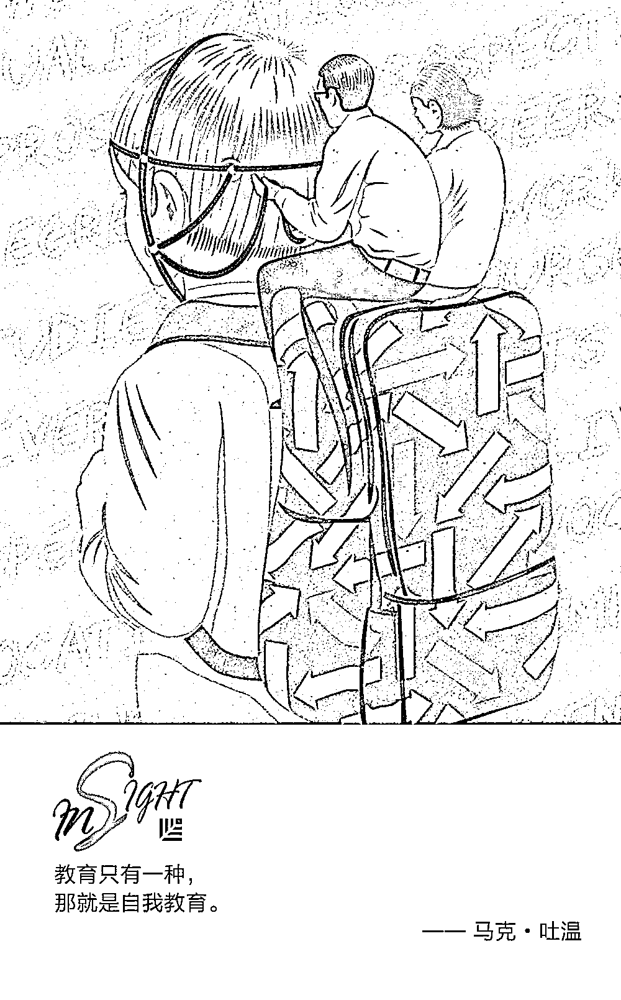
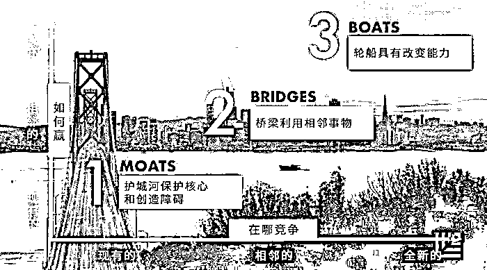

# 你与巴菲特、盖茨、乔布斯的学识距离，只有“5 小时”｜红杉汇内参

> 原文：[`mp.weixin.qq.com/s?__biz=MzAwODE5NDg3NQ==&mid=2651224890&idx=1&sn=e8872a71d9f284fb27ab554d27c0a6cb&chksm=8080456eb7f7cc7864f730e1474c661a735b5ab1ff03a47cc334a752410ed7de99727a1d5439&scene=21#wechat_redirect`](http://mp.weixin.qq.com/s?__biz=MzAwODE5NDg3NQ==&mid=2651224890&idx=1&sn=e8872a71d9f284fb27ab554d27c0a6cb&chksm=8080456eb7f7cc7864f730e1474c661a735b5ab1ff03a47cc334a752410ed7de99727a1d5439&scene=21#wechat_redirect)

[ 编者按 ] “我在最活跃的时候，就开始进入半退休状态了。”当地时间 5 月 5 日，在 2018 年度巴菲特股东大会上，这位“股神”如此调侃自己。他的老搭档芒格则在旁边取笑说：“巴菲特非常善于什么都不做。”

巴菲特表示自己已经半退休几十年了，伯克希尔集团各子公司的 61 位高级经理人都不会向他汇报工作，这正好给了他大量的时间去阅读。巴菲特认为自己成功的关键是每周阅读 500 页书。无独有偶，比尔・盖茨每周都会读完一本书，其中多数都与软件业甚至商业本身毫无关联。今天就来谈一谈，这些世界上最有成就的人，为什么都遵循 5 小时原则——每周都会刻意留出时间去学习？

每期监测和精编中文视野之外的全球高价值情报，为你提供先人一步洞察机会的新鲜资讯，为你提供升级思维方式的深度内容，是为 **[ 红杉汇内参 ]**。

** 内参**

世界上最有成就的人

**都遵循的 5 小时学习原则**

作者 / Michael Simmons

编译 / 洪杉

世界上最有商业成就的 5 个人——比尔・盖茨、史蒂夫・乔布斯、沃伦・巴菲特、拉里・佩奇和杰夫・贝佐斯，都拥有两种非同常人的特质：

▨ 他们都对知识如饥似渴

▨ 他们都学识广博

**沃伦・巴菲****特**认为自己成功的关键是：“每周阅读 500 页书，这是学习知识的原理。它会像储蓄复利一样逐渐累积壮大。”

据**比尔・盖茨**自己估计，52 年来，他每周都会读完一本书，其中多数都与软件业甚至商业本身毫无关联。在整个职业生涯中，他每年还会划出两周假期，专门用于阅读。

**杰夫・贝佐斯**通过实验，进行了广泛学习，最终才建立了整个公司，而且他一直都酷爱阅读。

**拉里・佩奇**会与谷歌的每个员工进行深入谈话，从门卫到核聚变科学家，试图从他们身上找到可供自己学习的地方。

**史蒂夫・乔布斯**在跨学科结合上颇负盛名，并将之视为苹果的竞争优势，甚至表示：“单靠技术是不够的，将科技与人文科学结合起来才能创造出令人激动的成果。”

如果我们将目光转向其他白手起家的亿万富翁，就会发现**奥普拉・温弗瑞**、**瑞・达利欧** 、**马克・扎克伯格**等人都有着相似的习惯。

为什么这些世界上最繁忙的人会将时间这一最宝贵的资源投入到聚变能、字体设计、科学家传记、医生回忆录这些看似与其所在领域完全无关的主题中呢？

关于学习，学校、大学和整个社会一直都在向我们灌输三条有力观点。过去，这些观点可能是正确的，但现在却绝非如此。

在最高层次上，学习的目的并不是为工作做准备。它本身就是最重要的工作，是你需要建立的核心能力，是别人无法代劳的事，是维持长期绩效和取得成功的最终驱动力。

**谎言#1**

**学科是对知识分类的最佳方式**

现代教育系统模式的基础是将知识划分为不同的科目。但细分学科有一个重要缺点：由于所学的概念与某一特定学习领域的联系过于紧密，一件事物的学习会增大另一件事物学习的难度。同时，专业领域外的人无法轻易理解领域内所发生的事情。

假设你正在讲解引擎的工作方式。传统的教学方法会说：“你们将就螺丝刀和扳手的方方面面进行学习，参加有关螺丝刀和扳手的课程……”

更好的方法应该是，“我们要把引擎拆开，具体有哪些步骤呢？噢，我们需要用到螺丝刀，由此可见，螺丝刀有哪些用途；我们需要用到扳手，所以我们可以得知扳手的用途。”

不同之处就在于：让知识之间的相关性变得显而易见。

** 真 相 ** **将不同的学科连接在一起**，正是世界上顶尖学习者和博学者在知识经济中独占鳌头所凭借的利器。

**谎言****#2**

**大多数学习都在学校中进行**

教育的一大根本性问题在于它将学校和学习捆绑在一起。

事实上，学校不过是学习发生的其中一个场景罢了。我们一生中很多的学习都在校外进行：家里、游乐场、运动场，又或是旅游时、看书时、发展业余爱好时，特别是工作时。

而且，我们在学校中习得的技能，往往要么无法应用到现实生活中，要么甚至会影响到我们的表现。

举个例子，在学校里，听从指示、按规则行事的人能够得到奖励。然而，在现实生活中，关键的领导特质却包括冒险和独创思考，这两种要求恰恰与学校里的学习背道而驰。大多数正规教育将我们训练为听令者，而不是领导者。

中等教育和高等教育一般不鼓励学生成为自我导向的学习者，或者培养他们对终身学习的热爱。事实上，为考试而学，或者为进入一所优秀大学而学，这种外部动力往往会阻碍内部动力的形成。正规教育也不擅长向学生展示学科间彼此的联系，或者指导学生如何把所学知识运用到现实生活中，以得到他们想要的结果。

** 真 相 ** 我们的人生旅程中，大多数学习都在校外进行。比起成绩和学位，**自主学习**和**终身学习**才是决定我们能否成功的更重要因素。

**谎言****#3**

**你必须专攻一个领域**

在《国富论》第一页中，亚当・斯密以回形针工厂为例论述专业化的强大力量。工厂里，由于实行分工，仅仅 10 个工人一天就能制造 48000 枚回形针，而如果这 10 个人每个人独立完成回形针的制造，一天下来他们总共才能生产 200 枚回形针。换句话说，专业化的分工使他们的产量提高了 240 倍。

一直以来，几乎所有人都被教导，跻身成功行列的道路就是要追逐“专而精”。如果是回形针工厂，其正确性毋庸置疑，因为在工业时代，生产力以量化的产出作为衡量标准。

然而，如今我们多数人都在知识经济中博弈，生产力不再以数量而是以创新成果来计算。而提出创新理念的最有效办法之一，就是学习并融合同一领域中其他竞争者尚不了解的有价值的技术和概念。知识经济当道的今天，跨领域学习，掌握不同领域的知识和能力，然后将你所领悟到的见解运用到自己的主业中，才是助你脱颖而出、鹤立鸡群的秘笈。

** 真 相 ** 专业化是工业经济的关键。但在知识经济里，想成为各自领域前 1%的顶尖人才，学习范围应**至少覆盖三个领域**，并**融会贯通**。

从现在开始，不要再把所有时间都专注在一个狭窄的领域里，而应该专注投资于个人的终身学习上。每周至少花 5 个小时探索你主业外的领域，学习你的同事还不了解的技能和概念。训练自己成为自我导向的学习者，并努力成为博学者，这便是在现代知识经济中解密成功的钥匙。

** 读数**

**23%**

BCG 测算，到 2027 年，中国金融业就业人口可能达到 **993 万 **人，其中 **23% **的工作岗位会受到人工智能带来的颠覆性影响，削减或转变为新型工种；剩下 **77% **虽未被替代，但效率将获得大幅提升，比如解决复杂问题、应对人际情感交互及随机多变环境的岗位。

** 情报**

#你的护城河？你的桥梁？你的轮船在哪里？#

**价值 10 亿美元的增长路线图了解一下？**

宏观经济趋势转变，顾客购买渠道多元，零售局面被破坏……昨天让你成功的手册已不能为明天的地形导航。男士配件品牌 Randa 创始人分享了他绘制的新增长路线图，结果？营业额从 2 亿美元变成了近 10 亿美元。

▨ **Moats** / 护城河——保护核心竞争力并且建立高进入门槛。利用和延伸你最擅长的事情，向垂直领域发展，向深度进发。

▨ **Bridges **/ 桥梁——渗入相邻型业务细分市场。比如满足同一场景下消费者的其他需要、渗入相邻的配送渠道、向类似消费人群进军等。

▨ **Boats **/ 轮船——业务模式的转换。这是驶向下一个成功彼岸所需要的，比如投资新技术、尝试新商业模式等。

#从卖产品到卖公司到卖 Idea 都适用#

**成功的交易缔造者就是伟大的销售员**

▨ 懂得关系即一切。我们都是从自己喜欢的人那里买东西。

▨ 崇拜推荐的力量。想得到推荐，必须尽全力做到比承诺的更好。

▨ 在社交媒体上花心思。包括专业个人简介、行业分析，以及之前客户的评论。

▨ 化繁为简。不使用任何缩略词和行业术语，用易于理解的话给予客户建议。

▨ 视情穿衣。去新潮初创公司？穿 T 恤，背双肩包；去大型国企？请穿套装。

▨ 避免过分思考。耽误太久，会失去销售机会；承诺过多，会惹怒客户。

▨ 远离自负。不要为了生意而说谎，伪装自信会让潜在客户跑掉。

▨ 遵守纪律。我们天性懒惰，但纪律是成功的关键。

▨ 倾听。理解客户的意思并传达出能让他们做出购买决定的信息。

** 推荐阅读**

壹

[另一面红杉：关注三大技术升级驱动的工业科技巨变](https://mp.weixin.qq.com/s?__biz=MjM5NDk1NDE2MA==&mid=2676286453&idx=1&sn=3232221ff387eb467f1b48c81b9ae934&scene=21#wechat_redirect)

贰

[热烈祝贺药明康德在 A 股成功上市！](http://mp.weixin.qq.com/s?__biz=MzAwODE5NDg3NQ==&mid=2651224884&idx=1&sn=51f1382d62df767c0bf4c7b364b9fb31&chksm=80804560b7f7cc7637c88221443889c4d3ec72eb0fa6433be8b9083fff0b77468801ddd1f57d&scene=21#wechat_redirect)

叁

[红杉×福特，一场穿越半世纪的对话 | Great Causes](http://mp.weixin.qq.com/s?__biz=MzAwODE5NDg3NQ==&mid=2651224852&idx=1&sn=ea9bd0916c4c86800c2ebda06f660669&chksm=80804540b7f7cc56cb653deb889c8f28c0c7ec952620420d75df4153d897eeee5a9cb7974d58&scene=21#wechat_redirect)

肆

[大数金融柳博：我们要有成为传奇的勇气｜红杉原创特写](http://mp.weixin.qq.com/s?__biz=MzAwODE5NDg3NQ==&mid=2651224865&idx=1&sn=817b37932500069a61b4beb833dd3771&chksm=80804575b7f7cc6345d35bf06753100de718ef94c214fece26c958069ffb9ccb855477b0c139&scene=21#wechat_redirect)

伍

[为什么说创业者永远年轻？顶尖物理学家给出了科学解释](http://mp.weixin.qq.com/s?__biz=MzAwODE5NDg3NQ==&mid=2651224872&idx=1&sn=695f91644c998852748b7b6381895787&chksm=8080457cb7f7cc6a55cd7511e851fd4a544dd83048524f32e6d9bd7e2eb278693b92245fdfda&scene=21#wechat_redirect)

