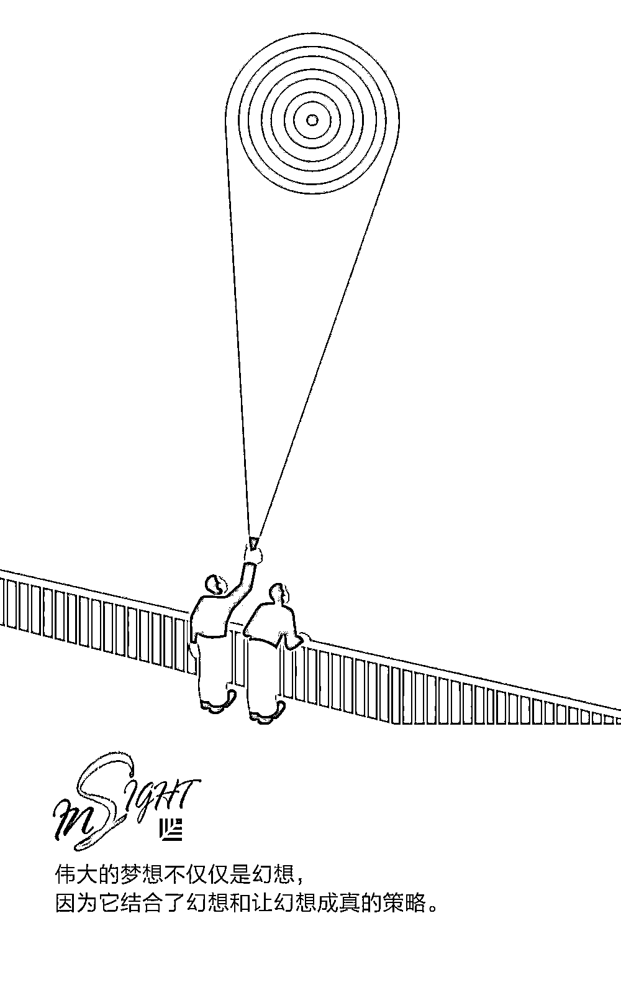
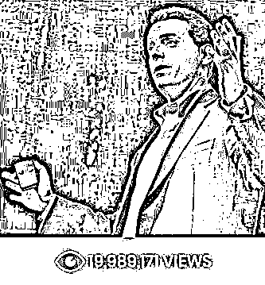
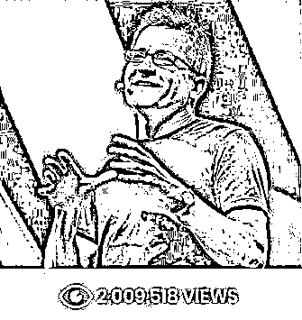
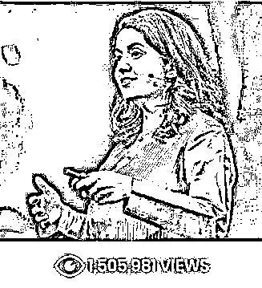
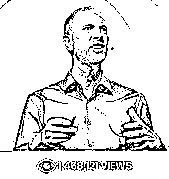
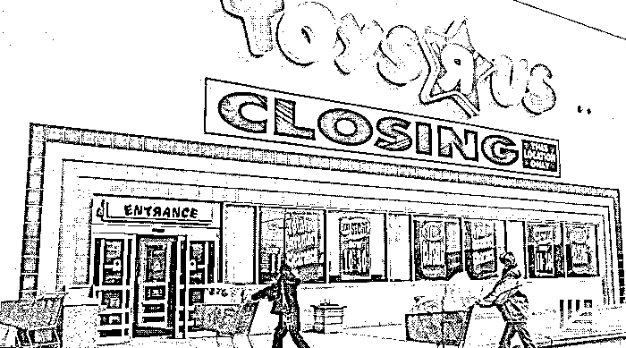
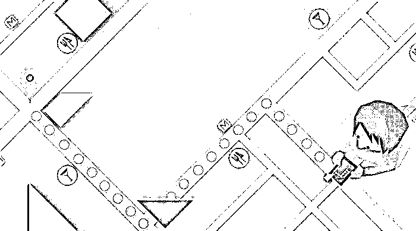

# 超燃 TED 演讲集锦，10 句话点燃你的小宇宙｜红杉汇内参

> 原文：[`mp.weixin.qq.com/s?__biz=MzAwODE5NDg3NQ==&mid=2651224733&idx=1&sn=59fa580f87fdfaa1c16fb201624acbac&chksm=808044c9b7f7cddfac16530bb445c905a0fe7e4b2fac35e107a250d6069357adb36cb689c5b4&scene=21#wechat_redirect`](http://mp.weixin.qq.com/s?__biz=MzAwODE5NDg3NQ==&mid=2651224733&idx=1&sn=59fa580f87fdfaa1c16fb201624acbac&chksm=808044c9b7f7cddfac16530bb445c905a0fe7e4b2fac35e107a250d6069357adb36cb689c5b4&scene=21#wechat_redirect)

[ 编者按 ] 保持动力很难，却是成功的关键。

毫无疑问，在创业旅程中，家庭或是资金上的压力，都会使你前进的动力备受考验。幸运的是，你可以找到很多动力的源泉，其中就包括 TED 演讲。

TED 的讲者包括创业者、作家、科学家等等，他们讲述着变革、失败、自信等话题。如果要说 TED 演讲对你有什么影响的话，它可以让你打满鸡血、重振旗鼓、继续前行。

无论你来自哪个行业，身居何职，这些励志演讲总能鼓励你做最好的自己，活出精彩人生。

每期监测和精编中文视野之外的全球高价值情报，为你提供先人一步洞察机会的新鲜资讯，为你提供升级思维方式的深度内容，是为 **[ 红杉汇内参 ]**。

** 内参**

超燃 TED 演讲集锦

**10 句话点燃你的小宇宙**

编译 / 洪杉

好莱坞作家、制片人桑德・莱姆斯(Shonda Rhimes) 制作了众多脍炙人口的电视剧，其中就包括《实习医生格蕾》(Grey’s Anatomy) 和《丑闻》(Scandal)，而莱姆斯本人也以其励志的 TED 演讲“我对一切说好的那一年”(My year of saying yes to everything)闻名。在演讲中，她分享了自己冒险、建立信心和充实过好每一天的人生经验。企业家、发明家、谷歌秘密实验室 X(前称 Google X)负责人阿斯特洛・泰勒(Astro Teller)曾在 TED 演讲，题为“庆祝失败可能会带来意想不到的好处”(The unexpected benefit of celebrating failure)。在演讲中，他解释了 X 如何打造舒服的文化，让人们不惧怕冒险，大胆尝试。

我们可以从 TED 演讲中受益匪浅，了解一下 10 个超燃的 TED 励志演讲。

** 01 **** 庆祝失败可能会带来意想不到的好处**

[`v.qq.com/iframe/preview.html?vid=x0626wm0hi4&width=500&height=375&auto=0`](https://v.qq.com/iframe/preview.html?vid=x0626wm0hi4&width=500&height=375&auto=0)

**阿斯特洛・泰勒**

谷歌秘密实验室 X(前称 Google X)负责人阿斯特洛・泰勒讨论了他运营企业的秘诀，就是建立一种组织文化，让员工在进行大胆的项目、探索“充满风险的”想法时感到舒适自在。

**伟大的梦想不仅仅是幻想，因为它结合了幻想和让幻想成真的策略。**

** 02 **** 出人意料的工作动机**

**丹・平克**

事业分析师丹・平克揭开动机的秘密，讲述为什么传统的报酬体系不如我们想象的那样激励人心。

**高绩效的秘密不是奖励和惩罚，而是看不见的内在动力——让人为了自己而做的动力。有动力做事是因为这件事情对自己至关重要。**

** 03 **** 我对一切都说好的那一年**

**桑德・莱姆斯**

好莱坞作家、制片人桑德・莱姆斯制作了众多脍炙人口的电视剧《实习医生格蕾》(Grey’s Anatomy)、《丑闻》(Scandal)和《逍遥法外》(How to Get Away with Murder)。

在演讲中，她表示她花了一年时间对一切说好，生活发生了很大的变化。

**我对更少工作和更多玩耍说好，我仍以某种方式掌握着我的世界。**

** 04 **** 你究竟为自己创造了怎样的人生？**

**艾萨克・利茨基**

作家、企业家艾萨克・利茨基向我们讲述了他失明后所学到的人生经验，并呼吁大家抛弃借口、假设和恐惧。

**失明教会我用开阔的眼界去生活。**

** 05 **** 拥抱近在咫尺的胜利**

**萨拉・刘易斯**

作家萨拉・刘易斯让我们思考人生中“几乎失败”、“接近胜利”的作用，这些时刻能帮助我们在未来取得成功。

**不断接近你心中想要的东西，可以帮助你获得比梦想中还要多的东西。**

** 06 **** 如何成为一名杰出的领导者**

**罗莎琳德・托雷斯**

领导力专家罗莎琳德・托雷斯花了 25 年时间观察真正杰出的领导者，在演讲中她向我们分享了她的感悟。

**是什么造就了 21 世纪的杰出领导者？ 我见过许多杰出领导者，有女性也有男性。他们确实与众不同。他们正在做更好的准备，不是为了昨日舒适的预言，而是为了今天的现实和明天所有未知的可能性。**

** 07 **** 万变时代的 5 种领导方式**

**林杰敏**

组织变革专家林杰敏向大家展示了改变企业，使其适应不断变化的世界是一段充满活力的经历。

**我们要勇敢地改变我们变革的方法。这是我们欠自己、欠公司的，往大了去说，是我们欠社会的。为了达到这个目的，我们需要以人为本。**

** 08 **** 为什么我们需要想象不同的未来**

**阿娜布・珍**

未来派艺术家、设计师阿娜布・珍分享了她的作品如何生动有趣地展示未来，向大家强调了争取自己想要的未来非常重要。

**影响改变最有效的手段之一就是让人们直接、实质、带着情感去体验一些他们现今的行为所造成的未来后果。**

** 09 **** 在机器时代，创造人性化公司的 4 个方法**

**蒂姆・拉伯瑞克**

商业浪漫主义者蒂姆・拉伯瑞克认为，在人工智能和机器学习时代，我们需要一种新的人文主义。

**机器可以更高效地****工作，很快，留给人类解决的就只剩那些需要美感而非效率的工作。**

** 10 **** 商业世界里人们保持诚实的动机**

**亚历山大・瓦格纳**

经济学家亚历山大・瓦格纳阐释了“做对的事”中蕴含的经济学、伦理学和心理学道理，并研究企业和人们的行为方式。

**考虑筛选对的人，而不是先把人招进来再提供奖励。筛选对的、有正确价值观的人，可以为企业省去很多麻烦，节省成本。 换言之，以人为本，必有收获。**

** 读数**

**7 倍**

AI 有多热？全球上市公司中，2017 年第四季度财报上提到人工智能和机器学习的次数超过了 700 次，是 2015 年同期的 7 倍。

** 情报**

#零售商如何起死回生#

**没有意识到购物行为正在发生变化的任何零售商都将面临损失**

“玩具反斗城（Toys R Us）”宣布将全面关闭所有门店以及同样申请破产的周边产品连锁店 Claire's。曾经充满狂热购物者的商场活力不再，零售业的生存之战已经打响。

▨ 提供全渠道无缝式购物体验。众所周知，购物方式多种多样，日趋无缝化，零售商需要统筹发展手机端、线上和线下业务，探索有限库存的商品展览店或只营业一段时间的临时店铺。

▨ 开创市场而不是盲目跟风。想要在快速变化的市场环境中站稳脚跟，就必须打破原有的思维方式，为实体店定义新角色。网络购物已经取代了实体店的展示作用，零售商需要在实体店中加入触觉、感觉、视觉和听觉体验，让人们乐意前去。

▨ 相信品牌的力量。沃尔玛目前正在买入更多的品牌并提升其网上购物体验，它们相信提供品牌系列产品可以扩大客户群体。

#如何预防机器学习偏差#

**机器学习会产生的偏见（以及如何预防）**

在没有检查的情况下，输入有偏差的数据可能教会机器做出不道德或完全错误的事情。怎么办？

▨ 选择训练数据时考虑偏差。必须记住：如果人类参与决策，偏差总是存在的——群体越小，偏差不被别人推翻的可能性就越大。

▨ 根除偏差。开诚布公地询问组织流程中存在哪些偏见，积极搜寻这些偏见可能如何在数据中表现，通过清除问题数据或移除输入数据集的特殊组件来阻拦它们，或者通过更多的信息扩展训练数据集来抵消可能存在问题的数据。

▨ 反击“动态”数据集中的偏差。必须确保新参数是全面且经过实证测试的，否则这些参数可能歪曲模型，尤其是在数据很缺乏的领域。

▨ 权衡透明度和性能之间的重要性。机器学习的诱惑之一在于将数量逐渐增加的数据置于一个精致的基础训练结构中，并让机器能够“将它们识别出来”。

** 推荐阅读**

壹

[刘星详解红杉消费投资逻辑：消费×科技，企业必须更加“激进”](http://mp.weixin.qq.com/s?__biz=MzAwODE5NDg3NQ==&mid=2651224723&idx=1&sn=9c1a471bf3078b295292cba0128d1029&chksm=808044c7b7f7cdd16503f794999c437be704acd20fe4de76813d69bc3787f495e1842f93779c&scene=21#wechat_redirect)

贰

[如何让求职者爱上你，更爱你的公司？](http://mp.weixin.qq.com/s?__biz=MzAwODE5NDg3NQ==&mid=2651224725&idx=1&sn=26d5f9b016e49526d21d3bfb7b3839bd&chksm=808044c1b7f7cdd7a2b714dbbdc0a3163e4404d08d4167cb9e9c17e21b8c3f43937cf44b54a7&scene=21#wechat_redirect)

叁

[我们能与机器人建立真正的友谊吗？](http://mp.weixin.qq.com/s?__biz=MzAwODE5NDg3NQ==&mid=2651224711&idx=1&sn=a5f146a155636c7ecd6db105906aed5b&chksm=808044d3b7f7cdc56ddb604794d9d7cf22954f23c75e25d262f806834e5092ced9daef1bea2b&scene=21#wechat_redirect)

肆

[请留存这篇 3 万字长文，它或许正是独角兽公司们手中的那张王牌](http://mp.weixin.qq.com/s?__biz=MzAwODE5NDg3NQ==&mid=2651224674&idx=1&sn=cb06e421a1194e962c6f773c70a36731&chksm=80804436b7f7cd20c91ebd3e6ad92f7f07a2b084de383056385f227702b458a985c8fe4f210d&scene=21#wechat_redirect)

伍

[The Mountain: no longer so cruel, but a close companion.](http://mp.weixin.qq.com/s?__biz=MzAwODE5NDg3NQ==&mid=2651224686&idx=1&sn=fe219e2b454c41133cdc6a52738415be&chksm=8080443ab7f7cd2c9ff33d1ad9bd0310b624b9d60eb660f2cc0d860767930af60109ba36b3b0&scene=21#wechat_redirect)

