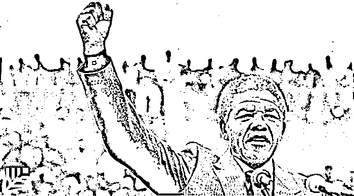
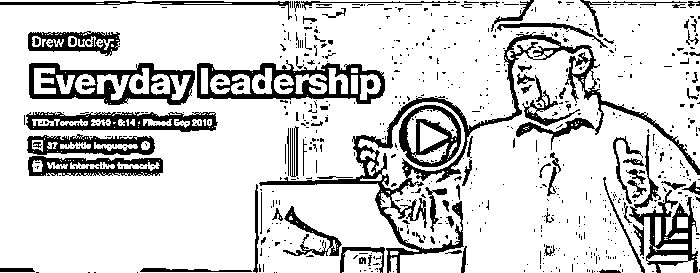
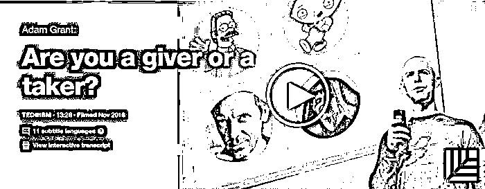
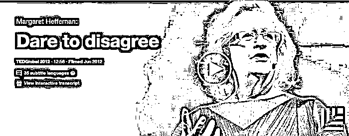
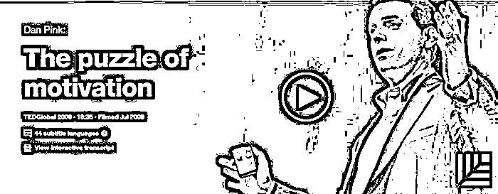
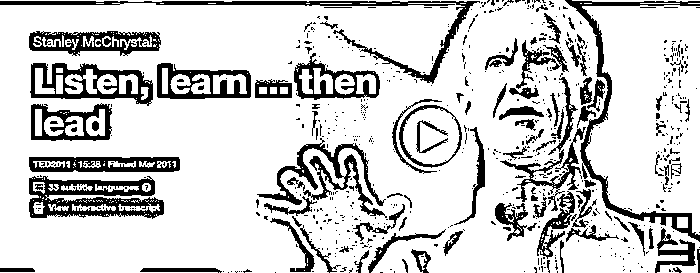

# TED 迄今最好的 9 个关于领导力的演讲｜红杉汇内参

> 原文：[`mp.weixin.qq.com/s?__biz=MzAwODE5NDg3NQ==&mid=2651222472&idx=1&sn=03ec4541a46dcae5fa380a097f68c8f0&chksm=80804f9cb7f7c68a8b66857888445f30300db42a0e3bb5137f4c1345593de34f8d5a659b8cf5&scene=21#wechat_redirect`](http://mp.weixin.qq.com/s?__biz=MzAwODE5NDg3NQ==&mid=2651222472&idx=1&sn=03ec4541a46dcae5fa380a097f68c8f0&chksm=80804f9cb7f7c68a8b66857888445f30300db42a0e3bb5137f4c1345593de34f8d5a659b8cf5&scene=21#wechat_redirect)

[ 编者按 ]波士顿咨询高级合伙人罗莎琳德·托雷斯在以 4000 家公司为样本的研究后指出，尽管世界上存在着各种成本不菲的领导力培训项目，但仍有超半数的公司未能培养出足够杰出的领导者。为什么会这样，究竟是什么成就了伟大的领导者？

另一方面，正如管理学家彼得·圣吉、吉姆·柯林斯等将领导力从一般到卓越划分成为五个等级，大多数创业 CEO 实际上尚处在第三到第四级阶段，即虽然善于组织人力资源以实现商业目标，但还距魅力型的伟大领袖甚远——那些将个人的谦逊品质与职业化素养结合，让团队自觉追随的人。

今天，我们推荐 9 个或许是迄今为止最好的关于领导力的 TED 演讲，这些演讲将围绕定义、证明、分析与提高领导力等话题展开。事实上，领袖气质并非与生俱来，领导力也不单单得益于后天的培养和实践，真正领导力的学习，不过是使某些与生俱来的特质得以彰显，而令某些人性的弱点得到抑制。

每期监测和精编中文视野之外的全球高价值情报，为你提供先人一步洞察机会的新鲜资讯，为你提供升级思维方式的深度内容，是为** [ 红杉汇内参 ]**。

***

**【本期悬念】**

1.如何成为一名伟大的**领导者**？这里有 9 个 TED 迄今最好的演讲给你。

2.工作易得，好 Boss 难寻，评测一下你的老板是否值得追随。

3.**语音交互**时代真的来了，微软小冰、苹果 Siri、亚马逊 Alexa 等还将给我们的生活带来什么惊喜？

4.在美国，**真人秀**节目可能已经火爆到头了。中国呢？

***

**【每日金句】**

伟大领导者从不会自矜身价而不愿亲力亲为，

也不会不乐意全心投入去完成乏味的苦差事，

不管过去他们有怎样的成就。

***

**【内参】**

**TED**迄今最好的

**9 个关于领导力**的演讲

作者/Marcel Schwantes

综合编译/洪杉

**如何成为一名伟大的领导者**

演讲人：罗莎琳德·托雷斯（Roselinde Torres）

托雷斯花了 25 年的时间，在世界 500 强企业中观察究竟是什么造就了伟大领导者。几年前，她注意到在领导力的培养过程中存在一种令人不安的趋势。在这次演讲中，她提出（并回答）了两个问题：

为什么尽管有那么多的资金投入到领导力发展当中，领导力的差距却还在扩大？

伟大的领导者做了什么与众不同的事情而使他们自己成长为更杰出的人才？

Quote：“伟大领导者明白，认识那些思维方式与你有所不同的人、拥有一个更加多样化的人际网络，是更多层次的模式识别和解决方案的源泉。”

以下为演讲全文（稍有删节）和完整视频——

[`v.qq.com/iframe/preview.html?vid=r0372ivtebp&width=500&height=375&auto=0`](https://v.qq.com/iframe/preview.html?vid=r0372ivtebp&width=500&height=375&auto=0)

今天的杰出领导者是什么样的？很多人会想到一个无所不能的超人，站在那里，指挥着并保护着他的追随者们。但那是旧时的印象。同样过时的还有领导力发展培养计划，这种发展计划通常是基于过去而不是眼前或者未来的环境。

我们做了一个研究，覆盖了 4000 个公司。我们问：贵公司领导力发展培养计划的效果怎样？58%的公司认为他们在重要的领导角色选取上有很大的人才欠缺。这意味着，**尽管有各种培训项目，仍然有超过半数的公司未能培养出足够杰出的领导者**。你可能会自问：我的公司有在帮助我成长为一名 21 世纪的杰出领导者吗？答案很可能是：没有。

我花了 25 年的职业生涯时间来观察杰出领导者的特征。几年前，我注意到在领导力培养方面一个令人不安的趋势。为什么尽管那么多的资金投入到领导力发展培养项目，领导力的差别还是这么大？杰出领导者做了什么明显不同于他人的事情，使他们成长为更杰出的人？

我做了一件事——因为思考这些问题越发感到无力同时因为不同个体领导力失败的故事而感到沮丧，我离职了，这样我就可以专职研究。我花了一年时间游历世界的各个地方，试图了解高效和无效的领导力实践。我前往南非，在那里我有机会了解到纳尔逊·曼德拉是如何超越他的时代预测和引领政治、社会和经济走向。

我还约见了一些非营利组织的领导者，尽管他们的财政资源非常有限，却仍在努力改变世界，并经常促成和看似是敌人的合作。我在总统图书馆内度过了无数个小时，试图了解环境是如何塑造领导者的，他们的行动如何超越他们任期的影响。

从所有这一切研究中，我总结出快速成长的领导者有哪些特征以及他们做了哪些不同常规的事，并总结出可以增长人类潜能的一些练习方法。我想分享其中一些给你们听。

在更加全球化、数字化和透明的 21 世纪，信息流动和创新都十分快速，没有采用某种复杂的模型就好似什么大事也做不了，依托传统发展的方法会阻碍领导者的成长。事实上，传统的评估方式比如狭隘的 360 度调查或是过时的评价标准会给你错误的信息，引诱你认为自己比现实准备的更充分。

21 世纪的领导力可以用这三个问题来定义和证明——

你打算在哪里实施下一步，以对商业模式或你的生活作出改变？问题的答案就在你的日历上。你的时间和谁一起度过？你们聊什么主题？你去哪里出差旅行？你在读什么书？怎样从中提炼要点，作出现在要做什么的决定并随时准备着。**杰出领导者不会低着头，他们会看周围环境，他们会塑造自己的未来，而不仅仅只是对它作出反应**。

第二个问题是：如何权衡你的个人和职业利益相关的社会网络？我们都有一个社交网络，它由我们熟悉且喜欢的人组成。所以这个问题是关于你和与你大为不同的人发展关系的能力。杰出领导者明白拥有多样化的网络是一种更多层次的识别思考以及解决方案，因为你能够认识那些和你有着不同思考方式的人。

第三个问题是：你是否有勇气放弃一种过去使你成功的做法？有一种说法是：随遇而安、取法中庸。但伟大的领导者勇于改变。他们不只是嘴上谈论冒险，他们会真的去冒险。有位领导者跟我分享了这一事实——最有影响力的发展会出现在这样的时候：你能够情绪稳定地接受别人告诉你，你的新想法很天真、很鲁莽或者就是非常愚蠢。不同于传统的领导力培养项目，回答这三个问题将确定你作为一个 21 世纪领导者的能力。

是什么造就了 21 世纪的杰出领导者？我见过许多，他们与众不同，他们正在准备着，不是为舒适的可预测的昨天，而是为了今天的现实和明天所有未知的可能性。

**改善工作的快乐之道**

演讲人：肖恩•阿克尔(Shawn Achor)

阿克尔——也许是你在 TED 舞台上所看到的最有趣的科学家——花了几年时间去研究快乐，并且证明了大脑在积极状态下的表现明显更好——提升的程度高达 31％。为了让你的大脑处于“快乐模式”，不妨尝试这些简单的日常练习，在仅仅 21 天内对大脑进行重装。

Quote：“我们发现并不一定是现实世界造就了我们，而是我们的大脑用来观看世界的那副镜片造就了我们的现实世界。如果我们换一副镜片，我们就不仅可以改变自己的快乐程度，同时还能使教育和商业结出各个不同的硕果。”

以下为完整视频——

[`v.qq.com/iframe/preview.html?vid=r0189ji9ehf&width=500&height=375&auto=0`](https://v.qq.com/iframe/preview.html?vid=r0189ji9ehf&width=500&height=375&auto=0)

**日常领导力**

演讲人：德鲁•达德利（Drew Dudley）

Nuance 领导力发展服务的创始人达德利认为，领导力是关于“棒棒糖时刻”的——那些当你改善了别人的生活的时刻。

Quote：“我们需要用棒棒糖时刻来重新定义领导力——我们创造了多少棒棒糖时刻，认可了多少这样的瞬间，传递了多少这样的时刻，以及有没有向那些时光表示感谢。”

▲视频链接：http://www.ted.com/talks/drew_dudley_everyday_leadership?language=en

**你是一个给予者还是一个索取者？**

演讲人：亚当•格兰特（Adam Grant）

作为沃顿商学院教授以及畅销书《给予和索取》的作者，格兰特认为，在每个工作场所都存在三种基本类型的人：给予者、索取者和匹配者。格兰特打破了这些框框，并且提供了简单的策略以促进慷慨的文化，使每个人所索取的部分不超过他们应得的份额。

Quote：“如果我们可以从组织中除去索取者，如果我们可以容许请求帮助，如果我们可以保护给予者使其免于倦怠，并允许他们怀有追求我目标、尝试帮助他人的雄心壮志，我们就可以改变人们定义成功的方式。人们会意识到成功更多的是关于作出贡献的大小，而不是就等于要从竞争中取胜。”

▲视频链接：https://www.ted.com/talks/adam_grant_are_you_a_giver_or_a_taker

**敢于表达异议**

演讲人：玛格丽特•赫弗南（Margaret Heffernan）

你是回避冲突型人格吗？这里的意思是，你处理冲突的方法是通过避免直接面对手头的问题吗？虽然你可能不会承认，连续创业家、《大难时代》的作者玛格丽特•赫弗南认为，源于建设性冲突的“良好分歧”是有效合作和进步的核心。

Quote：“组织是如何思考的？其实在大多数情况下，他们是不会思考的，不是因为他们不想，而是真的因为他们不能思考，组织当中的人对于矛盾冲突有一种过于恐惧的心理。”

▲视频链接：https://www.ted.com/talks/margaret_heffernan_dare_to_disagree

**伟大的领袖如何激励行动**

演讲人：西蒙•斯涅克（Simon Sinek）

截至撰写本文为止，这部经典被浏览了 3022 万多次。斯涅克迫使我们重新审视，为什么我们会去做目前正在做的事情，而不是单单解释我们正在做什么。什么东西将吸引人们的情绪和价值观？这总是一个值得提出的问题——对于员工和客户都一样。

Quote：“人们买的不是你的产品，而是产品背后的理念。讲述你的理念，将会吸引那些跟你拥有相同理念的人。”

以下为演讲完整视频——

 [`v.qq.com/iframe/preview.html?vid=r03649iemmg&width=500&height=375&auto=0`](https://v.qq.com/iframe/preview.html?vid=r03649iemmg&width=500&height=375&auto=0) 

**脆弱的力量**

演讲人：布琳•布朗（Brené Brown）

畅销书作家和研究员布琳•布朗认为，脆弱是“创新、创造力和变革的发源地”。这个历史性的 TED 演讲确立了在工作场所当中脆弱的重要性，并阐明了与他人产生联系和对其进行启迪激励，对于领导者而言是多么关键的举动。

Quote：“关系就是我们在这里存在的原因，它赋予了我们生命的目的和意义，这就是关系的全部涵义。”

▲视频链接：https://www.ted.com/talks/brene_brown_on_vulnerability?language=zh-cn

**动机的谜题**

演讲人：丹尼尔•品克（Dan Pink）

丹尼尔是《纽约时报》畅销书作者《驱动力》、《未来在等待的销售人才》）的作者，他告诉我们，科学已经知晓但是大多数管理者和 HR 经理却还没有想明白的事情是，传统的奖励员工的方式是错误的。外在动机如奖金、休假时间等应该被内在动机如目的、激情、掌控、自主权和控制权所取代。如此，生产力、员工参与度、员工满意度均会提高。

Quote：“如果你需要的是服从，传统的管理学概念是好的。如果你想要员工全心投入，自发动机所带来效果会更好。”

▲视频链接：http://www.ted.com/talks/dan_pink_on_motivation?language=en

**倾听，学习……然后才能领导**

演讲人：斯坦利•麦克里斯特尔（Stanley McChrystal）

这位曾任驻阿富汗美军指挥官的四星上将分享了他对于伟大领导力的见解。一切都从倾听、向别人学习、有共同目标开始。在战斗中，技术进步和不同年龄成员的存在，如何迫使麦克里斯特尔变得更坦诚、更愿意倾听、更愿意从下级处接受反向指导。

Quote：“我开始相信，一名领导者并不是因为他正确了就代表他是好的；他们之所以是好的领导者，是因为他们愿意学习和去信任他人。”

▲视频链接：https://www.ted.com/talks/stanley_mcchrystal

**【情报】**

#工作易得，好 Boss 难寻#

**卓越领导者的 9 种特质**

*   相信不可思议的事物。而大多数人只是试图达到可实现的目标，这就是为何大多数目标是渐进式的，而不是难以企及的。

*   善于在不稳定性和不确定性中发现机遇，并让组织变得更强大。而当一切顺利时，要做出重大甚至是必要改变却非常困难。

*   会让感情流露出来。是有人味的。

*   不惧于寻求帮助。

*   保护他人免受指责。而糟糕的领袖会拿员工来顶罪。

*   从不会自矜身价而不愿亲力亲为，也不会不乐意全心投入去完成乏味的苦差事，不管过去他们有怎样的成就。

*   通过言辞和行动，让员工觉得是和领袖共同工作，而不是为了领袖而工作。

*   胸怀更远大的目标。

*   承受实际风险而非虚假风险：愿意选择不受欢迎的立场、采取不受欢迎的措施、承受在未知水域航行的风险。

#美剧《真实的人类》所描摹的场景不再遥远#

**聊天机器人将影响人类生活的 5 种方式**

微软小冰、苹果 Siri、亚马逊 Alexa 等还将给我们的生活带来什么惊喜？

*   工作助手：从会议日程安排到解决 IT 问题。这意味着 IT 团队将来可专注于核心任务。 

*   店铺小二：维系顾客忠诚度和做客服。自动语音响应客服热线的时代很快就要来临，还有助于品牌与顾客建立更具个性化、更有意义的关系。

*   家庭管家：为你播放音乐、点餐。比如烹饪时，用户可要求播放特定歌曲，而不必擦拭双手再手动点选。

*   购物参谋：提供消费决策和生活方式选择。如果用户没有时间去搜索假日里最实惠的商品，他们可以寻求聊天机器人给出建议。

*   对话者：电脑屏幕将不再主宰未来的互动，并开辟完成日常任务的新方式。

#爸爸们都跟着贝尔去哪里了#

**在美国，真人秀节目可能面临终结**

*   超过 2/3 的真人秀节目制作人说节目利润率在 2016 年有所下降，从整个预算的 10%降到约 8%，意味着每个季度少了 12 万美元；

*   收视率下降。调研公司 CivicScience 表示，在 2014 至 2015 年，每周观看真人秀节目超过 1 小时的观众数量下降 10%；

*   制作成本上升，观众对节目要求变高；

*   真人秀节目近几年并没有再创佳绩，播出了 14 年的《美国偶像》因收视率下滑于去年停播；

*   节目形态类似，情节则枯燥无味；

*   不过，歌唱和才艺比拼节目还会继续受欢迎。

***********

**【往期回顾】**

红杉汇内参第 017 期

[亚马逊“作战室”之秘：学会构建你的快速反应部队](http://mp.weixin.qq.com/s?__biz=MzAwODE5NDg3NQ==&mid=2651222399&idx=1&sn=42f0dfd321bfc53f46603295156add47&chksm=80804f2bb7f7c63dc2dc168a0c2ff00091d317325bb6e745fa5b436c5fdc5d9d4e61c9fdafad&scene=21#wechat_redirect)

红杉汇内参第 016 期

[2017，人工智能大爆发之年？](http://mp.weixin.qq.com/s?__biz=MzAwODE5NDg3NQ==&mid=2651222335&idx=1&sn=19dec7dc8c67b522596a58735b366bf0&chksm=80804f6bb7f7c67d1556865a86d7e46608ba163fed46e97f08e0db6ae828e3b593a02088b48d&scene=21#wechat_redirect)

[Apple、Google、Facebook 都放大招了](http://mp.weixin.qq.com/s?__biz=MzAwODE5NDg3NQ==&mid=2651222335&idx=1&sn=19dec7dc8c67b522596a58735b366bf0&chksm=80804f6bb7f7c67d1556865a86d7e46608ba163fed46e97f08e0db6ae828e3b593a02088b48d&scene=21#wechat_redirect) 

  红杉汇内参第 015 期

[什么是 2017 科技创新的新赛道？](http://mp.weixin.qq.com/s?__biz=MzAwODE5NDg3NQ==&mid=2651222288&idx=1&sn=be19204f716460cd4721e4c94ca87a9e&chksm=80804f44b7f7c652fde0f1aed1a5c1dc7ffc746e20f0e0e621c6c35419a80b67401ecd9cc68d&scene=21#wechat_redirect) 

  

