# 思辩、赋能与率先垂范：沈南鹏×包凡×冯仑×陈志武谈终身学习与领导力成长

> 原文：[`mp.weixin.qq.com/s?__biz=MzAwODE5NDg3NQ==&mid=2651223210&idx=1&sn=dca1ed96481ff6e5586bafd3da3f1ec1&chksm=80804afeb7f7c3e8cca6f7e1fa425d3fcfac58fe26cf5b62663db6afed4cb10dd1e2f312894f&scene=21#wechat_redirect`](http://mp.weixin.qq.com/s?__biz=MzAwODE5NDg3NQ==&mid=2651223210&idx=1&sn=dca1ed96481ff6e5586bafd3da3f1ec1&chksm=80804afeb7f7c3e8cca6f7e1fa425d3fcfac58fe26cf5b62663db6afed4cb10dd1e2f312894f&scene=21#wechat_redirect)

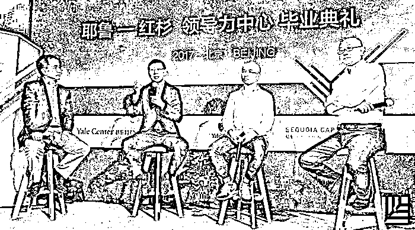

**“耶鲁-红杉领导力中心”首期毕业礼系列报道一**

5 月 21 日，红杉资本中国基金与耶鲁大学管理学院、耶鲁北京中心联合打造的“耶鲁-红杉领导力中心”首期项目毕业典礼成功举办。在圆桌对话环节，耶鲁大学管理学院教授、著名经济学家陈志武与红杉资本全球执行合伙人沈南鹏、著名企业家冯仑、投行家包凡一同探讨了终身学习与领导力发展等话题。

三位嘉宾分享了各自的学思历程，不约而同地提到了“思辩”、“求证”、“虚心求教”等关键词。在谈到与领导力有关的话题时，沈南鹏认为，领导者应当起到表率作用，同时要定期反思过去的工作；包凡则分享了“赋能”的重要性：“要把每一位团队成员的能力激发出来”；在冯仑看来，领导力无非是六个字：指路、用人、扛事。

以下为金句摘要：

**学如何时习之？**

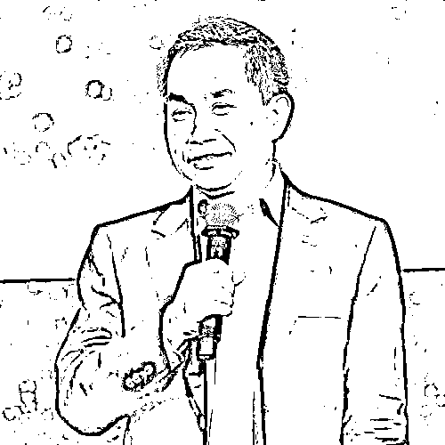

**陈志武**

我想先问三位嘉宾一个问题，你们平时都有什么好的学习方法？特别是除读书外，还有什么其他的学习方式，怎么让自己不断成长？

**沈南鹏**

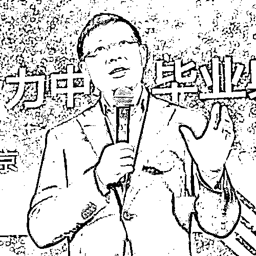

学习是一个非常重要的持续性的过程，同时，学习也要讲效率、讲成效，这涉及到一个方法：Critical thinking（批判性思维），更精确的翻译或许是“思辩”，这也是我们今年红杉中国年会的主题。只有找到更好的学习方法，你才会成为一个深度思考者（Deep thinker）。

作为领导者，你要比竞争对手有更深层的思考。在同样的市场变化中，你能否做出比对手更有效的应对，能否有长远的谋略？思辩能力可以起到重要作用。

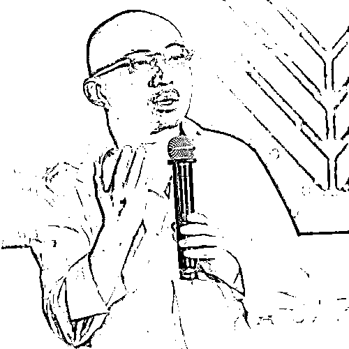

**包凡**

我一直把读书当作是一种脑力运动，至今还保持着大量的阅读量。除了商业管理类书籍外，对创业者来说，我觉得历史书真的应该读。因为我们今天做的很多事情都是面向未来的，但过去发生的事情对我们也是有启发的。

在我个人的经验里，还有一个很好的学习方式，就是跟业内高手聊天，你一小时内获得的信息量可能比自学十小时还多。因此，跟靠谱的人在一起是最好的学习方法。

**冯仑**

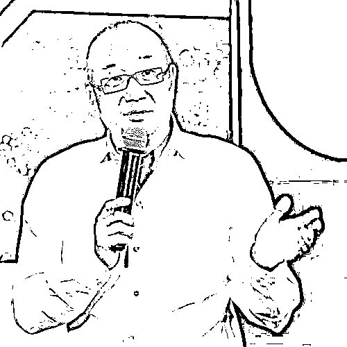

“学”和“习”实际上是两个字，“学”是简单的学技能，而“习”意味着要反复揣摩、思辩、求证，知识相对来说越来越容易获得，现在挑战的是我们“习”的能力。

怎么“习”？我通过接触各种人，甚至是找那些奇怪的人去学，要有很多跨界的学习。

“习”的目的是得道，得道的目的是产生智慧，智慧是你把所有东西融汇之后的结果，我们叫悟透。所以，“习”的目的是增加你的智慧，提升你对价值观的认同和选择的能力，所以我觉得应该花更多的时间在“习”上。

**如何培养领导力？**

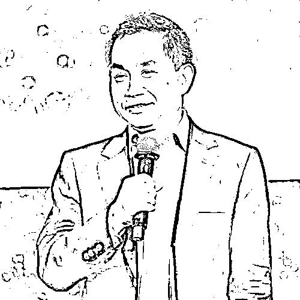

**陈志武**

第二个话题就是领导力，很多人会认为，领导力等同于控制力，CEO 一个人说了算？领导力是如何培养出来的？

**冯仑**

在我们公司内部，领导力就是六个字：指路、用人、扛事。

指路，就是给人指方向；用人，就是善用人才；扛事，意味着出了事情你要负责兜底、买单。电影里大哥和小弟最大的区别是什么？大哥来了可以彻底解决事情，如果大哥出场局面反而更乱了，那就不是真正的领导者。

如何提高领导力？我觉得还是要感谢挫折和打击，它们是提高领导力的最佳机会，就像运动员只有参加比赛才能进步。

**包凡**

这几年我自己做企业的一个体会是，作为一个领导很重要的一点，是如何真正把团队里每个人的能力激发出来。最重要的一件事情就是赋能。赋能要从影响身边的人开始，然后身边的人再把整个组织的潜能释放出来，让每个人都愿意为组织做贡献。

另一方面，一个人的能力毕竟是有限的，以刚才提到的思辩精神来举例。试想一下，当整个组织的文化都在提倡这种思辩能力的话，就会产生相当强大的力量。

如何提高自己的领导力？首先，要从挫折中不断总结学习；此外，要学会“放下”，学会重启，如果你想要进步，就要放下自我，忘记以前取得的成就，重新归零，这样才能不断往前走。

**沈南鹏**

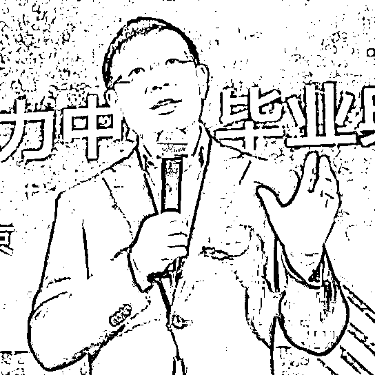

作为领导者，我认为很重要的一点是：成为团队的表率。表率这个词听起来好像很空，但真正做到，效果是切实可见的。

我们在企业中有很多规矩，当你设立这些规矩的时候，应该设身处地的去想——假如你不是领导，你觉得这个规矩合理吗？

作为领导，如果你能率先垂范的话，整个公司文化就会发生改变。这往往是考验能否凝聚团队、领导团队、影响团队的重要因素。真正的影响力不是靠说教，而是靠以身作则赢得团队的信任。

此外，要学会反思，不管公司生意有多“顺”，还是要仔细想想犯过的错，即使你不能完全纠正它们，但这个反思的过程是要有的，必须不断重复这件事情。

**最近在看什么书？**

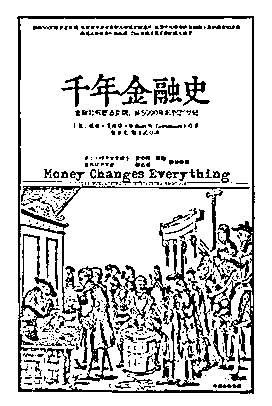

** **

**千年金融史**

Money Changes Everything

威廉·戈兹曼  **/ 著**

张亚光,熊金武  **/ 译**

中信出版集团 2017

**推荐人**：陈志武

这本书的作者威廉·戈兹曼是耶鲁的教授，也是我非常好的朋友。这本书讲了四千年左右的金融发展史，其中重点谈到文字的起源，其中提到，是借贷催生了文字的出现，为什么？这本书提供了很多细节。

另外，我希望大家一边创业，一边多思考人类社会。年轻的时候创业，到年龄大一些可能就会思考一些哲学问题，这也是一个不断学习的过程。

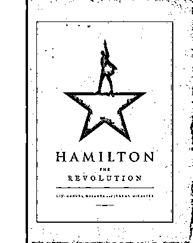

** **

**Hamilton**

The Revolution

Lin-Manuel Miranda,Jeremy Mccarter  **/ 著**

Grand Central Publishing 2016

**推荐人**：沈南鹏

去年夏天，我在纽约看了近来炙手可热的一部音乐剧《汉密尔顿》，讲述的是美国开国元勋亚历山大·汉密尔顿的故事。为了更详细地了解这段历史，我提前看了和这相关的书。其实，那些现在仍受到普遍认可的规则，其背后也是充满了偶然与争议。如果放在今天的显微镜下去看，恐怕仍会有很多的问号。所以大家不要对某些规则过于迷信，任何一个成功商业体系背后都有很多偶然性。这也提醒我们，要培养思辩的精神，形成独立判断的能力。

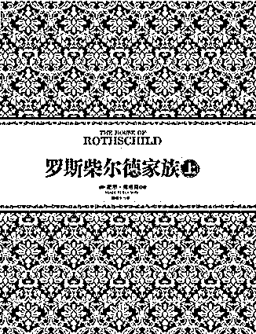

** **

**罗斯柴尔德家族**

 The House of Rothschild

尼尔·弗格森  **/ 著**

顾锦生 , 何正云  **/ 译**

中信出版社 2012

**推荐人**：包凡

正在读《罗斯柴尔德家族》那套书。我总觉得今天我们所处的世界，比起过去三十年来说越来越不安全，罗斯柴尔德家族是在战乱当中成长起来的，我想看看他们当初做的一些判断，所面临的一些问题。

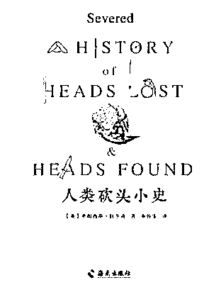

** **

**人类砍头小史**

Severed a history of heads lost & heads found

[英] 弗朗西斯·拉尔森  **/ 著**

秦传安  **/ 译**

海南出版社 2016

**推荐人**：冯仑

我现在不爱看“正经书”，都看“不正经”的书。比如《人类砍头小史》等。为什么是不正经的书？因为做生意要懂人，懂人性才懂市场，这些奇奇怪怪的书对了解人性有很大的帮助。

