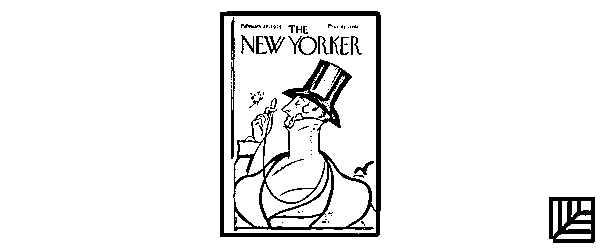
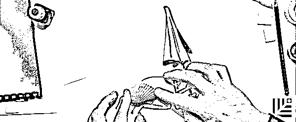
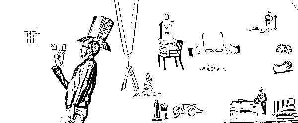

# 创业者应该向艺术家学习什么？你应该看看 Netflix 这部新纪录片

> 原文：[`mp.weixin.qq.com/s?__biz=MzAwODE5NDg3NQ==&mid=2651222758&idx=1&sn=fa25f558620134fbbef422a4c7a1e44d&chksm=80804cb2b7f7c5a452f16af287fa9f4ad166804a0a8be0f8811ce541ecb64835563578efbefe&scene=21#wechat_redirect`](http://mp.weixin.qq.com/s?__biz=MzAwODE5NDg3NQ==&mid=2651222758&idx=1&sn=fa25f558620134fbbef422a4c7a1e44d&chksm=80804cb2b7f7c5a452f16af287fa9f4ad166804a0a8be0f8811ce541ecb64835563578efbefe&scene=21#wechat_redirect)

在创业路上遭遇瓶颈怎么办？大脑几乎 24 小时满负荷工作怎么办？

这次，我们没有推荐书，而是“意外地”推荐了这部 Netfilx 新推出的纪录片:《抽象：设计的艺术》。《纽约客》杂志的插画师克里斯托夫·尼曼（Christoph Niemann）在本片中讲述了令其创意源源不断的工作方法，例如：抓住创意的核心、学会休息，为饱和的工作安排空间......

此外，导演还邀请了数位当代知名的设计师、插画师、建筑师、汽车设计师等，讲述他们的创意方法论和创作故事，其中呈现的许多新思维也同样适用于创业者。

点击文末“阅读原文”，可观看完整视频。

***

**【每日金句】**

与艺术相似，

创业的道路上也没有终点。

总有可以提升的空间

或新目标需要实现。

***

[`v.qq.com/iframe/preview.html?vid=a03692joyga&width=500&height=375&auto=0`](https://v.qq.com/iframe/preview.html?vid=a03692joyga&width=500&height=375&auto=0)

▲《抽象：设计的艺术*Abstract: The Art of Design*》预告片

《抽象：设计的艺术》（*Abstract: The Art of Design*）第一季共有八集，从《纽约客》的封面讲到宜家的家具，影片通过对艺术家的思考方式和灵感来源等方面进行分析，为我们讲述了这个世界是如何被“设计”出来的。

▲第一集开篇克里斯托夫·尼曼的作品展示（节选）

第一集的主角是为《纽约客》和《连线》杂志的封面插画师克里斯托夫·尼曼。开篇直接为我们展示了尼曼一系列极富创意的作品。你或许心生疑问，本片和商业有什么关系呢？其实，看完之后你会明白，创业和艺术创作有很多共通的地方。

例如本集中这六条针对艺术家的建议，同样适用于对创业者——

**创意只抓核心**

如何才能想出好点子？尼曼在构思插画时，脑海中会蹦出上千种想法，然后一个一个筛选，最后只留下一到三个他认为特别重要的点子。

在企业创建的任何阶段，优先排序的方法都是制胜法宝。先想出所有可以选择的发展方向，例如产品特性、战略重心等等，然后开始筛选，最后留下对当前目标最为重要的三个想法。想清楚做什么才能达到目的，把剩下的统统抛弃。

**休息与工作同样重要**

如何对工作日进行规划？尼曼借用知名艺术家恰克·克罗斯（Chuck Close）的一句话道出其中精髓：“外行人急求灵感，而内行人只是起床、工作。”尼曼有时会在下班后为了构思艺术创作去博物馆找找灵感，但是他认为“在早上 9 点到下午 6 点之间集中精力做事才是最重要的”。

当你初入某个领域时，很容易让工作吞噬你的生活。急于求成会让你的压力迅速膨胀，因此，定好工作和休息的时间尤为重要。

**更新工作方式**

从纽约搬到了柏林后，尼曼的工作强度比以前都要大，生活忙碌而充实。同时，他也在努力摸索一条能让自己不断进步的路径。他认识到，要想提升自己，就得“不断更新工作方式”。 

在忙碌的初创企业里最适合酝酿转变、研究规划。如果事情进展得不顺，你的大脑会处于时刻应对的状态，也会想要恢复原有的秩序。但当事情进展顺利时，你反而会积极思考，想着怎么才能在过去和现在的基础上实现突破，开始着手创新了。因此，你的工作方式与状态需要不断调整。

**留一些****「不计划」的****空间**

尼曼认为，工作做久了，就要慢慢学会给自己留出空间，不求事事都按着计划走。这就像向空中抛球一样，计划就像你抓在手里的球，而能灵光乍现的时刻正如抛到空中的球，你得掌握好两者的平衡，才能顺畅地抛起来又接住。不设定计划意味着留出了一些空间，为创意的集中迸发留出机会。

作为企业主，也有必要为员工设定目标、制定策略的时候，让他们能朝着目标工作，确保每个工作流程能以什么方式、在什么时间达到具体的效果，但同时，也需要留出一定计划外的空间。如果你能做到两者平衡，反应会更加敏锐，一旦出现了更重要的顾客需求、商业需求，也就有足够的空间做出调整，经常反思工作的成果。

**灵感需要每天练习**

好的创意带来的最大困扰，也许是迫使你继续超越过去。思考出一个好点子的几率就像中彩票一样渺茫，想要创造第二次奇迹，就会陷入极度的痛苦和恐惧之中。尼曼鼓励艺术家放松下来，学会分解压力，坚持每天练习。

一位具备长远眼光的企业家，常常会把绝大部分的时间用于思考远大的想法和计划，若能将日常工作中一些小的、零散的想法融合进来，两相结合，就能更好地锻炼自己的领导力和执行力。

**不设终点，持续探索**

尼曼在第一集结尾处总结道：“做完”一件事，并不是他的目标。对他而言，艺术家并不是画插画、交稿那么简单，这条道路永无止境、需持续探索。

与艺术相似，创业的道路上也没有终点。创业者的工作同样是无穷无尽的，总有可以提升的空间或新目标需要实现。你不应该像并购企业或是 IPO 一样开个价码，而是要清楚什么才是公司理想的发展路径、发展方式，思考公司在每个阶段所需解决的问题，从一个阶段跃升到下个阶段所要具备的条件。

不妨看看《抽象》这部影片，也许能帮助你快速突破自己的创业瓶颈。

***********

**【往期回顾】**

[AI 与人类 2.0：技术服务人类还是人类服务技术？](http://mp.weixin.qq.com/s?__biz=MzAwODE5NDg3NQ==&mid=2651222628&idx=1&sn=8cf90b6d6957be189ac46fb88d82e0e4&chksm=80804c30b7f7c526bae6663b19b413c88ef20937e1d8007c74142abccbec3247f36f5f438672&scene=21#wechat_redirect)

[谈判成功法则：像女孩那样谈判？](http://mp.weixin.qq.com/s?__biz=MzAwODE5NDg3NQ==&mid=2651222585&idx=1&sn=bbfacb4b2322ed2519c4e8b884fd793f&chksm=80804c6db7f7c57be42f2120f0b2807981a0440637e2767497838210a8abfc87156e93e146fd&scene=21#wechat_redirect)

[三次成功创业，卖掉两家公司，](http://mp.weixin.qq.com/s?__biz=MzAwODE5NDg3NQ==&mid=2651222524&idx=1&sn=78a1ed276d9aface72a7df8b2cc0bb00&chksm=80804fa8b7f7c6befecd3292ad949ede126b5ab6ac3aff25921c3871447a648ac492de5608dd&scene=21#wechat_redirect)

[他将赚来的钱全部捐掉？](http://mp.weixin.qq.com/s?__biz=MzAwODE5NDg3NQ==&mid=2651222524&idx=1&sn=78a1ed276d9aface72a7df8b2cc0bb00&chksm=80804fa8b7f7c6befecd3292ad949ede126b5ab6ac3aff25921c3871447a648ac492de5608dd&scene=21#wechat_redirect)

