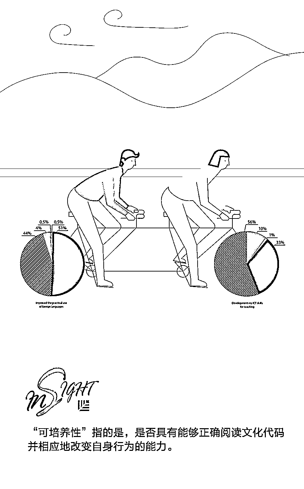

# 比起“志同道合”，“可培养性”在招聘时更关键 | 首席人才官

> 原文：[`mp.weixin.qq.com/s?__biz=MzAwODE5NDg3NQ==&mid=2651225914&idx=1&sn=6128d178e9ec02a4f917dbc5276e41b1&chksm=8080416eb7f7c878f9cab0059a45c760db18379dac96786f3358dc11167aae8d60ace05e39da&scene=21#wechat_redirect`](http://mp.weixin.qq.com/s?__biz=MzAwODE5NDg3NQ==&mid=2651225914&idx=1&sn=6128d178e9ec02a4f917dbc5276e41b1&chksm=8080416eb7f7c878f9cab0059a45c760db18379dac96786f3358dc11167aae8d60ace05e39da&scene=21#wechat_redirect)

一家公司或团队的文化越强大、越独特，文化契合度就越重要。这也是为什么无论初创公司还是传统企业，都不太欢迎那些跟他们的世界观不合的人。那么，“志同道合”的候选人就一定是合适人选吗？当然不是。

斯坦福商学院组织行为学副教授 Amir Goldberg 认为，在招聘新人时，充分考虑文化契合度是必须的，但还远远不够。一种至关重要的能力，不能被忽略，那就是适应能力。文章介绍了适应能力的重要性，它在招聘之外的作用，以及如何避免被夸大和滥用。

2013 年，Facebook COO 桑德伯格曾提到了一份“很可能是硅谷有史以来最重要的文件”。这不是一份革命性的软件代码，也不是一份概述两个巨头合并的合同，甚至与 Facebook 完全无关。她所指的是一份 127 页的名为“Netflix 文化：自由与责任”的 PPT 文件。

组织文化越来越被视为一个公司能够取得成功的关键因素：领导者应该对公司文化有一个明确的定义，并以此来指导相应的行动。而招聘人员通常都是建立和维护公司文化的先锋队，公司需要依靠他们来找到合适的人才。

“长期以来，学者和业界都认为，与公司文化是否契合是在新员工加入公司时就应该确定的事情——有些人适合，有些人不适合。雇主和雇员都应该在招聘过程中认真考虑对方是否适合自己。”斯坦福商学院组织行为学副教授 Amir Goldberg 这样说，“但我们的研究表明，其实还有另外一种非常重要的能力被大家忽略了。”

他说，那就是员工的适应能力。

**考察应聘者的适应能力，**

**而不仅仅是契合度**

人们不仅对公司文化会表现出不同程度的契合度，而且也会表现出不同程度的适应能力。Goldberg 认为，这第二点其实是公司更应该深入探讨的问题。

在一篇新论文中，他和其他三位共同作者——加州大学伯克利分校的 Sameer Srivastava，以及斯坦福大学的 Govind Manian 和 Christopher Potts，收集了 2009 年至 2014 年期间一家技术公司发送的 1000 多万份内部电子邮件。他们使用了语言学分析来检测公司员工的文化契合度（语言的使用与个人在社交环境中的适应性内在相关），每个人都是与相互交流最频繁的人进行对比衡量。

虽然那些入职时就很契合公司文化的员工确实表现良好，但是另一个更有力的相关因素是员工识别和消化公司文化标准的能力。Goldberg 说：“我们发现，最能够预测谁会留下、谁将离开，以及谁将被解雇的因素，并不在于员工初入职时的文化契合度，而是他们是否能够正确阅读文化代码并相应地改变自身行为的能力。”作者将这种可塑性称为“可培养性”。

根据这个结论，相比于应聘者是否与公司的信念一致，人力资源部门或许应该更多地考察申请者的适应能力，比如是否曾居住在其他国家或地区，是否愿意在多种不同的工作环境之间移动，以及是否能顺利适应这些环境等等。

**除了招聘以外，**

**这个研究还可以用来做什么？**

除此以外，这个研究还探讨了公司应该如何留住员工。Goldberg 和他的同事们解析了离开公司的员工数据，以探究谁是自愿离去的，而谁是被要求离开的。他们发现，从一开始就挣扎于公司文化的员工确实经常被解雇，这是文化不匹配的经典案例。而第二组员工最初也与公司文化不匹配，但很快就学会了适应。然后，随着时间的推移，他们对公司的依恋开始减弱。最终，这组员工经常会主动离职。

长期以来，学者和业界都认为，与公司文化是否契合是在新员工加入公司时就应该确定的事情——有些人适合，有些人不适合。雇主和雇员都应该在招聘过程中认真考虑对方是否适合自己。但该研究表明，其实还有另外一种非常重要的能力被大家忽略了。

Goldberg 认为，这为公司的领导者提供了一个机会。他说，通过语言诊断，以及将来的其他方式，如观察肢体语言或人们如何着装等，可以帮助领导者“密切关注公司的文化脉搏”。公司投入了大量资金来聘请合适的人才，并为他们提供合适的定位，但文化融合在此之后往往会很快停止。

他说：“我们目前没有很合适的工具，可以用来了解公司内部的运营状况。”员工参与度的调查往往成本高昂且不够频繁，而且员工有时还会掩盖或误解问题，由此得到的数据和结论也值得怀疑。“那么，我们是不是可以考虑使用这些语言工具，来发现公司内部哪些部分从文化的角度来看存在问题呢？”Goldberg 说，“或许这些工具还可以让员工更清楚地了解自己，以及他们与公司文化的契合度。”

**关于避免夸大问题的警示**

Goldberg 对这些可能性感到兴奋——更有效的招聘程序，更好地监督公司文化健康程度，但是也担心这个研究有可能会被滥用。

虽然他的研究对当前业界的普遍做法提出了一种新的转折性思考，但它还不是确定性的。“目前，我不希望某个人能否得到工作，是完全基于这个新兴的研究计划。”他说，“因为有关招聘和解雇员工的问题是很关键的，必须谨慎对待。这是我们想要说明的一点。”

他认为，随着时间的推移，这项研究会逐渐成熟起来，在更好地避免误报或降低负面影响之后，就可以在进行员工评估时极大地改善公司招聘人员和管理人员的传统工作方式。Goldberg 认为，通过分析一个人的语言或其他表达方式，可以便捷而准确地预测他的文化开放性。但是，无论是从技术还是道德角度出发，这一方式现在还有很多尚未解决的问题。

“我们希望可以在不会夸大问题导致混乱的前提下，帮助公司运作得更有效率和更具成本效益。”他说。** **

原标题 / GSB 观点 | 除了文化契合度，公司在招聘时还应该关注这一点

来源 / 斯坦福商学院

** 推荐阅读**

壹

[KPI 不是指南针，而是可视化的 GPS 工具 | 首席人才官](http://mp.weixin.qq.com/s?__biz=MzAwODE5NDg3NQ==&mid=2651225800&idx=1&sn=540419d5c125f6440de27f578502cbf2&chksm=8080409cb7f7c98ad9563a4f9b2c4c474b18a0d721fb38cf5e81e089c70617ad952fae2436e5&scene=21#wechat_redirect)

贰

[办公室福利：是一种浪费还是利润驱动？| 首席人才官](http://mp.weixin.qq.com/s?__biz=MzAwODE5NDg3NQ==&mid=2651225757&idx=1&sn=cabfa1eeb863a27a2a560d43d9fac6b1&chksm=808040c9b7f7c9df7d11c212e032fb72134457ca0ad63cc7bde272a3adb68e1ea2dd390d0dc2&scene=21#wechat_redirect)

叁

一位 CEO 给职场年轻人的一封信 | 首席人才官

肆

[为什么多样化比人数更重要？ | 首席人才官](http://mp.weixin.qq.com/s?__biz=MzAwODE5NDg3NQ==&mid=2651225543&idx=1&sn=f35c8f8e209a3750de50d31ad8d838b4&chksm=80804393b7f7ca856ae7723b0721263f31c035b87444fa4d250da8d28630c48766648b4811d2&scene=21#wechat_redirect)

伍

从 3 个人到 600 人，这家初创企业如何避免自我迷失？| 首席人才官

