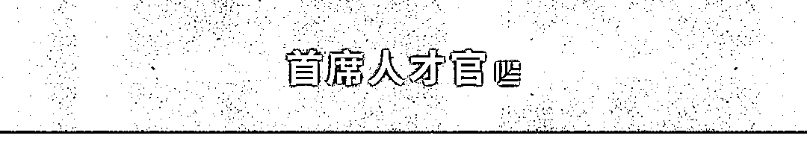
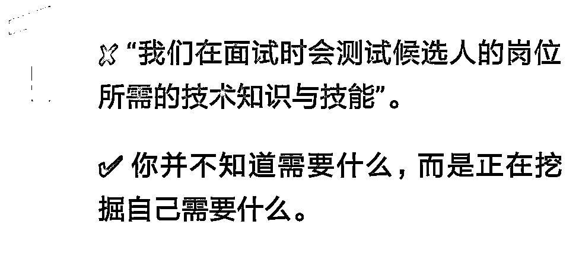
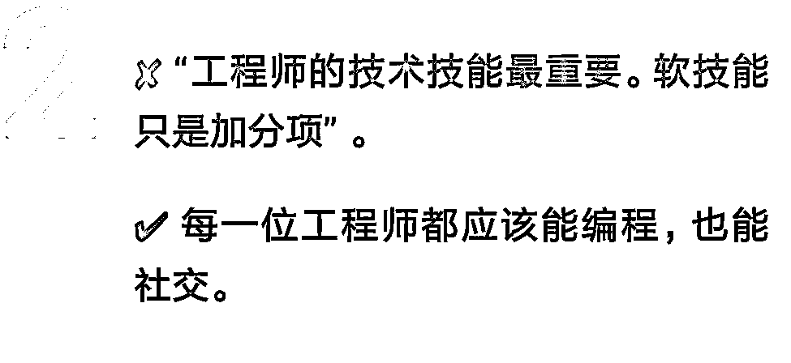
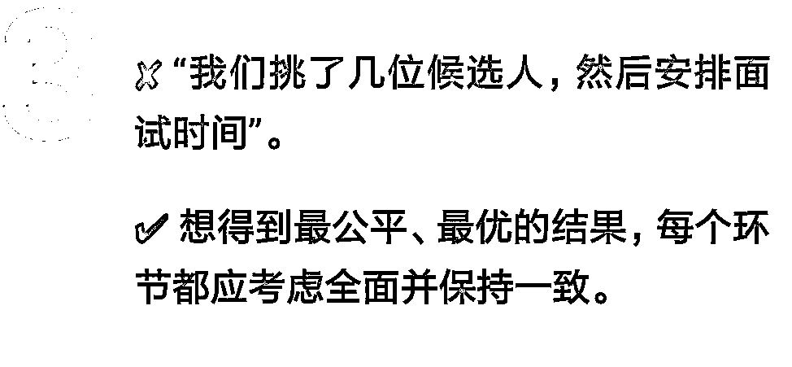
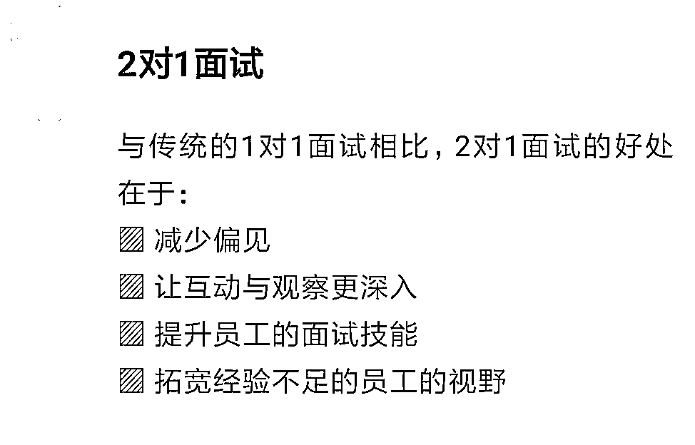
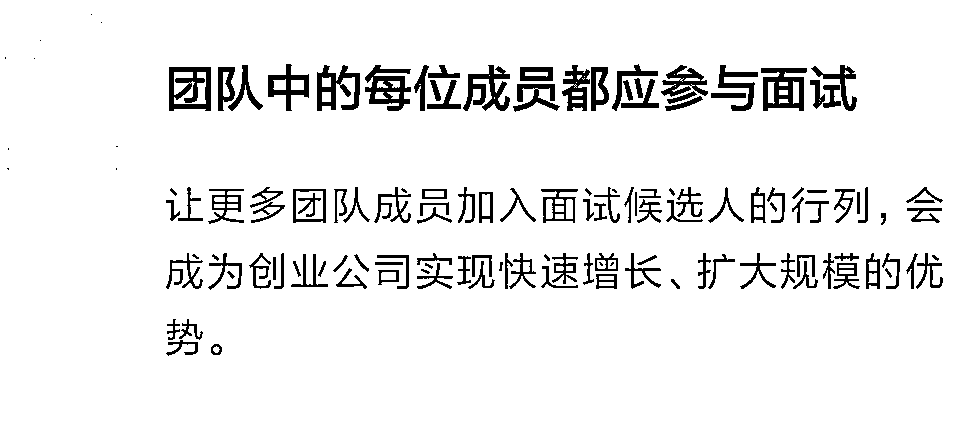
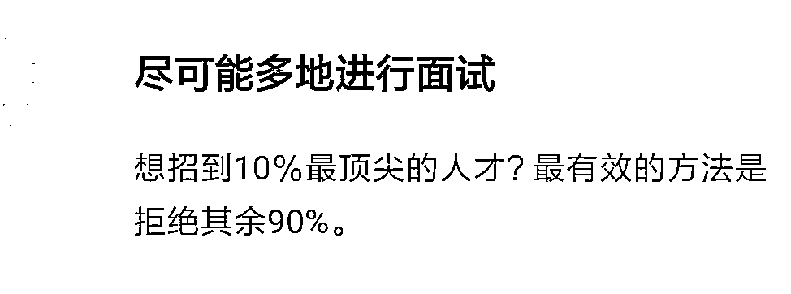
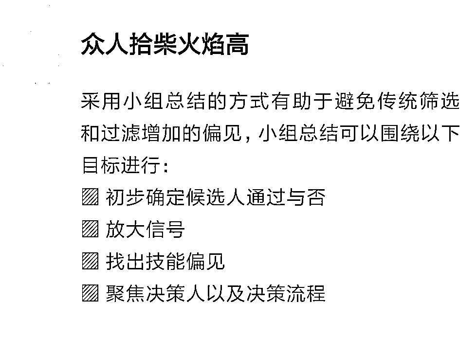

# 很多公司还在沉睡，用 90 年代的老方法招新人类｜首席人才官

> 原文：[`mp.weixin.qq.com/s?__biz=MzAwODE5NDg3NQ==&mid=2651225243&idx=1&sn=38bb4dedd2e4cb625da5658f681d03a7&chksm=808042cfb7f7cbd967b4457022a81b8605ae0622ee823360d3aa1ff79f6981742778a86295b9&scene=21#wechat_redirect`](http://mp.weixin.qq.com/s?__biz=MzAwODE5NDg3NQ==&mid=2651225243&idx=1&sn=38bb4dedd2e4cb625da5658f681d03a7&chksm=808042cfb7f7cbd967b4457022a81b8605ae0622ee823360d3aa1ff79f6981742778a86295b9&scene=21#wechat_redirect)

招聘软件 Lever 的工程总监 Marco Rogers 曾就职于 Clover Health 和 Yammer，在那期间他就十分痴迷于设计、优化面试流程。过去七年，他成功招聘了 80 多名工程师，为此至少进行了 400 场面试。更让人赞叹的是，他能让自己的技术团队参与其中，乐此不疲地面试未来的同事。对他而言，这才是面试的正确之道。在他的团队中，老练的面试官每月会进行 12-16 场面试。

在最近的专访中，Rogers 分享了一些常见招聘误区以及自己的独家招聘方法，并坦言，目前许多公司仍在延续微软 90 年代开创的面试风格，但这种风格找到的也是 90 年代微软需要的人才。如今的创业公司想要招到合适的新人类，就必须对招聘方法进行调整，建立一个全新的招聘体系。这样不仅能够改善公司的人才库，还能提升团队的凝聚力、能力和多样性。最后，Rogers 还推荐了一些初创企业可以优先使用并轻易实现的措施，用以优化面试流程。

**常见的三大招聘误区**

Rogers 一直试着改变岗位知识与技能的相关描述。他表示，“无论是连续创业者还是经验丰富的技术负责人，我都不认为他们足够了解初创公司早期的需求。因为这当中会有许多变数，招聘方法也要随着市场、竞争环境等因素的变化而改变”。“技术初创企业首先要了解需求，并在探索过程中找到答案。有些人一味地追求某些静态技能。但现实是，即便一位工程师能背出编写 B+tree 有什么意义，也无益于整体发展”。

在此必须郑重强调：很多公司在招聘技能上所写的并不是自己真正需要的。

那么这个误解的根源是什么呢？Rogers 说：“当我与他人深度讨论这一问题时，我意识到他们并不认为面试和招聘是一项关键业务” 。“他们似乎只把这些当成任务，而且为了完成任务，他们寻找并依靠一些传统模式，选择重复其他人所说或所做之事。尽管他们在乎与谁共事，但他们更在乎完成招聘任务。这样一来，招聘并非主题；找到人才是核心。这其中的差距很微妙，却能对招聘结果产生很大影响”。

Rogers 认为软技能与技术技能同等重要。候选人是否可以编写 JavaScript，同时与业务利益相关方有效地沟通？能够同时满足两个条件才是发展中的组织所需要的。

Rogers 通过提出以下问题来衡量工程师的软硬技能：

▨ 自我。自我意识差？过分执着于自己编的代码？自己必须是对的？这是否会影响自己倾听他人意见？

▨ 适应能力。是否了解公司要壮大和改变的目标？是否有过因公司发展而必须修改流程或重建团队的经历？如果有，是否很好地应对了这些变化？是否在变化中抓住个人成长的机会？

▨ 技术交流。是否了解岗位所需的技术技能？是否展示了技能运用的能力？最后，能否就技术难题很好地沟通？是否明白理论、应用与技术专业知识的沟通需要掌握不同技巧？

▨ 跨职能协作。能否分享自己与不同职能部门（如工程、产品、设计和客户服务等）密切合作的实例 ？能否举例说明什么时候协作良好？不顺畅时怎么应对？是否帮助组织内的“孤岛”人士，如何帮助的？ 

Rogers 认为面试有一道工艺流程，“我们的面试有四个环节，其中三个环节是团队评估，一个环节是候选人提问，每个环节 1 小时。这是我们的‘正确’环节数，我们会尽可能多地从中获取一些有效数据。最后一个环节由人事经理，一般是我来进行，回答问题并说明团队如何工作” 。“这样的环节设计可以让候选人与各个级别的工程师交流，进一步了解日常工作内容和晋升路径。每一环节都有固定的实测或提问，还有一部分随机对话。这里需要注意平衡，一致的结构和实测可以减少偏见。随机对话更人性化，我们收到反馈说这一流程给予了候选人充分的时间来评估公司是否合适”。

**将面试变成关键的商业战略**

Rogers 设计了一套体系，他在本次采访中透露了其中的 4 大方法，组合使用效果更好。

在 Yammer 和 Clover  Health 工作期间，Rogers 就长期使用且十分重视 2 对 1 面试。他在职业生涯早期就发现了 2 对 1 面试的好处，传统的 1 对 1 面试在他看来既无法给候选人带来很好的体验，面试官也容易把整个谈话变成尬聊。他认为解决这个问题最快最好的办法就是增加第三个人。

“让另一位同事参与其中，作为第二位面试官。我发现这不仅可以让候选人表现得更真实，双方沟通也更有效，而且还打破了僵硬的对话流程” ，Rogers 说。“这样的谈话可以有更多的选择和可能，既可以与候选人交谈，也可以与同事相互沟通。通过三点问答会让整个讨论和评估更加明朗”。

Rogers 分享了几次个人经历简单说明 2 对 1 面试的好处：

▨ 减少偏见。Rogers 解释道，“2 对 1 面试可以看到一些细节，比如候选人对待不同面试官有哪些不同表现。此外，2 对 1 面试可以让两位面试官比较自己的笔记和发现。但如果只派一名面试官，就很难有一些新的发现”。

▨ 让互动与观察更深入。“一名面试官同时兼顾互动、观察和计时并不容易。当面试官变成两位时，就可以更好地进行互动和观察，当候选人感到紧张时，可以有效地采取一些措施帮其解围，并让面试重回正轨。”

▨ 提升员工的面试技能。Rogers 说，“两位面试官最好是老新搭配。实操是理论教学无法替代的，新手会在一年内学到很多不同的技巧和风格。”

▨ 拓宽经验不足的员工的视野。Rogers 表示，“很多人会派最资深的人去评估候选人。因为他们认为一个更有经验的人才能更好地评估候选人的资历”，“但我并未发现其中有什么关联性。换个角度思考，经验少一些的员工或许可以挖掘出不同点。他们会敏锐地意识到候选人是否比自己更好，是否可以向他们学习或者该候选人是否有成为经理或导师的潜能。”

Rogers 发现这一举措很难做到，“有些人会认为面试不在他们的职责范围内，有些人则担心自己无法在面试中代表公司。也有人说，让每个人都接受招聘培训并参与其中的成本太高”， “大多数人最难接受的是成本。看起来成本高昂，但花几个小时的时间去了解是值得的，因为那些通过面试最终被聘用的人会和你朝夕相处，共同奋斗多年。”

让更多团队成员加入面试候选人的行列，会成为创业公司实现快速增长、扩大规模的优势。Rogers 认为在他的团队中发展面试技能是他的责任，他说道，“我需要评估整个团队在面试中的表现。在与新工程师搭档进行 2 对 1 面试时，我不仅要评估候选人，还要观察工程师的面试能力”，“在最后进行综合讨论时，我要求所有面试官都反映面试的情况，我们还会通过提问的方式进一步帮助每个人更好地应对面试过程中的困难和挑战、提高面试技巧。”

整个团队都应参与面试，如果你不想让一些人参与，问问自己为什么。如果你担心他们无法代表公司，那么你就遇到了一个更大的问题。

“传统观念认为，你可以通过一纸简历去判断这个人是不是最优秀的 10%的候选人。但我发现这是错的。当我与工程师负责人讨论其团队成员表现是否与聘用时的预期有所不同时，我们发现很多人的表现与履历不符。即使他们毕业于名校或曾在谷歌工作，也没有通过面试”，Rogers 说道，“相反，光看简历你可能无法发现真正优秀的人才。因为你无法预料他们的表现多出色，这关乎他们是否有合适的机会、动力和投入。这不仅与他们个人有很大关系，也与公司的结构能否激发员工潜能有关。”

Rogers 认为解决这些问题的唯一方法就是进行更多的面试，“如果你的初创公司正处于初期，需要招聘很多人，就需要设计一个可以面试许多候选人的机制并坚持执行。”Rogers 发现，想招到 10％最顶尖的人才，最有效的方法是拒绝其余 90%。

Rogers 非常推崇以小组总结来结束整个面试流程。这样可以实现动态信息交换，得出一些书面评估无法捕捉的关键点。一般持续 30 分钟，若每个人都已熟悉这样的流程，可以缩短至 15 分钟。

以下是 Rogers 的小组总结的目标：

▨ 初步确定候选人通过与否。他解释道，“Lever 有一个评级来确定候选人是否通过面试，分为四个等级：强烈建议聘用、聘用、不聘用、强烈建议不聘用。我们有意设定其中没有‘可能’的等级，因为人们必须在评估时做出选择。无论你选择不聘用还是聘用，都要说说理由。”

▨ 放大信号。这个环节是面试官总结面试情况以及提问，主要是了解面试官的评估做得如何、候选人表现如何。在谈论的过程中，有些信号会被放大，有助于我们进行下一步判断。

▨ 找出技能偏见。“只要是人类主导的事情都难免会存在一些偏见 。即使你了解并可以控制自己的偏见，也不意味着你可以完全摒弃它”，小组总结就可以帮助我们发现这些偏见。Rogers 解释道：“例如，候选人因为在技术实测中没有很好地指出一些变量而被某位面试官减分是很常见的事。这时你需要权衡的是：没有指出所有变量是否真的很重要？是。那这项技能是否可以培训和改正？是，没错。若是这样，我们就不能凭这一点取消候选人的资格。这也是我们进行小组总结的原因。”

▨ 聚焦决策人以及决策流程。“首先认可、感谢每位面试官的贡献，同时说明部分流程不等同于决策。”Rogers 说，“你应该让团队成员了解你的思维过程。在小组总结中，我试图让团队更深入地了解我是如何做出决定的。并明确告诉他们，如果觉得我说的话不对，应该说出来。别让团队觉得最终的决定很糟糕。”

这类小组总结有助于避免传统筛选和过滤增加的偏见。也是负责人们说明决策流程的绝佳机会。

**别用 90 年代的老方法**

**招新人类**

从初始的筛选到面试环节到总结汇报，初创公司面试候选人的方式都应该不断改进。

▨ 首先，要充分认识到自己可能不了解某个岗位所需的全部能力，且工程师候选人必须同时满足公司对软硬技能的期望值。

▨ 建立一个全面的面试体系，该体系应从 2 对 1 面试开始，这不仅是评估候选人的有效方式，也是培养面试官的宝贵机会。

▨ 每个人都应该有机会参与面试。如果你不希望某个人参与，请深入了解原因。

▨ 尽可能多地面试，想要招聘顶尖的 10％，就需要面试其他 90％。

▨ 每次面试以小组总结结束，对候选人进行动态解读，并让成员了解负责人的决策流程。

“那么升级初创公司的面试流程的第一步是什么？实际上第一步之前还有一个步骤零，如果想获得更强大的信号来确定是不是对的人，请尝试使用此方法。即提问：你在面试过程中得到的数据是否足够多样化？”

Rogers 补充道，“当我与很多人谈论面试时，我注意到许多公司仍在延续微软 90 年代开创的面试风格。这是整个行业的主要趋势。但这种风格找到的也是 90 年代微软需要的人才。如果你的创业公司想要蓬勃发展，就必须调整招聘方法。这一体系不仅能改善人才库，还能增强工程师团队的凝聚力、能力和多样性。” 

** 推荐阅读**

壹

[红杉资本 Doug Leone：别做房间里最聪明的人｜红杉七问之谈](http://mp.weixin.qq.com/s?__biz=MzAwODE5NDg3NQ==&mid=2651225235&idx=1&sn=f4c30e3690311b7b634763371e6a65c1&chksm=808042c7b7f7cbd1c5281f0a213a13b248f223ab7147605bb150b5e94576cc38ba362b77e6fc&scene=21#wechat_redirect)

贰

[留不住、招不到？可能是人才管理体系出了问题](http://mp.weixin.qq.com/s?__biz=MzAwODE5NDg3NQ==&mid=2651225209&idx=1&sn=e2efb78e284660702acf8d8e73c61ced&chksm=8080422db7f7cb3b11cd972b42e94767a9dfe49f16d7e3552ab1787c88585937ce8134191599&scene=21#wechat_redirect)

叁

[颠覆组织：让人人都成为“迷你 CEO”](http://mp.weixin.qq.com/s?__biz=MzAwODE5NDg3NQ==&mid=2651225214&idx=1&sn=9fa64294faa93b2251c2c88e92fe5c9f&chksm=8080422ab7f7cb3cfa25225616150bfadecd2afc7c7633010ddc618233429bde6dba21f7ebc0&scene=21#wechat_redirect)

肆

[出门问问李志飞：少谈算法，多想想 AI 商业落地](http://mp.weixin.qq.com/s?__biz=MzAwODE5NDg3NQ==&mid=2651225222&idx=1&sn=1f06ad40e9eb9fdbfde937ac82ee2441&chksm=808042d2b7f7cbc472b94ea8feb01753d0eca98642a1fae217eeba0267a325090db9291edd6b&scene=21#wechat_redirect)

伍

[专属修习 ▎从耶鲁走出来的人，都有哪些共同点？](http://mp.weixin.qq.com/s?__biz=MzAwODE5NDg3NQ==&mid=2651225230&idx=1&sn=03ac80df4dd654399e6679b934fbfb57&chksm=808042dab7f7cbcc6cba2e3779aa92742eb31347f94e6a6a8e3a207dacd290b27d3df60d2f5e&scene=21#wechat_redirect)

