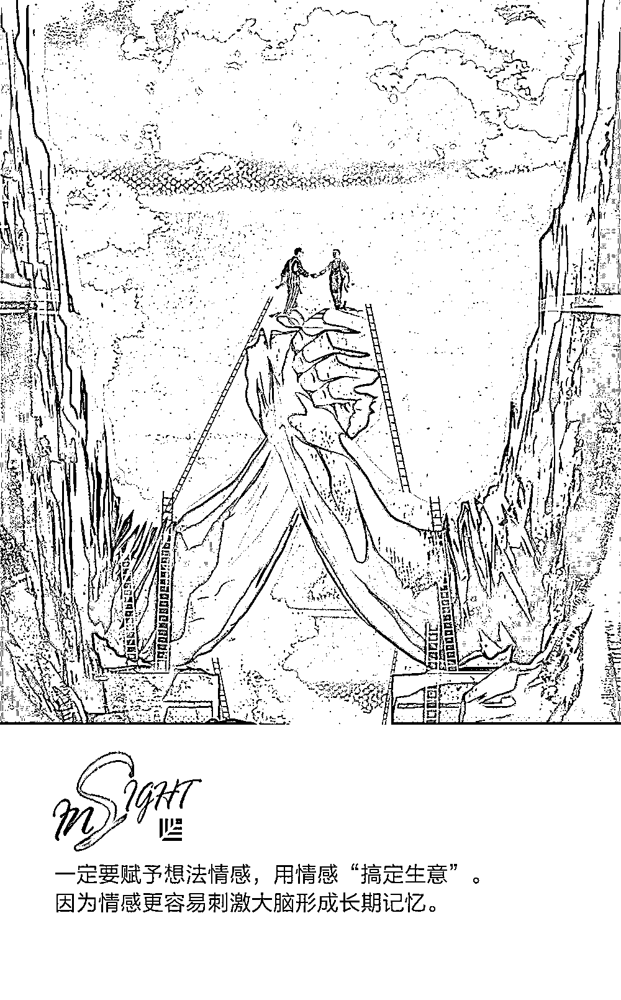

# 故事怎么讲才更扎心？跟“招聘界的迈克尔・乔丹”学两招｜首席人才官

> 原文：[`mp.weixin.qq.com/s?__biz=MzAwODE5NDg3NQ==&mid=2651225269&idx=1&sn=fe44d8c51776ce07eb4dabff1c5aaf53&chksm=808042e1b7f7cbf759f4964a3ae46ab7ac5d40584b8f7c460aac0cb9f8f722477add2a4acbf7&scene=21#wechat_redirect`](http://mp.weixin.qq.com/s?__biz=MzAwODE5NDg3NQ==&mid=2651225269&idx=1&sn=fe44d8c51776ce07eb4dabff1c5aaf53&chksm=808042e1b7f7cbf759f4964a3ae46ab7ac5d40584b8f7c460aac0cb9f8f722477add2a4acbf7&scene=21#wechat_redirect)

旧金山州立大学管理学教授 John Sullivan 博士被《快公司》杂志称为“招聘界的迈克尔・乔丹”，他先后在 6 大洲 30 多个国家的 300 多家公司或组织中担任发言人，并在人才管理领域发表过 900 多篇文章和 10 部著作。John Sullivan 博士在研究哪些因素能够对候选人的选择产生巨大影响时发现，一个真实的好故事往往决定了候选人的最终选择。

故事的作用不容小觑，但遗憾的是，很多公司都没有形成系统的故事收集、分类和传播流程。阅读 John Sullivan 博士的这篇文章，或能让你充分了解到讲故事的重要性，以及如何建立一份故事集、如何选择有说服力的故事，并学会在招聘面试时，用自己的故事打动最优秀的候选人。

**为何要讲故事？**

如果你们正在向数据驱动的招聘方式转型，那么首先要做的便是判断哪些“卖点”会对招聘产生何种影响。了解了这些数据后，讲故事这种面试技巧便会大受欢迎。很多管理者其实已经从乔布斯身上看到了讲好故事的重要性，但如果某些管理者仍不认同，你可以从以下 8 个角度告诉他们，为什么故事能够对最佳候选人的招聘产生积极影响：

▨ **带****情感色彩的****想法能给人留下深刻印象**

你可以通过文字、数据或图表推销想法。但所有成功的销售人员都会告诉你，想要达成大额交易，一定要赋予想法情感，用情感“搞定生意”。因为情感更容易刺激大脑形成长期记忆。

▨ **故事不带推销色彩**

一听到华丽的“强势推销式强调”，候选人便会产生反感情绪。但以故事开始面试则会让候选人感到更轻松。

▨ **完整的故事会被人反复讲述**

故事应该教人道理，有始有终，并且能够始终吸引听者的注意力。有趣的故事更容易被记住，人们也更乐于跟自己的家人、同事分享。

▨ **影响力最大的故事最为真实**

精心写就的故事中不乏“公司套话”，可能会对候选人产生消极影响。精心制作的企业视频中的故事也是同样的道理。所以，为了达到“真实”的效果，故事中可以包含一些小错误，避免使用复杂难懂的词句，而且要通过预讲确保故事有趣、真实、可信。

▨ **故事能够提高招聘负责人的推销能力**

很多负责招聘的人并不擅长推销。所以，为他们准备一系列效果很好的故事能够极大地提升他们向最佳候选人推销的整体能力。

▨ **很多面试环节适合讲故事**

故事更容易传播，因为适合讲故事的环节很多。可以在与候选人初次沟通或面试过程中讲故事。轻松、简单的故事也会让很多员工在闲聊时或在带人参观公司时讲起这些故事。

▨ **员工讲述的故事更可信**

故事最好由在职员工讲述。因为候选人更信赖未来的同事，而且由员工讲述的故事往往听起来更准确，因为他们才是每天“与实际工作接触”的人。

▨ **面对面交流时讲故事效果更好**

通过面对面交流，招聘人员能够根据每位候选人的特点选择合适的故事，还能更好地把控时间。通过这种讲故事的方式，候选人也有机会提问，从而解答其疑惑。

**如何建立故事集？**

故事只有经过传播才具备价值。多数公司缺乏系统的故事筛选流程，也没有可供人们查阅的故事中心。解决这一问题的最佳方式便是建立企业“故事集”。这个故事集表格中包含但不仅限于对故事、最佳实践、优秀员工管理项目和奖项的收集和分类。受限于文章篇幅，本文不一一罗列完整的“步骤”。以下是关键步骤：

▨ **广泛涉猎**

涵盖工作、产品、客户和企业荣誉等多个方面。

▨ **分类故事**

故事较多时，分类便于浏览。

▨ **不要过度推送故事**

过度推送会导致员工的反感情绪。因此只需要提醒员工，了解这些故事有助于推荐。

▨ **预讲故事**

尽可能多地与非员工人员预讲故事，了解哪些故事效果最好。

▨ **建立企业故事集和本地故事集**

企业故事集涵盖所有企业故事；本地故事集涵盖具体部门的故事。

▨ **奖励**

评选并建立提供企业故事的人员。

▨ **确立持续改进工作的指标**

通过新入职的同事了解其加入公司的原因，特别是难以填补岗位的新入职员工。通过了解到的情况不断完善故事集和整个推销流程。

**哪些故事影响力更大？**

在研究中，我选出了 25 类能够对最佳候选人的决定产生重大影响的故事。以下故事按影响力大小排序。

▨ **我会创造奇迹**

这类故事体现了员工的努力对公司、环境和客户的影响。

▨ **伟大的同事**

这类故事展示了员工的丰富经历和专业知识。

▨ **伟大的管理者**

这类故事展示了管理人员卓越的管理风格。

▨ **创新**

这类故事体现了员工的创新能力。也可以提供公司鼓励员工自由思考和尝试的故事。

▨ **自由选择**

这类故事列出对员工而言非常重要的事项，包括项目、工作计划和工作地点，体现员工自由选择的权利。

▨ **最佳工具和技术**

渴望掌握行业技能的员工往往希望掌握最新工具和技术。故事应该体现公司所拥有的前沿技术。

▨ **伟大的产品**

这类故事是关于公司所提供的领先行业的优秀产品和服务。所有人都希望与胜者为伍。

▨ **荣誉时刻**

这类故事列举了获得外部奖励或认可的项目、产品或活动，特别是“最佳雇主”奖。

▨ **自由时间**

这类故事讲述员工所拥有的自由规划和自由开展工作的时间。

▨ **参与决策**

这类故事展示了员工如何参与决策以及自主决策。

▨ **学习和个人成长机会**

优秀的员工希望能够不断学习。所以相关故事应该体现员工在相关领域拥有的各类机会。

▨ **认可并奖励优秀员工**

优秀员工渴望得到奖励。所以相关故事应该体现优秀的工作所获得的奖励。

▨ **关注环境**

这类故事讲述了公司及员工为可持续发展和环境所作出的贡献。

▨ **鼓励团队合作**

多数员工希望在团队合作氛围浓厚的环境中工作。所以相关故事应该体现公司对团队合作的重视和肯定。

▨ **多样性**

讲述不同员工所取得的成绩往往令人信服。这类故事应该体现不同员工的高度参与或不同员工在更高层次上的参与程度。

▨ **职业规划**

多种快速成长和晋升渠道对潜在申请者和候选人的吸引力很大。因此，体现公司提供的多种快速成长和晋升渠道的故事能够对候选人的决定产生很大影响。

▨ **小角色，大成功**

这类故事讲述了底层员工不断晋升的经历。体现底层员工的重要性以及他们所获得的关注和认可非常重要。也可以讲述从底层做起的管理人员的故事。

▨ **员工共享公司成功**

这类故事体现了员工共享企业成功带来的经济效益的政策和途径。

▨ **双向沟通**

反映管理人员倾听和了解员工意见以及与员工沟通的故事。很多优秀员工喜欢透明的公司环境。

▨ **工作安全**

体现公司努力保证长期雇佣员工的案例。

▨ **工资与福利**

如果公司工资较高或福利很好，可以在故事中提到这些优势。

▨ **幸福感**

很多公司和创业企业都在提倡员工幸福感这一概念，因此可以引入体现员工幸福感的故事。

▨ **坚定的企业价值观**

这类故事讲述了企业是如何“践行”企业价值观的。

▨ **灵活度以及工作生活平衡**

这类故事体现了员工在工作之外拥有足够的享受生活的时光。

▨ **人性化**

这类故事体现了企业和员工“人性化”的一面，特别是员工不管是在工作时间以内还是工作时间以外特意去帮助同事和当地居民的案例。

**用故事打动每个人**

如今的招聘市场竞争日益激烈，招聘的“话语权”已经从公司转移到候选人手中。当优质候选人面对多个工作机会选择时，推销就变得尤为重要。且推销这个技能无法被科技取代。要显著提升推销能力，就应该设计一套正式的数据驱动的流程，讲述并传播能够激发潜在申请者和候选人兴趣的故事。

想要让每个故事更具影响力，可以加入一些“力量因素”让普通故事变得不寻常。比如在故事中引用名言和数字，或是体现员工的参与度和投资规模。但最重要的是要能够打动每个人，让每个人都能记住故事。最后，要给书面故事附上链接、图片或短视频。

实际上，讲故事不仅可以用在新人招聘上，让在职员工更多地了解这些故事也有助于提升留存率。此外，在行业媒体上传播故事同样有助于树立企业形象。

** 推荐阅读**

壹

[作业帮侯建彬：我非常相信企业价值观背后的力量｜红杉原创特写](http://mp.weixin.qq.com/s?__biz=MzAwODE5NDg3NQ==&mid=2651225265&idx=1&sn=bea9348aac3535abb50af7cedd519f4d&chksm=808042e5b7f7cbf36daf8b3e2af2b119d9c3fe02c457980e776a4d42209cbffffee4bae3a1e2&scene=21#wechat_redirect)

贰

[很多公司还在沉睡，用 90 年代的老方法招新人类](http://mp.weixin.qq.com/s?__biz=MzAwODE5NDg3NQ==&mid=2651225243&idx=1&sn=38bb4dedd2e4cb625da5658f681d03a7&chksm=808042cfb7f7cbd967b4457022a81b8605ae0622ee823360d3aa1ff79f6981742778a86295b9&scene=21#wechat_redirect)

叁

[你对“现金为王”的理解有多少是错的?](http://mp.weixin.qq.com/s?__biz=MzAwODE5NDg3NQ==&mid=2651225247&idx=1&sn=c2f3e71e30168c7e81b14603b6f541f2&chksm=808042cbb7f7cbdd68060128ac7ce9dc085a2be88f447be6202f0bdadb64f41b6cacee7b0d35&scene=21#wechat_redirect)

肆

[自动驾驶是马拉松，Pony.ai 一路领先 | 红杉 A 轮特写](http://mp.weixin.qq.com/s?__biz=MzAwODE5NDg3NQ==&mid=2651225254&idx=1&sn=7f814683dd60f2e192b0a66d4322f643&chksm=808042f2b7f7cbe47ce5341fee8ea58e1a2575b2bb988e402b5abb7d8aefcdcb0d39ab72b32d&scene=21#wechat_redirect)

伍

[什么时候该把选择权交给命运？问问算法吧](http://mp.weixin.qq.com/s?__biz=MzAwODE5NDg3NQ==&mid=2651225255&idx=1&sn=fc42cfb83b0b00c7d41b1a32ecddf70a&chksm=808042f3b7f7cbe577c982149a529fce5e517d7bffc0a841df66c3f19b7907fe3a2f2dbf19bc&scene=21#wechat_redirect)

