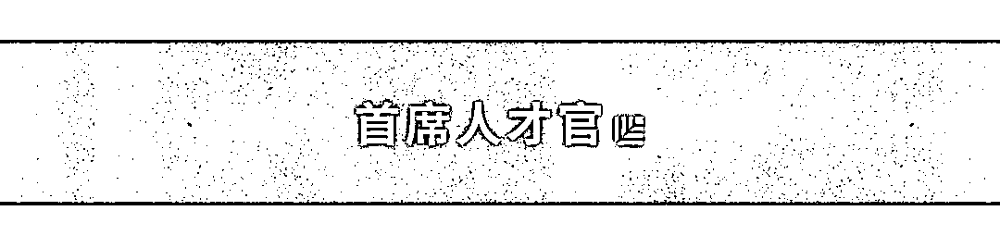
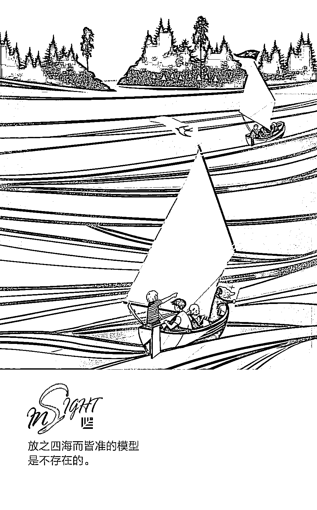

# 如何让求职者爱上你，更爱你的公司？| 首席人才官

> 原文：[`mp.weixin.qq.com/s?__biz=MzAwODE5NDg3NQ==&mid=2651224725&idx=1&sn=26d5f9b016e49526d21d3bfb7b3839bd&chksm=808044c1b7f7cdd7a2b714dbbdc0a3163e4404d08d4167cb9e9c17e21b8c3f43937cf44b54a7&scene=21#wechat_redirect`](http://mp.weixin.qq.com/s?__biz=MzAwODE5NDg3NQ==&mid=2651224725&idx=1&sn=26d5f9b016e49526d21d3bfb7b3839bd&chksm=808044c1b7f7cdd7a2b714dbbdc0a3163e4404d08d4167cb9e9c17e21b8c3f43937cf44b54a7&scene=21#wechat_redirect)

英国第二大付费电视公司维珍媒体（Virgin Media）发现，在被拒绝的求职者中，有 18%的人是它们的客户，而糟糕的求职者体验则导致了高达 540 万美元的收入损失。

尽管越来越多的公司已经意识到求职者体验会给企业带来何种负面影响，但却只有 36%的企业愿意对人才战略进行投资，更别提少人问津的求职者体验计划了。如果能够给求职者提供一个绝佳的求职体验，让他们爱上你和你的公司，即使最终没能共同工作，他们也可能为你推荐更多优质的人才资源，更重要的是，如维珍媒体所意识到的那样，求职者可能是你的客户，能让客户爱上你的公司，这不正是维系客户关系的最高境界吗？

那么如何打造最佳求职者体验？首先，你得明白，求职者体验指的是有意向的求职者对你公司的看法。从品牌到入职整个过程中的直接或间接沟通都会影响到这种看法。

本文提供了一个求职者体验框架 1.0 版，为企业招聘提供基本参考，企业可以根据自身情况在此基础上加以完善，从而保持自己在招聘上的竞争力。求职者体验框架主要围绕以下 7 个步骤展开说明：

▨ 雇主品牌理念

▨ 岗位描述/网上提交申请

▨ 电话筛选/面试

▨ 发出 Offer

▨ 回复落选求职者

▨ 入职前准备

▨ 评估求职者体验

1

**雇主品牌理念**

▨ 企业社会责任——谷歌和微软一直因其企业社会责任项目受到国际广泛赞誉，也多次被评为最佳企业雇主，这两方面绝非毫无关联。它们的企业社会责任项目旨在帮助解决人类和环境所面临的问题，这种投身伟大使命的理念在影响求职者体验上起着关键作用，甚至会提高顾客忠诚度，从而带来更多的利润。

▨ 创新产品——高瞻远瞩的企业如通用汽车（GM）和财捷（Intuit），已经在招聘会上使用 VR 头盔，向求职者直观展现在它们公司工作的情景。

▨ 求职网站上的评论——就像人们网购会浏览和发表评论一样，70%的人在决定是否要加入新公司前，都会参考网上的相关评论。投入足够资源，让求职者在整个招聘生命周期中都有美好的体验，这样你会收到许多好评。

2

**岗位描述/网上提交申请**

▨ 聊天机器人——知名猎头公司 Allegis Group 旗下的 Allegis Global Solutions 做了一项研究，它们发现，58%的求职者认为与聊天机器人交谈感觉舒适。所以，不妨考虑使用 Tasha 或 Esther Bot 等聊天机器人帮助你回答求职者关于岗位或公司的常见问题。

▨ 简明扼要的岗位描述——很多岗位描述要么太无趣、要么太短、要么太长，请将字数控制在 400-700 字之间。除此之外，需要注意的要点还包括：突出使命陈述；包含标有办公室地点的地图；添加可跳转到求职网站上的公司页面链接；加入感染力十足的“工作中的一天”和介绍公司文化的短片；记得在职业页面上说明面试流程等等。

▨ 申请表格的长度——在网上申请岗位时，求职者因为申请表格过长过复杂而放弃申请的情况并不少见。因此，请移除表格中不必要的信息。另外，若求职者在申请前还得先创建一个账号，这样的做法可是一大地雷，因为这只会让整个过程更加繁琐。在发布岗位前先进行测试，自己过一遍申请流程，计算完成所需的时间。如果用时超过了 4-5 分钟，那么你也许需要对此进行重新评估。

3

**电话筛选/面试**

▨ 交互式虚拟之旅——针对那些无法进行现场面试的求职者，可通过虚拟技术让他们在家中也能跟公司员工交流、参观公司办公室。不少创新公司已经使用这种方法来打造更加个性化的求职者参观体验。

▨ 帮助求职者做足功课——人才委员会（Talent Board ）最近的报告显示，求职者体验奖（CandE Award）得主认同帮助求职者做好准备的重要性。尽量避免因为没有帮助求职者做好充分准备，而错失顶尖人才的情况。不妨像谷歌那样，在求职者与招聘经理会面之前，帮助他们做好功课。这样做可以让求职者在公司面前展示出最棒的自己。

▨ 建设性的反馈——一些公司会在面试后向落选的求职者打电话，并提出一些改进建议。能做到这一点的公司并不多。但如果能为求职者抽出这些时间，那么他们会由衷感谢你。

▨ 招聘经理培训——北美最大的招聘网站凯业必达（CareerBuilder）的一项调查发现，只有 16%的招聘经理接受过关于求职者体验的培训。许多时候，猎头因为在提交后没有收到招聘经理的及时回复或反馈，无法向已进行面试的求职者告知最新进展。其实，一个简单的服务级别协议（SLA）就可以解决这个问题。在 SLA 中商定好回复时间，这样就能及时通知求职者了。

4

**发出 Offer**

要发出无可挑剔的录用通知，可考虑以下重要元素：

▨ 避免使用东凑西补的口头通知。学会全面清晰地进行说明，并确保能够信守承诺。

▨ 详述薪酬（包括工资、奖金、股票、福利等）。

▨ 在 24 小时内致电通过者，确认他们对通知是否有疑问，是否接受录用。

▨ 确认通过者对接受录用是否持肯定态度，向他们提问，弄清楚他们是否感到犹豫。

▨ 提供使用电子签名的选项，方便通过者完成录用通知书。

5

**回复落选求职者**

向最佳候选人发出 Offer 后，应该就轮到向人才管道做出回复，告知他们岗位已经招到合适人选了对吧？这个过程已经可以实现自动化了。但是如果你能花精力给次优候选人和那些参加面试的求职者打电话，那么你便能从一众竞争对手中脱颖而出。要确保与那些不合格的求职者进行沟通，如不能致电，最起码要通过邮件来交流。

进行沟通时要注意的要点：

▨ 给予反馈，帮助面试者改进和完善自我。

▨ 向他们提供未来出现类似工作机会的相关预测。

▨ 邀请他们参加企业交流活动。

▨ 邀请他们加入你的人才网络。

6

**入职前准备**

确保从候选人接受录用到入职第一天前的这段期间里，与他们保持联系。否则的话，失去他们的可能性会提高。因为假如候选人也参加了其他面试，很有可能他们会转而选择你的竞争对手。保持好沟通，不要让他们在等待入职的两周中收不到任何音讯。以下是一些推荐做法：

▨ 发送来自团队的个人专属欢迎视频，并提前让他们看到自己未来的办公桌。

▨ 告诉他们，你已经将这个好消息分享给了他们的推荐人，以此向推荐人的贡献表示感谢。

▨ 考虑为他们准备一个来自公司的家庭大礼包。

7

**评估求职者体验**

这里有一份求职者体验调研表，供大家参考。

我们都知道净推荐值（Net Promoter Score）在评估求职者体验中的重要性，但是如何利用调研所得的数据，系统地减少贬损者而增加推荐者？建立一个 PDCAR（即规划、执行、查核、调整、重复）流程会是一个很好的起点，来细分世界一流求职者体验的各个阶段。

▨ 规划——发现求职者体验模型中各个阶段存在的断裂。选择财务团队中最佳的合作人选，来弄清楚贬损者所造成的损失，以及对企业造成的影响。规划好解决方案，提交给高层，并下定决心、投入资源将其推行。

▨ 执行——尤达大师说过，“要么做，要么不做，不存在试试看”。这一阶段是计划实施阶段，根据净推荐值改进或改变你的求职者体验计划。

▨ 查核——确认所做的改变是否提高了净推荐值。再次跟财务部门合作，验证和评估投资回报率（ROI）。检查新改变是否导致新的断裂。

▨ 调整——解决求职者体验生命周期中新出现的断裂或问题。

▨ 重复——不断优化整个过程。

许多人力资源和人才招聘从业者都会将求职者体验放在优先的位置，但多数企业苦于无法定义和建立一个端对端求职者体验框架。放之四海而皆准的模型是不存在的，我们也要意识到，技术的进步使求职者体验生命周期在不断快速变化。为了保持竞争优势，企业必须不断调整和改变自身的求职者体验模型，以淘汰过去影响求职者对企业看法的行为与做法。

** 推荐阅读**

壹

[刘星详解红杉消费投资逻辑：消费×科技，企业必须更加“激进”](http://mp.weixin.qq.com/s?__biz=MzAwODE5NDg3NQ==&mid=2651224723&idx=1&sn=9c1a471bf3078b295292cba0128d1029&chksm=808044c7b7f7cdd16503f794999c437be704acd20fe4de76813d69bc3787f495e1842f93779c&scene=21#wechat_redirect)

贰

[每天花 10 分钟摆弄笔和回形针，能让创造力源源不断](http://mp.weixin.qq.com/s?__biz=MzAwODE5NDg3NQ==&mid=2651224718&idx=1&sn=e502c29e8cf49c94325d446a1cad7127&chksm=808044dab7f7cdccbfed7a13aef651f1ddf11153d42b0390d4775cb40328f88ed4b3bdec6c68&scene=21#wechat_redirect)

叁

[我们能与机器人建立真正的友谊吗？](http://mp.weixin.qq.com/s?__biz=MzAwODE5NDg3NQ==&mid=2651224711&idx=1&sn=a5f146a155636c7ecd6db105906aed5b&chksm=808044d3b7f7cdc56ddb604794d9d7cf22954f23c75e25d262f806834e5092ced9daef1bea2b&scene=21#wechat_redirect)

肆

[请留存这篇 3 万字长文，它或许正是独角兽公司们手中的那张王牌](http://mp.weixin.qq.com/s?__biz=MzAwODE5NDg3NQ==&mid=2651224674&idx=1&sn=cb06e421a1194e962c6f773c70a36731&chksm=80804436b7f7cd20c91ebd3e6ad92f7f07a2b084de383056385f227702b458a985c8fe4f210d&scene=21#wechat_redirect)

伍

[The Mountain: no longer so cruel, but a close companion.](http://mp.weixin.qq.com/s?__biz=MzAwODE5NDg3NQ==&mid=2651224686&idx=1&sn=fe219e2b454c41133cdc6a52738415be&chksm=8080443ab7f7cd2c9ff33d1ad9bd0310b624b9d60eb660f2cc0d860767930af60109ba36b3b0&scene=21#wechat_redirect)

