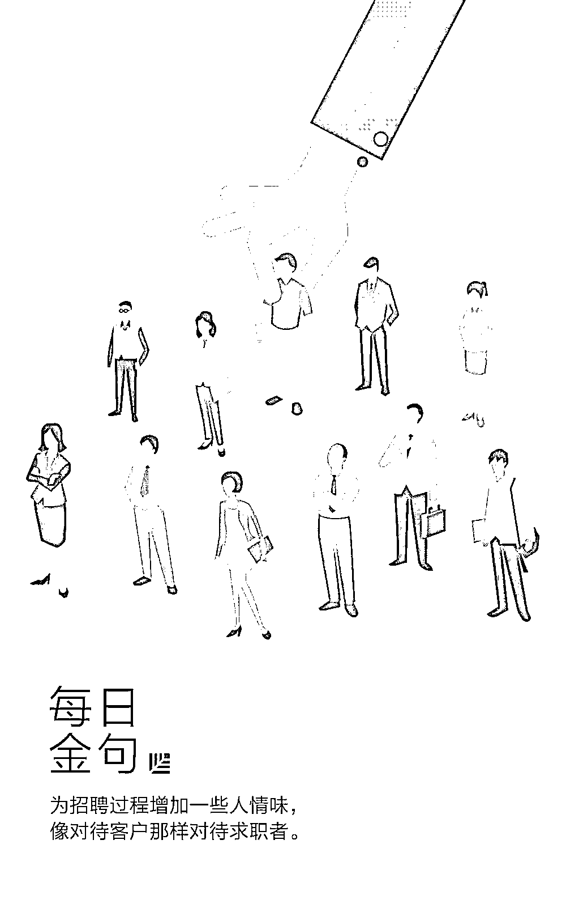
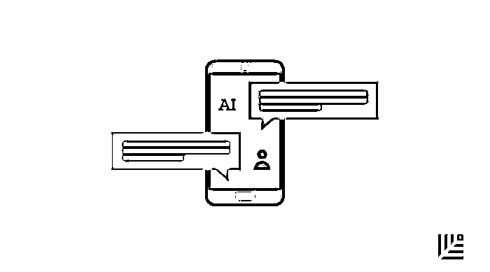
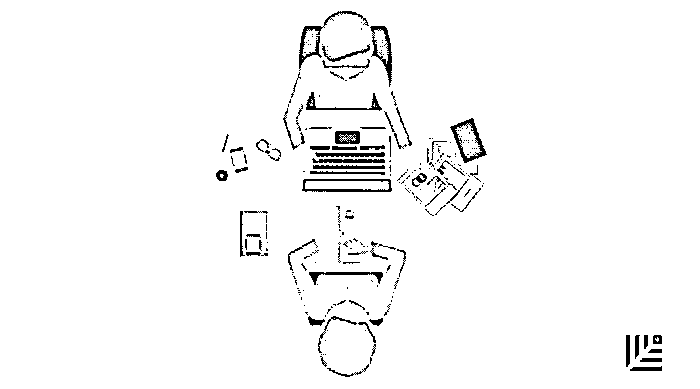

# 像对待客户一样对待求职者，你能做到吗？｜首席人才官

> 原文：[`mp.weixin.qq.com/s?__biz=MzAwODE5NDg3NQ==&mid=2651224546&idx=1&sn=5ac4b6468c3be8e89569b588ae297244&chksm=808047b6b7f7cea046078544fa4f93524805a31809268094d524076fb2c1a3a611e13846595d&scene=21#wechat_redirect`](http://mp.weixin.qq.com/s?__biz=MzAwODE5NDg3NQ==&mid=2651224546&idx=1&sn=5ac4b6468c3be8e89569b588ae297244&chksm=808047b6b7f7cea046078544fa4f93524805a31809268094d524076fb2c1a3a611e13846595d&scene=21#wechat_redirect)

数字化变革在极大提升工作效率的同时，也带来了一些问题，比如在需要进行沟通的工作上，与机器人对话难免缺失了一些“人情味”。仅凭问题清单、设定好的回答，无法针对性地解决所有问题。

尤其在人才招聘上，若自始至终让求职者与机器交流，可能会让企业与很多优秀人才擦肩而过。为了招揽更多优秀人才，你需要不断优化整个招聘流程，加入个性化、人性化的沟通。

如何让数字招聘更人性化？人力资源领域的专家们提出了自己的看法，综合他们的建议，本文总结出了 6 个要点：

▨ 让招聘流程更人性化

▨ 打造“求职者友好型”官网

▨ 与求职者直接交流

▨ 提供面试流程时间表

▨ 诚实以待

▨ 像对待客户一样对待求职者

在自动测试系统、人工智能和算法的时代，技术有望使招聘变得更加容易，但高度数字化的招聘可能会造成“人情味”的流失。

随着人才市场继续收紧，雇主不能缺少与求职者的直接交流和联系。幸运的是，招聘和雇佣个性化并不是一项艰难的任务。以下 6 点建议，或能帮你在数字招聘中增加一些人情味。

**让招聘流程更人性化**

如果招聘流程缺乏个人互动，求职者可能会认为，就算自己被聘用，也不会有大展拳脚的机会。如果你正在寻找的是优秀的人才，缺乏互动不会给对方留下一个很好的印象。

英国智能招聘公司 Beamery 发展部门的副总裁 Ben Slater 表示，求职者的期望已经改变了。“他们在招聘过程中寻求的是完全不同的体验。”这些求职者也不是很宽容，Ben Slater 指出：“如果求职者对待遇不满，他们就会在网上分享自己的疑虑，这可能会对公司的品牌声誉造成损害。”这一举动还将对公司未来的招聘不利，试想一下，后来的求职者看到过往求职者留下的不满，会有怎样的反应？Ben Slater 认为，“归根结底，人性化就是让每个求职者都获得一对一交流的体验”。

显然，很多雇主已经无法摆脱智能招聘工具，但他们可以做更多的工作来实现流程人性化。澳大利亚在线人力资源管理系统 Deputy 的营销活动经理 Dan Westmoreland 表示，雇主不一定要舍弃自动化，他建议根据人口统计学和行为学将求职者进行细分，通过使用客户关系管理系统、自动测试系统甚至是营销自动化系统，使自动化的拓展方案更加人性化。

“最后要为这个过程增添一些人情味，”他说， “虽然自动化很好，也很重要，但是像 LinkedIn 这样的社交平台上的快速通话或通信可以带来巨大的改变。”

**打造“求职者友好型”官网**

如今的求职者在他们发送简历邮件之前，就已经研究过自己应聘的公司了。雇主必须确保自己的网络形象是用户友好型的。

当求职者进入你的公司官网时，就是你与下一位优秀员工进行第一次交流的时候。如何介绍公司情况？是否很容易在网站上找到空缺岗位信息？信息查找过程是否很简单？所有这些因素都有可能吸引或是赶跑求职者。你要确保自己正在打造的形象能够吸引你想要的人才。

**与求职者直接交流**

根据客户关系管理和运营软件 Bullhorn 的首席人力资源官 Kim Castelda 所言，当你有兴趣雇用某人时，允许他们通过个人邮箱与你本人直接进行交流很重要。没有人希望将自己的介绍信发送到公司的智能电子邮件地址。

你需要花时间思考如何在整个招聘过程中通过单点联系让求职者知道你有意聘用他们，这包括分享你的电子邮件地址。让他们知道你自始至终都会解答他们的问题，并且随时恭候。

Castelda 表示：“我们希望每位求职者都有独特的惊人体验，尤其是当他们进入招聘经理面试的阶段之时。”Bullhorn 软件实现了在求职者和招聘专员之间建立咨询关系，让每位求职者在招聘过程中都有一位联络人。

**提供面试流程时间表**

从最初的筛选到最终的面试，让求职者知道在何时获得什么结果很重要。没人愿意处于悬而未决的状态，不知道自己是否应该联系你，了解这份工作的空缺状态。

让求职者知道面试需要多长时间，以及他们什么时候能够做出决定是一个简单的礼貌之举，将这个日期记到你的日历上。如果你不打算见面，就让求职者进入下一个循环，每个阶段的后续流程都会推动人性化过程继续进行。

**诚实以待**

在招聘中，最好的部分是给对方一份工作，最糟的部分是告诉对方没有通过面试，但这是工作的一部分。忽略那些花时间与你见面的人可能会留下不专业和不礼貌的印象，并且招来之前提到过的网络差评。

对那些想要填补空缺却落选的人诚实以待。如果对方是优秀的求职者，只是稍逊于某个人而已，那么以后还有讨论空缺职位的可能。一定要为人才敞开大门。

讨厌通过电话通知坏消息？可以通过一封专业的电子邮件感谢他们抽空参加面试，如果真的可以的话，提醒他们将来如果有职位空缺之时会考虑他们，这是一个适当又简单的解决方案。

**像对待客户一样对待求职者**

最后，Slater 建议要像对待客户一样对待求职者。他指出：“假设今天的他们不适合这个岗位，这并不意味着你将来没法和他们共事。他们也可能把你的公司推荐给自己的朋友。” 

Castelda 对此表示赞同：“在劳动力短缺的情况下，我们很可能会再次向求职者求助。如果他们有很棒的求职体验的话，他们会重新来应聘或推荐他们认识的人才。”

Westmoreland 说，这些小步骤可以为企业带来更多好处，而不仅仅是聘用到了某个优秀的人才。“实现流程的人性化有助于提高求职者的质量，得到他人的推荐，拓宽未来的招聘渠道，并且为你打造一个良好的企业形象，对潜在员工更具吸引力。” 

 /mp/newappmsgvote?action=show&__biz=MzAwODE5NDg3NQ==&supervoteid=459596725#wechat_redirect 

** 推荐阅读**

壹

[传统企业 AI 决策之道：分 3 个层次回答 9 个问题](http://mp.weixin.qq.com/s?__biz=MzAwODE5NDg3NQ==&mid=2651224542&idx=1&sn=f545264222417de2887ca93f4d69e953&chksm=8080478ab7f7ce9c07c80f2aae6ffe6ab9605ecbad1fd86214e3d25e5c6e4a86b561a2227dc7&scene=21#wechat_redirect)

贰

[薪人薪事常兴龙：为什么“铁军”无法成就 SaaS 销售](http://mp.weixin.qq.com/s?__biz=MzAwODE5NDg3NQ==&mid=2651224512&idx=1&sn=3d9e517f6026aaf782762f540f1c3fe4&chksm=80804794b7f7ce8207229537820b73096a18a5e2010a3ef567e792186ebbb2c2a8e406cf67a0&scene=21#wechat_redirect)

叁

[12 年数据分析、300 家公司研究，告诉你企业转型成功的 5 个关键法则](http://mp.weixin.qq.com/s?__biz=MzAwODE5NDg3NQ==&mid=2651224513&idx=1&sn=a0e1b343ed7dfe3902f32568edc61a00&chksm=80804795b7f7ce83f62e216550a69b35eed91c618cb47f321181b139f7e9b4c0b28941d0465b&scene=21#wechat_redirect)

肆

[香侬科技李纪为：AI 不会造就时代，而是时代催动 AI 发展](http://mp.weixin.qq.com/s?__biz=MzAwODE5NDg3NQ==&mid=2651224528&idx=1&sn=0a21e153059d1963dc3648f5fbe6e201&chksm=80804784b7f7ce92ba7212b0e33553a635e2671e03b8667483f6dc311f75e10205b355410043&scene=21#wechat_redirect)

伍

[想获得爆发式增长？先来回答我这 3 个问题](http://mp.weixin.qq.com/s?__biz=MzAwODE5NDg3NQ==&mid=2651224534&idx=1&sn=28e665d5efa3793b396a6628fed6f84f&chksm=80804782b7f7ce94b9e5f6c54e4d652e1b0af7b202eb607945e87a518a6d6bf7c42cb4fcf3a3&scene=21#wechat_redirect)

