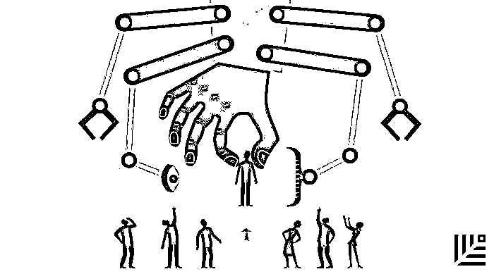

# 亚马逊保持一流人才竞争力的秘诀 | 首席人才官·选

> 原文：[`mp.weixin.qq.com/s?__biz=MzAwODE5NDg3NQ==&mid=2651222490&idx=1&sn=c9e11f872d03e1c05918258e4361ceaa&chksm=80804f8eb7f7c698920e3925c329397a2a90a1596469043fcbb924064dd60908344517cc867c&scene=21#wechat_redirect`](http://mp.weixin.qq.com/s?__biz=MzAwODE5NDg3NQ==&mid=2651222490&idx=1&sn=c9e11f872d03e1c05918258e4361ceaa&chksm=80804f8eb7f7c698920e3925c329397a2a90a1596469043fcbb924064dd60908344517cc867c&scene=21#wechat_redirect)

如何在每一次招聘中选取比现有员工更优秀的人才，以及如何科学地节省招聘环节的时间？亚马逊给出的解决方案是：机制化。

为此，他们可以从公司各个角落挖掘并任命“招聘门槛提升者”，这些人的使命就是要确保公司可以招聘到“业绩表现足以超过一半以上的公司既有的同职位员工”，并可以与 HR“讨价还价”；为了避免不必要的时间消耗，他们建立了“漏斗式招聘体系”，每一次电话面试必须拒绝三分之一的求职者......

这些都是曾任亚马逊首席架构师的阿努拉格·古普塔学到的宝贵经验，他认为，就是这些看起来几近死板的条条框框，保证着这家伟大的公司十几年如一日地保有着最初的强大生命力。

***

**【每日金句】**

领导者要确保瑕疵不会一路遗留下来，

并确保问题得到纠正，

因此他们必须严守高标准。

***

传统观点认为，员工巨大的热情与精力让企业取得了伟大的成就，事实或许并非如此。这正是阿努拉格·古普塔（Anurag Gupta）从亚马逊的工作经历中学到的——机制往往比热情重要。

因为几乎没有员工不希望去做“正确的事”，大部分人对工作都抱着良好的意愿与态度，但“员工想要达到的成就”与“无法避免的错误”之间存在巨大的鸿沟，怎么解决这一矛盾？

在亚马逊，**古普塔领悟到的答案是机制，即可重复的、可度量的、可审计和可提高的过程，是这些保障了企业一步步走向伟大**。

在首轮资本公司的上一次 CTO 峰会上，古普塔展示了一些可用于招聘环节中的机制。这些机制可有效减少招聘过程中的失误，并节省大量的时间。

**授权“门槛提升者”**

 “很多公司都说‘我们只雇佣比我们自己更好的人’，”古普塔对此表示疑惑，“如果你试着让招聘机制化，就能解决一大堆问题：究竟比谁好？哪一个最好？‘更好’的标准要如何制定？”

古普塔建议公司内部的人来负责提高招聘门槛，让他们参与所有的招聘会议和面试环节，授予他们做判断的权力，让他们来确定某个求职者相比于现有人才品质是否有所提高。

“寻找高水平，而且有良好的判断力的人作为‘门槛提升者’，”古普塔说，“告诉他们，**他们的工作是确保有新员工的业绩表现足以超过一半以上的公司既有的同职位员工**。”

很重要的一点是“门槛提升者”不能像 HR 那样迫切地需要填补某个职位。他们应该来自 HR 团队之外，但充分掌握评判人才所需的职位相关信息，他们只专注于求职者的表现。

而且，正如每一个良好机制一样，这一招聘机制也应该有内置的 Plan B 方案。“如果 HR 与‘门槛提升者’的意见不一致，在初创企业，你可能会把决定权交给创始人之一。 ”古普塔给出以上建议。

**建立漏斗式招聘体系**

“对每一个走完整个面试环节的人，你需要投入大概 20 个工时，”普塔说，“你还必须考虑求职者的感受——他们投入的时间和你对他们投入的一样多。”那么，问题来了：如何建立一套机制，从而节省招聘者与求职者双方的时间？

 “这个流程或许是这样的，第一次电话筛选后，你排除掉三分之一的通话对象；第二次电话筛选后再排除掉剩下的三分之一，”古普塔说。严格执行这一流程会防止参加面试的人数过多，还大大地节省了时间精力。

“我们做了测试。有些电话筛选结果模棱两可，所以就让求职者来现场面试了。结果他们都没有得到职位。”因此，在招聘过程中学会早早地拒绝，可以节省包括求职者在内的每个人的时间。

为了公平地筛选求职者，节省员工的时间，古普塔还建议在两次电话筛选之间加上一道限时测试题。

这个任务或许是一道简单的编程问题，这个任务并不难，对于一个水平中等的程序员来说，或许 10 分钟就能解决。“不可思议的是，即使你布置的是这样简单的问题，都会有约 30%的人出现大大小小的错误——一开始我都不敢相信。但现在，我们有上百个数据证明这个数字是站得住脚的。”

同样的，PR 团队可以要求求职者限时编辑一份新闻稿，使其语法正确，条理清晰。基本上，你要看一个人能否在面试人压力之下满足一些核心的工作要求。

**不要敷衍对待公司文化**

在招聘过程的各个方面中，确定文化适配这一项似乎是最难以标准化的。而且，如果你正严格提高招聘门槛，进行求职者的面试，那么缺乏文化适配可能意味着一年后有一半的人会流失。

“**有一半的现场面试时间应集中在考察文化的契合程度**，”古普塔说。这意味着你需要清楚地了解求职者身上哪些内容属于你公司的文化，而哪些不属于。

亚马逊经过漫长的时间确定了其核心领导原则，并把它们展示在网站上，他们必须思考这些原则对每一个层次的每个岗位分别意味着什么。文化是由文化所处环境中的人创造的，你有机会为每个新员工强化你所设想的环境——这也许是从一开始就列举并机制化文化价值观的最佳理由。

按照这个思路，亚马逊就良好的领导力构建出了 13 条核心原则，并公之于众：

*   **客户至上**：以客户为中心。从客户入手进行逆向思考。他们努力工作来获取并留住客户的信任。虽然领导也关注竞争对手，但他们更沉迷于客户。

*   **领导者即所有者**：领导者的行动代表了整个公司，而不仅仅是他们自己的团队。他们从不说：“那不是我的工作。”

*   **创新和简化**：领导者期望并要求他们的团队进行创新和发明，而且总是在寻找简化的方法。他们了解外部情况，从各个方面寻求新的想法，不会受到“非我所创”的局限。创造新事物时，我们要承认自己可能不被人理解。

*   **招聘和发展最佳人选**：领导者认可杰出人才，愿意把他们带到组织中各个位置。领导者发展新的领导者，并发挥自己的作用，认真指导他人。

*   **坚持最高标准**：领导者对高标准毫不动摇，尽管很多人可能会认为这些标准过高。领导者不断提高标准，从而推动他们的团队提供高品质的产品，服务和流程。领导者要确保瑕疵不会一路遗留下来，还要确保问题得到纠正，因此他们必须严守高标准。

*   **从大处着眼**：领导者创造和传达一个大胆的方向，由这个方向前进可以激励出成果。他们从与众不同的角度思考，且环顾四周来寻找服务客户的方法。

*   **行动的偏见**：在商业中速度起到关键作用。我们重视有计划的冒险。

*   **节俭**：我们尽量不把钱花在对客户不重要的事情上。节俭能培养出智慧、独立性、发明创造。职工总人数、预算规模或固定费用大并不能产生额外加分。

*   **直言不讳地自我批评**：领导者不会把自己或团队的缺点当成长处。领导者会提出问题或进行解释，即使这样做会引起尴尬和为难。领导者会按照最高的标准对自己和团队进行评价。

*   **赢得他人的信任**： 领导者怀抱真正豁达的心态，真诚倾听，乐意以谦卑的态度审视自己最坚定的信念。

*   **刨根问底**：领导者参与各个层次的运营，持续关注细节，进行经常性的审计。他们事必躬亲。

*   **有骨气，敢于提出异议**：领导者有异议时，必须以恭敬的态度质疑决策，即使这样做会令人感觉不舒服或筋疲力尽。领导者有信念和毅力。

*   **交付成果**：领导人专注于关键业务的输入并及时交付品质优良的成果。尽管遇到挫折，他们还是能做到随机应变，坚持到底。

制定这些领导力核心原则是亚马逊在全企业范围内列举和机制化文化价值观的另一种方式。凭借这种方式，他们所描绘并灌输给新员工的文化现在仍然像亚马逊初创之时一样，具有强大的生命力。

**点击文末“阅读原文”查看最新招聘信息**

**加入红杉中国大家庭。**

