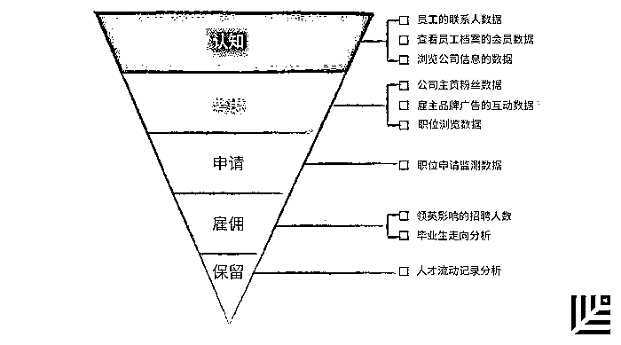
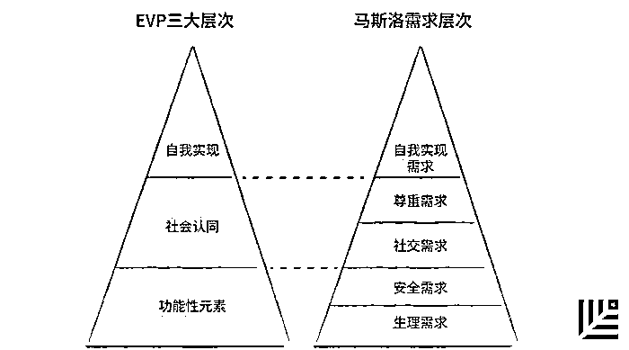

# 人才争夺的秘密武器:「雇主品牌」建设的六步法则 | 首席人才官

> 原文：[`mp.weixin.qq.com/s?__biz=MzAwODE5NDg3NQ==&mid=2651222782&idx=1&sn=ca37d966407fd24600667c2b57059f4e&chksm=80804caab7f7c5bcaae95f2372ceaf1c75617c5b3814aa41ea83ae2fea442c52bcf4dbc884af&scene=21#wechat_redirect`](http://mp.weixin.qq.com/s?__biz=MzAwODE5NDg3NQ==&mid=2651222782&idx=1&sn=ca37d966407fd24600667c2b57059f4e&chksm=80804caab7f7c5bcaae95f2372ceaf1c75617c5b3814aa41ea83ae2fea442c52bcf4dbc884af&scene=21#wechat_redirect)

“品牌”这一概念在市场营销领域早已深入人心，而在人力资源领域，“雇主品牌”概念的兴起也不过二十多年的时间，但人们很快便意识到它的威力——

此前，Linkedin 就曾通过一份专门的白皮书揭示：一个强有力的雇主品牌可以为企业带来 2.4 倍的业绩增长，1.8 倍的利润增长，节约 50%的雇佣成本，降低 28%的离职率......究竟什么是雇主品牌，企业又该如何打造一个强大的雇主品牌？本文为此制定了一份六步法则。部分要点摘录如下：

*   91％的中国 HR 负责人认可雇主品牌对招聘优秀人才有显著的影响，却只有 25%的雇主拥有全面的雇主品牌战略；

*   雇主品牌不能脱离商业品牌孤立存在，但它也绝不等同于商业品牌。商业品牌针对的是消费者，而雇主品牌更具针对性，它指向公司的现有雇员或市场上的潜在雇员；

*   雇主品牌需要商业品牌的支持，因此，将人力资源部门与市场营销部门强强合作是企业的不二选择；

*   以员工为核心，以体验为基础，与期望相结合，以恰当的方式表达，这就是建设真实雇主品牌的 4E 模型。

***

**【每日金句】**

在真实的基础上树立品牌愿景，

找到现实与愿景之间的平衡点，

提炼出雇主品牌的口号并将其落实，

这就是企业需要做到的。

***

**随**着雇主品牌的概念在中国越来越火热，很多企业管理者也常常被问到：“你们开始做雇主品牌了吗?” 他们会说：“在做呀，我们每年都做校园招聘，会在网上宣传，还会去高校办线下活动，向毕业生宣传我们的企业。”

到高校去抢夺“好苗子”确实是人才储备的关键，很多 HR 也会把校招作为雇主品牌的主要宣传阵地。但雇主品牌建设等于校招的宣传吗？当然并不是。究竟什么是雇主品牌呢？

雇主品牌代表着现有员工、离职员工、潜在员工心目中对雇主的形象反映和价值承诺，它既面向内部员工、又包括外部人才。

在中国，已经有越来越多的企业开始意识到雇主品牌建设的重要性。领英发布的《2017 年中国人才招聘趋势报告》中显示：**91％的中国 HR 负责人认可雇主品牌对招聘优秀人才有显著的影响，却只有 25%的雇主拥有全面的雇主品牌战略**。

究竟如何才能打造一个完善的雇主品牌呢？看似复杂，其实六个步骤便可以一目了然。

**衡量你的雇主品牌**

对于任何一个具体的项目，只有拥有被衡量的指标，才能确保执行的人尽力达成目标，雇主品牌建设也是如此，我们将在起点时了解现状和存在的问题，在终点时衡量品牌建设效果，并且定期回顾追踪。

过去，很多企业在衡量雇主品牌时，往往习惯于用一些与招聘相关的指标来衡量。例如招聘/到岗时间、招聘成本、试用期离职率、用人经理满意度等。这些指标在衡量招聘时固然有效，但在衡量雇主品牌传播的方面却很局限。

其实，我们可以将雇主品牌的衡量分为内外两个方面：

> *   在公司内部，HR 们可以通过内部员工调研来评估公司的雇主品牌，例如调研员工的满意度、忠诚度和敬业度等；
>     
>     
> *   在公司外部，大数据正在成为热门的衡量方法，越来越多的企业将大数据作为参考，将人才与雇主互动的旅程拆解成多个阶段，并追踪每一个阶段的成效,从而更合理地分配资源，优化“雇主品牌漏斗”。

▲领英大数据分阶段衡量雇主品牌表现

**让商品品牌与雇主品牌发挥合力**

说到雇主品牌，有一个常见的误区：“商业品牌即雇主品牌”。虽然，雇主品牌不能脱离商业品牌孤立存在，但同时，它也绝不等同于商业品牌。商业品牌针对的是消费者，而雇主品牌更具针对性，指向公司的现有雇员或市场上的潜在雇员。

领英与利平科特(Lippincott)公司的研究显示，**同时具备强大商业品牌和雇主品牌的企业，股价在 5 年时间里涨幅最大**。因此，我们一定要意识到雇主品牌需要支持商业品牌，将企业的内部体验与外部需要联系在一起，这样才能发挥雇主品牌的最大力量。

在创造合力的过程中，我们可以让公司高层及相关部门都参与进来，深入的理解和支持品牌。例如，市场营销团队可以发挥特长，提炼雇主品牌的价值点，选择最有效的传播渠道等。人力资源部门若是能与营销团队有效合作，必然能增强企业雇主品牌的竞争力。

**创造真实的品牌形象**

当一家公司在宣传中秉承着“创新、激情、改变世界”的理念，但他们的员工却说最重要的是遵守规则时，你是否会觉得疑惑？

“真实”是一个有生命力的雇主品牌极其关键的要素。一个雇主品牌离“现实”太远，员工的反应通常要么漠不关心，要么心生反感。这样的雇主品牌形象，即使在短期内吸引了一部分外面的人才，也终究会给企业带来不利影响。

要打造一个有生命力的雇主品牌，**必须以员工为核心，以体验为基础，与期望相结合，以恰当的方式表达，这就是建设真实雇主品牌的 4E 模型**。在真实的基础上树立品牌愿景，找到现实与愿景之间的平衡点，提炼出雇主品牌的口号并将其落实，这就是企业需要做的。

▲雇主品牌建设的 4E 模型

**善用社交媒体**

越来越多的 HR 意识到，要宣传雇主品牌，他们还需要表现得像个营销人员，将企业的雇主品牌广而告之。当社交媒体已经成为大多数中国人生活的重要部分时，它推广雇主品牌的力量变得不可忽视。

需要注意的是，不同社交媒体适合传播的内容也不相同。微信上大家注重生活类信息的获取和互动；微博用户热衷于讨论娱乐和社会舆论类资讯；而在 LinkedIn 上用户则倾向于讨论与职场和事业发展相关的话题。当企业做雇主品牌传播时，需根据内容的类型匹配合适的平台。

除此之外，积极使用社交媒体时，不能忽视最宝贵的传播资源——员工。有时候，公司写的几份稿件不如员工说的一句话，要打动目标人才的心，就需要借助公司现有人才的社交网络，更广泛地宣传雇主品牌。

**让人才对公司一见倾心**

雇主品牌要有吸引力，需要回答求职者们的一个问题：我为什么应该到你的企业工作？回答这个问题之前，企业的人力资源工作者也需要先明确两件事：**第一，谁是我应该吸引的人才；第二，这些人才最主要的需求是什么**。

许多 HR 对想要吸引的人才比较清楚，对人才的需求却不够了解。根据马斯洛需求层次理论，人的需求有层次之分，虽然很多企业给予了人才的基本利益，满足了他们的生理需求、安全需求，却不一定能为他们带来归属感、尊重感、自我价值等。

对应人才的马斯洛五层需求，我们可以从功能性元素、社会认同、自我实现三个层次思考企业的员工价值主张。

▲EVP 层次与马斯洛需求层次的对应关系

例如，在谷歌的员工价值主张中，从职位本身层面，可以给员工创造创新有趣的工作内容，欢乐随性的工作环境，弹性自由的工作时间；在社会认同层面，能够让员工感受到自己被认为是最聪明、最优秀、最有创新精神的互联网人才；在自我实现层面，“做很酷的事，改变世界”这一句口号深入人心，员工能感觉到自己在改变世界的过程中，实现自我价值。

**不走寻常路**

寻求产品或服务的差异化优势，从而给消费者留下深刻印象，这是许多营销者从一开始就追寻的目标。雇主品牌工作也是一样，如果 HR 与企业高管能够转变思路，从员工的角度出发考虑问题，寻求雇主品牌给员工和企业带来更大的价值，那么即使是最普遍的工作也能够成为突破点,而差异化将成为水到渠成的事情。

雇主品牌想要以差异化取胜，根本点在于要找准自己的定位，在做好市场细分的 基础上，把自己的独特点彰显到极致。2016 年 7 月，联合利华发布了一条视频，讲述旗下品牌和路雪为年轻人创造就业机会的活动：“I AM WALLS(我是和路雪)”。

这个项目在 18 个国家开展，为那些面临障碍的人创造工作机会，帮助他们开设移动冰淇淋销售点，成功实现小微创业。这个活动既与公司业务结合紧密，又恰当地传递出帮助年轻人投资未来的理念，这条动态没有采用任何推广，自然展示量就达到 50 多万。

原标题 / 雇主品牌太高深？“六步法”一目了然

来源 / 领英 HR 精英汇（LinkedInChinaHR）

**点击文末“阅读原文”查看最新招聘信息**

**加入红杉中国大家庭。**

