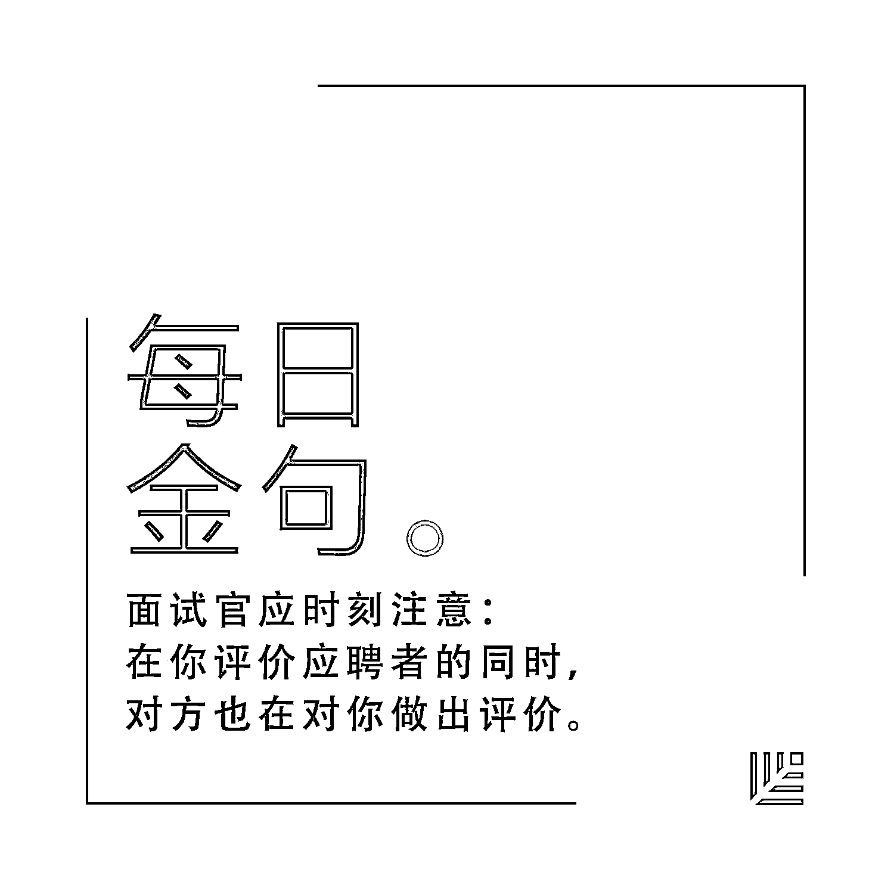
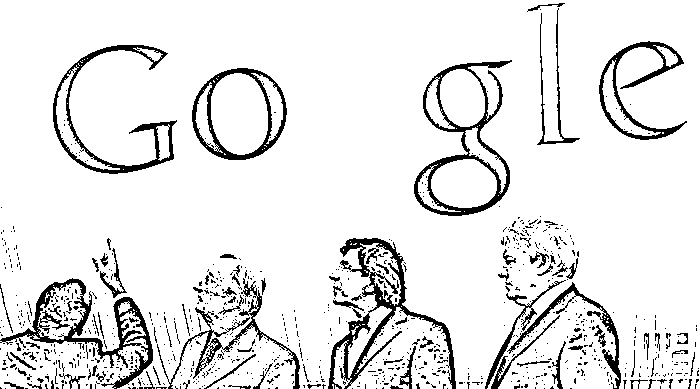
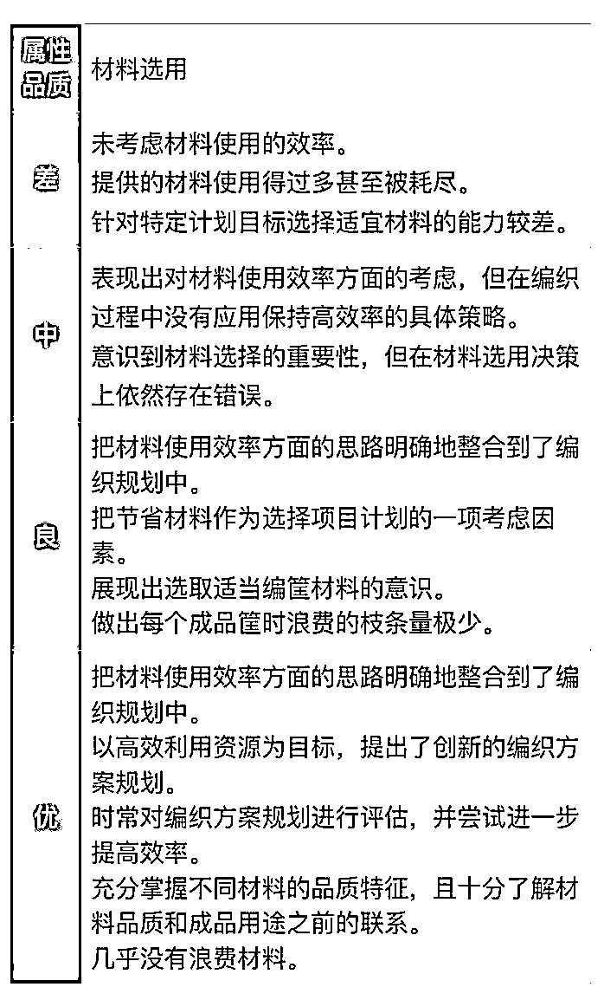
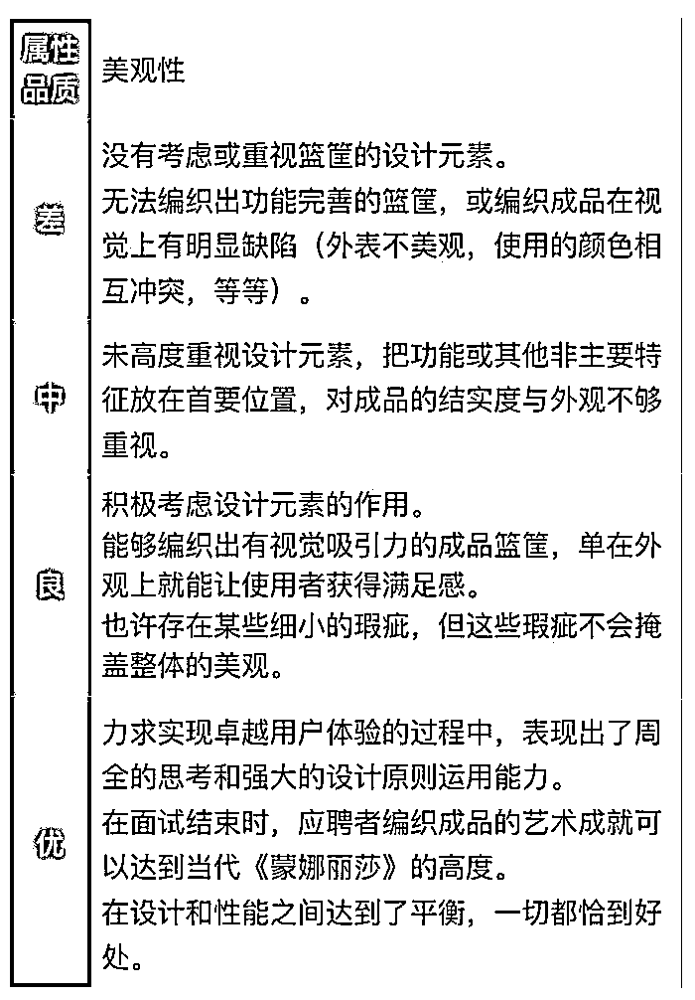
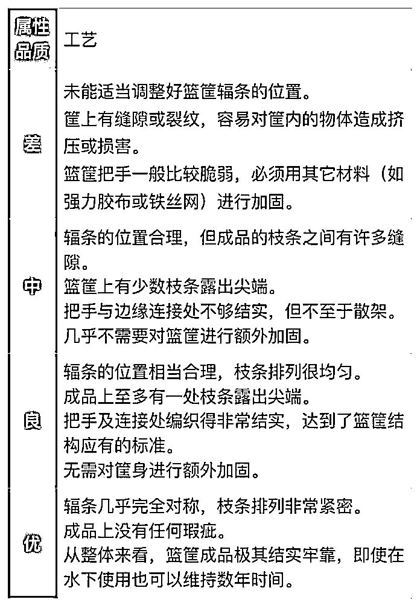
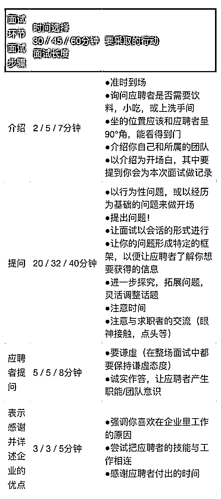
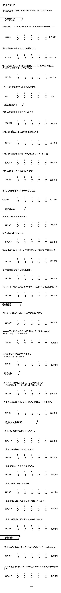

# 像 Google 一样招聘：内部面试工作手册免费放送 | 首席人才官·选

> 原文：[`mp.weixin.qq.com/s?__biz=MzAwODE5NDg3NQ==&mid=2651223170&idx=1&sn=a4e2c3d6b7b53d5cdef0aab78cd5c778&chksm=80804ad6b7f7c3c0a2f5cc8ecb9de0b86991c47e641a1aca4d31052845a3728ce9eba409fb6b&scene=21#wechat_redirect`](http://mp.weixin.qq.com/s?__biz=MzAwODE5NDg3NQ==&mid=2651223170&idx=1&sn=a4e2c3d6b7b53d5cdef0aab78cd5c778&chksm=80804ad6b7f7c3c0a2f5cc8ecb9de0b86991c47e641a1aca4d31052845a3728ce9eba409fb6b&scene=21#wechat_redirect)

“我们只雇佣最聪明的人。”这句“口号”既反映出 Google 对人才的高标准要求，也反映出其“宁缺毋滥”的招聘原则。

有资料显示，那些最终获得 Google 工作机会的应聘者平均需要通过 6.2 次面试；从公司出现职位空缺到招聘到适合的人才，一般需要长达三个月的时间。除人力资源部和岗位需求部门外，甚至还会邀请跨部门、跨区域的人员参与面试。正是这样几近严格的招聘机制，保证了 Google 能够招到真正合适的员工。

近日，Google 用于分享其管理经验的博客 re:Work 放出了一份“大彩蛋”——五个招聘文档，其中包括：

*   职位描述检查表

*   结构化面试评分准则范本

*   面试官最佳实践范例

*   应聘者调查范本

*   面试官培训检查清单

这五个文档不仅可以帮助创业公司理解 Google 成熟的招聘理念、人才观，也可以为实际的招聘工作提供宝贵借鉴。以下为全部 5 个文档及一份“使用指南”。

****职****位描述检查表**** 

********这******是 Google 招聘团队提供的检查表，利用这类清单可以确保你的招聘启事内容明确而连贯。** 

****职位描述检查表****

****结构和内容指南****

*   **把你的职位描述按四个类别的内容组织起来：区域、角色、职责和资历。**

*   **向应聘者提供充分的信息，方便他们理解工作的内容。**

*   **强调职位的行为，而不是职位特征。行为可以表示出来，也可以进一步发展；而一成不变的特征则以刻板印象和臆断为基础，很容易被曲解。**

*   **表述企业期待实现的目标。**

*   **设定好期望的目标，帮助求职者理解岗位的职能，以便他们在能胜任的前提下确定自己是否适合该职位。**

****措辞指引****

*   **往职位描述中添加一点个性特征，这可能决定了应聘者对企业工作生活真正的第一印象。**

*   **展现包容性，检查措辞，防止出现无意识的偏见。**

*   **从第二人称角度，采用和应聘者对话般的语气（例如用“你”、“你会”等字眼）来描述工作职责。**

*   **在陈述岗位要求时，应该多用带有未来含义的“计划”“从事”和“解决”等来代替对应的“正在计划”“正在从事和“正在解决”等说法。**

*   **使用具体且客观的描述词汇（例如“预算管理的经验”或“曾处理过专利相关的诉讼请求”）。尽量不要使用“技术专家”这样带有强烈主观色彩的短语，因为“专家”的定义很模糊。**

*   **应该避免在职位描述中向应聘者提问。**

*   **尽量不要使用行业术语和缩写。**

****结构化面试评分准则范本**** 

**面试同一批应聘同一岗位的求职者时，结构化面试可以帮助你提出更好的问题，记录反馈信息，并依照始终如一的标准来评估每位求职者。以“编筐”为例，解读如何进行结构化评分。**

****

****

****面试官最佳实践范例[速查手册]****

**面试官们要做好准备，分析手册中列出的实践案例掌握其中的小窍门。**

****面试官最佳实践范例****

****面对当前的招聘环境，衡量是否成功的两大要素是：****

*   **吸引人才**

*   **挖掘获取求职者的渠道**

 **在 Google，我们发现面试（尤其是面试官）是决定应聘者对招聘过程总体满意度的重要因素，从面试中获得的体验可以决定他们是否会接受公司的录用。**

**在面试过程中，面试官要提出具有挑战性的问题来评估应聘者的技能，同时还要说服应聘者，让他们认同应聘的企业是开启或延续职业生涯的适宜场所。如何在这两者之间取得正确的平衡则是最难把握的环节。从招聘企业的角度来看，需要展示出工作范围和公司使命；从应聘者的角度来看，他们希望公司看重的是自己的才能，希望自己加入公司以后马上就能产生影响力并迅速融入到员工大家庭当中。在你评价应聘者的同时，对方也在对你做出评价。**

 ****面试一名应聘者时，需要特别关注**：**

*   **问题**

*   **行为**

****提问的窍门****

**问题要以你想要评估的品质为基础。一般来说，应尽量做到如下几点：** 

*   **用一个行为性问题或者与“和我聊聊你那次……的经过”之类，与应聘者经历有关的问题来开启对话。**

*   **提问题时要弄清楚我们想要获得什么信息。应聘者常常抱怨自己无法确定面试官想要的是什么答案，他们应该花多少时间来想答案。**

*   **要灵活变通。当应聘者答不出问题时表示体谅，稍作提示，让他们转换思路或围绕新问题展开对话。若应聘者在某一个问题上花的时间过多，你应该用温和的方式切换话题。如：“考虑到时间问题，我们何不换个话题试试？如果你有兴趣，我们不妨在面试结束的时候再聊聊这件事。”**

*   **总的来说，你要负责把握好时间。留出时间让应聘者提问，但不宜太长，否则会让后续面试官的提问延后。**

*   **避免提出一些敏感问题，不要迫使应聘者透露一些受保护的信息：**

**  “你来自哪个国家？”**

**  “你可以在宗教节日工作吗？”**

**  “你有工作许可证吗？”**

**   求职者：“这个地区最好的学校是哪一所？”**

**   面试官：“你的孩子多大了？”**

**    ……**

****面试官行为提示****

**为了给求职者提供良好的招聘体验，面试官的友善态度是必不可少的。面试官可能参与了上百次面试，但对于应聘者来说，这可能是他们的第一次面试经历。** 

**在面试过程中，需要营造令人舒服的氛围。以下为面试和应聘者体验的分类表，我们按 30，45，或 60 分钟的面试长度进行了划分。**

****

****如何避免最常见的陷阱****

**在求职者反馈的基础上，我们发现了一些常见的问题，提出以下建议：** 

*   **准时现身。迟到会让求职者失去信心，可能会浪费其他面试官的时间，缺乏对他人基本的尊重。**

*   **不要直奔主题！这会带来消极的面试体验。**

*   **要有眼神接触。应聘者常常抱怨的一点就是面试官一直埋头做记录。记录要尽量细致，但对话式的面试需要高层次的互动。**

*   **要保持谦虚。还有一种常见的反馈：面试官像看门人那样以高压姿态来评判应聘者。无论应聘者的表现如何，都会觉得自己回答了一个极具挑战性又切合职能的问题，你要与之共同评估他们的技能，而不是炫耀自己。**

*   **消除应聘者的疑虑。并非所有的应聘者都能在面试中取得成功，但不必让应聘者觉得自己失败了。**

**在应聘者侃侃而谈时，要不时地点点头或进行其他形式的交流。这不仅会鼓励他们，还表明你在积极倾听他们的想法。**

**避免说“我其实想要的是这样的答案……”，或者“你应该从这个角度考虑问题”之类的话。不要直接表达“你的应聘失败了”。**

******应聘者调查范本******

****凭借这份调查示例，你可以衡量并了解求职者在企业招聘过程中的感受。****

********

******面试官培训检查清单******

****回答完这份清单上所有的问题，就能确认你公司的面试官是否已经准备好要帮你找到合适的人才了。**** 

******面试官培训检查清单******

******公司的面试官是否******

*   ****清楚公司的招聘流程及他们自己在这个过程中扮演的角色？****

*   ****知道要如何为面试做准备（设计问题，规划时间，审查简历等等）？****

*   ****具备了必需的面试技能，可以保证无论求职者是否得到工作机会，都对公司观感良好？****

*   ****能在面试过程中遵守相关的法律法规？****

*   ****知道该如何提供有效的反馈并给出有意义的面试评分？****

*   ****了解面试后该做哪些工作？****

****以上就是 Google5 大招聘文档，希望可以帮您把 Google 在招聘上的心得应用到自己的企业当中，收获人才。****

****回复**关键字“Google”**，获得英文原版 Google 招聘工作手册下载方式。****

******点击文末“****阅读原文****”参与******

******红杉资本中国基金成员企业大咖系列分享******

******4 个小时，4 位大咖，助你进面试、进名企******

********