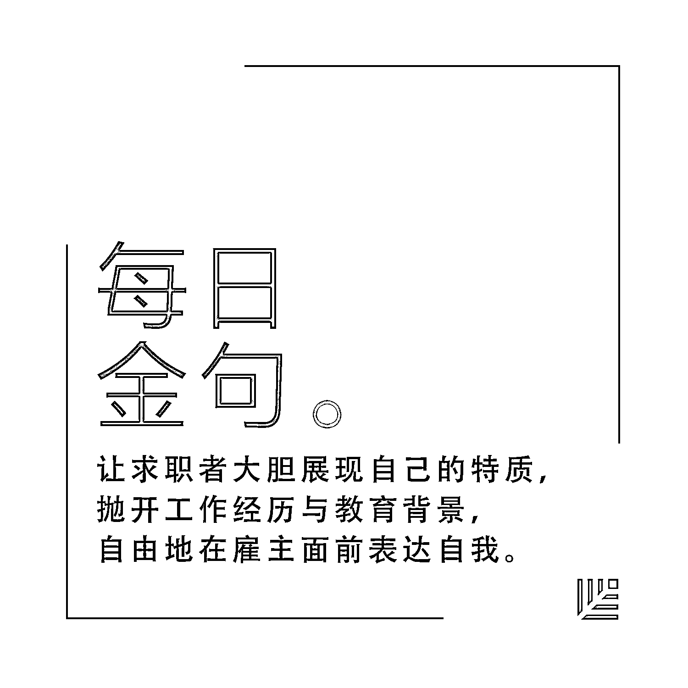
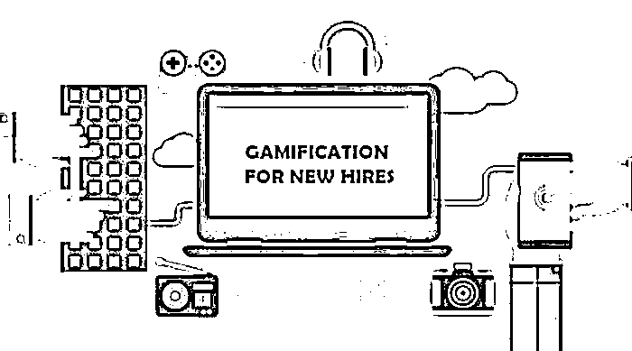

# 游戏化设计能让招聘变得更有效吗？| 首席人才官·选

> 原文：[`mp.weixin.qq.com/s?__biz=MzAwODE5NDg3NQ==&mid=2651223222&idx=1&sn=ea903899a2e5467094c990869e527b81&chksm=80804ae2b7f7c3f4834dfae6c36ed03142fd18d18d4b64cfa0920106dd8fd00bf927c716c0c1&scene=21#wechat_redirect`](http://mp.weixin.qq.com/s?__biz=MzAwODE5NDg3NQ==&mid=2651223222&idx=1&sn=ea903899a2e5467094c990869e527b81&chksm=80804ae2b7f7c3f4834dfae6c36ed03142fd18d18d4b64cfa0920106dd8fd00bf927c716c0c1&scene=21#wechat_redirect)

招聘是一个发掘有才之士的过程，每个公司都想招聘到合心意、能力强的人才。但是传统的招聘方法似乎很难满足这一点了。

那么招聘过程游戏化能否使招聘更有效？或许是的。因为游戏化的方式能极大地吸引正在找工作的人，让他们在投出简历之前就对公司产生浓厚的兴趣。本文将详细分析招聘过程游戏化的意义，部分要点摘录如下：

*   由于没有有效地利用信息沟通渠道、在吸引人才上的资源投资缺乏效率，公司每年都会招聘到不合适的员工；

*   过去的十年里，招聘过程中使用的评测几乎没有什么新意，这种情况将会发生改变；

*   招聘过程可以变得更具吸引力，而评测则可成为这个过程里“混合阶段”的一部分；

*   数据分析是加强评测的预测能力的方式之一，游戏则成为吸引应聘者的亮点；

*   通过这些有趣的游戏，让求职者大胆展现自己的特质，抛开工作经历和教育背景，自由地在雇主面前表达自我。

**下**一次去应聘时，求职者们可能得在手机上玩一个游戏了。

芬恩·希尔是 GreatRok 的商业分析师，GreatRok 则是一家投资招聘行业初创公司的种子基金。根据芬恩·希尔的说法，企业发掘有才之士的方式现正向招聘过程游戏化转变，这一趋势虽然相对较新，但不断地获得了更多人的认同。

**为何测试应征者如此重要**

虽然在过去的十年里，评测作为一种招聘方式被诸多公司运用，但是这些评测几乎没有什么新意。芬恩指出，“这种方式充满了人为失误，雇主固有的偏见也会严重影响评测结果。”

Criteria Corp 的创办人和 CEO 乔希·米勒指出，“研究显示，能力倾向测试的结果一直以来都是最能预测应聘者能否胜任这项工作的因素之一。”他引用了一个元分析的数据来支持自己的观点。

该元分析总结了美国爱荷华大学和密歇根州立大学过去 85 年来做过的研究。这项研究表明，认知能力更能决定是否能够胜任某项工作，它的作用几乎是面试表现的两倍，是工作经历的三倍，是教育水平的四倍，”米勒如是说。

有 95%的公司承认，**由于没有有效地利用信息沟通渠道、在吸引人才上的资源投资缺乏效率，公司每年都会招聘到不合适的员工**。根据 Talent Board 的数据，多达 88%的雇主在应聘者未能通过筛选性问题的情况下仍选择让他们中的大多数人继续填写求职申请。

在为 Talent Tech Labs（人才技术实验室，TTL）做的一份报告中，芬恩肯定了 TTL 负责人乔纳森·凯斯坦鲍姆的看法，认为 2017 年将是评测之年。所谓评测之年，即在招聘过程中，测试将扮演重要的角色。

这些测试可以帮助雇主了解应聘者，发掘潜在人才，进而决定哪些应聘者能够胜任这份工作。在评测之年，一切将会不同。

**让评测更有趣**

芬恩认为，招聘过程可以变得更具吸引力，而评测则可成为这个过程里“混合阶段”的一部分。

**数据分析是加强评测的预测能力的方式之一，游戏则会成为吸引应聘者的亮点**。波士顿咨询集团和招聘工作研究院的研究显示，全球有 55%的求职是通过招聘网站，有 35%是通过智能手机完成的。因而，智能手机可以是游戏化招聘的良好载体。

Fast Company 曾报道过 CodeFight 的企业机器人。这家公司会为不同的雇主打造转恩德在线机器人，为应聘者提供特定编码的任务，企业以此来评测他们的技能水平。而全球市场和公关公司 Ketchum 则使用了一个名为 LaunchPad 的 app 来使招聘过程游戏化，并评测应聘者的创意能力、数字感知力、书面表达能力和视觉沟通技巧。

芬恩还指出，除了考察特定的技能，像 Arctic Shores 和 Debut 这样的公司还会让求职者在申请职位的过程中玩电子游戏，以测试他们是否具有公司看重的各种关键特征。“Arctic Shores 通过游戏来评测应聘者的行为方式，并获得他们的心理侧写；而 Debut 则在游戏里测试应聘者的基本技能，以帮助公司挑选出最佳的人选，”芬恩写道。

**让评测更有效**

米勒自己的企业 Criteria Corp. 在不久前发布了一款 iOS 端的脑力游戏 app，名为 JobFlare，以推动招聘过程的进一步游戏化。

应聘者要在 90 秒内同时玩 6 个游戏，以测试他们的认知能力。他们在企业网站注册、输入基本工作兴趣和地点后，就要开始玩 Robot Inspector（“机器人检查员”）和 Mumble Jumble（一种拼词游戏）等游戏。

“一直以来，口语交际能力、计算分析能力和追求细节的专注程度等都被认为与职业成功相关联，”米勒说道，“**JobFlare 通过这些有趣的游戏，让求职者大胆展现自己的特质，抛开工作经历和教育背景，自由地在雇主面前表达自我**。”

这个 app 会收集游戏结果，并把它们结合求职者个人档案里的数据一起分析，随后生成一系列可能适合该求职者的工作岗位，通过邮件发送给他们。“对于那些得分最高的求职者，我们的团队可能会直接联系他们，为他们度身提供在优质雇主公司工作的机会，”米勒说道。

米勒谈到，虽然他的公司涉足评测行业已 10 年有余，但 JobFlare 却是这个月才发布的，所以现在还没有成功帮助求职者找到工作的案例。但是招聘游戏化的潜力不容小觑。米勒认为，在求职者确定要申请哪个工作之前，JobFlare 的游戏化就已经极大地激发了他们对公司的兴趣，因为“这种游戏化会展示出我们公司具有竞争优势、有极客范的一面。”

他指出，游戏玩家可以看到得分的总排名，也可以看到在自选领域里自己的得分排名。游戏得分会随着参与游戏次数的增多而逐渐提高，这样就会让求职者心里一直有股动力去打破自己的最高分记录，并在排行榜上不断刷新自己的排名。

谢菲尔德就职于另一家雇员评测和才能培养企业 Caliper，是研发部门的高级副总裁。他认为，即使现在游戏化还处在“有点初级”的阶段，但整体而言这一突破有望优化求职体验。

“游戏应用现在都倾向于把更多的关注放在评测认知能力这个方面，但现在也开始出现评测其他方面的游戏，如评测情境判断能力和决策能力等等。”谢菲尔德注意到了这种趋势。“目前最大的阻碍是还没有足够多的证据可以证明这种方法是有效的，但我相信以后会有的。”。

