# 彼得・蒂尔、 埃隆・马斯克……11 位大咖教你用一个提问，解决招聘难题｜首席人才官・选

> 原文：[`mp.weixin.qq.com/s?__biz=MzAwODE5NDg3NQ==&mid=2651223460&idx=1&sn=2f0da91301a1044ef7b68879d7655828&chksm=80804bf0b7f7c2e68f15a9386595b5232dde93fd62054063d9004fdbdeeeae36bf55d1986337&scene=21#wechat_redirect`](http://mp.weixin.qq.com/s?__biz=MzAwODE5NDg3NQ==&mid=2651223460&idx=1&sn=2f0da91301a1044ef7b68879d7655828&chksm=80804bf0b7f7c2e68f15a9386595b5232dde93fd62054063d9004fdbdeeeae36bf55d1986337&scene=21#wechat_redirect)

同样的招聘方式，为什么别人能招到出色的人，进而成就一个公司，而你却总为招不到人而苦恼？一场面试，进行了 30 分钟你仍在招与不招中犹豫不决，而有的人却能在 7-10 分钟内确定面前这个人是不是最佳人选。

PayPal 创始人彼得・蒂尔（Peter Thiel）、特斯拉 CEO 埃隆・马斯克（Elon Musk）、Facebook 人力资源总裁罗莉・格勒尔（Lori Goler）……11 位成功的商业领袖分享了他们如何通过一个问题去判断求职者是否足够聪明、有创造力和责任心。

与“上一份工作为什么离职？”、“目标薪水是多少？”这类常规问题相比，想要回答好他们的问题除了需要智商、经历，确实还需要一些创意。以下是部分精彩问题摘录：

▨ “地表上的什么地方，首先向南行走 1.6 公里，然后分别向西、向北各走 1.6 公里，最后刚好回到起点？”

▨ “如果给自己的古怪程度打分，从 1 到 10，你会打几分？”

▨ “告诉我一些绝大多数人都会跟你意见相悖，且真实存在的事情。”

▨ “在认识的人中，你是最聪明的吗？”

▨ “你如何在中央公园里通过卖雪糕来赚钱？”

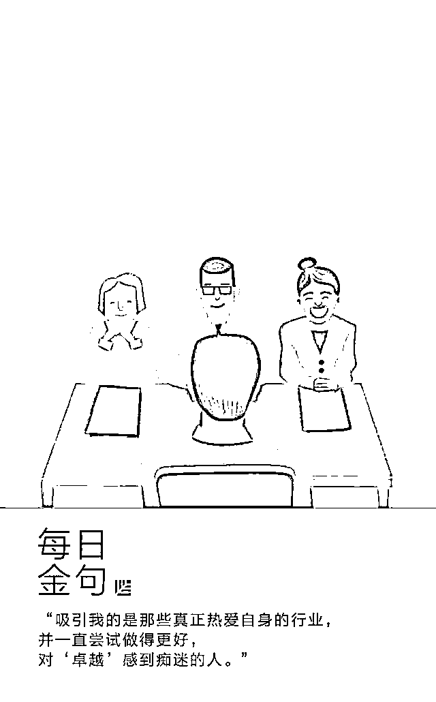

面试是成一门科学，提出愚蠢或无关的问题只是浪费时间。

在面试时，成功的商业领袖都有一个自己最喜欢问的问题，能够帮助他们迅速了解求职者是否符合他们的招聘需求。

这里汇集了 11 位商业领袖在招聘时最喜欢提的问题：

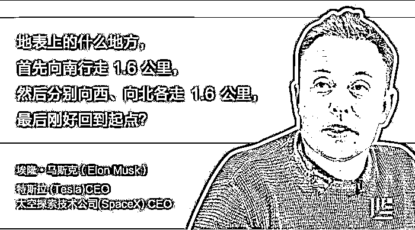

《硅谷钢铁侠：埃隆・马斯克的冒险人生》（Elon Musk: Tesla, SpaceX, and the Quest for a Fantastic Future）这本传记里写道，身为两家公司 CEO 的马斯克喜欢用上面这个谜题来测验求职者的智商。

这个谜题有多个正确答案，其中一个就是北极。

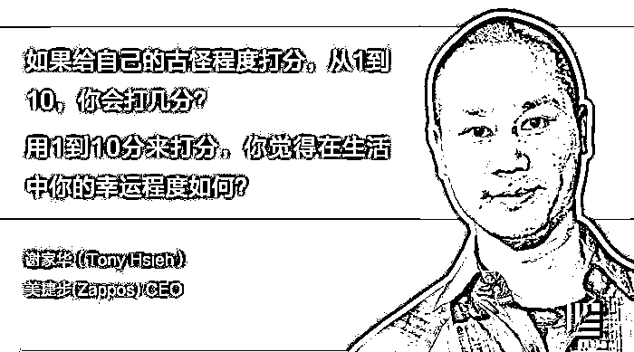

Zappos 的 CEO 谢家华说，他们公司有一条核心价值就是“创造乐趣和一点古怪”。

为了确保招到最合适的员工，谢家华通常会问求职者：“如果给你自己的古怪程度打分，从 1 到 10，你会打几分？”

其实这个分数其实不太重要，重要的是求职者如何回答这个问题。从 Zappos 的企业文化来看，如果你给自己打 1 分，可能有点墨守成规，但如果你打了 10 分，可能又会觉得你太过了。

同样地，对于另一个问题而言，分数本身也没多大重要性，但如果你给自己打 1 分，你可能就不知道为什么糟糕的事情总是发生在你的身上，且还有可能经常抱怨他人，如果你打 10 分，那你就不太了解为什么好事情总让你碰上了，还有可能是缺乏自信。

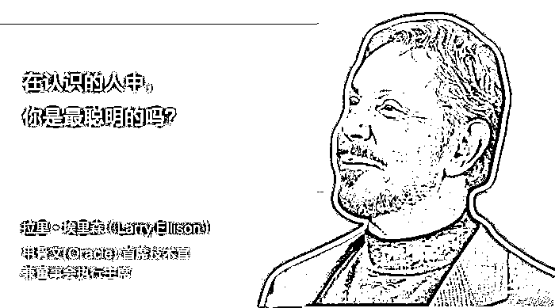

达特茅斯学院（Dartmouth）商学教授悉尼・芬克斯坦（Sydney Finkelstein）在他的新著作《超级上司》中描述道，甲骨文的首席技术官兼董事会执行主席拉里・埃里森强调，他们只招聘才干超群和聪明绝顶的员工，因此，会指导公司的招聘人员向大学毕业生提问上面的问题。

如果应聘者回答“是的”，那他们就会获得工作；如果他们回答“不是”，那招聘者就会问“那谁是？”，然后试图招聘这个应聘者口中最聪明的人。

芬克斯坦教授表示，像埃里森这样的超级上司有充足的自信，他们相信自己的能力，毫不担忧员工胜于自己。他们的目标是招聘比自己更加有头脑的人才，因为这些员工会向他们挑战，提出更好的想法并解决各种难题。

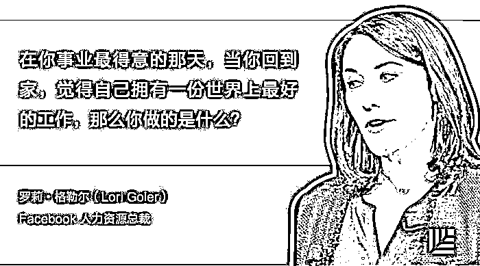

这个问题其实在问——在你工作里的那个“完美日”，是什么事情让你“开了挂”，得以成就一番。

Facebook 的人力资源总裁罗莉・格勒尔建议有意进入 Facebook 的求职者申请能发挥自身优势的职位。

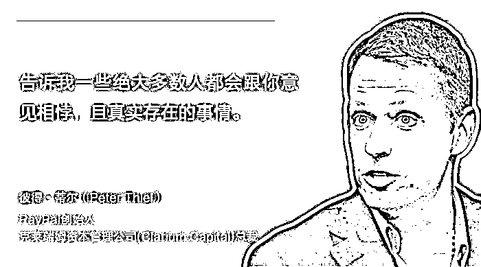

彼得・蒂尔一直倾向于聘用能够大胆说出自己想法的人。因此，他总爱向求职者和寻求投资的创业公司提这个面试题。

2012 年，在福布斯的一个采访中，蒂尔向读者解密了他喜欢这道问题的原因：“这是在考验人的思维独创性，在某种程度上，它考验了你是否有勇气在压力重重的面试中说出自己的想法。”

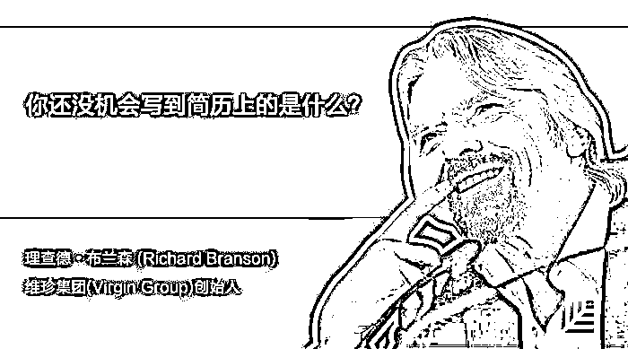

维珍集团创始人理查德・布兰森在他的新书《维珍方法论：关于领导力我所知道的一切》（The Virgin Way: Everything I Know About Leadership）中称，他对传统类型的面试不感冒。

布兰森在该书中写到：“一份好的简历很重要，但如果你打算依据他们简历上所写的内容来雇佣他们的话，就没必要浪费时间进行面试了。”

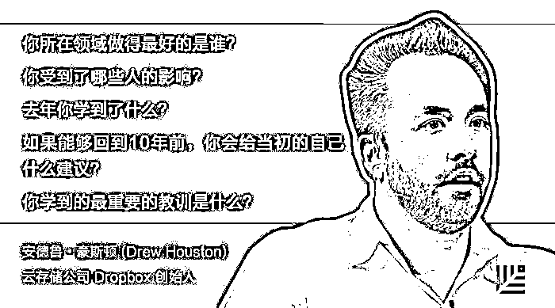

豪斯顿认为，这些问题有助于他辨别求职者是否热衷于持续提升自我。“吸引我的是那些真正热爱自身的行业，并一直尝试做得更好，对‘卓越’感到痴迷的人。”

互动广告代理公司 Paramore 位于美国纳什维尔，总裁汉娜・帕拉摩尔说道：“我想从中了解的是，求职者的职业道德以及独立性。如果他们高中和大学期间出于需要曾做过兼职，特别是艰苦的工作，那就显示他们很有责任感。而我喜欢那些在不同领域获得过成功的人。”

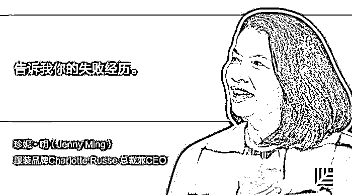

珍妮・明曾任零售品牌 Old Navy 的 CEO，现任服装品牌 Charlotte Russe 的总裁兼 CEO，她最喜欢问求职者的失败经历。她认为人们惯于谈论他们的成功，但出了问题则倾向于闭口不谈。因此，回答好这个问题很重要，这意味着求职者不怕冒风险，而且出了问题会勇于承认。

她说：“不一定非得是工作上的失败，也可以是生活上的教训。他们失败后是怎么做的？如何从失败中走出来的？我一直找的是出问题了能够坦然承认的人。”

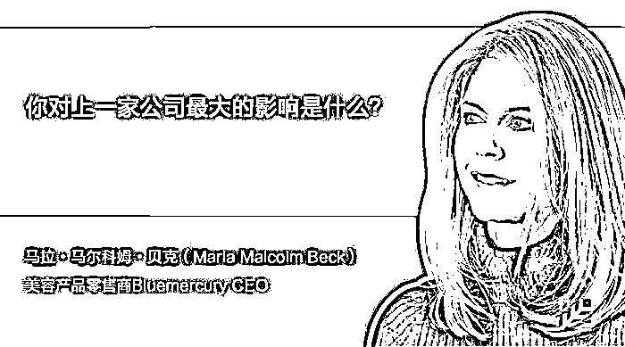

奢侈美容用品零售商 Bluemercury 的 CEO 马拉・马尔科姆・贝克更倾向于只花 7 到 10 分钟进行面试，若有疑问，会问得很具体。

她说道：“重要的是求职者能掌控他们曾经做过的项目。从他们讲述的方式，就可以辨别他们是真的负责过这个项目，还是说只是公司里有过这个项目而已。”

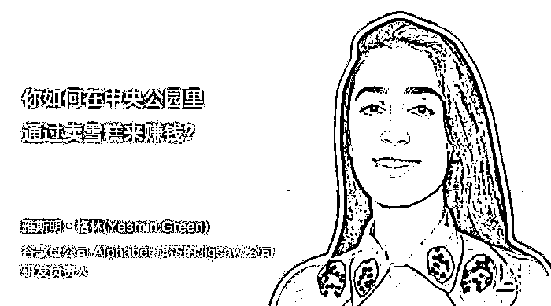

雅斯明・格林是 Jigsaw 公司的研发负责人，该公司是谷歌母公司 Alphabet 旗下的一家科技孵化器，由谷歌旗下智库 Google Ideas 转型而来。她想招富有创意且能够独立思考的人，因此，她让求职者快速思考如何管理一个假想中的冰淇淋摊位。

她说：“我想知道求职者如何应付模棱两可的问题，在快速思考的同时，是否还能找点乐子。”

格林说，想要在谷歌找到一份工作，你还要向问题提出一些挑战。****

因为要挑战马斯克，所以我向洪杉老师提出了这个问题，然鹅他没回答出来，特地让我也问问你们：

**一个球有几个面？**

（在后台回复“洪杉”查看答案）

 /mp/newappmsgvote?action=show&__biz=MzAwODE5NDg3NQ==&supervoteid=453542749#wechat_redirect 

** 推荐阅读**

壹

[汇纳科技张宏俊：新零售如何做到高维打击？靠这个](http://mp.weixin.qq.com/s?__biz=MzAwODE5NDg3NQ==&mid=2651223456&idx=1&sn=fb64de2e41656b75fb81844472dd96a1&chksm=80804bf4b7f7c2e2329bdd23ed01551cb6dc6e2e47b7f123006dc02b6fe654ed90ad948208f8&scene=21#wechat_redirect)

贰

[光有梦想和金钱还不够，合伙人股权分配怎么搞？](http://mp.weixin.qq.com/s?__biz=MzAwODE5NDg3NQ==&mid=2651223431&idx=1&sn=1b91067764fae7cd992a4858a1fcb1c9&chksm=80804bd3b7f7c2c5e12978158d53b22f052cb45eb1d43e7f7223896da4b9a4ec30abfdf95cca&scene=21#wechat_redirect)

叁

[消除创业倦怠、原地满血复活的 6 个领导力养成大法](http://mp.weixin.qq.com/s?__biz=MzAwODE5NDg3NQ==&mid=2651223434&idx=1&sn=014ba06f1a86d0b42e5b412e7b85f29c&chksm=80804bdeb7f7c2c8f6d872601f2e78aba47496930e04c27e31649c770e270ef9aac176383b45&scene=21#wechat_redirect)

肆

[想成为中国迪士尼，快看漫画陈安妮都做了什么？](http://mp.weixin.qq.com/s?__biz=MzAwODE5NDg3NQ==&mid=2651223443&idx=1&sn=af83d11a604cdd5391c0a5c35ec88bf7&chksm=80804bc7b7f7c2d17832b57a418ca6de1f6ad4801f32a55efc347c7b18cdf35261b5a0731716&scene=21#wechat_redirect)

伍

[反僵化：有些公司活着，但已经死了](http://mp.weixin.qq.com/s?__biz=MzAwODE5NDg3NQ==&mid=2651223447&idx=1&sn=d3a42219d4160241969942dd8c5fbbb7&chksm=80804bc3b7f7c2d520a88881e06ce124a41a3d08521cc7e8cf994bf315ef6efd9822209e07c2&scene=21#wechat_redirect)

