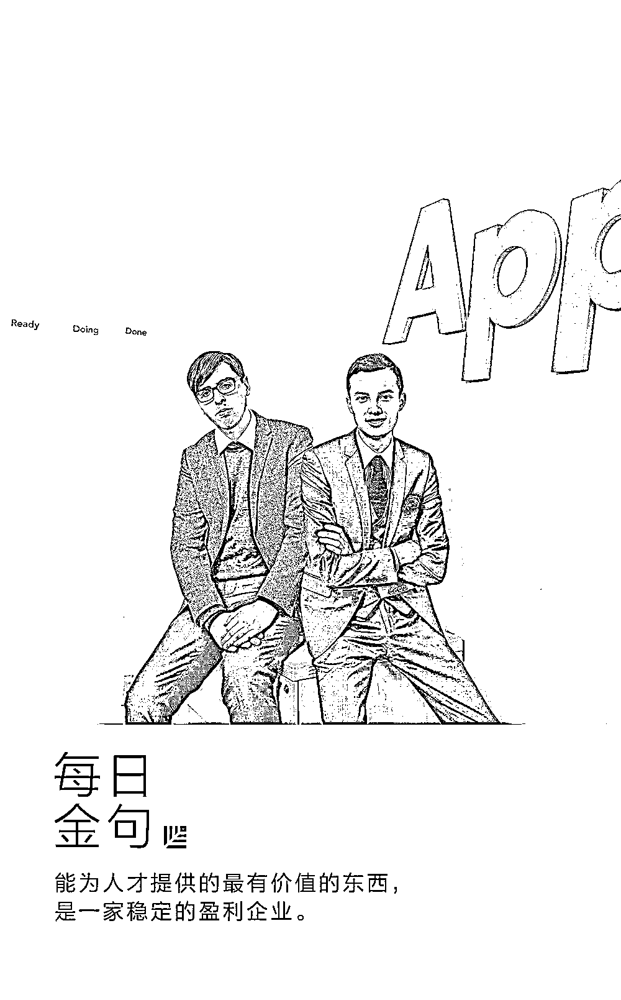
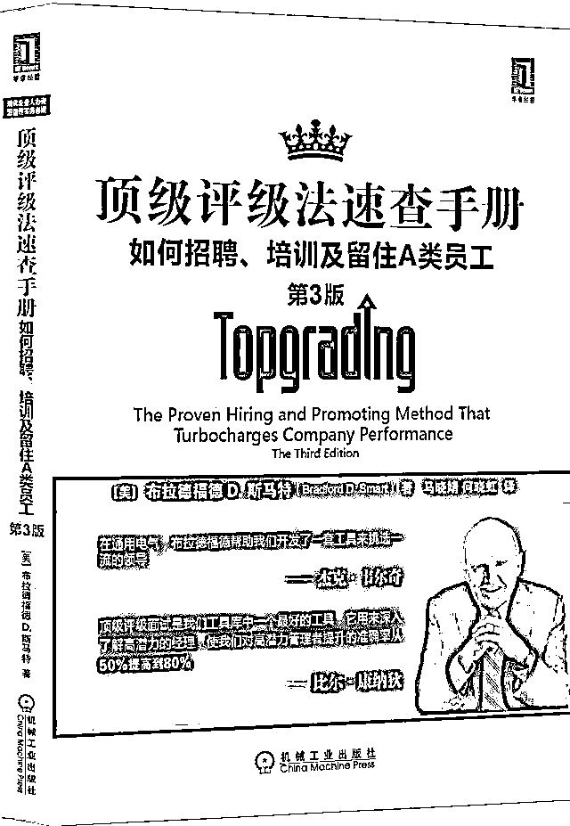
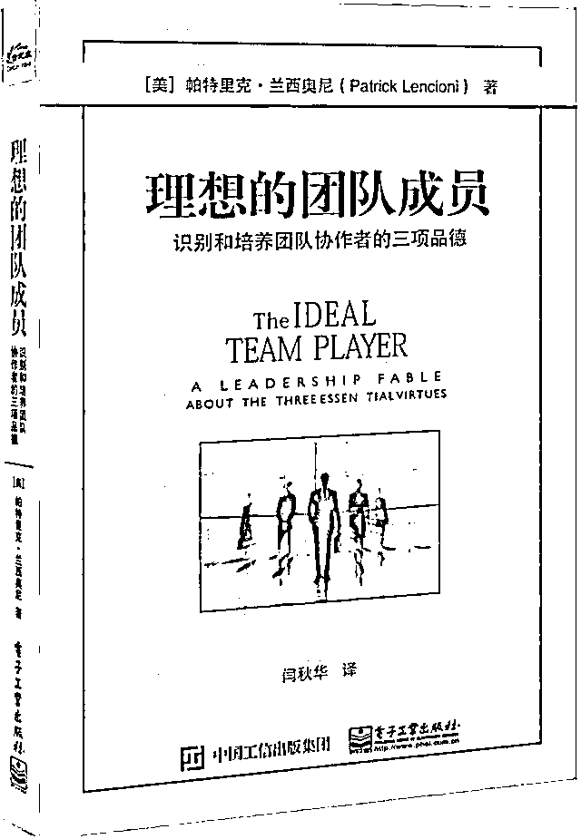

# 如何招到「对的人」？年仅 25 岁就登上福布斯的创始人有话说｜首席人才官

> 原文：[`mp.weixin.qq.com/s?__biz=MzAwODE5NDg3NQ==&mid=2651224152&idx=1&sn=f1ec6ee405d28f2958ada6651b0a7706&chksm=8080460cb7f7cf1addf1c913beb2129fb93ed0c38385b8d6b696c52b6e235e6b19045b1418d0&scene=21#wechat_redirect`](http://mp.weixin.qq.com/s?__biz=MzAwODE5NDg3NQ==&mid=2651224152&idx=1&sn=f1ec6ee405d28f2958ada6651b0a7706&chksm=8080460cb7f7cf1addf1c913beb2129fb93ed0c38385b8d6b696c52b6e235e6b19045b1418d0&scene=21#wechat_redirect)

澳大利亚应用程序开发公司 Appster 的两位创始人兼 CEO Josiah Humphrey、Mark McDonald 年仅 25 岁就一同登上福布斯 2017 亚洲 30 位 30 岁以下青年才俊榜。目前，他们的公司员工横跨 3 大洲，数量超过 400 人，公司年收入达 1900 万美元，这样的成功当然无法缺少一个伟大的团队。

近日，Josiah 撰文分享了他们的招聘心得，讲述了他们为何要大刀阔斧地改变以往招聘和培养员工的方式，以及如何优化招聘流程。

两位创始人为了将冗杂的工作流程从 3-6 个月缩减至 5-10 天，提出了一个新的项目规划方式，当他们想启用这个更高效的新模式时，销售团队不愿改变，因此几乎整个销售团队都辞职或被炒了。Josiah 坦言自己非常受不了“我们一直以来都是这样做的”这种狭隘的说法，他认为，如果你想在这个行业里成为领军企业，就得乐于做出改变。在熬过没有销售团队的几个月后，他们的新模式如今成为了业内标准。这次事件让他们认识到了必须招对人，才能做好事。 

于是，他们展开了一场人才招聘的变革，研究出了更适合自己的人才招聘体系，并成功地将招聘失误率从 75% 降至 10% 。以下是部分要点摘录：

▨ 将团队成员分成 3 种类型：A 型有能力，B 型有潜力，C 型需摆脱。

▨ 如何判断成员属于那一类型？你可以反问自己：如果可以回到过去，我们依然会聘用这个人吗？

▨ 我们要找的人应具备以下三种品质：求知若渴、谦逊、聪明。

▨ 尽管聘用决策由 CEO 批准，但整个团队的判断更重要。

▨ 也许你有世上最具创意、最完美的策略，但如果没找到正确的人来执行，也会一败涂地。

****招聘失误率**从 75%降至 10%**

刚创办 Appster 时，我们完全不知道应该如何建立团队。因此，任何一个品貌兼优、资质符合的人我们都招，但最后没有一个人能长久地在他们的岗位上做下来。

我们的招聘失误率在 75%左右，招错人的代价是巨大的。前线工作人员要是没招好，公司损失的将是这些人年薪的 3 到 5 倍。如果是高管招错了，损失可能就是 12 到 27 倍。这还没算上为了吸引人才、组织面试、带领新人适应工作以及管理那些表现差强人意的员工所投入的时间和资源。

在那次销售团队离职事件后，我们审视了一番，心里想“我们在某些部门的表现为什么那么差？”如果从理论上来说你的商业计划行得通，但实际上却被某些地方所困扰的话，仔细地观察一下涉及公司业务的那些人：

▨ 谁在领导团队？

▨ 谁是团队成员？

▨ 他们都是高质量的员工吗？

在阅读了大量书籍并咨询专家的意见后，我们开始打造公司的招聘体系。招聘体系在很多方面借鉴了这两本书：

** **

**顶级评级法速查手册**

Topgrading

Bradford D.Smart **/ 著**

马晓婧 、何晓虹 **/ 译**

机械工业出版社 2014 年

** **

**理想的团队成员**

The Ideal Team Player

Patrick M. Lencioni **/ 著**

闫秋华** / 译**

电子工业出版社 2016 年

首先，我们按下面三种类型将现在和将来的团队成员进行分类：

**A**

A 型成员会增强你的实力，加速业务的发展。他们是值得你培养、留住的团队成员，为此，你要保证他们工作顺心并为他们未来的发展做投入。

**B**

B 型成员可能目前还没表现出自己最强的能力，但你可以给他们足够的时间和支持，帮助他们成长。

**C**

C 型成员需要尽快摆脱，因为他们拖了整个团队的后腿，影响大家的士气。

接下来，我们为每个职位制订了详细的打分卡。这个打分卡的第一部分是根据具体岗位而设置的，用来考察 A 型成员应该拥有哪些特征和资质。

例如说，销售岗打分卡的考察内容可能包含情商、谈判技巧、说服能力以及看懂肢体语言的能力。在收集比对上述数据后进行第二部分考核。

在第二部分里，我们借用了《理想的团队成员》一书的理念。我们要找的人应具备以下三种品质：

** 求知若渴｜****Hungry**

这名求职者是否志存高远、充满激情？他们是否出于真心地想要解决这个岗位上会遇到的问题，还是说只是为了钱？

在面试时谈论求职者的自我发展计划会对你的判断有所帮助。

求职者是否在阅读、听电台或者上什么课程？如果某位求职者不怎么读书，最近一次技能提升是在五年前，那么他就不是我们要找的人。

** 谦逊｜****Humble**

自信是好的，但过分自信的人会损害团队，尤其应该避开那些自我膨胀、毫不谦逊的人。

要想测试求职者的谦逊程度并不简单，你可以仔细听他们如何描述自己的成就。他们是用“我”还是“我们”？这种区别对判断一个人是否适合管理类岗位尤其重要。

谦逊的领导者在谈及项目时永远都会提到团队所付出的努力。他们能一直带领着团队前进并一起冲过终点线。

让应聘者谈谈过去的失败也很有帮助。你可以让他们描述一段把工作搞砸了的经历，问他们犯过的最大错误是什么？怎么解决的？认识到自己的错误并采取行动来更正它，能体现一个人的谦逊和个人责任感。

** 聪明｜****Smart**

很多人认为“聪明”就是 IQ 的同义词，但这里的考察跟硬技能和知识无关，与情商有关。

▨ 这位求职者有同理心吗？

▨ 他们能弄懂社交里各种暗示吗？

▨ 与他们相处时会感到愉快吗？

我们想要招聘能与他人顺畅沟通、善于团队合作、具有同理心、心地柔软的人。

这样的面试过后，我们就能做出明智的决定。

虽然这样的面试仍掺杂有个人的直觉感受，但打分卡能够提供许多可量化的数据，从而优化招聘过程。这个方式可能还不完美，但我们的招聘失误率已经降到 10%左右了。

**建立体系并逐步完善**

我们现在在全球拥有 400 多名员工，所以我们的招聘和团建流程也在不断完善中。ABC 类型和评分体系只是基础，我们还有其他招聘方法，用《理想的团队成员》的作者 Lencioni 的话来说就是“让每位乘客都对号入座”的方法。

** 聘用有经验或曾成功的人**

有两到三次相关领域经验的人可能更适合你。在聘用高管时，我们常常使用这种方法。若某个销售主管曾成功帮助两家公司从一百万美元的规模发展到两千万，则他也能为你的公司达到同样的目标。

** 视发展阶段而定**

公司在不同的时期及发展阶段需要的角色大不一样。你要招聘那些符合公司目前所处阶段且能帮助公司发展到下一阶段的人才。比如，管理 10 亿美元收入的首席财务官，与目标是从 500 万美元扩张到 2000 万美元的首席财务官，拥有的技能和经验是完全不一样的。

不用担心他们的水平会慢慢跟不上。有的人认为，一旦你达到目标，按照阶段聘用的人才可能会变得不再重要。但如果你知道自己何时能达到目标，同时又找到了不可或缺的优秀团队成员，之前的角色总是能够再商榷的。

** 密切关注招聘流程**

各部门经理有最终的决定权，但我和 Mark 仍亲自批准每个聘任决定，并尽可能持续地参与这一过程，因为我们认为这一点很重要。

即便到了 2015 年，谷歌创始人之一兼现任首席执行官拉里・佩奇仍亲自批准谷歌每年为数 6000 的聘任决定。如果他能做到，我们也能。

****** 设立高标准决不妥协**

新闻媒体大量报道了我们苛刻的招聘流程。有的人认为这很多余，但我们却觉得这是成功的必要条件。

我们的招聘流程包括线上简历筛选、数次电话面试、面对面面试（评分卡在这里派上用场）、跟进会议、完整的介绍人和背景调查。虽然报道有些地方过于夸大，但强大的候选人能承受压力，并为他们的新工作而自豪。毕竟，“卓越表现”是我们的四个理念之一。如果我们无法吸引并招到合适的人选，又何谈“卓越”？

和早期高达 75%的失败率相比，全面的筛选过程将人为偏误最小化。量化的评分卡数据、我们与招聘团队共同面试，可以让我们关注到正确的细节。

团队本身要对候选人感觉良好，尽管由我们做出批准的决定，但是团队的判断比我们更重要。

我意识到每次我和某个团队意见不一，并否决了他们的决定，最后都是我错了。被招进来的人往往不适合该工作。有的是太过自负或不符合公司文化，不过我现在知道要信任大家的一致决定。

**反复描述公司愿景**

**激发团队成员的动力**

与招到优秀人才相比，让员工保持专注、快乐、求知若渴更具挑战。

在完成招聘工作之前，无需担忧企业文化的问题。一旦人招齐了，你可以通过不断地跟员工描述你的愿景，来激发他们的动力。 

“

**反复描述你的未来愿景、使命及目标，耳朵不长茧不罢休。不断地讲述不断地分享，哪怕这让你觉得自己像个宣传机器。**

”

曾有一时出于我们的大意，没有及时告知员工内情。我们没有告诉他们公司在往哪个方向走，这是个错误。我们的管理团队反复地在讲策略，但员工没有读心术，我们必须清楚地告诉他们公司发生了什么。

几周前，我们引进了“创始人致辞”活动。我作了 45 分钟的讲话，内容涉及了以下问题：

▨ 公司现在处在什么位置？

▨ 我们要努力达成的目标是什么？

▨ 在竞争日益激烈的市场中，我们如何达成这一目标？

说实话，我心里对这样的活动挺没底的，但结果出乎我意料。大家说这样的讲话振奋人心。现在我们每月都举办“创始人致辞”活动。

我们全公司每隔两周会在周二玩一次“时间旅行”。因为有时差，这种全员参与的虚拟式会议在美国是周一进行，在澳大利亚和印度就是周二进行。这是培养一支凝聚力强、士气高昂的团队的另一种方式。

**从聘用 A 型成员开始**

**塑造公司文化**

在创业圈里，人们对企业文化、团队环境十分狂热。的确，建设只有 20 个人的团队比起有着成百上千分布在不同国家的成员的团队来说要容易多了。

关于如何加强优秀的企业文化，我们也还在学习中，但可以从聘用 A 型团队成员开始：他们不仅敏而好学，同时虚怀若谷。这样的员工能用最好的方式来激励你、挑战你。

我在本文多次提到了我们公司的核心承诺，所以值得在此把它们一一分享：

1

开放型企业，拒绝隐瞒。

Open company. No BS. 

我们的企业公开透明，对员工要求亦是如此。不要隐瞒错误或者埋藏歧见。让我们坦诚布公、勇于承担、一往无前。

2

卓越表现。

High performance.

不断提高行业标准。寻找有野心、想要打破行业“四分钟记录”的高效人才。

3

拥抱改变。

Change is good.

做个积极的偏执狂。如果你不成长，不改变，不求知若渴，公司可能会死亡。这就是企业的生存现状。充满竞争和变化。我们得跟上步伐，引领革新。

4

主人翁意识。

Ownership.

创业者非常乐意听到这样的话：“嘿！这里得交给我们做主。”因为这样的主人翁意识能够加强企业文化，每个人都要为企业的成长承担责任，而不仅仅是为自己负责。

**一流团队成员**

**值得最优厚的待遇**

奖励一流团队成员是我们所做的事情里最开心的部分之一。我们依然采用评分卡制度来建立清晰的报酬标准。

**A**

A 型成员应该得到最优厚的待遇，还能获得定期加薪及公司所提供的所有额外津贴及奖金。

B

B 型成员待遇优厚，但短期内没有加薪的可能。我们希望他们取得更高的成就，达到 A 级成员的表现，才有资格谈钱和待遇。

C

对于 C 型成员，要以专业的方式、尊重的态度与他们解聘。连报酬都不用谈。

薪资和福利绝不能有所偏袒，这也是为何我们靠评分卡上的数字作为依据。但如果你存在怀疑，可以问问自己：

**如果可以回到过去，我们依然会聘用这个人吗？**

若答案是“当然会”，这就表明他是一名 A 型成员。如果答案是“或许吧”或直接否决，那下一步怎么做你应该知道了。

**一开始就走对路**

**能让你事半功倍**

我们所在的行业以超丰厚的额外津贴而闻名，托儿所、交通补贴、健身设施以及为加班员工提供免费伙食……这些资源的确可以帮助员工保持专注与高效。

但是，**能为人才提供的最有价值的东西，是一家稳定的盈利企业。****糟糕的工作文化、起内讧的团队和混蛋经理才会让他们辞职。**

也许你有世上最具创意、最完美的策略，但如果没找到正确的人来执行，也会一败涂地。Appster 是一家年轻的企业，我们犯过的错误不计其数，如果我可以穿越时空，我愿意回到过去，修缮我们的招聘流程。

**从一开始就把招聘做对，会让你事半功倍。**我们无法改变过去，但我们能持续进步和完善。希望我们能一直保持求知若渴、虚怀若谷、聪明机敏。****************

** 推荐阅读**

壹

[红杉资本以压倒性优势登上“硅谷十家最顶级风险投资机构”榜单首位](http://mp.weixin.qq.com/s?__biz=MzAwODE5NDg3NQ==&mid=2651224148&idx=1&sn=b0e5afc46a162793fb3fb901208bbc84&chksm=80804600b7f7cf16ce9807aa4c48cc59d4b328bc8e390681f51475dbac6125843177195a6c44&scene=21#wechat_redirect)

贰

[人才发展的“慢”哲学](http://mp.weixin.qq.com/s?__biz=MzAwODE5NDg3NQ==&mid=2651224094&idx=1&sn=31863682bb814d68ed16cb4ef0db0980&chksm=8080464ab7f7cf5cd94214a5c3f50e7b0a65dc8c0d2f82f3e26898b5ad0f25ffbcd028201a2d&scene=21#wechat_redirect)

叁

[产品导向型创业者的七个致命错误](http://mp.weixin.qq.com/s?__biz=MzAwODE5NDg3NQ==&mid=2651224101&idx=1&sn=da478ae797f7d6f2a60b682a8f0262f0&chksm=80804671b7f7cf679253ed70debea13ac8fd77a2ffa597641d6bdf8af3cf315411591d2af433&scene=21#wechat_redirect)

肆

[红杉 NEWS｜红杉中国进入固定收益资产市场 成为弘收投资战略股东](http://mp.weixin.qq.com/s?__biz=MzAwODE5NDg3NQ==&mid=2651224085&idx=1&sn=cc6d688342cbdee8a07e71171f916c4e&chksm=80804641b7f7cf57b85ef96a79f1244ce7c20ee65d9ecf80f6fe23ecf64ac1919e416779ac4b&scene=21#wechat_redirect)

伍

[财富全球头脑风暴论坛上，沈南鹏谈 What is the next big thing in China](http://mp.weixin.qq.com/s?__biz=MzAwODE5NDg3NQ==&mid=2651224138&idx=1&sn=9e1479056b29f1e42267b1e8af3d3895&chksm=8080461eb7f7cf08f25ccb0489e7f52feceea6dc012da0e39d125a10795c9cf11aadab37fee7&scene=21#wechat_redirect)

