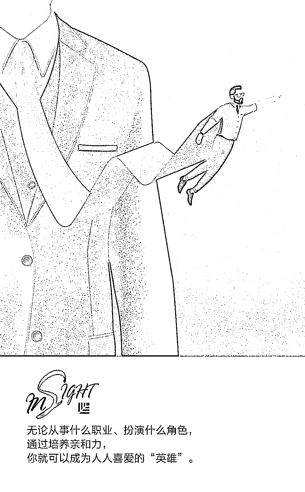
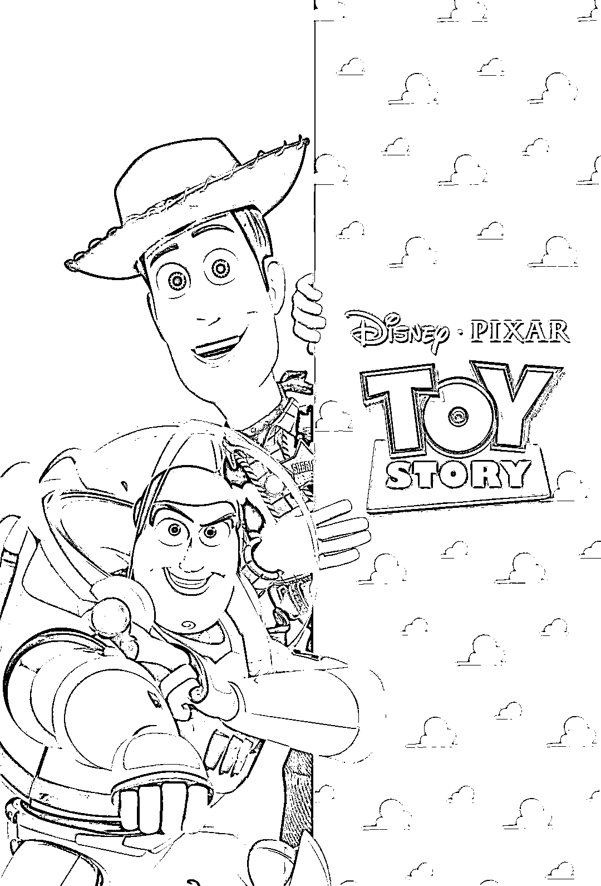
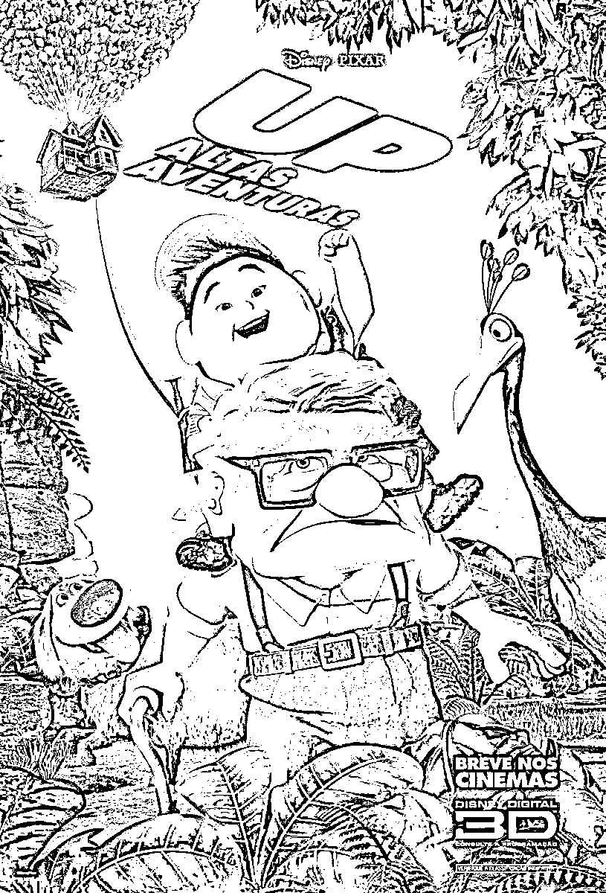
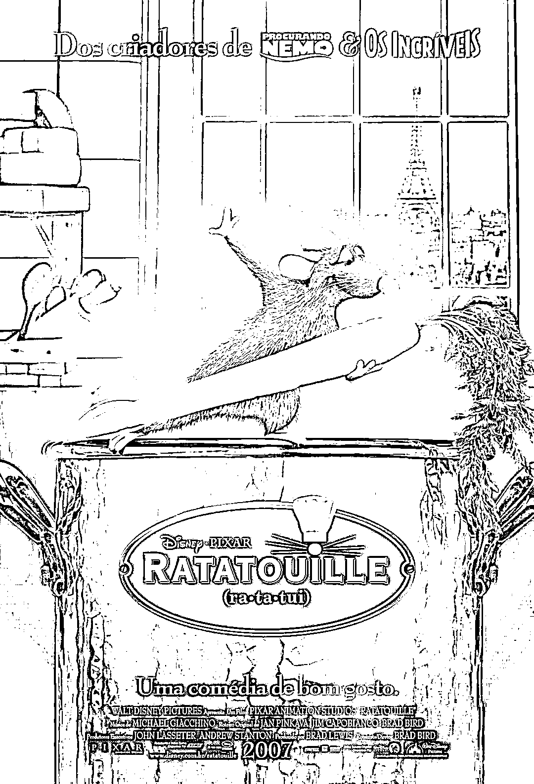
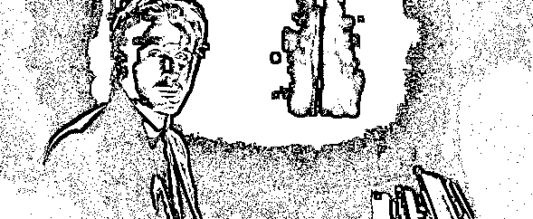
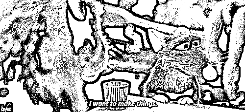
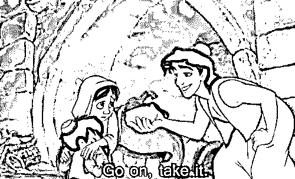
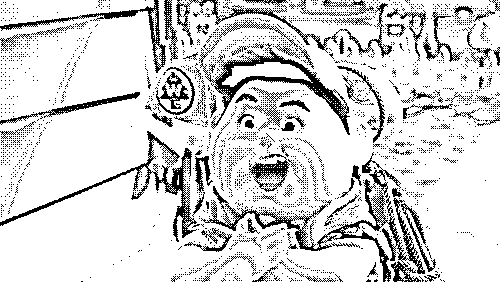
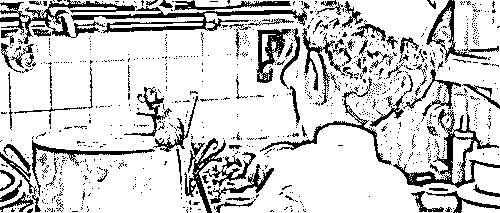

# 电影领导力：英雄给激励团队的启示｜首席人才官

> 原文：[`mp.weixin.qq.com/s?__biz=MzAwODE5NDg3NQ==&mid=2651225300&idx=1&sn=cda77a88a72de97c2bc0d8025fca32c5&chksm=80804280b7f7cb9662cc5c6079be58e634afd1864db3d0adfc2b41209ad5b0e556c99c9bdba2&scene=21#wechat_redirect`](http://mp.weixin.qq.com/s?__biz=MzAwODE5NDg3NQ==&mid=2651225300&idx=1&sn=cda77a88a72de97c2bc0d8025fca32c5&chksm=80804280b7f7cb9662cc5c6079be58e634afd1864db3d0adfc2b41209ad5b0e556c99c9bdba2&scene=21#wechat_redirect)

看过许多全球爆款电影，认识不少深受人们喜爱的英雄角色，可你知道他们俘获人心的套路吗？如今的领导者能否也变成讨人喜欢的英雄，从而更好地激励团队、强化品牌形象、与消费者建立个人联系呢？

曾在皮克斯打造过多个爆款的故事顾问、动画师 Matthew Luhn 将为我们揭开谜底。Luhn 擅长在电影中塑造深入人心的英雄角色，我们熟知的《玩具总动员》《飞屋环游记》《美食总动员》等都是 Luhn 的作品，他的作品可谓是奥斯卡奖的“常客”。我们能否成为电影中那些有魅力的英雄呢？Luhn 的答案是肯定的，他在一次演讲中分析了人们为什么喜欢电影中的英雄人物，并就商界领导者如何塑造自己的英雄特质提出了以下建议，通过这样的改变或能让领导者更好地带领团队创造辉煌：

▨ 提升亲和力

▨ 做一件善事

▨ 表现得像个孩子

▨ 扮演弱者

大多数精彩的故事都有两个共同点：英雄和旅程。一个怀揣目标的英雄，一路克服障碍，吸取教训，最后完成蜕变。

Matthew Luhn 十分擅长创造一个伟大的英雄人物形象。20 多年来，Luhn 的大多数电影作品都斩获了奥斯卡奖。Luhn 把他对英雄人物的理解运用到商界，总结了在商界创造伟大英雄和领袖所需的五个特质。在进入主题前，我们先了解一下为什么人们会喜欢英雄。

▲ 《玩具总动员》《飞屋环游记》《美食总动员》电影海报

**英雄给予人们正向激励**

我们喜欢英雄，不仅因为英雄让我们想起自己，也因为英雄给我们带来很多正向激励。Luhn 以电影《爱乐之城》为例，分析了英雄们如何带领我们坐一趟情感过山车。

在电影《爱乐之城》的开头，欢快的音乐传达乐观的情绪。两位英雄正沿着一条向上的轨迹走向成功，他们对成名的喜悦和期待让我们的身体系统释放多巴胺，我们便开始与英雄人物建立一种联系，给人留下印象深刻。

电影的中间部分有笑声和幽默。这样的喜剧时刻会让身体系统释放内啡肽，让我们与英雄的相处更加自在，且激发我们的创造力和专注力。

电影的结尾有悲伤的时刻，这对年轻人分道扬镳了。我们的英雄遇到了挫折，此时的音乐传达的情绪也变得悲观。这些悲伤的时刻会刺激催产素的释放，有助于我们与英雄产生共鸣，建立包容和信任。 

▲ 《爱乐之城》片段

领导者讲故事时，在讲到精彩之处唤起听众特定的情绪，同样可以让听众释放多巴胺、催产素和内啡肽。这样可以激发团队的同情心、创造力、慷慨、专注和信任。

**提升亲和力**

根据 Luhn 的说法，电影中的英雄们一次又一次地展现出了同样的五个特点：脆弱、亲和力、远见卓识、组织能力和团队精神。在这五种品质中，领导者最重要的是亲和力。

如果我们在电影开始的前十分钟没有爱上这个英雄，就会对电影失去兴趣，不再观看。同理，如果领导者不受团队成员欢迎，他就无法鼓舞团队，并让人追随他去创造伟大的事业。

Luhn 解释说，想让我们喜欢一个英雄（或商界领袖），以下三件事他必须做其中一件来激发人们的同情心：向一个地位较低的人物表示善意、分享他们小时候的故事或者主动示弱。

▲ 《美食总动员》片段

**做一件善事**

强烈建议在电影的前 12 分钟设置英雄帮助弱小的情节，以此激励观众喜欢他们。在好莱坞，这种善举情节被称为“save the cat”。

例如，在电影《阿拉丁》中，阿拉丁是一个傲慢自大的街头霸王。我们看着他偷面包，轻而易举地逃过追打他的人。此时我们还不能确定阿拉丁是否是好人，直到他正要吃偷来的面包时，故事插入了“save the cat”。阿拉丁看到两个饥饿的孤儿，就把面包递给了他们。这时我们才知道阿拉丁是一个善良的人。他对弱者表现出了善意，大家就开始喜欢他了。

▲ 《阿拉丁》片段

企业同样可以效仿这样的模式，做一些善举，比如保护环境、为社会事业做贡献等。阿迪达斯就曾做过一件比较有影响力的事，与公益组织 Parley 合作，共同研发了一些以海洋垃圾为原料的环保鞋款。通过此举，阿迪达斯在商界成为了一个可爱的英雄。

**表现得像个孩子**

另一个让观众喜欢上英雄的好方法是分享他们年轻时的故事。我们都曾是孩子，所以很容易联系到自己。《勇敢》《怪兽大学》《飞屋环游记》以及其他几十部皮克斯电影，许多故事都用这个小技巧让观众喜欢上主角。

▲ 《飞屋环游记》片段

这个小技巧的强化版就是把人物设定为孤儿。乔治・卢卡（George Lucas）斯在《星球大战前传 1：幽灵的威胁》中就为达斯・维德（Darth Vader）创造了可爱的形象，他把维德打造成一个年轻的天行者阿纳金，喜欢制造机器人和吸血鬼。当然，他是个孤儿。

领导者也可以这么做。当你分享小时候的故事时，意味着你打开了心扉，并展现自己的脆弱，这也会让你显得更加可爱。

▲ 《星球大战前传 1：幽灵的威胁》中的天行者阿纳金

女性卫生用品公司 Always 就是通过“像个女孩”这一广告活动来实现目标的。

在广告中，Always 不仅表现出儿童的纯真，也直接将此与成人进行对比。他们首先要求成年人“像女孩一样”奔跑、投掷和战斗；然后让小女孩也这么做。大人们不知所措地摆动肢体，但孩子们却全力以赴，满怀信心地冲过舞台。通过展示孩子们的成功，Always 做到了利用人们的同情心，传达一种有力量的信息。

**扮演弱者**

还有一个增加英雄魅力值的办法就是示弱。我们总是站在弱者的立场上，同情这个英雄，因为我们在生命的某些时刻也把自己看成是弱者。这就是为什么我们喜欢《美食总动员》里的老鼠 Remy。看到一只想当厨师的老鼠，我们会认为 Remy 是一个巨大的弱者，所以我们支持 Remy。

▲ 《美食总动员》片段

最后，无论从事什么职业、扮演什么角色，通过培养亲和力，你就可以成为人人喜爱的“英雄”。

** 推荐阅读**

壹

[如何成为行业排名前 20%的赢家？](http://mp.weixin.qq.com/s?__biz=MzAwODE5NDg3NQ==&mid=2651225298&idx=1&sn=528dd0d2bdc0549cb564103b62070f95&chksm=80804286b7f7cb903dee16524ab7f36fa727ab70136ef2735eaa7b2fb8f4f93e29879a6a09e5&scene=21#wechat_redirect)

贰

[故事怎么讲才更扎心？跟“招聘界的迈克尔・乔丹”学两招](http://mp.weixin.qq.com/s?__biz=MzAwODE5NDg3NQ==&mid=2651225269&idx=1&sn=fe44d8c51776ce07eb4dabff1c5aaf53&chksm=808042e1b7f7cbf759f4964a3ae46ab7ac5d40584b8f7c460aac0cb9f8f722477add2a4acbf7&scene=21#wechat_redirect)

叁

[为什么极致高效、灵活的沟通是个坑？](http://mp.weixin.qq.com/s?__biz=MzAwODE5NDg3NQ==&mid=2651225273&idx=1&sn=72d63710df276f1ed24d60c244106c54&chksm=808042edb7f7cbfbf5cb7c86128a2f973932b4b5a745149fe751575f01898b72b8b8b8e8d518&scene=21#wechat_redirect)

肆

[热烈祝贺红杉投资企业拼多多成功挂牌纳斯达克](http://mp.weixin.qq.com/s?__biz=MzAwODE5NDg3NQ==&mid=2651225295&idx=1&sn=00a3e83af9114c5ab79844f0098f2909&chksm=8080429bb7f7cb8dabb8fc076155bfae83a326e78718adbeb903962477144ab63f76bc8a0095&scene=21#wechat_redirect)

伍

[为什么伟大艺术的真谛在于 Do Nothing](http://mp.weixin.qq.com/s?__biz=MzAwODE5NDg3NQ==&mid=2651225296&idx=1&sn=5a354e7ac10e043ff0231b92b50b8bee&chksm=80804284b7f7cb9229c4252587cf42723f0a70d6c5e758aa90fb546bf38a22f2caa6ed486403&scene=21#wechat_redirect)

