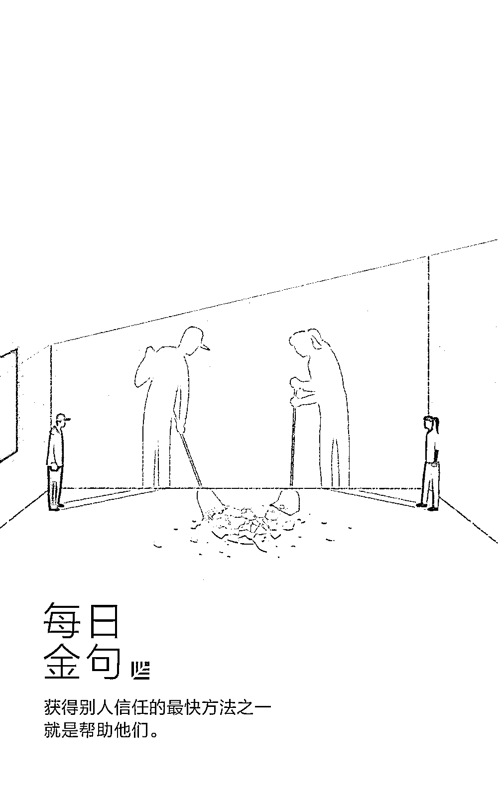

# 九、件小事，厘清伟大团队的本质｜首席人才官

> 原文：[`mp.weixin.qq.com/s?__biz=MzAwODE5NDg3NQ==&mid=2651224419&idx=1&sn=ae11c6ec8240699bf37eb05db01ef008&chksm=80804737b7f7ce21579a6f0d1259e578e820c46c9c466a043e6e1fd3eeaeadd02bc74ec42d6b&scene=21#wechat_redirect`](http://mp.weixin.qq.com/s?__biz=MzAwODE5NDg3NQ==&mid=2651224419&idx=1&sn=ae11c6ec8240699bf37eb05db01ef008&chksm=80804737b7f7ce21579a6f0d1259e578e820c46c9c466a043e6e1fd3eeaeadd02bc74ec42d6b&scene=21#wechat_redirect)

不久前，谷歌开始探索成功团队的必备素质。他们将这项研究命名为“亚里士多德计划”，这是对这位哲学家的名言“整体大于部分之和”的致敬。研究人员发现，真正起关键作用的其实是心理安全感。换句话说，伟大的团队靠的是信任。

如何在团队中建立信任？本文作者 Justin Bariso 提供了 9 个具体建议并进行了详细说明。Justin Bariso 是一名作家和顾问，致力于帮助组织以不同的方式思考和沟通。2016 年，LinkedIn 将他评为“管理和文化的最强音”。以下是部分要点摘录：

▨ 倾听的过程中你所传递的信息是，那些对他们来说重要的事情，对你来说也很重要。

▨ 保持真我意味着去表达你的想法，说出你真正想表达的意思，并坚持自己的价值观和原则。

▨ 你可以通过树立榜样传授你所追求的尊重和正直。

▨ 获得别人信任的最快方法之一就是帮助他们。 

▨ 为人谦虚也意味着当需要时，你愿意说出这句可能有点难以启齿的话：对不起。

▨ 记住，每个人都值得赞扬。

那些最好的公司是由伟大的团队组成的。要知道，即使一家公司聚集了最优秀的员工，但假如这些人无法在一个团队里共同合作，这家公司也不会成功。

这就是为什么不久之前，谷歌开始探索成功团队的必备素质。他们将这项研究命名为“亚里士多德计划”，这是对这位哲学家的名言“整体大于部分之和”的致敬。

为了定义“有效性”，研究小组决定了测量定性和定量数据并以之作为评估标准。为了做到这一点，他们分析了几十个团队，并采访了数百名高管、团队领导和团队成员。

研究人员随后在四个不同的方面评估了团队的有效性：

▨ 团队的执行力评估

▨ 团队领导对团队的评价

▨ 团队成员对团队的评价

▨ 销售业绩与季度指标

那么，他们发现了什么?

谷歌就此发表了一部分研究结果，并总结出了以下的深刻见解：

研究人员发现，真正起关键作用的并不是取决你的团队成员都有谁，而是取决于你的团队里成员之间是如何共同合作的。

是什么在起关键作用呢？

而最重要的因素又是什么呢？其实是心理安全感。简单地说，心理安全感指的是一个人对冒险的感知，以及他（或她）的队友对或将承担这种风险的反应。

谷歌是这样描述的：

“

**在一个心理安全感高的团队中，团队成员会敢于在队友面前去冒险。因为他们确信，团队中没有人会因为承认错误、提出问题或提出新想法而让大家感到尴尬或受到惩罚。**

In a team with high psychological safety, teammates feel safe to take risks around their team members. They feel confident that no one on the team will embarrass or punish anyone else for admitting a mistake, asking a question, or offering a new idea.

”

换句话说，伟大的团队靠的是信任。

这似乎是一个简单的概念，但是在团队成员之间建立信任并非易事。例如，一个只有 5 个人的团队在完成工作的过程中也会有不同的观点、想法和工作风格。

在我即将出版的《情商》（EQ, Applied: The Real-World Guide to Emotional Intelligence）一书中，我分析了一些关于世界上部分最成功的团队真实故事，以及基于这些成功团队的精彩研究。

以下是一些可以帮助你在团队中建立信任的行为：

**学会倾听**

要建立信任，你必须尊重别人的想法和感受。这就是为什么首先要学会倾听。

积极的倾听包括在倾听过程中提出问题，并集中精力去理解讲述者的回答，这些行为其实都是在抑制冲动判断。当你有规律、有技巧地倾听对方的阐述时，你就会理解他们脑海中的现实、并了解他们所处的世界。同时，你会表现出自己十分珍视他们向你展现的经验。学会倾听可以帮助你确定每个团队成员的长处、弱点以及不同的沟通方式。

此外，在这个过程中你所传递的信息是，那些对他们来说重要的事情，对你来说也很重要。因此，你的观点会变得更有分量，因为你将心比心地考虑他人的想法。

**表现同理心**

除了倾听之外，尽量去了解你的团队成员和他们的观点。这被称为认知同理心。

而且，你也会因情感的表现或产生情感上的同理心而受益。 因为这意味着你正试图分享另一个人的感受。

举个例子，如果一个同事跟你分享了他（或她）经历的一次挣扎，你可能会想：“嗯，这没什么大不了的。”我之前讲过。当这种情况发生时，试着回想一下你自己感到压力或不知所措的时候，并利用这种感觉来帮助你理解同事的感受。

**保持真我**

信任来源于真实。我们容易被那些“保持真我”的人所吸引，因为即便他们意识到自己并不完美，也愿意展示那些不完美，因为他们知道每个人都会有不完美的地方。

保持真我并不意味着分享所有关于你自己的事物，也不意味着无时无刻都将这些分享给每一个人。 它意味着去表达你的想法，说出你真正想表达的意思，并坚持自己的价值观和原则。

**树立榜样**

言语只能通过行动来建立信任。

这就是为什么实践你所传达的东西和树立榜样是非常重要的。因为你可以通过这一途径传授你所追求的尊重和正直。相反，咒骂你的团队成员其实是没有意义的。

**帮助他人**

获得别人信任的最快方法之一就是帮助他们。

想想你最喜欢的老板，他们从哪里毕业、他们有什么学位、甚至他们以前的成就，其实这些因素都与你们之间的关系无关。但是，如果他们愿意从繁忙的日程中抽出时间来倾听、帮助你们，或亲临一线和你们一起工作呢？

信任是一场持久战，但也能随时随地帮助你。

**不同意但服从**

亚马逊首席执行官杰夫・贝佐斯（Jeff Bezos）解释说，“‘不同意但服从’并不意味着你‘认为你的团队错了，或没抓住要点’，因为这将阻碍你为他们提供真正的支持。相反，即使你不同意，但也表现出一个真诚的服从、对团队真正的服从。”

当然，在你达到那个阶段之前，你应该能够解释你的立场，使得团队能够合理地权衡你的顾虑。

一旦你决定“虽不同意也依旧服从”，那就意味着你已经成为这项决议的一员，你不能直接或间接地破坏项目。你的团队也将由此获得信心，因为你给他们空间去尝试和成长，并信任他们身上的勇气。

**为人谦虚**

为人谦虚并不意味着你缺乏自信，也不意味着你从不坚持自己的观点或原则。它意味着你要认识到自己并不是对一切都了解，而且愿意向别人学习。

这也意味着当需要时，你愿意说出这句可能有点难以启齿的话：对不起。

**保持公开透明**

如果你身处在一个工作的循环当中，但领导者漠不关心，这种感觉会很难受。但如果你发现领导者有不肯公开的秘密，这种感觉将会更加糟糕。

因此，要确保你的团队中的每个人都清楚你的愿景、意图和方法，并且他们可以获得所需要的信息来把自己的工作完成得最好。

**真诚且具体地表示赞扬**

当你赞美别人时，你满足了人类一个基本的需求。 当你的同事注意到你欣赏他们的努力时，他们自然会有更多的动力。这份赞美越具体越好，告诉他们你欣赏的是什么、为什么会欣赏。

记住，每个人都值得赞扬。 通过学习识别、认可和赞美这些才能，你才会发挥出他们最大的作用。****************

原标题：Google Spent Years Studying Effective Teams. This Single Quality Contributed Most to Their Success

来源：inc   翻译：谢晓君

** 推荐阅读**

壹

[最重要的事情只有一件｜精力管理](http://mp.weixin.qq.com/s?__biz=MzAwODE5NDg3NQ==&mid=2651224416&idx=1&sn=5c11803894c0a2bba8bdbe4dea1dd5a0&chksm=80804734b7f7ce225fb155f17736633a3fa49cbcdc4f535366467c63d5767a6270ec84d18ea2&scene=21#wechat_redirect)

贰

[海外 AI 人才回流趋势走强，中国企业请接招](http://mp.weixin.qq.com/s?__biz=MzAwODE5NDg3NQ==&mid=2651224388&idx=1&sn=3448c2cf8651416ad9294d4d4a738f96&chksm=80804710b7f7ce0679f00d669709ed9b7d5be3742220c4d49be9c10a9cd43b005d460feecdfa&scene=21#wechat_redirect)

叁

[迄今最全网络效应模型研究，一文看清顶级公司边界](http://mp.weixin.qq.com/s?__biz=MzAwODE5NDg3NQ==&mid=2651224392&idx=1&sn=9ecbe5333891528d0533209ad20c702d&chksm=8080471cb7f7ce0aac6b7f58e33f41bcdd6bb56a947feba6f0d919ace468577e4909a356527d&scene=21#wechat_redirect)

肆

[红杉中国精准医疗投资再下一城 ARMO 闪亮挂牌纳斯达克](http://mp.weixin.qq.com/s?__biz=MzAwODE5NDg3NQ==&mid=2651224399&idx=1&sn=e660110ca12937e085502f792bf4c3b8&chksm=8080471bb7f7ce0d437485c2543f7d8c850fa6c33b1604921f590fadd12b18c3d3b769d84888&scene=21#wechat_redirect)

伍

[被英雄互娱改变人生的四个人｜红杉故事计划](http://mp.weixin.qq.com/s?__biz=MzAwODE5NDg3NQ==&mid=2651224407&idx=1&sn=49e1f4d5c27730128e841d3cb5ee1dab&chksm=80804703b7f7ce153991d7aacb3a4cac5cf5aca9864d3c9b795d3d31f16db1f74a256eff33bd&scene=21#wechat_redirect)

