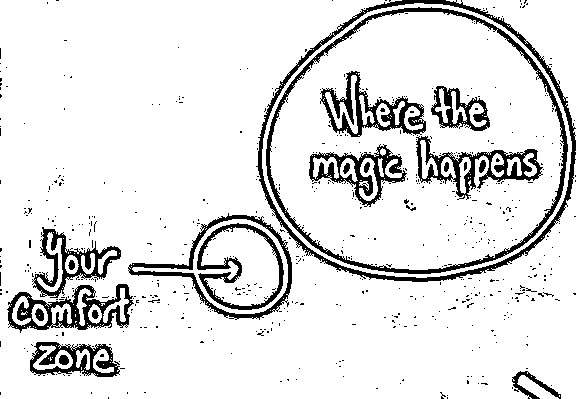
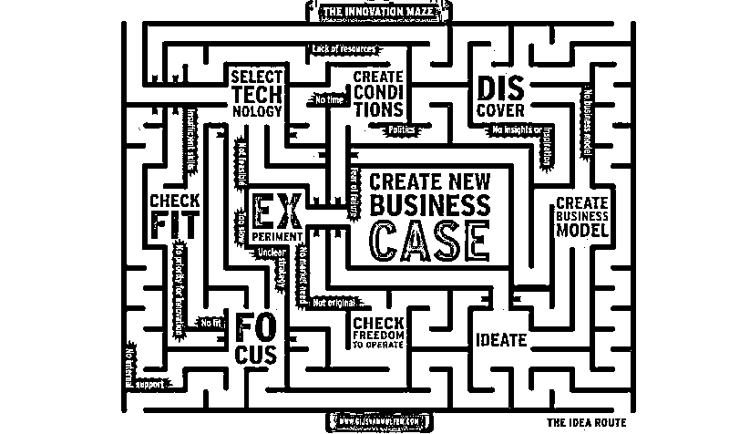

# 红杉汇内参｜让员工对进步上瘾：第一手解读替代 KPI / OKR 的美国最新管理理念

> 原文：[`mp.weixin.qq.com/s?__biz=MzAwODE5NDg3NQ==&mid=2651221540&idx=1&sn=8b5c160dcdb89a3f015e5a2b9406182e&chksm=80805070b7f7d96660a5e6b3ab6efbd36e0f8ec37c309e735a0e3063f0a06f98453fc817eb69&scene=21#wechat_redirect`](http://mp.weixin.qq.com/s?__biz=MzAwODE5NDg3NQ==&mid=2651221540&idx=1&sn=8b5c160dcdb89a3f015e5a2b9406182e&chksm=80805070b7f7d96660a5e6b3ab6efbd36e0f8ec37c309e735a0e3063f0a06f98453fc817eb69&scene=21#wechat_redirect)

**** **‖** **红杉汇内参 **‖****

第 **002** 期

 *[* *编者按 ]* 被称之为“发明了管理学”的彼得·德鲁克在晚年一直孜孜探究的问题就是：在信息时代，如何管理知识工作者？或者说，知识工作者如何实现自我管理？

源自工业时代的 KPI 已成为许多经理人的诅咒和噩梦，它肯定不是“德鲁克之问”的答案。于是，当一个叫 OKRs 的新式目标与关键成果考核体系出现后，所受到的热捧就不足为奇了，特别是，它有一个著名的企业应用案例叫 Google。

现在，一个以 OKRs 体系为基础，结合人类行为心理学而被发明的更先进的绩效管理理念出现了，这就是“目标科学思维”（ Goal Science Thinking ）。本期 [红杉汇内参] 重点介绍这一体系的构成要点。

每期监测和精编中文视野之外的全球高价值情报，为你提供先人一步洞察机会的新鲜资讯，为你提供辟开脑洞、升级思维方式的深度内容，是为 **[ 红杉汇内参 ]**。

【本期悬念】

*   **介绍一个绩效管理领域的新理念：GST，它比 OKRs 体系还先进。痛恨 KPI 的你应该一读。**

*   **爱购物的女人们创业后却不爱并购，为什么？特别建议：少向你的闺蜜圈子咨询商业疑惑。**

*   **从一个想法开始，到做成令人信服的商业案例需要几步？这里有一个穿越创新迷宫的红绳。**

*   **初创型智能硬件公司无不从利基市场起步，怎样捍卫自己的领土避免被巨头碾压？学苹果，不如学 GoPro、Fitbit 。**

*   **我知道开发者的纠结：是把功能都放到一个全能 APP 上还是分散到几个 APP 上好呢？答案是……**

**※※※**

【内参】

**让员工对进步上瘾：**

第一手解读替代 KPI / OKR 的

美国最新管理理念

早在 1980 年代中期，英特尔的安迪·葛洛夫（Andy Grove）和甲骨文的加里·肯尼迪（Gary Kennedy）已经开始探索公司考核制度的最初模型。他们的成果后来被 Google 加以调整后发扬光大，作为目标与关键成果考核制度，即 OKRs 体系闻名于世。在很长一段时间内，它都是公司进行规划与协调最先进、最好的工具。但现在，有一种新的方法出现了，这就是“ 目标科学思维 ”（ Goal Science Thinking，以下简称 “ GST ” ）。

这是一种以 OKRs 体系为基础，结合人类行为心理学，同时注重增强互动和促进习惯养成的方法。基本上，它运用了所有能让人们养成好习惯的方法和技巧——只通过重新构想来帮助大型团队把握业务目标。

这些都是 BetterWorks 公司的主要业务。在这篇独家采访中，其 CEO Kris Duggan 分享了 GST 的运作方式，即如何让公司的目标更加面向数据驱动，更加具有协作性，并最终获得成功。

**目标管理为什么是 GST 的核心**

BetterWorks 完成的一项研究表明，目标设定如何影响一个公司发展。以下是其中一些比较有趣的发现：

*   采用规范目标设定方法的公司，每年在财政方面表明突出的概率比其他公司高出 3.5 倍。

*   只有 7%的员工能理解公司的业务策略，以及公司希望他们如何帮助实现目标。

*   普通员工只能同时为了达到 3-5 个目标而努力。

*   一年中，只有半数的高层领导会修改目标。

*   一年中，1/3 的经理级别员工会修改他们的目标。

*   一年中，1/5 的一线员工会修改他们的目标。

因此，即使管理者尽可能的强调流程，使员工与公司层面的目标联系起来，也无济于事。

**GST 重要原则：所有目标对所有人可见**

公司的每个人都可以看见别人的目标，没有什么秘密或者是隐瞒的东西。不再有等级限制，员工可以直接申请查看上级领导的目标，甚至是其他部门领导的目标。

有趣的是，BetterWorks 发现人们查看上级目标的次数比查看自己的多出 20% 。

很显然人们需要这样的了解和透明化。在传统体系里，这些是不可能发生的。只有经理可以查看下属的目标。

“ 将目标对每个人透明化是公司实现一致和统一的必要条件。”

为了让目标变得有效（ 比如让其有可能达到 ），它需要由员工发起和初拟，由上级进行审核，再由双方同时进行跟踪。如果真的做到了透明化，你可以直观感受到你的目标跟上级的目标、公司的总体目标以及团队其他成员的目标是息息相关的，而不是对立的。

GST 和 OKRs 体系之间最大的不同点在于，前者的目标来源于不同团队、不同部门的多个渠道。比如 Duggan 发起了一个目标，是作为沟通部门的负责人要发布一些关于公司的文章，那么销售部门需要与市场部门敲定具体发布的信息，市场部门需要与工程部门配合才能真正了解产品。可见性使这种协作不仅是发生，而是被记录和监测。

“ 我们发现由跨职能员工制定的目标往往收益更多，对全公司公开的目标比保密的目标达成率高了 10.4% 。” Duggan 说。

一致性也至关重要。BetterWorks 建议每个季度制定一次目标，让整个公司都参与到流程中来，这样他们就会感受到自上而下与自下而上的平衡。行为科学家 Gary Latham 发现，参与目标制定的利益相关者最后的表现会超出目标预期——这肯定是每个公司都乐见的结果。

**引入社交机制锻炼 “ 目标肌肉 ”**

“ 一些公司拥有很好的‘任务肌肉’，他们总是做好很多小事，并认为自己非常高产。但是他们的‘目标肌肉’却很弱。他们在所有事情的背后没有一个成熟的意愿和方向。如果这是你的公司，那你就会像制造了一个拥有粗壮手臂和瘦弱大腿的人一样，失去平衡。” Duggan 说。

锻炼“ 目标肌肉 ”的最好方法，就是频繁有效的使用目标体系去完成优先任务，并且持续不断的重复这个过程。

在一个季度中被查看 10 次或者以上的目标比只被查看一次或两次的目标达到的可能性高出 21% 。通过机制来保证定期进行查看是非常值得的。

这些工具中最有力的就是社交强化。无论你们用什么系统记录和目标追踪，强烈建议你们引入同事评论机制，对目标和关键成果定期进行互相反馈。

这些评论可以是提问、建设性评论、赞扬和鼓励，什么类型都无所谓。重要的是，它会刺激人们一遍一遍地回到他们的目标，然后促使他们去倾听周围人说了什么。

任何形式的认同对行动都是很大的推动。每当人们回到他们的目标上去看同事的评论或者仅仅只是一个“ 赞 ”的时候，他们都会再看一遍自己都写了什么，思考项目的状态，和他们的付出。

另一个保持社交热度的方法，则是鼓励团队中最有影响力的成员制定一个有野心的个人目标，并邀请同事加入。在 BetterWorks ，一个工程师制定了在季度内完成 2 万个俯卧撑的目标，并发邮件邀请愿意支援的人参入。有十几个人自愿加入，最后他们完成了 24000 个俯卧撑，超出目标 20% 。

**让人们对进步上瘾**

另一个锻炼“ 目标肌肉 ”的机制是让人们对进步上瘾。

Duggan 说：“ 量化生活运动——像 FitBit 、Jawbone 这些活动记录器，证明人们想要得到频繁的、可量化的，一目了然的、更关键的是图形化的反馈。当个体获得这种积极同时也是视觉上的反馈时，会让他们形成新的行动，从而使得他们采取更多可衡量和一致的方法去实现目标。”

同样地，你需要的只是用一种简单明了、通俗易懂的方式在你的目标系统中呈现已完成的部分。

当人们有能力实现进步，看见其发生的过程，大脑的愉快中枢就会激活，喜欢看到社交媒体转发和点赞的就是这个部位。如果你让他们用这种简便的方式记录进步，他们会越来越频繁地使用这种方式，并更加频繁地想起自己的目标，并努力完成它们。

Duggan 最后总结道：“ GST 只是一个工具，不是宗教。但如果你运用正确，就会对公司产生革命性的影响，带来意想不到的收获。”

｜来源：First Round Review

**※※※**

【情报】

＃咦，怎么停止剁手了？＃

**女性企业家为什么不爱收购**

相较而言，女性企业家比男性似乎更愿意自己创立一番事业，而非收购一家公司。美国 Quiet Light Brokerage 公司发现，在其经手的所有收购案中，只有 3% 的收购方是女企业家。一位成功的商业教练 Kat Loterzo 建议：

*   不要让自我身份认同影响公司决策。女企业家倾向于将公司作为个人身份认同的一部分，因此不太愿意把别人的公司变成自己的。

*   少向女企业家圈子寻求建议，而应向有收购经验的人请教。女企业家团体中蔓延着太多浮夸和不切实际的情绪。

*   直觉思维使女性比男性更加容易在收购过程中嗅到危险。但是，在考虑备选收购企业的优点时，更加需要分析性思维。

*   战胜恐惧。美国“今日心理学”网站发现，女性对不愉快经历的反应倾向于更加负面，对积极结果感受到的喜悦也比男性少。因此，女性在追寻商业目标时会更加迟疑不决。

| 来源：Entrepreneur

＃Idea is cheap＃

**如何从一个想法开始创业**

如何将想法或机遇变成有理有据、令人信服的商业案例？商业专栏作者 Gijs van Wulfen 通过创新迷宫图开发了一个 “ 想法路线 ” ：

*   酝酿：生成并选择原始的相关想法。

*   专注：定义您的创新兴趣中心，包括所有边界条件。

*   检查您的想法是否符合您的个人（ 及企业 ）优先级。

*   创造条件：为您的创新举措安排合适的时机、合适的团队、合适的速度及合适的资金。

*   发现趋势、市场、技术和客户洞察。

*   创建可行的商业模式和现金流。

*   识别和选择合适的技术来交付您的新产品、服务、进程或经验。

*   检查运营的自由度：检查有无侵害他人的知识产权。

*   实验：开展系统研究或测试，验证您的新产品、服务、流程或经验的采用和吸引力。

*   创建新的商业案例：为您的新产品、服务、流程或经验创建有理有据、令人信服的商业案例。

| 来源：Innovation Excellence

#学苹果？不如学 GoPro、Fitbit #

**智能硬件公司如何自卫**

在 2016 东京亚洲科技会议上，硬件俱乐部合伙人 Jerry Yang 分享了初创型智能硬件公司如何避免早期夭折的市场自卫之道：

*   在初始阶段须弄清两个问题：如何衡量自己的业务？如何捍卫自己的业务？

*   增加用户切换成本。如 Nest 的 Dropcam 通过在相机产品中添加安全云存储组件，从而使其用户留在其生态系统内。

*   工艺卓越。让产品对于其竞争对手及模仿者而言几乎是不可复制的。

*   健身追踪器并不是 Fitbit 的杀手级应用，围绕产品创建的用户社交网络才是。

*   最后一个关键防守是品牌。比如让“ GoPro 视频”成为一个关键词。

| 来源：Market Watch

＃天下大势，合久必分，分久必合＃

**全能 APP ……这样好吗？**

Facebook、Snapchat、Google 等现在都在着手把最新、最好的功能全都整合到一个 APP 上，借此形成一个开环网络（ Open loop ）。这样就能一统江湖吗？

*   开环与闭环网络概念源自支付领域，前者类似信用卡一样允许用户在不同平台上进行支付，而闭环网络则像是商店礼品卡，只允许在特定平台实现支付。

*   操作系统巨头或成最大赢家。

*   把功能都放到全能 APP 上还是分散到几个 APP 上？这要看如何让应用场景变成现实。如果一款万能 APP 功能繁杂而且操作逻辑不明显，那么也就失去了“ 万能 ”的意义。

*   微信正在全球范围内树立万能 APP 用户体验的典范。

*   赢家通吃？那可不一定！单一 APP 难以涵盖如今越来越复杂的用户需求。

| 来源：TechCrunch

# 健忘症者的福音 #

**忘了把车停哪儿了？TrackR 帮你定位追踪**

**** 

*   加州一家创业公司开发了这个名为 TrackR 的精巧小装置，把它贴到你想标记的重要物品上，通过手机里的相关应用即可快速定位，找到遗忘物品的位置。

*   比如帮你在停车场里找到车到底停在哪里。还可以用于：贴在宠物的颈圈上，根据 TrackR 来找到它们玩耍的位置。贴在钥匙或钱包上，再也不用翻遍整个房间找它们。或者笔记本电脑、自行车……

*   它只有 25 美分硬币大小，全球已卖出 150 万个。

｜来源：Recode

**※※※**

【往期回顾】

红杉汇内参第 001 期

[机器智能时代，非科技公司如何立于不败之地？](http://mp.weixin.qq.com/s?__biz=MzAwODE5NDg3NQ==&mid=2651221512&idx=1&sn=7907c0307bcc6a167a377f8fe3327bc3&chksm=8080505cb7f7d94a6807454b7886bf0de38e47f73430393bc29e30ae2c42583d5dca848c8090&scene=21#wechat_redirect)

