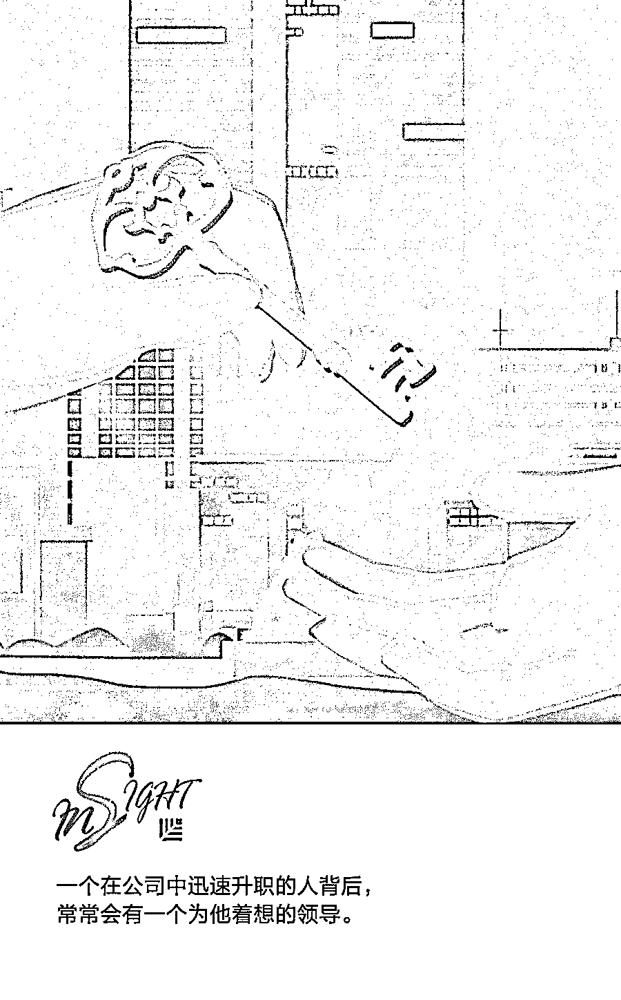
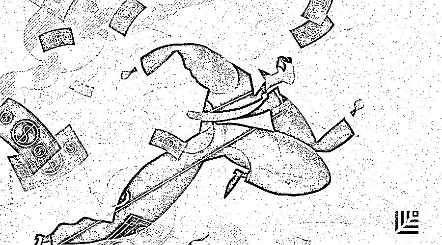

# 四、个 X 要素告诉你，伟大领导者和优秀领导者的差别 | 红杉汇内参

> 原文：[`mp.weixin.qq.com/s?__biz=MzAwODE5NDg3NQ==&mid=2651225616&idx=1&sn=a16ffd468d319865b4dce414a65dd693&chksm=80804044b7f7c952fb4502afa2afbebbc08d0b9f52466415aee577ad7e3ea0a4f92bd722748b&scene=21#wechat_redirect`](http://mp.weixin.qq.com/s?__biz=MzAwODE5NDg3NQ==&mid=2651225616&idx=1&sn=a16ffd468d319865b4dce414a65dd693&chksm=80804044b7f7c952fb4502afa2afbebbc08d0b9f52466415aee577ad7e3ea0a4f92bd722748b&scene=21#wechat_redirect)

[ 编者按 ] 伟大的领导者和优秀的领导者，差别在哪？

为了回答这个问题，企业动用了各种能力指标、发展规划、培训方案，砸下了巨资。但在确定谁是最佳候选人的关键时刻，掌握升职大权的人常常陷入纠结，因为这个人看上去“挺不错”，那个人似乎也“还可以”，真正的“明星”早已经擦肩而过。事实上，当我们把考核指标过于细化时，评估的就只是领导者的能力是否过关，它无法说明领导者是如何取得成就的，也无法预测领导者的未来表现。被忽略的那些潜在特质，才是决定一个领导者是否真正优秀的重要因素。

每期监测和精编中文视野之外的全球高价值情报，为你提供先人一步洞察机会的新鲜资讯，为你提供升级思维方式的深度内容，是为 **[ 红杉汇内参 ]**。

** 内参**

**伟大领导者和优秀领导者**

**差别在哪儿？**

作者 / David Reimer、Adam Bryant、Harry Feuerstein

编译 / 洪杉

35 年来，每年 2 月，美国国家橄榄球联盟（NFL）都会举办一次选秀大会（英文称为“combine”），对大学生运动员进行技能评估。选秀大会上的表现将影响球员进入球队的时间，入选时间的先后被看作是球员职业发展的主指向标。然而，史上最强四分卫汤姆·布拉迪（Tom Brady）直到第六轮才被选中，明星角卫理查德·谢尔曼（Richard Sherman）也是在第五轮才被选中。多项研究表明，尽管选秀大会会根据球员的运动技能对其入选资格进行衡量，但却忽略了一些使球员在比赛中脱颖而出的无形因素。

NFL 选秀大会希望能够押中未来的体育明星，同样，企业构建精密的框架也是为了回答一个看似简单的问题：哪种特质可以区分出未来最佳的管理层人选？经验表明，以下两个明显原因常常使传统的高管评估与培养方案失色。

首先，能力指标评估过于细化。企业在评估时列出一长串高度细化的能力指标，以为能够找到合适人选。这种错误最常出现在下面两种截然相反的情况中：一是以之前的成功领导为模板，对当下候选人的资质进行评估。二是试图单凭想象，把那些能够帮助公司在未来五年实现战略计划的领导能力指标都找出来。

其次，一些技能被视为入选筹码，董事会尤其易受这些技能的影响，且过于注重这些技能。比如，拥有战略思维、损益业绩表现良好，令董事会成员都认可的“万人迷”领导层候选人。但这种偏好只能区分出多数领导层高管所共有的特质，并不能凸显那些重要的潜在因素。

为了解决上述问题，我们在对 2500 名领导者进行数据分析时，发现了 4 个能够区分出卓越领导者的重要因素。

**简化复杂问题，制定运作方案**

真正出色的高管不仅能够轻松自如地应对混乱状况：他们还可以凌驾于复杂问题之上，用简单、易操作的方式传达给自己的下属，让他们觉得容易理解和接受。

简单，但不过于简化。物联网、区块链等多数当下正在进行的商业革命，最终走向还未可知。面对这种不确定性，最佳领导者都会尽力明晰企业战略目标中所针对的问题。他们强调公司在应对这些挑战时所面临的情景有哪些独特之处，提出一个简单的决胜计划，其中只列出三四个优先事项。

为复杂的问题制定运作方案。最佳领导者会把简单计划作为运作方案的基础。首先，运作方案必须包含一两个简单框架，厘清公司实施战略目标的具体方式。例如，2010 年，美国健康医疗公司艾尔建的现任负责人——布伦顿·桑德斯(Brent Saunders) 出任博士伦的首席执行官，他注意到公司的工程师过于注重获得专利和发表论文。在传达解决方案时，他将“研究与发展（R&D）”换为了“发展与研究（D&R）”，借此来不断提醒员工将重点放在市场和消费者身上。

除了基本框架外，企业在制定运作方案时还应阐明一到两个主要指标，使企业的进步变化一目了然。最佳领导者会刻意为整个公司提供一个参考点，用于追踪企业长期目标的进展情况。江慕忠（Joseph J. Jimenez）曾是跨国企业诺华制药的前任首席执行官，现任宝洁公司和通用汽车公司的董事会成员，他说：“你必须提取公司战略中的精华：公司将如何走向胜利，公司真正追求的是什么，这样员工才会把它们记在心中。”

确立了那些将在未来产生影响的三四件优先事项后，领导者要将这些优先事项融入到运作方案中，然后不断就这些事项进行沟通。借助运作方案、持续的沟通、清晰的进步衡量标准来使员工对企业进行深入了解，是一种不懈追求。但并非所有的领导者都会为之付出努力。

**激起整个企业的雄心壮志**

企业发展中最具有破坏力的武器就是明显的抱团倾向。我们通常会把自己看作某个小团体中的一份子，只信任那些和我们处在一个圈子中的人，把公司其他部门的同事视作抢夺资源的竞争对手，而不是和我们同属公司大集体中的一份子。这种抱团行为只会把重点放在小团体内部，而不是放在为公司赢得市场份额上。

走出小团体，为整个公司考虑，需要克服两个重要驱动因素：部落主义和对熟悉领域的安全感。要想整个公司的心往一处想，员工需要自己主动去了解这些驱动因素，同时能够足够自律，克服这些冲动。公司应成为员工心中唯一重要的“大团体”，而悖论在于，走出自己的熟悉领域会为我们带来不适，卓越的领导者要将这种不适转化为自己的舒适区。

几年前，一家全球制药公司中，一位部门业绩表现良好的领导认为需要对团队风气进行整改。虽然该部门总是能达到自己的财务目标，但团队在抱团工作。这位领导让他们想一想自己作为公司一份子的作用：一味把目光集中在个人业绩目标上，他们在整个市场上的价值损失有多少？短短的几个星期内，团队成员自愿提出对薪酬结构进行重新设计，将 50%以上的奖励工资按照整个部门的业绩表现而非个人表现来发放。为了实现延伸目标，他们还进行了合作。最终，该业务部门超额完成目标，团队内大多数的高管在后来的工作中也升了职。而那位引发这场讨论的团队领导者成为了首席执行官。

**即便不是团队领导者，**

**他们依然表现出色**

自高层领导往下，团队始终是企业组建的关键。尽管越来越多的学术研究和战略工作都在强调团队的力量，但多数企业团队并没有进行深入思考，了解真正的团队到底意味着什么。

在自己离高层领导还很遥远时，最佳领导者就会带着特定的问题与团队进行对话。要想加快战略推进，我们需要在哪些方面共同努力？作为一个团队，我们应该优先处理哪些事项？这些问题的答案会使会议议程得到完善，为如何制定决策提供指导，使沟通重点放在大局之上。

最出色的高层领导接班人要做到即便不是团队的领导者，依然表现出色。这对许多领导者来说可能都是一个挑战。随着职位的升迁，高管会受到激励，获得领导团队的动力。但领导者清楚自己的定位，他们注重自己在实现公司战略目标上的作用，而不是在具体措施上。2016 至 2017 年，我们对 100 多个高管团队进行了调查，结果发现，那些在实现预设转型目标上进展最大的高管团队，称自己会将 50%以上的时间用于讨论整体战略；而那些进展较为缓慢的团队则将 90%至 95%的时间用于讨论具体措施上。

2014 年接任微软首席执行官一职不久之后，萨提亚·纳德拉（Satya Nadella）就表示：“上任初期，我最关注的是，自己如何才能最大程度地提高团队的效率？如何才能培养一个团队？我们是否能够进行真诚的沟通？如何才能让每个人尽其所长，为公司带来利益？”

**他们能够培养出领导者**

经验告诉我们，高管分为两大阵营。一是把手下的员工看作帮助自己职位晋升的筹码，二是发现员工的潜力并主动培养他们。有时候，对于顶级领导人、董事会成员或人力资源高管来说，准确判断出某个经理人属于哪个阵营并非易事。但是有一个明确的衡量标准可以判断出一个领导者是否能够培养出领导者：看他们以往的表现，公司内是否有员工在为这位高管工作后职权不断上升？

在与继任候选者一同工作时，我们发现，如果一位领导者培养出了多名出色领导者，则说明他的领导能力出色，这种衡量方式常常遭到忽略，但它对高管表现的预测结果却十分可靠。它还可以衡量一个人的自我意识。一个在公司中迅速升职的人背后，常常会有一个为他着想的领导。食品原料供应商宜瑞安的前任首席执行官艾琳·戈登（Ilene Gordon）说：“我认为，一个人能够取得今天的成就，必然受过某人的指导。”

如果一个领导者能够培养出领导者，那么他/她很可能可以留住或者培养那些与自己持不同意见的人。多样性不是说人员构成上的细微差别，它有利于战略的执行，表明领导者所构建的团队不仅能够更加迅速地抓住新机会，还善于打破公司传统的思考和工作方式，为公司带来益处。若一个能力出色的高层领导先前并没有培养或提拔过那些与自己意见立场不同的人才，那么成为顶级领导人之后，他们不可能奇迹般摇身一变，开始拥护思想多元化。

**如何培养出**

**具备这些潜在特质的领导者？**

首先，企业必须确定自己是否要明确表态，强化这些特质在衡量领导人是否成功时的作用。如果答案是肯定的，企业必须在董事会、当前的高层领导和执行发展战略与框架的具体人员这三个层面内对其进行传达和强化。

其次，企业应当考虑采用传统的 70-20-10 员工发展模型来培养高管，即 70%的员工靠工作经验进行提升，20%的员工靠指导，10%的员工靠培训。但企业应对这一模型进行整合，我们提倡 90-10 式模型，即公司战略和在职环境应与培训水乳交融。通过这种方式，培训与经验累积联系起来，能让企业更快明白所需的领导能力有哪些独特之处。

再者，企业必须建立一个简单但能长期使用的衡量标准或量化体系，用于长期追踪领导者在不同岗位上的表现或进步。

** 预测**

**“塑料时代”**

英国赫尔大学沉积学教授丹·帕森斯说，当前塑料垃圾非常普遍以至于会形成新的地层，世界可能正在进入地质学意义上的“塑料时代”。

近年来，塑料开始在世界所有海洋中被发现，在总计超过 4 亿吨的塑料中，只有 25 万吨漂浮在水面上，其中 90%沉入了海床。专家说，这些塑料最终会在那里矿化。据估计，到 2050 年，塑料在全球海洋中的重量将超过海洋生物的重量。

** 情报**

#金融危机十周年#

**可以自救的 4 条经验（今天仍然适用）**

▨ 拥有自知之明。每家企业和每个行业都需要确定其薄弱之处的来源，并在时机合适时对其加以防范。

▨ 多长几双眼睛。建立数据分析模型，加强风险管控措施并提高透明度，可以防止企业在“挡风玻璃上有泥浆”的情况下盲目经营。

▨ 拥有推动变革的意愿和手段。在很多情况下，当你有意愿时，你已经失去了手段。

▨ 建立一支强大的团队。面临棘手问题时，若没有行动迅速的团队指引方向，情况可能会变得更糟。

#用最佳实践武装自己#

**如何接近医疗保健这个行业猛兽？**

▨ 了解你的利益相关者。医疗机构层次深且极其复杂，你必须了解每个利益相关者是谁，他们的侧重点在哪里，他们认为哪里存在风险，对他们来说成功是什么。

▨ 重视连锁反应。仔细考虑一下你的产品除了直接使用之外的连锁效应——对病人、对家庭成员、对辅助人员。

▨ 从关键绩效指标开始反向推导。如果你想不断赢得利益相关者，最好的方法是在客户研究阶段深入挖掘可以改进产品的关键绩效指标，然后进行反向推导。** **

** 推荐阅读**

壹

[比想象更快，开始依赖虚拟现实的 7 个行业 | 红杉汇内参](http://mp.weixin.qq.com/s?__biz=MzAwODE5NDg3NQ==&mid=2651225582&idx=1&sn=4d5dd23f7095da37881e259f10de2f3f&chksm=808043bab7f7caac24f459baa12cd46e1b11e62b7a872b625199e88054356b927521cfed9a5c&scene=21#wechat_redirect)

贰

[未来，你的健康将由 AI 做主 | 红杉汇内参](http://mp.weixin.qq.com/s?__biz=MzAwODE5NDg3NQ==&mid=2651225547&idx=1&sn=2963478adcd0f2814acd0d5f4adc3eb4&chksm=8080439fb7f7ca89a0e28338e844b0eea9ed608357cc4a0a69e76cff0ebc1b74541e9e11a9b1&scene=21#wechat_redirect)

叁

[自测：你是那个值得员工信任的领导者吗？ | 红杉汇内参](http://mp.weixin.qq.com/s?__biz=MzAwODE5NDg3NQ==&mid=2651225510&idx=1&sn=b5f833b59d40c5ceb20bce70218b3e49&chksm=808043f2b7f7cae4b170a7530327a8d39af6df1f325aa1d681e2d12f500e17d0b61d097878c6&scene=21#wechat_redirect)

肆

[殿堂级商业领袖留下的 6 条最佳商业建议｜红杉汇内参](http://mp.weixin.qq.com/s?__biz=MzAwODE5NDg3NQ==&mid=2651225455&idx=1&sn=8e5f288e8aff4d59e46122914148ba3f&chksm=8080433bb7f7ca2d1d5c5c691b76d964850254c6a6bfdedc48bbf36cf5df14a8dbf66400abda&scene=21#wechat_redirect)

伍

[先营销，再创业：淹没初创公司的 8 个营销教训 | 红杉汇内参](http://mp.weixin.qq.com/s?__biz=MzAwODE5NDg3NQ==&mid=2651225396&idx=1&sn=8a887bd4009c13bbad38e43cdd71af40&chksm=80804360b7f7ca76fb3faed641e9524a977108337df83184345d4a697f81f4faeb7f6df99882&scene=21#wechat_redirect)

