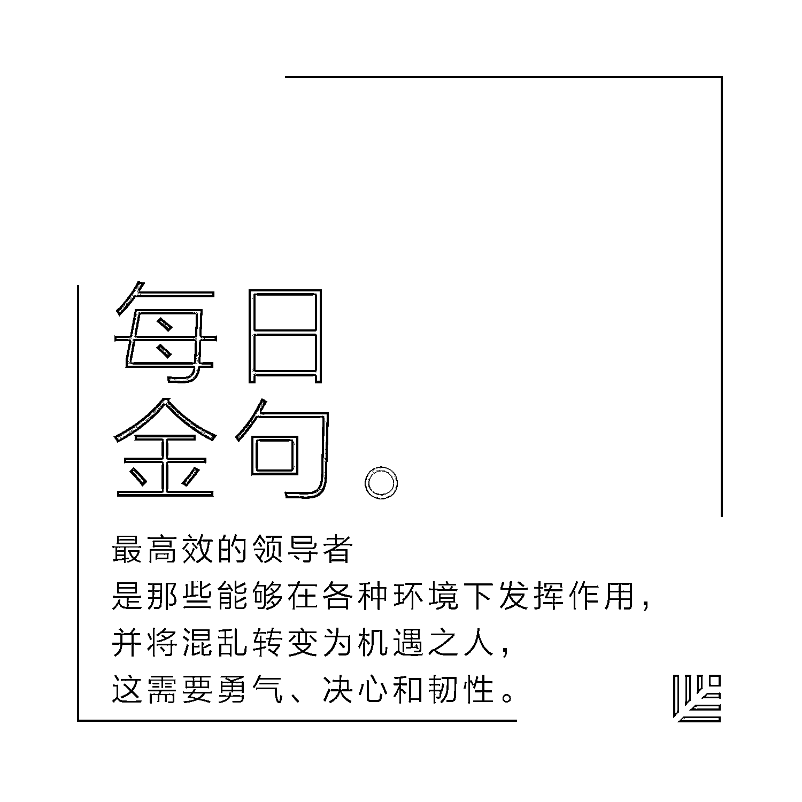
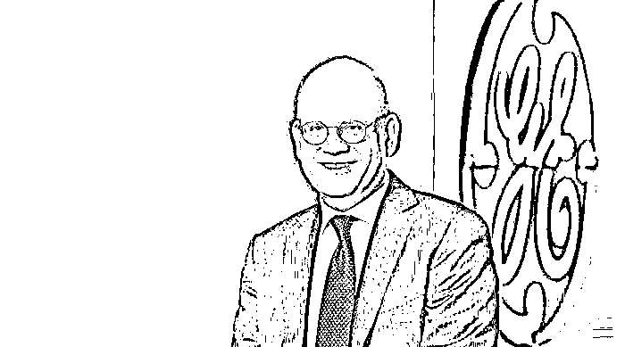
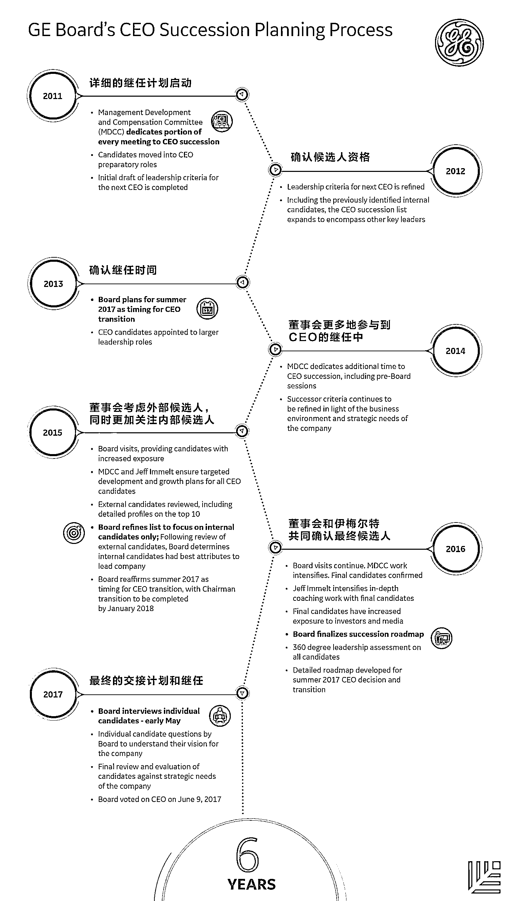

# 耗时 6 年选定 GE 新 CEO，高级副总裁亲口解密决策过程｜首席人才官·选

> 原文：[`mp.weixin.qq.com/s?__biz=MzAwODE5NDg3NQ==&mid=2651223289&idx=1&sn=c139a691180530bf78f7e9f5fc612163&chksm=80804aadb7f7c3bb872e64e6cc54612b66e8c2ed03da59c43e0cbea8389d4bcd07115e1dac2a&scene=21#wechat_redirect`](http://mp.weixin.qq.com/s?__biz=MzAwODE5NDg3NQ==&mid=2651223289&idx=1&sn=c139a691180530bf78f7e9f5fc612163&chksm=80804aadb7f7c3bb872e64e6cc54612b66e8c2ed03da59c43e0cbea8389d4bcd07115e1dac2a&scene=21#wechat_redirect)

杰夫·伊梅尔特应该对这一幕不陌生。17 年前，他也正是经历如此漫长的考察、竞逐，从最初 24 名候选人中脱颖而出，成为通用电气公司（GE）历史上第 9 任 CEO。现在，轮到他选择交棒人了。6 月 12 日，GE 正式对外宣布，GE 医疗现任 CEO 约翰·弗兰纳里（John Flannery）将成为下一任 CEO。

GE 前任传奇 CEO 杰克·韦尔奇在自传《赢》里曾这样描写选择接班人工作：“这不仅是我职业生涯中最重要的一件事，而且是我面临过最困难也是最痛苦的选择。整个过程几乎让我发疯，给我带来了无数个难眠之夜。”

GE 考察和选择 CEO 的过程，历来被业界当作教科书一般的案例所称道。这篇文章来自 GE 主管人力资源的高级副总裁苏珊·皮特斯（Susan Peters），她亲口解密了此次选择接班人的过程，以及方法论。

你可能有所不知的一些细节如下：

*   通常大公司 CEO 的选拔流程为 1-2 年，GE 则花费长达 6 年时间。

*   GE 的 CEO 平均任期为 12.5 年，高于标普 500 企业 CEO 平均 8.8 年的任期。

*   5 月 13 日是终极 PK 日，四位候选人轮番进行最后陈述，题目就是“GE 的未来之路”。每人的面试时间为一个半小时。

*   6 月 9 日上午，GE 董事会进行了最后一次投票会，前一晚，酒店安保严密，所有可能的监听设备都被扫清。下午 1 点，约翰·弗兰纳里收到正式电话通知，告知他将成为下一任 CEO。

*   GE 标准：最高效的领导者是那些能够在各种环境下发挥作用，并将混乱转变为机遇之人，这需要勇气、决心和韧性。

▲苏珊·皮特斯（Susan Peters），通用电气公司高级副总裁兼人力资源主管

**作**为通用电气公司的人力资源主管，我最重要的责任就是帮助发展整个公司的所有领导者，尤其是高层领导者。我已将大半的职业生涯都倾注于领导力发展之上。

今天（6 月 12 日）我们要宣布一件事，这也是我迄今为止最重要的一项工作——任命通用电气的下一任 CEO。

这项重大决定将影响到通用电气公司未来的发展。数百万的投资者和几十万员工都要以这位领导者马首是瞻。

杰夫·伊梅尔特（Jeff Immelt）担任通用电气公司的董事长兼 CEO 已有 16 年之久。自通用电气公司成立 125 年以来，我们只任命过 10 位 CEO；平均任期为 12.5 年。而在 2001 年至 2015 年间，美国标普 500 上市公司 CEO 的平均任期为 8.8 年。

如今的工作环境需要更伟大的领导力量。**最高效的领导者是那些能够在各种环境下发挥作用，并将混乱转变为机遇之人，这需要勇气、决心和韧性。**正是基于这一标准，我们的董事会才做出了决定。

与通用电气公司其他重要的决定一样，我们为此做足了功课。在铁则的约束下，我们花费了 6 年多进行考量，对新 CEO 的选择过程远不止慎重那么简单。

**确定 CEO 候选人**

首先，我们将有潜力的候选人调动到有助其发展的领导职位上，让他们历练更多的新工作岗位，同时也面对越来越多复杂的问题。这会耗费数年时间。

早在 2012 年，我们撰写了 CEO 的职位说明书，并在接下来的几年中不断进行完善。我们基于对公司环境、策略和文化的了解，以及对百余位外部领导者和有关文献的研究，撰写了我们自己的“公司领导能力清单”，列出了通用电气公司下一任伟大 CEO 的必备能力。**比起渊博的知识，我们更关注 CEO 的学习速度、经历和韧性。**

2012 年，董事会依据我们的指标考察内部候选人，并对内外部候选人进行一一评估。

我们掌握了历年数据，其中包括各候选人在全球的业务领导、企业绩效统计、执行力审查、领导能力和同事反馈等方面的历史记录。经过深思熟虑，通用电气公司董事会决定由内部候选人继任才是最佳路径。

我们让内部候选人继续担任更为复杂重大的职位，以检验他们能否胜任公司最重要的领导职责，包括 CEO。

2013 年，我们慎重考虑了交接时机，董事会和杰夫·伊梅尔特一致认为交接日期宜预定在 2017 年夏季。

这充分考虑了公司战略规划、投资组合转型以及两任 CEO 如何实现平稳交接。

**面试候选人**

我们的最后一步是什么？面试。

通用电气公司董事会直接向候选人提问，他对于 CEO 一职的看法，以及他对于通用电气公司的愿景思考。

董事会向候选人提出了几个极具挑战性的难题，并深入聆听了他们的想法。这些问题包括：

*   **你认为你目前的领导团队最欣赏你的哪种领导方式？**

*   **在当前环境下，你会如何使通用电气公司胜出？**

*   **你会在资本配置和资产组合管理等方面推动哪些战略性改革？**

*   **你认为你要维护的通用电气公司文化中最好的一面是什么？你计划改革哪些方面？**

*   **你收到过的最糟糕的个人反馈是哪些？**

*   **哪些专业或个人经历帮助你形成了全球化视野？**

*   **你如何学习？**

▲约翰·弗兰纳里（John Flannery）

约翰·弗兰纳里（John Flannery）成为我们公司的下一任 CEO。在为通用电气公司工作的 30 年来，约翰已经展现出了他是一个具有大局观、爱好钻研、适应性强又有韧性的人。他的一个特质就是他能融入自己领导的团队。

所以，通用电气公司董事会选择了这样一位具备国际经验的终身学习者作为运营者，他将拥有领导、授权和激励能力。

虽然这一公告对通用电气公司来说意味着一个很大的改变，不过，这一改变是经由董事会和杰夫·伊梅尔特 6 年来深思熟虑并精心计划而得到的结果。

不妨看看下面的信息图，可以更详细了解我们的规划过程。

最后，这些决定牵涉人员甚广，对股东造成了影响。在这一过程中，杰夫·伊梅尔特已经展现出了作为我们公司的领导者和一位杰出 CEO 的才能。

如此重大的行动，能够参与其中实属荣幸，其中包括了确保无缝交接和卓越经营，以及为了投资方、顾客、团队乃至全世界发展下一任 CEO 等重要工作。

**点击文末“阅读原文”查看**

**红杉资本中国基金**

**成员企业 2018 校园招聘**

